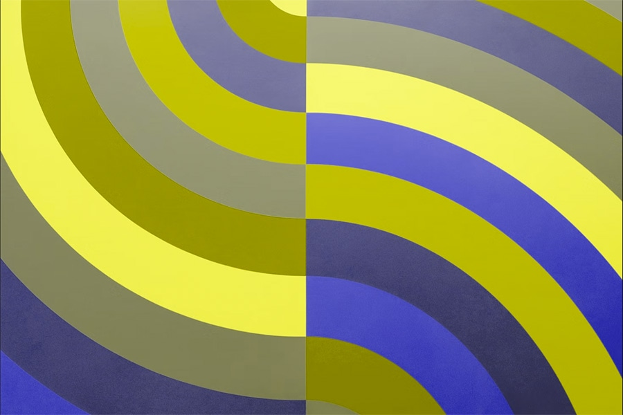

# Цвет и контраст

<big>
Приходилось ли вам когда-нибудь пытаться читать текст на экране и обнаруживать, что его трудно читать из-за цветовой схемы, или бороться с тем, чтобы увидеть экран в очень яркой или тусклой среде? Или, возможно, вы человек с более постоянными проблемами цветового зрения, как приблизительно [300 миллионов людей с дальтонизмом](https://www.colourblindawareness.org/colour-blindness/) или [253 миллиона людей с ослабленным зрением](https://www.ncbi.nlm.nih.gov/pmc/articles/PMC5820628/)?

Как дизайнер или разработчик, вы должны понимать, как люди воспринимают цвет и контраст, будь то временно, ситуационно или постоянно. Это поможет вам наилучшим образом поддержать их визуальные потребности.

Этот модуль познакомит вас с некоторыми основами доступного цвета и контраста.
</big>

## Восприятие цвета

Знаете ли вы, что объекты не обладают цветом, а отражают длины волн света? Когда вы видите цвет, ваши глаза принимают и обрабатывают эти длины волн и преобразуют их в цвета.


Когда речь идет о цифровой доступности, мы говорим об этих длинах волн в терминах оттенка, насыщенности и яркости (HSL). Модель HSL была создана как альтернатива цветовой модели RGB и более тесно соответствует тому, как человек воспринимает цвет.

!!!note ""

	В CSS цвет может быть указан множеством способов, например, с использованием названий цветов, значений RGB, RGBa, HEX, HSL, HSLa, HSV или HSVa. HSLa похож на HSL, только добавлено альфа-значение. Альфа — это мера прозрачности и определяется как число от 0.0 (полностью прозрачный) до 1.0 (полностью непрозрачный).

**Оттенок** — это качественный способ описания цвета, такого как красный, зеленый или синий, где каждый оттенок имеет определенное место на цветовом спектре со значениями от 0 до 360, с красным в 0, зеленым в 120 и синим в 240.

<iframe allow="camera; clipboard-read; clipboard-write; encrypted-media; geolocation; microphone; midi;" loading="lazy" src="https://codepen.io/web-dev-codepen-external/embed/eYrEZqE?height=350&amp;theme-id=auto&amp;default-tab=result&amp;editable=true" style="height: 450px; width: 100%; border: 0;" data-title="Pen eYrEZqE by web-dev-codepen-external on Codepen"></iframe>

**Насыщенность** — это интенсивность цвета, измеряемая в процентах от 0% до 100%. Цвет с полной насыщенностью (100%) будет очень ярким, в то время как цвет без насыщенности (0%) будет в оттенках серого или черно-белым.

<iframe allow="camera; clipboard-read; clipboard-write; encrypted-media; geolocation; microphone; midi;" loading="lazy" src="https://codepen.io/web-dev-codepen-external/embed/vYjJKBP?height=350&amp;theme-id=auto&amp;default-tab=result&amp;editable=true" style="height: 450px; width: 100%; border: 0;" data-title="Pen vYjJKBP by web-dev-codepen-external on Codepen"></iframe>

**Яркость** — это светлый или темный характер цвета, измеряемый в процентах от 0% (черный) до 100% (белый).

<iframe allow="camera; clipboard-read; clipboard-write; encrypted-media; geolocation; microphone; midi;" loading="lazy" src="https://codepen.io/web-dev-codepen-external/embed/poVrboR?height=350&amp;theme-id=auto&amp;default-tab=result&amp;editable=true" style="height: 450px; width: 100%; border: 0;" data-title="Pen poVrboR by web-dev-codepen-external on Codepen"></iframe>

## Измерение цветового контраста

Чтобы поддержать людей с различными нарушениями зрения, группа WAI создала [формулу цветового контраста](https://www.w3.org/TR/WCAG21/#dfn-contrast-ratio) для обеспечения [достаточного контраста](https://www.w3.org/WAI/WCAG22/Understanding/contrast-minimum.html) между текстом и его фоном. Когда эти соотношения цветового контраста соблюдаются, люди с умеренно ослабленным зрением могут читать текст на фоне без необходимости в вспомогательных технологиях, усиливающих контраст.

Давайте посмотрим на изображения с яркой цветовой палитрой и сравним, как это изображение будет выглядеть для людей с определенными формами дальтонизма.

<div class="grid cards" markdown>

-   

	<small>Оригинальный радужный песок</small>

-   

	<small>Оригинальный радужный узор</small>

</div>

Слева изображение показывает радужный песок с пурпурными, красными, оранжевыми, желтыми, аква-зелеными, голубыми и темно-синими цветами. Справа — более яркий, многоцветный радужный узор.

### Дейтеранопия

<div class="grid cards" markdown>

-   

	<small>Радужный песок, как его видит человек с дейтеранопией</small>

-   

	<small>Радужный узор, как его видит человек с дейтеранопией</small>

</div>

[Дейтеранопия](https://www.color-blindness.com/deuteranopia-red-green-color-blindness/) (обычно известная как зеленая слепота) встречается у 1%-5% мужчин, 0,35%-0,1% женщин.

Люди с дейтеранопией имеют пониженную чувствительность к зеленому свету. Этот фильтр дальтонизма имитирует то, как может выглядеть этот тип дальтонизма.

### Протанопия

<div class="grid cards" markdown>

-   

	<small>Радужный песок, как его видит человек с протанопией</small>

-   

	<small>Радужный узор, как его видит человек с протанопией</small>

</div>

[Протанопия](https://www.color-blindness.com/protanopia-red-green-color-blindness/) (обычно известная как красная слепота) встречается у 1,01%-1,08% мужчин и 0,02%-0,03% женщин.

Люди с протанопией имеют пониженную чувствительность к красному свету. Этот фильтр дальтонизма имитирует то, как может выглядеть этот тип дальтонизма.

### Ахроматопсия или монохроматизм

<div class="grid cards" markdown>

-   

	<small>Радужный песок, как его видит человек с ахроматопсией</small>

-   

	<small>Радужный узор, как его видит человек с ахроматопсией</small>

</div>

[Ахроматопсия или монохроматизм](https://www.color-blindness.com/2007/07/20/monochromacy-complete-color-blindness/) (или полная цветовая слепота) встречается очень, очень редко.

Люди с ахроматопсией или монохроматизмом практически не воспринимают красный, зеленый или синий свет. Этот фильтр дальтонизма имитирует то, как может выглядеть этот тип дальтонизма.

### Вычисление цветового контраста

Формула цветового контраста использует [относительную яркость](https://www.w3.org/TR/WCAG/#dfn-relative-luminance) цветов для определения контраста, который может варьироваться от 1 до 21. Эта формула часто сокращается до `[значение цвета]:1`. Например, чистый черный на чистом белом имеет наибольшее соотношение цветового контраста `21:1`.

```text
(L1 + 0.05) / (L2 + 0.05)
L1 — это относительная яркость более светлого цвета
L2 — это относительная яркость более темного цвета
```

Текст обычного размера, включая изображения текста, должен иметь соотношение цветового контраста `4.5:1` для соответствия [минимальным требованиям WCAG для цвета](https://www.w3.org/WAI/WCAG21/Understanding/contrast-minimum.html). Крупный текст и важные иконки должны иметь соотношение цветового контраста `3:1`. Крупный текст характеризуется размером не менее 18pt/24px или 14pt/18.5px жирным. Логотипы и декоративные элементы освобождены от этих требований к цветовому контрасту.

К счастью, продвинутая математика не требуется, поскольку существует множество инструментов, которые выполнят расчеты цветового контраста за вас. Такие инструменты, как [Adobe Color](https://color.adobe.com/create/color-accessibility), [Color Contrast Analyzer](https://www.tpgi.com/color-contrast-checker/), [Leonardo](https://leonardocolor.io/) и [цветовая палитра Chrome DevTools](https://developer.chrome.com/docs/devtools/accessibility/reference/#contrast), могут быстро сообщить вам соотношения цветового контраста и предложить рекомендации для создания наиболее инклюзивных цветовых пар и палитр.

<iframe allow="camera; clipboard-read; clipboard-write; encrypted-media; geolocation; microphone; midi;" loading="lazy" src="https://codepen.io/web-dev-codepen-external/embed/PoeKzWq?height=450&amp;theme-id=auto&amp;default-tab=result&amp;editable=true" style="height: 550px; width: 100%; border: 0;" data-title="Pen PoeKzWq by web-dev-codepen-external on Codepen"></iframe>

## Использование цвета

Без хороших уровней цветового контраста слова, иконки и другие графические элементы [трудно обнаружить](https://www.w3.org/WAI/WCAG21/Understanding/non-text-contrast.html), и дизайн может быстро стать недоступным. Но также важно обращать внимание на [то, как цвет используется](https://www.w3.org/WAI/WCAG21/Understanding/use-of-color.html) на экране, поскольку нельзя использовать только цвет для передачи информации, действий или различения визуального элемента.

Например, если вы говорите: "[нажмите зеленую кнопку, чтобы продолжить](https://www.w3.org/WAI/WCAG22/Understanding/sensory-characteristics.html)", но не указываете никакого дополнительного содержимого или идентификаторов для кнопки, людям с определенными типами дальтонизма будет трудно понять, какую кнопку нажать. Аналогично, многие графики, диаграммы и таблицы используют только цвет для передачи информации. Добавление другого идентификатора, такого как паттерн, текст или иконка, имеет решающее значение для помощи людям в понимании содержимого.

Просмотр ваших цифровых продуктов в оттенках серого — хороший способ быстро обнаружить потенциальные проблемы с цветом.

<iframe allow="camera; clipboard-read; clipboard-write; encrypted-media; geolocation; microphone; midi;" loading="lazy" src="https://codepen.io/web-dev-codepen-external/embed/rNvzLmd?height=500&amp;theme-id=auto&amp;default-tab=result&amp;editable=true" style="height: 600px; width: 100%; border: 0;" data-title="Pen rNvzLmd by web-dev-codepen-external on Codepen"></iframe>

## Медиа-запросы, ориентированные на цвет

Помимо проверки соотношений цветового контраста и использования цвета на вашем экране, вы должны рассмотреть применение все более популярных и поддерживаемых [медиа-запросов](../design/media-features.md#preferences), которые предлагают пользователям больше контроля над тем, что отображается на экране.

Например, используя медиа-запрос [`@prefers-color-scheme`](https://drafts.csswg.org/mediaqueries-5/#descdef-media-prefers-color-scheme), вы можете создать темную тему, которая может быть полезна людям с [фотофобией](https://w3c.github.io/low-vision-a11y-tf/requirements.html#light-and-glare-sensitivity) или светочувствительностью. Вы также можете создать тему с высоким контрастом с помощью [`@prefers-contrast`](https://drafts.csswg.org/mediaqueries-5/#descdef-media-prefers-contrast), которая поддерживает людей с цветовыми нарушениями и [чувствительностью к контрасту](https://w3c.github.io/low-vision-a11y-tf/requirements.html#contrast-sensitivity).

!!!note ""

	Существуют дополнительные медиа-запросы и настройки ОС для рассмотрения цветовой доступности, но они гораздо менее поддерживаются, чем два перечисленных в этом модуле. См. статью [Режимы отображения доступности операционной системы и браузера](https://www.a11yproject.com/posts/operating-system-and-browser-accessibility-display-modes/) для получения дополнительной информации о различных настройках доступности ОС.

### Предпочтения цветовой схемы

Медиа-запрос `@prefers-color-scheme` позволяет пользователям выбирать светлую или темную тематическую версию веб-сайта или приложения, которое они посещают. Вы можете увидеть это изменение темы в действии, изменив настройки предпочтений светлого/темного режима и перейдя в браузер, который поддерживает этот медиа-запрос. Ознакомьтесь с инструкциями по темному режиму для [Mac](https://support.apple.com/en-us/HT208976) и [Windows](https://blogs.windows.com/windowsexperience/2016/08/08/windows-10-tip-personalize-your-pc-by-enabling-the-dark-theme/).


<iframe allow="camera; clipboard-read; clipboard-write; encrypted-media; geolocation; microphone; midi;" loading="lazy" src="https://codepen.io/web-dev-codepen-external/embed/ExLvNOw?height=300&amp;theme-id=auto&amp;default-tab=css%2Cresult&amp;editable=true" style="height: 400px; width: 100%; border: 0;" data-title="Pen ExLvNOw by web-dev-codepen-external on Codepen"></iframe>

**Сравните светлый и темный режимы**

<div class="grid cards" markdown>

-   

	<small>Светлый режим</small>

-   

	<small>Темный режим</small>

</div>

### Предпочтения контраста

Медиа-запрос [`@prefers-contrast`](https://developer.mozilla.org/docs/Web/CSS/@media/prefers-contrast) проверяет настройки ОС пользователя, чтобы увидеть, включен ли высокий контраст или отключен. Вы можете увидеть это изменение темы в действии, изменив настройки предпочтений контраста и перейдя в браузер, который поддерживает этот медиа-запрос (настройки режима контраста для [Mac](https://support.apple.com/lv-lv/guide/mac-help/unac089/mac) и [Windows](https://support.microsoft.com/windows/change-color-contrast-in-windows-fedc744c-90ac-69df-aed5-c8a90125e696)).

<iframe allow="camera; clipboard-read; clipboard-write; encrypted-media; geolocation; microphone; midi;" loading="lazy" src="https://codepen.io/web-dev-codepen-external/embed/bGMrgNV?height=300&amp;theme-id=auto&amp;default-tab=css%2Cresult&amp;editable=true" style="height: 400px; width: 100%; border: 0;" data-title="Pen bGMrgNV by web-dev-codepen-external on Codepen"></iframe>

**Сравните обычный и высокий контраст**

<div class="grid cards" markdown>

-   

	<small>Светлый режим</small>

-   

	<small>Темный режим</small>

</div>

### Наслоение медиа-запросов

Вы можете использовать несколько медиа-запросов, ориентированных на цвет, чтобы предоставить вашим пользователям еще больше выбора. В этом примере мы сложили `@prefers-color-scheme` и `@prefers-contrast` вместе.

<iframe allow="camera; clipboard-read; clipboard-write; encrypted-media; geolocation; microphone; midi;" loading="lazy" src="https://codepen.io/web-dev-codepen-external/embed/wvjqgaK?height=300&amp;theme-id=auto&amp;default-tab=css%2Cresult&amp;editable=true" style="height: 400px; width: 100%; border: 0;" data-title="Pen wvjqgaK by web-dev-codepen-external on Codepen"></iframe>

**Сравните цвет и контраст**

<div class="grid cards" markdown>

-   

	<small>Светлый режим, без предпочтений контраста</small>

-   

	<small>Темный режим, без предпочтений контраста</small>

-   

	<small>Светлый режим, предпочтение высокого контраста</small>

-   

	<small>Темный режим, предпочтение высокого контраста</small>

</div>

<small>:material-information-outline: Источник &mdash; <https://web.dev/learn/accessibility/color-contrast></small>
