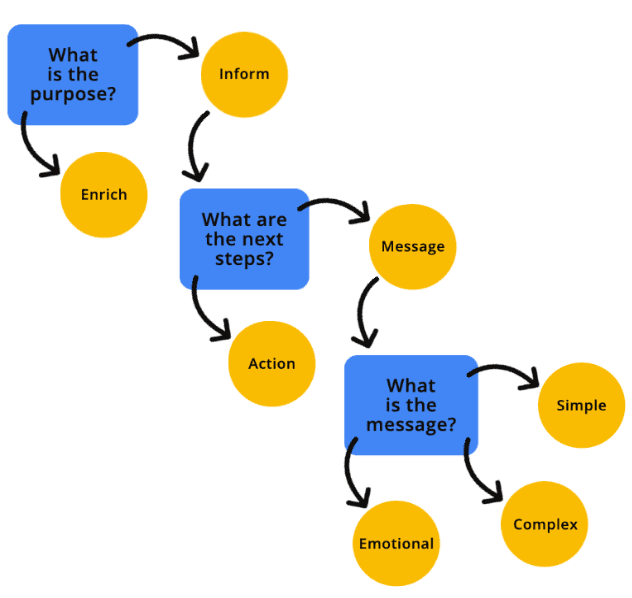

# Изображения

<big>

Доступные изображения могут показаться простой темой на первый взгляд &mdash; вы добавляете «альтернативный текст» к изображению, и всё готово. Но эта тема более многогранна, чем думают некоторые люди. В этом разделе мы рассмотрим:

-   Как обновить код, чтобы сделать изображения доступными.
-   Какую информацию следует предоставлять пользователям и где её размещать.
-   Дополнительные способы улучшения изображений для поддержки людей с ограниченными возможностями.

</big>

## Назначение и контекст изображения

Прежде чем будет написана хотя бы одна строка кода, вы должны сначала подумать о назначении изображения и о том, как оно будет использоваться. Задавая себе вопросы о назначении и контексте изображения, вы сможете определить, как лучше всего передать информацию человеку, использующему [вспомогательные технологии (AT)](https://www.nichd.nih.gov/health/topics/rehabtech/conditioninfo/device), такие как программы чтения с экрана.

Вы можете спросить себя:

-   _Является ли изображение необходимым для понимания контекста функции или страницы?_
-   _Какой тип информации пытается передать изображение?_
-   _Изображение простое или сложное?_
-   _Вызывает ли изображение эмоции или побуждает пользователя к действию?_
-   _Или изображение — это просто визуальная «конфетка для глаз» без реальной цели?_

Визуальная блок-схема, такая как [дерево решений для изображений](https://www.w3.org/WAI/tutorials/images/decision-tree/), может помочь вам определить, к какой категории относится ваше изображение.

Попробуйте скрыть изображения на вашем сайте или веб-приложении с помощью расширения браузера или других методов. Затем спросите себя: «Понимаю ли я контент, который остался?» Если ответ положительный, скорее всего, это декоративное изображение. Если нет, то изображение каким-то образом информативно и контекстуально необходимо. После того как вы определите назначение изображения, вы сможете определить наиболее точный способ его кодирования.



### Декоративные изображения

[Декоративное изображение](https://www.w3.org/WAI/tutorials/images/decorative/) — это визуальный элемент, который не добавляет дополнительного контекста или информации, позволяющей пользователю лучше понять контекст. Декоративные изображения являются дополнительными и могут обеспечивать стиль, а не содержание.

Если вы решили, что изображение является декоративным, оно должно быть программно скрыто от AT. Когда вы программируете изображение как скрытое, это сигнализирует AT, что изображение не нужно для понимания содержания, контекста или действия страницы. Существует множество способов скрыть изображения, включая использование пустой/нулевой текстовой альтернативы, [применение ARIA](https://developer.mozilla.org/docs/Web/Accessibility/ARIA) или добавление изображения в качестве CSS-фона. Ниже приведены несколько примеров того, как скрыть декоративное изображение от пользователей.

!!!note "Осторожно"

	Будьте внимательны при принятии этого решения, поскольку «[декоративность](https://www.smashingmagazine.com/2021/06/img-alt-attribute-alternate-description-decorative/)» может означать разные вещи для разных пользователей. Некоторые пользователи AT хотят слышать описания каждого визуального элемента на экране.

	Пользователи могут выбрать пропустить ваши описания изображений, если и когда они сочтут их избыточными или многословными, но они не могут представить описания, которых не существует. В случае сомнений добавляйте описания к вашим изображениям.

#### Пустой или нулевой `alt`

<iframe allow="camera; clipboard-read; clipboard-write; encrypted-media; geolocation; microphone; midi;" loading="lazy" src="https://codepen.io/web-dev-codepen-external/embed/QWrMgxg?height=300&amp;theme-id=auto&amp;default-tab=html%2Ccss%2Cresult&amp;editable=true" style="height: 400px; width: 100%; border: 0;" data-title="Pen QWrMgxg by web-dev-codepen-external on Codepen"></iframe>

Пустой/нулевой атрибут альтернативного текста отличается от отсутствующего атрибута альтернативного текста. Если атрибут альтернативного текста отсутствует, AT может прочитать имя файла или окружающий контент, чтобы предоставить пользователю больше информации об изображении.

#### Роль установлена на `presentation` или `none`

<iframe allow="camera; clipboard-read; clipboard-write; encrypted-media; geolocation; microphone; midi;" loading="lazy" src="https://codepen.io/web-dev-codepen-external/embed/mdLMwje?height=350&amp;theme-id=auto&amp;default-tab=html%2Cresult&amp;editable=true" style="height: 450px; width: 100%; border: 0;" data-title="Pen mdLMwje by web-dev-codepen-external on Codepen"></iframe>

Роль, установленная на [`presentation` или `none`](https://developer.mozilla.org/docs/Web/Accessibility/ARIA/Roles/presentation_role), удаляет семантику элемента из дерева доступности. В то время как [`aria-hidden="true"`](https://developer.mozilla.org/docs/Web/Accessibility/ARIA/Attributes/aria-hidden) удалит весь элемент &mdash; и всех его дочерних элементов &mdash; из API доступности.

```html
<!-- Все эти варианты приводят к одному и тому же результату. -->


```

Используйте `aria-hidden` с осторожностью, поскольку он может скрыть элементы, которые вы не хотите скрывать.

#### Изображения в CSS

<iframe allow="camera; clipboard-read; clipboard-write; encrypted-media; geolocation; microphone; midi;" loading="lazy" src="https://codepen.io/web-dev-codepen-external/embed/GRdvEYo?height=350&amp;theme-id=auto&amp;default-tab=css%2Cresult&amp;editable=true" style="height: 450px; width: 100%; border: 0;" data-title="Pen GRdvEYo by web-dev-codepen-external on Codepen"></iframe>

Когда вы добавляете фоновое изображение с помощью CSS, программа чтения с экрана не обнаружит файл изображения. Убедитесь, что вы хотите, чтобы изображение было скрыто, прежде чем применять этот метод.

### Информативные изображения

[Информативное изображение](https://www.w3.org/WAI/tutorials/images/informative/) — это изображение, которое передает простую концепцию, идею или эмоцию. Типы информативных изображений включают фотографии реальных объектов, основные иконки, простые рисунки и [изображения текста](https://www.w3.org/WAI/WCAG22/Understanding/images-of-text.html).

Если ваше изображение является информативным, вы должны включить [программный альтернативный текст](https://www.w3.org/WAI/WCAG21/Understanding/non-text-content.html), описывающий назначение изображения. Альтернативные описания изображений &mdash; часто сокращаемые как «alt text» &mdash; дают пользователям AT больше контекста об изображении и помогают им лучше понять сообщение или намерение изображения.

Простые альтернативные описания с использованием [элементов ``](https://developer.mozilla.org/docs/Web/HTML/Element/img#attr-alt) достигаются путем включения атрибута `alt`, независимо от типа файла, на который он указывает, такого как `.jpg`, `.png`, `.svg` и других.

```html

```

<iframe allow="camera; clipboard-read; clipboard-write; encrypted-media; geolocation; microphone; midi;" loading="lazy" src="https://codepen.io/web-dev-codepen-external/embed/yLjoXrj?height=350&amp;theme-id=auto&amp;default-tab=html%2Cresult&amp;editable=true" style="height: 450px; width: 100%; border: 0;" data-title="Pen yLjoXrj by web-dev-codepen-external on Codepen"></iframe>

Однако при использовании элементов `<svg>` в строке необходимо обращать внимание на доступность.

Во-первых, поскольку SVG семантически кодированы, AT по умолчанию будет пропускать их. Если у вас есть декоративное изображение, это не проблема &mdash; AT будет игнорировать его как предполагается. Но если у вас есть информативное изображение, необходимо добавить ARIA `role="img"` к шаблону, чтобы AT распознал его как изображение.

Во-вторых, элементы `<svg>` не используют атрибут `alt`, поэтому [различные методы кодирования](https://codepen.io/web-dot-dev/pen/dyezRBP) должны использоваться вместо этого для добавления альтернативных описаний к вашим информативным изображениям.

```html
<svg role="img">
    <title>
        Мультяшный рисунок красной, черной и серой божьей коровки.
    </title>
</svg>
```

### Функциональные изображения

[Функциональное изображение](https://www.w3.org/WAI/tutorials/images/functional/) связано с действием. Примером функционального изображения является логотип, который ссылается на главную страницу, увеличительное стекло, используемое как кнопка поиска, или иконка социальной сети, которая направляет вас на другой веб-сайт или приложение.

Как и информативные изображения, функциональные изображения должны включать альтернативное описание, чтобы информировать всех пользователей об их назначении. В отличие от информативного изображения, каждое функциональное изображение должно описывать действие изображения &mdash; а не визуальные аспекты.

<iframe allow="camera; clipboard-read; clipboard-write; encrypted-media; geolocation; microphone; midi;" loading="lazy" src="https://codepen.io/web-dev-codepen-external/embed/YzLxxPw?height=350&amp;theme-id=auto&amp;default-tab=html%2Cresult&amp;editable=true" style="height: 450px; width: 100%; border: 0;" data-title="Pen YzLxxPw by web-dev-codepen-external on Codepen"></iframe>

<iframe allow="camera; clipboard-read; clipboard-write; encrypted-media; geolocation; microphone; midi;" loading="lazy" src="https://codepen.io/web-dev-codepen-external/embed/gOzxxbg?height=350&amp;theme-id=auto&amp;default-tab=html%2Cresult&amp;editable=true" style="height: 450px; width: 100%; border: 0;" data-title="Pen gOzxxbg by web-dev-codepen-external on Codepen"></iframe>

В примере с логотипом изображение является одновременно информативным и действующим, поскольку это изображение, которое передает информацию и ведет себя как ссылка. В таких случаях вы можете добавить альтернативные описания к каждому элементу &mdash; но это не является требованием.

Один из способов добавить альтернативные описания к изображениям — через визуально скрытый текст. При использовании этого метода текст будет прочитан программами чтения с экрана, поскольку он находится в DOM, но визуально скрыт с помощью пользовательского CSS.

Из фрагмента кода видно, что «Navigate to the homepage» — это заголовок обертки, а альтернативный текст изображения — «Lovely Ladybugs for your Lawn». Когда вы слушаете код логотипа с помощью программы чтения с экрана, вы слышите как визуальную, так и действующую составляющую, переданные в одном изображении.

```html
<div title="Перейти на главную страницу">
   <a href="/">
      </img>
   </a>
</div>
```

<iframe allow="camera; clipboard-read; clipboard-write; encrypted-media; geolocation; microphone; midi;" loading="lazy" src="https://codepen.io/web-dev-codepen-external/embed/qBYXXdW?height=350&amp;theme-id=auto&amp;default-tab=html%2Cresult&amp;editable=true" style="height: 450px; width: 100%; border: 0;" data-title="Pen qBYXXdW by web-dev-codepen-external on Codepen"></iframe>

### Сложные изображения

[Сложное изображение](https://www.w3.org/WAI/tutorials/images/complex/) часто требует больше объяснений, чем декоративное, информационное или функциональное изображение. Оно требует как краткого, так и подробного альтернативного описания для передачи полного сообщения. Сложные изображения включают инфографику, карты, графики/диаграммы и сложные иллюстрации. Как и в случае с другими типами изображений, существуют различные методы, которые вы можете использовать для добавления альтернативных описаний к вашим сложным изображениям.

<iframe allow="camera; clipboard-read; clipboard-write; encrypted-media; geolocation; microphone; midi;" loading="lazy" src="https://codepen.io/web-dev-codepen-external/embed/NWMvvqw?height=400&amp;theme-id=auto&amp;default-tab=html%2Cresult&amp;editable=true" style="height: 500px; width: 100%; border: 0;" data-title="Pen NWMvvqw by web-dev-codepen-external on Codepen"></iframe>

```html
<a href="ladybug-science.html"
    >Узнать больше об анатомии божьей коровки</a
>
```

Один из способов добавить дополнительное объяснение к изображению — это ссылка на ресурс или предоставление ссылки-перехода к более подробному объяснению далее на странице. Этот метод является хорошим выбором не только для пользователей AT, но также помогает людям с ограниченными возможностями &mdash; такими как когнитивные, учебные расстройства и расстройства чтения &mdash; которые могут получить пользу от наличия этой дополнительной информации об изображении легко доступной на экране, а не скрытой в коде.

<iframe allow="camera; clipboard-read; clipboard-write; encrypted-media; geolocation; microphone; midi;" loading="lazy" src="https://codepen.io/web-dev-codepen-external/embed/OJZjxGK?height=400&amp;theme-id=auto&amp;default-tab=html%2Cresult&amp;editable=true" style="height: 500px; width: 100%; border: 0;" data-title="Pen OJZjxGK by web-dev-codepen-external on Codepen"></iframe>

Другой метод, который вы можете использовать, — это добавление атрибута `aria-describedby` к элементу ``. Вы можете программно связать изображение с ID, содержащим более длинное описание. Этот метод создает сильную связь между изображением и полным описанием. Расширенное описание может отображаться на экране или быть визуально скрыто &mdash; но рассмотрите возможность сохранения его видимым для поддержки еще большего количества людей.

<iframe allow="camera; clipboard-read; clipboard-write; encrypted-media; geolocation; microphone; midi;" loading="lazy" src="https://codepen.io/web-dev-codepen-external/embed/MWGvEdJ?height=450&amp;theme-id=auto&amp;default-tab=html%2Cresult&amp;editable=true" style="height: 550px; width: 100%; border: 0;" data-title="Pen MWGvEdJ by web-dev-codepen-external on Codepen"></iframe>

Еще один способ группировать краткие альтернативные описания с более подробными — это использование элементов HTML5 `<figure>` и `<figcaption>`. Эти элементы действуют аналогично `aria-describedby` в том, что они семантически группируют элементы, формируя более сильную связь между изображением и его описанием. Добавление ARIA `role="group"` обеспечивает обратную совместимость со старыми веб-браузерами, которые не поддерживают нативную семантику элемента `<figure>`.

### Лучшие практики альтернативного текста

Конечно, включения альтернативного текста недостаточно. Текст также должен быть содержательным. Например, если ваше изображение о рое божьих коровок, поедающих листья вашего призового розового куста, но ваш альтернативный текст гласит «жуки», передаст ли это полное сообщение и намерение изображения? Определенно нет.

Альтернативные описания должны захватывать как можно больше релевантной визуальной информации и быть лаконичными. Хотя нет ограничения на количество символов, которые может прочитать программа чтения с экрана, обычно рекомендуется ограничивать альтернативный текст 150 символами или меньше, чтобы избежать усталости читателя. Если вам нужно добавить дополнительный контекст к изображению, вы можете использовать один из шаблонов сложного изображения, добавить текст подписи или дополнительно описать изображение в основной копии.

Некоторые дополнительные [лучшие практики альтернативного текста](https://www.w3.org/WAI/tutorials/images/tips/) включают:

-   Избегайте использования слов как «изображение» или «фото» в описании, поскольку программа чтения с экрана определит эти типы файлов за вас.
-   При именовании ваших изображений будьте как можно более последовательными и точными. Имена изображений являются запасным вариантом, когда альтернативный текст отсутствует или игнорируется.
-   Избегайте использования не-буквенных символов (например, `#`, `9`, `&`) и используйте дефисы между словами, а не подчеркивания в именах ваших изображений или альтернативном тексте.
-   Используйте правильную пунктуацию, когда это возможно. Без неё описания изображений будут звучать как одно длинное, бесконечное предложение.
-   Пишите альтернативный текст как человек, а не как робот. Набивание ключевыми словами никому не приносит пользы &mdash; люди, использующие программы чтения с экрана, будут раздражены, а алгоритмы поисковых систем будут штрафовать вас.

<small>:material-information-outline: Источник &mdash; <https://web.dev/learn/accessibility/images></small>
