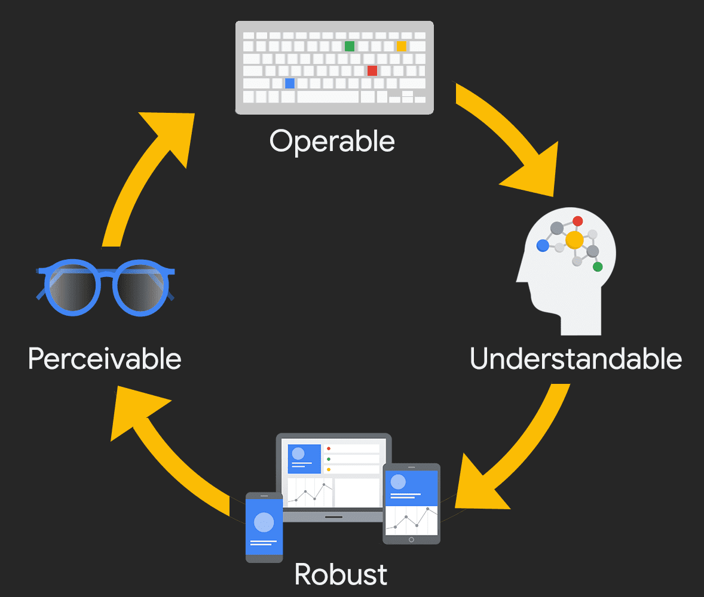
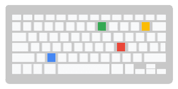
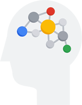
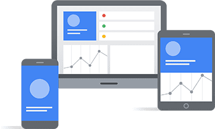

# Как измеряется доступность цифровых технологий?

<big>[Доступность цифровых технологий](https://www.w3.org/WAI/fundamentals/accessibility-intro/) означает разработку и создание цифровых предложений таким образом, чтобы независимо от умственных или физических способностей человека он мог полноценно и на равных взаимодействовать с вашим сайтом, приложением или другим цифровым продуктом.</big>

Но как измерить доступность цифрового продукта? Как понять, что продукт доступен?

## Введение в тестирование доступности

Существует множество способов проверить цифровой продукт на доступность. Один из основных подходов заключается в оценке его соответствия набору стандартов доступности.

Существует множество типов стандартов доступности. Как правило, отрасль, тип продукта, местные/страновые [законы](https://www.3playmedia.com/blog/major-accessibility-laws/) и [политики](https://www.w3.org/WAI/policies/), а также общие цели, связанные с доступностью, определяют, какому набору рекомендаций следовать и какому уровню соответствовать. Если для вашего проекта не требуется конкретный стандарт, то стандартной рекомендацией является следование последней версии [Web Content Accessibility Guidelines (WCAG)](#wcag).

Тестирование цифрового продукта на соответствие стандарту доступности и уровню соответствия принято называть _[аудитом доступности](https://www.w3.org/WAI/test-evaluate/)_. При проведении аудита доступности используются различные методологии, методики и инструменты, включая проектирование, автоматизированное, ручное тестирование и тестирование вспомогательных технологий (AT).

Аудит доступности проводится для определения базового уровня соответствия цифрового продукта требованиям доступности. Однако одного раза в начале проекта недостаточно, чтобы определить, является ли продукт доступным. Аудит необходимо проводить несколько раз в течение жизненного цикла программного продукта, чтобы проверить изменения в уровне соответствия по заранее определенным контрольным точкам или рекомендациям.

## Руководство по доступности веб-контента (WCAG) {#wcag}

[Web Content Accessibility Guidelines (WCAG)](https://www.w3.org/WAI/standards-guidelines/wcag/) - это международный набор стандартов доступности, разработанный W3C в сотрудничестве с частными лицами и организациями. Цель WCAG - создать единый общий стандарт доступности цифровых технологий, отвечающий потребностям людей, организаций и правительств во всем мире.

WCAG предназначен в первую очередь для дизайнеров и разработчиков веб-приложений и нативных мобильных приложений. Однако многие другие специалисты, включая разработчиков программного обеспечения, создателей/редакторов контента и руководителей всех уровней, получат пользу от понимания и применения методов, основанных на WCAG, в своем процессе. К вашей роли могут быть применимы и другие стандарты W3C, в том числе [Authoring Tool Accessibility Guidelines (ATAG)](https://www.w3.org/WAI/standards-guidelines/atag/) и [User Agent Accessibility Guidelines (UAAG)](https://www.w3.org/WAI/standards-guidelines/uaag/), поэтому обязательно ознакомьтесь со [списком стандартов W3C](https://www.w3.org/standards/) и используйте те из них, которые наиболее применимы к вашей роли и проекту.

С точки зрения доступности WCAG считается "золотым стандартом" для тестирования соответствия. [Первый проект WCAG](https://www.w3.org/TR/WAI-WEBCONTENT/) был выпущен в 1999 году. Текущая версия [WCAG 2.1](https://www.w3.org/TR/WCAG21/) вышла в июне 2018 года, а выход [WCAG 2.2](https://www.w3.org/TR/WCAG22/) запланирован на 2023 год. Полностью обновленная версия руководства, [WCAG 3.0](https://www.w3.org/WAI/standards-guidelines/wcag/wcag3-intro/), готовится к выпуску в будущем, но ожидается, что она не станет завершенным стандартом W3C еще несколько лет.

Руководство WCAG имеет три уровня критериев успеха: A, AA и AAA. Критерии успеха определяют соответствие WCAG. Чтобы соответствовать WCAG, тестируемый цифровой продукт должен удовлетворять критериям успеха для целевого уровня.

-   30 `A` критериев успеха
-   20 `АА` критерии успеха
-   28 `ААА` критерии успеха

В действующем стандарте (WCAG 2.1) всего 78 критериев успеха, распределенных по каждому уровню. Важно отметить, что каждый уровень является прогрессивным, т.е. если ваша цель по обеспечению доступности - AA, то для достижения этого уровня соответствия необходимо пройти критерии успеха как для A, так и для AA.

-   30 Пройден уровень `A`
-   50 Пройден уровень `A` + `AA`
-   78 Пройден уровень `A` + `AA` + `AAA`

## Принципы доступности

Критерии успеха WCAG - это очень важный набор подробных рекомендаций, которые информируют дизайнеров и разработчиков о том, как создавать доступные веб-сайты и приложения. Понимание этих рекомендаций очень важно для решения проблем, возникающих при тестировании на соответствие требованиям доступности, однако эти рекомендации быстро становятся очень техническими.

Если вы новичок в этой области, начните с принципов WCAG &mdash; [Воспринимаемый, управляемый, понятный и надежный (POUR)](https://www.w3.org/WAI/fundamentals/accessibility-principles/). Применяя принципы POUR к своим цифровым продуктам, вы сможете сосредоточиться на том, как ваши продукты будут использоваться реальными людьми, в том числе людьми с ограниченными возможностями.

### Воспринимаемый

Первая категория в POUR - Perceivable. Этот принцип гласит, что пользователи должны иметь возможность воспринимать всю основную информацию на экране, и она должна передаваться несколькими органами чувств.

**Спросите себя**: Есть ли в вашем цифровом продукте контент или функциональные возможности, которые человек с ограниченными возможностями не сможет воспринять? Обязательно учитывайте все виды инвалидности - зрительные, мобильные, слуховые, когнитивные, речевые нарушения, вестибулярные расстройства, судороги и т.д.

**Примеры восприятия**:

-   Добавление текстовых альтернатив ко всем недекоративным изображениям и важным пиктограммам.
-   Добавление субтитров, транскриптов и аудиоописаний к видео.
-   Обеспечение того, чтобы цвет не был единственным способом передачи смысла.

### Эксплуатируемый

Вторая категория - Operable. В соответствии с этим принципом пользователи должны иметь возможность управлять интерфейсом цифрового продукта. Интерфейс не должен требовать взаимодействия, которое пользователь не может выполнить.

**Спросите себя**: Могут ли пользователи управлять интерактивными элементами вашего цифрового продукта? Нет ли проблем с порядком фокусировки или клавиатурных ловушек? Как устроены сенсорные интерфейсы?

**Примеры работоспособности**:

-   Добавление поддержки клавиатуры и сенсорного экрана во все активные элементы.
-   Обеспечение слайд-шоу и видеороликов всеми необходимыми элементами управления.
-   Предоставление пользователям достаточного времени для заполнения формы или способ продления этого времени.

### Понятный

Третья категория POUR - понятность. В соответствии с этим принципом пользователи должны понимать информацию и работу пользовательского интерфейса.

**Спросите себя**: Ясно ли написано все содержимое? Все ли действия пользователя понятны? Имеет ли порядок страниц смысл для зрячих пользователей, пользователей, использующих только клавиатуру, пользователей программ чтения с экрана?

**Примеры понятного**:

-   Писать просто - не использовать сложное слово, когда достаточно простого.
-   Обеспечение предсказуемой навигации по цифровому продукту.
-   Обеспечение понятности сообщений об ошибках и простоты их устранения.

### Надежность

Последняя категория - "Надежность". Этот принцип направлен на поддержку вспомогательных технологий и обеспечение того, чтобы по мере развития устройств и пользовательских агентов цифровой продукт оставался доступным.

**Спросите себя**: Какие типы вспомогательных технологий вы поддерживаете? Работает ли ваш цифровой продукт только на новейших браузерах или операционных системах? Работает ли он во всех точках останова и при различных ориентациях устройства?

**Примеры надежности**:

-   Тестирование навигации только с помощью клавиатуры.
-   Тестирование с использованием различных технологий чтения с экрана.
-   Обеспечение доступа ко всему содержимому и функциональности независимо от размера и ориентации устройства.

Помните, что суть POUR заключается не в жестком следовании жестким правилам. Напротив, это способ помочь вам [понять и удовлетворить](https://alistapart.com/article/getting-to-the-heart-of-digital-accessibility/) разнообразные потребности ваших пользователей.
