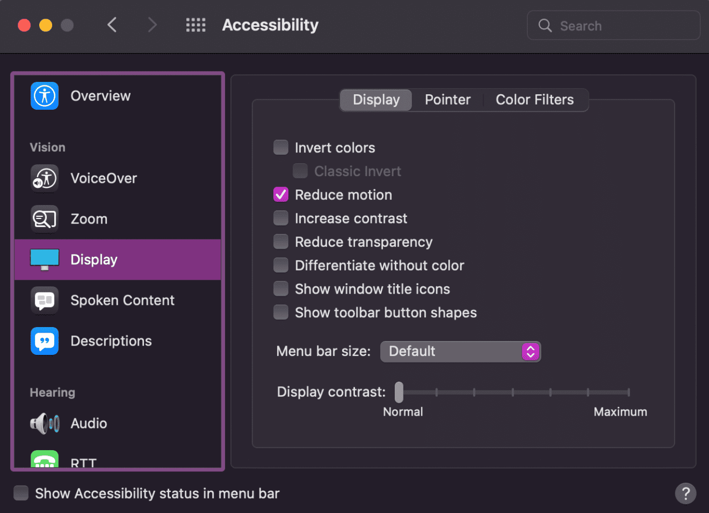

# Анимация и движение

<big>
Испытывали ли вы когда-нибудь, находясь в машине, лодке или самолете, внезапное ощущение того, что мир вращается? Или была ли у вас такая сильная мигрень, что анимации на вашем телефоне или планшете, созданные для того, чтобы "порадовать" вас, внезапно вызывали тошноту? А может быть, вы всегда были чувствительны к любым типам движения? Это примеры различных типов вестибулярных расстройств.

К 40 годам более 35% взрослых испытают какую-либо форму [вестибулярной дисфункции](https://vestibular.org/article/what-is-vestibular/about-vestibular-disorders/). Это может привести к временному головокружению, вертиго, вызванному мигренью, или более постоянной вестибулярной инвалидности.

Помимо провоцирования вертиго, многие люди находят движущийся, мигающий или прокручивающийся контент отвлекающим. Люди с [СДВГ](https://www.nimh.nih.gov/health/publications/attention-deficit-hyperactivity-disorder-in-children-and-teens-what-you-need-to-know) и другими расстройствами дефицита внимания могут быть настолько отвлечены вашими анимированными элементами, что забудут, зачем вообще пришли на ваш веб-сайт или в приложение.

В этом модуле мы рассмотрим некоторые способы лучшей поддержки людей с различными типами расстройств, вызванных движением.
</big>

## Мигающий и движущийся контент

При создании анимации и движения вы должны спросить себя, является ли движение элемента чрезмерным. Например, цвета, мигающие от темного к светлому, или быстрые движения на экране могут вызвать судороги у людей с фотосенситивной эпилепсией. По оценкам, [3% людей с эпилепсией](https://www.epilepsy.com/what-is-epilepsy/seizure-triggers/photosensitivity) страдают от фотосенситивности, и это чаще встречается у женщин и молодых людей.

[Рекомендации WCAG по миганию](https://www.w3.org/TR/WCAG21/#three-flashes-or-below-threshold) советуют избегать следующего:

-   Мигание более трех раз в любую одну секунду
-   Мигание ниже [общего порога мигания и красного мигания](https://www.w3.org/TR/WCAG21/#dfn-general-flash-and-red-flash-thresholds).

Такое мигание может, в лучшем случае, вызвать невозможность использования веб-страницы или, в худшем случае, привести к заболеванию.

Для любого экстремального движения крайне важно протестировать его с помощью [Инструмента анализа фотосенситивной эпилепсии (PEAT)](https://trace.umd.edu/peat/). PEAT — это бесплатный инструмент для определения того, могут ли содержимое экрана, видео или анимации вызвать судороги. Не весь контент нужно оценивать с помощью PEAT, но контент, который содержит мигание или быстрые переходы между светлыми и темными фоновыми цветами, следует оценить для безопасности.

Еще один вопрос, который вы должны задать себе об анимации и движении, — является ли движение элемента существенным для понимания контента или действий на экране. Если оно не является существенным, рассмотрите возможность удаления всего движения — даже микро-движений — из элемента, который вы создаете или проектируете.

Предположим, вы считаете, что движение элемента не является существенным, но может улучшить общий опыт пользователя, или вы не можете убрать движение по другой причине. В этом случае вы должны следовать [рекомендациям WCAG по движению](https://www.w3.org/WAI/WCAG21/Understanding/pause-stop-hide.html). Рекомендации гласят, что вы должны создать опцию для пользователей приостанавливать, останавливать или скрывать движение для: несущественных движущихся, мигающих или прокручивающихся элементов, которые запускаются автоматически, длятся более пяти секунд и являются частью других элементов страницы.

## Приостановка, остановка или скрытие движения { #pause-stop-hide }

Добавьте механизм [приостановки, остановки или скрытия](https://css-tricks.com/accessible-web-animation-the-wcag-on-animation-explained/#aa-pause-stop-hide) на вашу страницу, который позволяет пользователям отключать потенциально проблематичную анимацию движения. Вы можете сделать это на уровне экрана или на уровне элемента.

Например, предположим, что ваш цифровой продукт включает много анимаций. Рассмотрите возможность добавления [доступного JavaScript-переключателя](https://css-irl.info/accessible-toggles/), чтобы позволить пользователям контролировать свой опыт. Когда кнопка переключена в состояние "движение выключено", все анимации замораживаются на этом экране и на всех остальных.

<iframe allow="camera; clipboard-read; clipboard-write; encrypted-media; geolocation; microphone; midi;" loading="lazy" src="https://codepen.io/web-dev-codepen-external/embed/xxjpBGE?height=450&amp;theme-id=auto&amp;default-tab=js%2Cresult&amp;editable=true" style="height: 550px; width: 100%; border: 0;" data-title="Pen xxjpBGE by web-dev-codepen-external on Codepen"></iframe>

## Использование медиа-запросов

В дополнение к избирательному подходу к анимациям, предоставлению пользователям опций для приостановки, остановки, скрытия движения и избеганию бесконечных циклов анимации, вы также можете рассмотреть добавление медиа-запроса, ориентированного на движение. Это дает вашим пользователям еще больше выбора в том, что отображается на экране.

### `@prefers-reduced-motion` { #prefers-reduced-motion }

Подобно медиа-запросам, ориентированным на цвет в [модуле цвета](color-contrast.md), медиа-запрос @prefers-reduced-motion проверяет [настройки ОС пользователя](https://developer.mozilla.org/docs/Web/CSS/@media/prefers-reduced-motion#user_preferences), связанные с анимацией.

Пользователь может установить предпочтения дисплея для уменьшения движения. Эти настройки различаются между операционными системами и могут быть сформулированы положительно или отрицательно. С [@prefers-reduced-motion](https://web.dev/articles/prefers-reduced-motion) вы можете спроектировать сайт, который уважает эти предпочтения.

На MacOS и Android пользователь включает настройку для уменьшения движения. На MacOS пользователь может установить **Reduce motion** в Настройки > Доступность > Дисплей. Настройка Android — **Remove animations**. На Windows настройка формулируется положительно как **Show animations**, которая включена по умолчанию. Пользователь должен отключить эту настройку, чтобы уменьшить движение.

!!!note ""

	Поскольку каждый интерфейс использует разный язык, рассмотрите возможность по-прежнему позволять пользователям выбирать самостоятельно, а не угадывать, сколько анимации слишком много. Это может различаться в зависимости от ситуации.

<iframe allow="camera; clipboard-read; clipboard-write; encrypted-media; geolocation; microphone; midi;" loading="lazy" src="https://codepen.io/web-dev-codepen-external/embed/VwxyReM?height=350&amp;theme-id=auto&amp;default-tab=css%2Cresult&amp;editable=true" style="height: 450px; width: 100%; border: 0;" data-title="Pen VwxyReM by web-dev-codepen-external on Codepen"></iframe>

Альтернативно, как показано в следующем наборе примеров, вы можете кодировать все ваши анимации так, чтобы они останавливались в течение пяти секунд или менее, вместо воспроизведения в бесконечном цикле.

### Прогрессивное улучшение для движения

Как дизайнеры и разработчики, мы должны сделать много выборов, включая состояния движения по умолчанию и количество движения для отображения. Давайте еще раз взглянем на последний пример о движении.

Предположим, мы решаем, что анимация не нужна для понимания контента на экране. В этом случае мы можем выбрать установку состояния по умолчанию на анимацию с уменьшенным движением вместо полной версии движения. Если пользователи специально не просят анимации, анимации отключены.

!!!note ""

	Доступные предпочтения движения зависят от операционной системы. Некоторые позволяют вам включить анимации, в то время как другие требуют отключения анимаций.

Мы не можем предсказать, какой уровень движения вызовет проблемы у людей с судорогами, вестибулярными и другими визуальными расстройствами. Даже небольшое количество движения на экране может вызвать головокружение, размытое зрение или хуже. Поэтому в следующем примере мы по умолчанию устанавливаем отсутствие анимации.

<iframe allow="camera; clipboard-read; clipboard-write; encrypted-media; geolocation; microphone; midi;" loading="lazy" src="https://codepen.io/web-dev-codepen-external/embed/qBYpvam?height=350&amp;theme-id=auto&amp;default-tab=css%2Cresult&amp;editable=true" style="height: 450px; width: 100%; border: 0;" data-title="Pen qBYpvam by web-dev-codepen-external on Codepen"></iframe>

### Многослойные медиа-запросы

Вы можете использовать несколько медиа-запросов, чтобы дать вашим пользователям еще больше выборов. Давайте используем `@prefers-color-scheme`, `@prefers-contrast` и `@prefers-reduced-motion` все вместе.

<iframe allow="camera; clipboard-read; clipboard-write; encrypted-media; geolocation; microphone; midi;" loading="lazy" src="https://codepen.io/web-dev-codepen-external/embed/wvjpOzR?height=400&amp;theme-id=auto&amp;default-tab=css%2Cresult&amp;editable=true" style="height: 500px; width: 100%; border: 0;" data-title="Pen wvjpOzR by web-dev-codepen-external on Codepen"></iframe>

## Позвольте пользователям выбирать {: #allow-user-choice}

Хотя может быть весело встраивать анимацию в наши цифровые продукты, чтобы радовать пользователей, критически важно помнить, что некоторые люди будут затронуты этими дизайнами. Чувствительность к движению может затронуть любого, от ощущения легкого дискомфорта до вызывания изнурительной болезни или судорог.

Вы можете использовать ряд различных инструментов, чтобы позволить пользователю решить, что лучше для них, а не угадывать, сколько движения слишком много. Например, добавьте переключатель для включения или отключения анимации на вашем сайте или веб-приложении. Рассмотрите возможность установки такого переключателя по умолчанию в положение **выключено**.

<small>:material-information-outline: Источник &mdash; <https://web.dev/learn/accessibility/motion></small>
