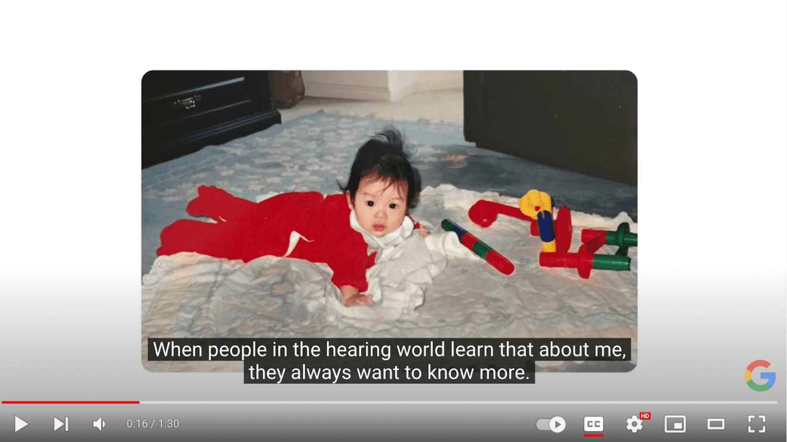
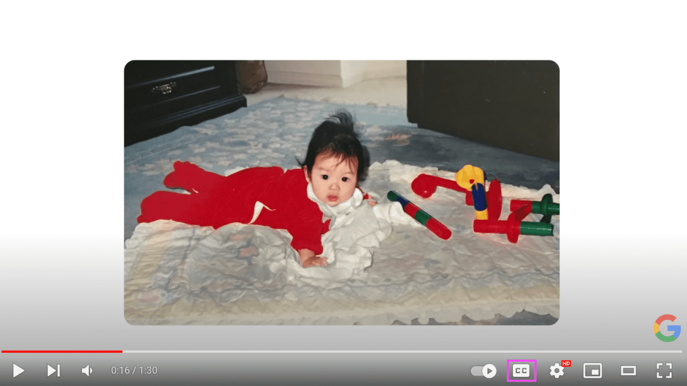
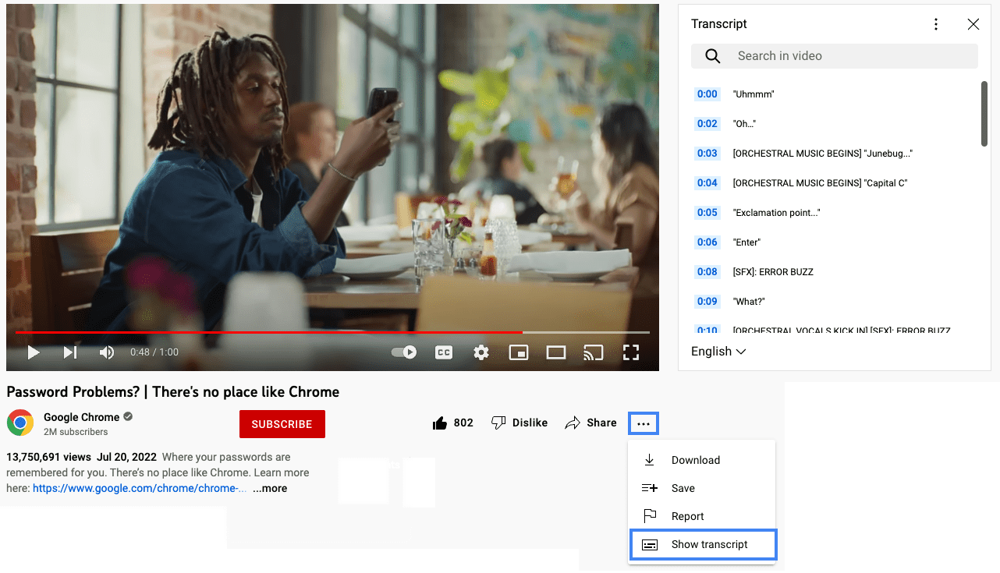

# Видео и аудио

<big>

Хотели ли вы когда-нибудь посмотреть прямую трансляцию, но не могли найти наушники, поэтому включили субтитры? Или, возможно, вы не совсем поняли последние несколько тезисов из вашего любимого подкаста, поэтому решили прочитать транскрипт вместо этого? Если это так, то вы, вероятно, понимаете важность и удобство наличия альтернативных способов доступа к аудио- и видеоконтенту.

Хотя ваша роль в компании или организации может не требовать от вас создания аудио- и видеоконтента напрямую, важно знать основы [требований доступности для медиа](https://www.w3.org/WAI/WCAG21/Understanding/time-based-media). Эти знания помогут вам проектировать и создавать подходящие макеты и функции для пользователей с различными экологическими и сенсорными потребностями, такими как миллионы людей с потерей слуха или нарушениями зрения по всему миру.

</big>

## Альтернативные форматы медиа

Альтернативные форматы медиа были разработаны для поддержки медиапотребностей людей с инвалидностью. Это даёт людям дополнительные форматы на выбор при доступе к аудио- и видеоконтенту.

[Альтернативные форматы медиа, которые вы должны включить](https://www.w3.org/WAI/media/av/planning/#wcag-standard) вместе с вашими медиафайлами, зависят от:

*   Типа медиа, которое вы поддерживаете &mdash; только аудио, только видео или видео с аудио (мультимедиа) форматы
*   Является ли медиа прямой трансляцией или предварительно записанным
*   Версии и уровня соответствия WCAG, на которые вы нацеливаетесь
*   Любых дополнительных потребностей пользователей, связанных с медиа

Для создания [доступного аудио- и видеоконтента](https://www.w3.org/WAI/media/av/) для веб-сайтов и приложений существует четыре основных типа альтернативных форматов медиа: [субтитры](#субтитры), [транскрипты](#транскрипты), [аудиоописания](#аудиоописания) и [интерпретация жестового языка](#интерпретация-жестового-языка).

## Субтитры

Одним из наиболее широко используемых альтернативных форматов медиа являются [субтитры](https://www.w3.org/WAI/media/av/captions/). Субтитры представляют собой письменный текст, синхронизированный с мультимедийным контентом для людей, которые не могут слышать или понимать устную речь. Они представлены на том же языке, что и основная звуковая дорожка, и включают важную неречевую информацию, такую как звуковые эффекты, фоновые шумы и важную музыку.

Субтитры полезны людям, которые глухие, слабослышащие или имеют когнитивные нарушения, но также полезны многим другим людям.

Субтитры бывают двух форм &mdash; открытые или закрытые.

*   Закрытые субтитры (CC) — это текст поверх видео, который может быть включён или выключён зрителем и, в зависимости от медиаплеера, оформлен таким образом, чтобы соответствовать потребностям пользователя.
*   Открытые субтитры (OC) — это текст, вшитый в видео, который нельзя выключить или оформить по-другому.

Один метод может быть предпочтительнее в зависимости от ситуации или того, как мультимедиа будет потребляться.

Люди часто путают субтитры с подписями, но они не являются синонимами. Оба представляют собой текст, синхронизированный с мультимедийным контентом, часто появляющийся внизу медиа. Субтитры можно рассматривать как транскрипцию диалога и других важных звуков для людей с инвалидностью. Подписи — это визуальный текст для людей, которые могут слышать звуковую дорожку, но могут не понимать, что было сказано, например, при просмотре фильма на иностранном языке.

!!!note ""

	Существуют некоторые географические различия в том, что считается субтитрами и подписями, поэтому обязательно проверьте терминологию в вашем регионе.

| Особенности | Подписи | Закрытые субтитры | Открытые субтитры |
|-------------|---------|-------------------|-------------------|
| Визуальный текст соответствует звуковой дорожке | Нет | Да | Да |
| Включает важные фоновые звуки | Нет | Да | Да |
| Возможность включить/выключить | Да | Да | Нет |

<small>Посмотрите пример субтитров в этом видео, Google &mdash; История CODA. Переключите кнопку CC на Вкл, чтобы увидеть закрытые субтитры в этом видео.</small>

Сравните скриншоты этого видео с субтитрами и без них.

*   

	<small>Видео с субтитрами</small>

*   

	<small>Видео без субтитров</small>

## Транскрипты

Близкие родственники субтитров, [транскрипты](https://www.w3.org/WAI/media/av/transcripts/) — это подробные, текстовые документы, которые захватывают все важные слова, звуки и важную визуальную информацию в вашем медиа. Транскрипты в первую очередь помогают людям, которые слабослышащие или глухие, а описательные транскрипты помогают людям, которые слепоглухие.

Транскрипты также полезны для людей с когнитивными нарушениями или для людей, которые хотят просматривать контент в своем собственном темпе.

Хотя транскрипты обычно более подробные, чем субтитры, они очень похожи по формату и назначению. Они настолько похожи, что многие люди сначала добавляют субтитры к своему медиа, экспортируют их, а затем используют их как основу для своих транскриптов. Перепрофилирование ваших субтитров для создания транскриптов экономит время по сравнению с созданием всего с нуля.

Поисковые боты не могут получить доступ к вашим субтитрам, но могут сканировать ваши текстовые транскрипты. Когда вы включаете транскрипты вместе с вашими медиафайлами, ваша поисковая оптимизация получает усиление. Это одно из тех редких исключений, когда дублированный контент не сбивает с толку пользователей и не наказывается алгоритмами поисковых систем.

Каждый медиаплеер обрабатывает транскрипты по-разному. Некоторые провайдеры могут не иметь этой функциональности, встроенной в их медиаплеер, и даже когда она есть, некоторые пользователи могут быть не в состоянии получить доступ к интерфейсу транскриптов. Вы можете убедиться, что сделали ваш транскрипт доступным для всех пользователей:

*   Включив текст транскрипта непосредственно в контексте, на странице с встроенным видео.
*   Добавив ссылку на доступный PDF, содержащий транскрипт.
*   Дав ссылку на копию на другой странице.
*   Включив ссылку на транскрипт, где бы он ни находился, в описание видео на любой платформе медиаплеера, которую вы использовали (например, YouTube или Vimeo).

Например, посетите YouTube, чтобы посмотреть [_Проблемы с паролями? | Нет места лучше Chrome_](https://www.youtube.com/watch?v=SlGuvC5nnTA) и изучите пример транскрипта.

Под заголовком видео нажмите <strong>...</strong> и выберите <strong>Показать транскрипт</strong> из выпадающего меню. Транскрипты появятся справа или снизу от видео, в зависимости от размера вашего экрана.

## Аудиоописания

Другим альтернативным медиа, используемым для поддержки людей с инвалидностью, является [аудиоописание](https://www.w3.org/WAI/media/av/description/). Этот тип альтернативного медиа использует диктора для объяснения важной визуальной информации людям, которые не могут видеть визуальный контент. Эти описания включают невербальную информацию, такую как мимика лица, невысказанные действия и окружающую среду в видео и мультимедийном контенте.

Иногда аудиоописания должны быть очень подробными из-за большого количества информации, которую нужно поделиться со зрителем. Если в видео недостаточно естественных пауз для аудиоописаний, используются расширенные аудиоописания. В расширенных аудиоописаниях видео приостанавливается, чтобы дать диктору достаточно времени для передачи всей информации в медиа перед воспроизведением остальной части видео.

Аудиоописания и расширенные аудиоописания помогают людям, которые слепые или имеют слабое зрение, но также могут помочь людям с некоторыми когнитивными расстройствами.

Вот пример иллюстрированного видео с аудиоописанием под названием _`[Аудиоописание]` Начните работу с Lookout от Google | Android_.

## Интерпретация жестового языка

Другим основным типом альтернативного медиа, с которым вы можете столкнуться, является [интерпретация жестового языка](https://www.w3.org/WAI/media/av/sign-languages/), где переводчик озвучивает звуковую часть аудио или мультимедийного контента, используя жестовый язык. Это очень важно для многих людей, которые глухие, поскольку жестовый язык является их первым и наиболее свободным языком.

Интерпретация жестового языка часто более выразительная и подробная, чем письменные документы, обеспечивая гораздо более богатый опыт, чем субтитры или транскрипты в одиночку.

Тем не менее, интерпретация жестового языка может быть времязатратной и дорогостоящей для многих организаций. И даже если у вас есть время и бюджет для добавления интерпретации жестового языка к вашему медиа, существует [более 300 различных жестовых языков](https://en.wikipedia.org/wiki/List_of_sign_languages) по всему миру. Добавление одной интерпретации жестового языка к вашему медиа не будет достаточно для поддержки глобальной аудитории.

Посмотрите, как переводчики жестового языка рассказали историю устойчивого развития Google в видео _Google Presents: Search On '22_.

<small>:material-information-outline: Источник &mdash; <https://web.dev/learn/accessibility/video-audio></small>
