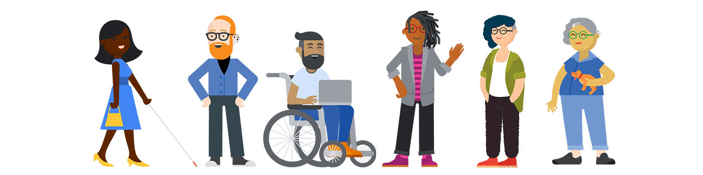
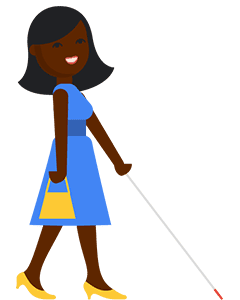

# Что такое цифровая доступность и почему она имеет значение?

Представьте себе мир, в котором вы не можете купить подарок другу, потому что корзина интернет-магазина несовместима с вашим устройством. Или мир, в котором приходится просить коллегу помочь понять график последних продаж, потому что в нем используются только мягкие однотонные цвета. Может быть, вы не смогли насладиться новым сериалом, о котором все говорят, потому что титры отсутствуют или плохо автоматизированы.

Для некоторых людей такой мир является повседневной реальностью. Но так не должно быть - вы можете помочь изменить эту реальность, если сделаете доступность цифровых технологий своим приоритетом. Цифровая доступность (сокращенно [a11y](https://www.a11yproject.com/posts/a11y-and-other-numeronyms/)) - это разработка и создание цифровых продуктов, позволяющих человеку, независимо от его инвалидности, взаимодействовать с продуктом значимым и равноценным образом.

Для создания цифровых продуктов с учетом принципа полной инклюзивности, помимо обычных требований руководства, времени, усилий и бюджета, которые необходимы для любого проекта, также требуются:

-   Знание различных стандартов доступности
-   Понимание основ доступного дизайна и кода
-   понимание важности использования различных методов и инструментов тестирования.

Самое главное, что настоящая инклюзивность может быть достигнута только тогда, когда вы включаете людей с ограниченными возможностями и лучшие практики обеспечения доступности в полный жизненный цикл продукта - от планирования, проектирования, кодирования и т.д.

## Каково индивидуальное воздействие?

По оценкам [Всемирной организации здравоохранения](https://www.who.int/teams/noncommunicable-diseases/sensory-functions-disability-and-rehabilitation/world-report-on-disability) (ВОЗ), более 15% населения Земли - 1,3 млрд. человек - идентифицируют себя как инвалиды, что делает эту группу самым многочисленным меньшинством в мире.

Согласно более поздним отчетам [Центров по контролю и профилактике заболеваний (CDC)](https://www.cdc.gov/ncbddd/disabilityandhealth/infographic-disability-impacts-all.html), [Переписи населения США](https://www.census.gov/content/dam/Census/library/publications/2018/demo/p70-152.pdf), [Академической сети европейских экспертов по инвалидности (ANED)](https://includ-ed.eu/sites/default/files/documents/aned_2013_task_6_-_comparative_data_synthesis_report_-_europe2020_final.pdf) и других организаций, общее число людей с инвалидностью еще больше. Это число продолжает расти по мере старения населения планеты и появления хронических заболеваний.

Недоступные цифровые продукты влияют на людей с ограниченными возможностями. Некоторые виды инвалидности подвержены влиянию цифровых технологий в большей степени, чем другие.

!!!note ""

    Чтобы узнать больше об идентичности и выборе языка, мы рекомендуем прочитать [Demystifying Disability: What to Know, What to Say, and How to Be Ally](https://emilyladau.com/book/) Эмили Ладау.

## Нарушения зрения

[Нарушение зрения](https://www.disabled-world.com/disability/types/vision/) ("Зрение", "инвалидность по зрению") - это снижение способности видеть до такой степени, что возникают проблемы, не устранимые обычными средствами, такими как очки или медикаменты. Нарушение зрения может быть вызвано заболеванием, травмой, врожденным или дегенеративным состоянием.

-   _Примеры_: Б/слепота, слабое зрение, дальтонизм
-   _Распространенность_: 253 млн. человек с нарушениями зрения в мире - 36 млн. слепых, 217 млн. имеют умеренные и тяжелые нарушения зрения (УНЗ) ([Источник](https://www.ncbi.nlm.nih.gov/pmc/articles/PMC5820628/)), 1 из 12 мужчин и 1 из 200 женщин являются дальтониками. ([Источник](https://www.colourblindawareness.org/colour-blindness/))
-   _Инструментарий включает в себя_: Программы для чтения с экрана, средства увеличения экрана, устройства вывода информации по Брайлю.
-   _Болевые точки_: Цифровые продукты, не работающие с программами для чтения с экрана, мобильные веб-сайты/приложения без функции масштабирования, сложные графики и диаграммы, различаемые только по цветам, цветовые контрасты, затрудняющие чтение текста на экране.

!!!warning ""

    Используйте строчные буквы, когда речь идет о состоянии зрения или о слепом человеке, который предпочитает строчные буквы. Для тех, кто пишет "Слепой" с заглавной буквы при описании себя, используйте прописные буквы.

> "За последние три года мое зрение стремительно ухудшилось, и размер шрифта в моем телефоне по умолчанию варьируется от крупного до мегакрупного. Существует приличное количество мобильных приложений, которыми я практически не могу пользоваться из-за их абсурдного размера шрифта."
>
> Frank

Прочитайте короткую [статью в New York Times](https://www.nytimes.com/2022/08/16/opinion/blindness-retinitis-pigmentosa.html) или посмотрите [видеофильм](https://youtu.be/X04HKyW-3hc) о том, что значит быть слепым.

## Нарушения подвижности

[Нарушение мобильности](https://www.disabled-world.com/disability/types/mobility/) - это категория инвалидности, к которой относятся люди с различными физическими недостатками. К этому виду инвалидности относятся потеря или инвалидность верхних или нижних конечностей, нарушение ручной ловкости, нарушение координации с различными органами тела.

-   _Примеры_: Артрит, паралич, ампутированные конечности, судороги.
-   _Распространенность_: 1 из 7 человек имеет проблемы с мобильностью. ([Источник](https://www.cdc.gov/media/releases/2018/p0816-disability.html#:~:text=One%20in%204%20U.S.%20adults,affects%201%20in%207%20adults.))
-   _Инструменты включают_: Адаптивные переключатели, устройства слежения за глазами, палочки для рта/головы, речевой ввод.
-   _Болевые точки_: Элементы, предназначенные для работы только с помощью мыши.

> "Доступность - это не только для людей с ограниченными возможностями. Я перенес операцию на локте, и это временно изменило мои ежедневные действия с цифровыми устройствами".
>
> Мелисса

## Нарушения слуха

[Нарушение или потеря слуха](https://www.disabled-world.com/disability/types/hearing/) - это полное или частичное снижение способности различать или понимать звуки. Нарушения слуха вызываются широким спектром биологических и экологических факторов.

-   _Примеры_: Г/глухота, слабослышащие (СС)
-   _Распространенность_: Во всем мире более 1,5 млрд. человек имеют низкий или средний уровень потери слуха, а по оценкам, 66 млн. человек имеют [значительный уровень потери слуха](https://www.who.int/health-topics/hearing-loss#tab=tab_1).
-   _Средства_: слуховые аппараты, субтитры, транскрипция, язык жестов.
-   _Болевые точки_: аудиоконтент без текстовой расшифровки, видео без синхронизированных титров.

!!!warning ""

    Используйте строчные буквы при упоминании состояния потери слуха или глухого человека, предпочитающего строчные буквы. Прописная буква используется для тех, кто идентифицирует себя как члена сообщества глухих, или когда они пишут "глухой" с большой буквы, описывая себя.

> "Некоторые глухие люди говорят, что автоматические субтитры НЕ лучше, чем ничего. Некоторые глухие говорят, что автоматические субтитры - это лучше, чем ничего. В отличие от людей со слухом, глухим людям не на что опереться. Все, что у них есть, - это субтитры. Лично я предпочел бы не видеть никаких титров, чем смотреть фильмы с автоматическими титрами. Конечно, я разочарован отсутствием субтитров. Но без автоматических субтитров я избегаю болезненного опыта, связанного с их печально известными плохими субтитрами."
>
> Meryl

## Когнитивные нарушения

[Когнитивная инвалидность](https://www.disabled-world.com/disability/types/cognitive/) охватывает различные медицинские состояния, влияющие на когнитивные способности. К людям с когнитивными нарушениями относятся различные интеллектуальные или когнитивные дефициты, слишком легкие дефициты, чтобы правильно квалифицировать их как интеллектуальную недостаточность, специфические заболевания, а также проблемы, приобретенные в более позднем возрасте в результате травм головного мозга или нейродегенеративных заболеваний, таких как деменция.

-   _Примеры_: Синдром Дауна, а/аутизм, СДВГ, дислексия, афазия.
-   _Частота_: Зависит от состояния.
-   _Инструменты включают_: Программы чтения с экрана, выделение текста, предсказание текста, средства абстрактного обобщения.
-   _Болевые точки_: Загроможденные интерфейсы, не позволяющие сосредоточиться на задаче, большие стены слов с малым количеством свободного пространства, выравнивание текста, мелкий или трудночитаемый шрифт.

!!!warning ""

    Используйте строчные буквы при упоминании аутизма как расстройства или аутиста, который предпочитает строчные буквы. Для тех, кто при описании себя пишет "аутизм" или "аутист" с заглавной буквы, используйте прописные буквы.

> "Сейчас я восстанавливаюсь после глазной мигрени, и я бы сказал, что темный режим помогает недостаточно. Мне по-прежнему нужен контраст, но менее резкий и яркий".
>
> Рут

Прочитайте небольшую [статью в New York Times](https://www.nytimes.com/2022/08/30/opinion/face-blindness-prosopagnosia.html) или посмотрите [видео](https://youtu.be/3-MzNPcEh6M) о слепоте по лицу (прозопагнозии).

## Судорожные и вестибулярные расстройства

Припадок - это чрезмерный всплеск электрической активности в головном мозге, который может вызывать различные симптомы в зависимости от того, какие участки мозга задействованы. Припадки могут быть следствием генетики или черепно-мозговой травмы, но их [причина часто остается неизвестной](https://nyulangone.org/conditions/epilepsy-seizure-disorders-in-adults/types).

Вестибулярная система включает в себя части внутреннего уха и мозга, которые обрабатывают сенсорную информацию, контролирующую равновесие и движения глаз. Если заболевание или травма повреждают эти области обработки информации, то могут возникнуть вестибулярные расстройства. [Вестибулярные расстройства](https://vestibular.org/article/diagnosis-treatment/types-of-vestibular-disorders/) также могут быть следствием или ухудшением генетических или экологических условий или возникать по неизвестным причинам.

-   _Примеры_: Эпилепсия, вертиго, головокружение, лабиринтит, нарушения равновесия и движения глаз.
-   _Частота_: [50 млн. человек в мире страдают эпилепсией](https://www.who.int/health-topics/epilepsy), а 1,8 млн. взрослых в мире имеют [двустороннюю вестибулярную гипофункцию](https://www.hopkinsmedicine.org/news/newsroom/news-releases/implant-improves-balance-movement-and-quality-of-life-for-people-with-inner-ear-disorder) (BVH).
-   _Инструменты включают_: Настройки операционной системы для уменьшения движения. В Windows эта настройка позитивно оформлена как **Показывать анимацию** и отключена. В Android включается настройка **Убрать анимацию**.
-   _Болевые точки_: Видеоролики с автоматическим воспроизведением, экстремальное мигание или стробирование визуального контента, параллакс-эффекты или анимация, запускаемая при прокрутке.

> "Мне очень не нравится лишняя анимация, которой в iOS сопровождаются переходы между приложениями, поэтому я ее отключаю. Обратная сторона: я лишаюсь большинства продуманных моушн-дизайнов в Интернете, потому что здесь нет золотой середины "немного движения - это нормально"".
>
> Оливер

## Нарушения речи

[Нарушение речи](https://www.pennmedicine.org/for-patients-and-visitors/patient-information/conditions-treated-a-to-z/speech-and-language-disorders#:~:text=A%20speech%20disorder%20is%20a,Articulation%20disorders) - это состояние, при котором у человека возникают проблемы с созданием или формированием звуков речи, необходимых для общения с другими людьми.

-   _Примеры_: Мышечные или когнитивные проблемы, затрудняющие речь, такие как апраксия, дизартрия или заикание.
-   _Частота_: 18,5 млн. человек имеют [речевые, голосовые или языковые расстройства](https://www.nidcd.nih.gov/health/statistics/quick-statistics-voice-speech-language).
-   _Инструменты включают_: Аугментативная и альтернативная коммуникация (AAC) и устройства, генерирующие речь.
-   _Болевые точки_: Технологии с голосовым управлением, такие как устройства и приложения для "умного дома".

> "У моего сына дислалия из-за диспраксии. Он говорит "seep", а не "sheep", или "fower", а не "flower". Это мило, но он так расстраивается из-за программ, управляемых голосом".
>
> > В нашем новом автомобиле для взаимодействия с телефоном используется голосовая активация. Часто, если мы вместе, мой муж отправляет нам сообщение в WhatsApp. Машина зачитывает его вслух, но когда она спрашивает нас, хотим ли мы ответить, ответ моего сына не воспринимается. Он так расстраивается... Теперь он шепчет мне сообщение, чтобы я могла сказать его в ответ".
>
> Елена

Прочитайте короткую [статью в New York Times](https://www.nytimes.com/2022/08/23/opinion/stutter-speech-listening.html) или посмотрите [видео](https://youtu.be/m0E_wMIwfSI) о заикании и технологиях.

## Дополнительные бенефициары доступности

Хотя число людей с ограниченными возможностями в мире велико, важно помнить, что эти цифры не охватывают всех, кто получает выгоду от доступных цифровых пространств. К ним относятся:

-   _Временные инвалиды_. Это может означать, что у человека сломано запястье или он страдает когнитивными нарушениями из-за приема лекарств.
-   _Ситуативные инвалиды_. Например, блики на экране устройства или невозможность воспроизвести звук на видео в общественном месте.
-   _Легкая степень инвалидности_. Человек, которому нужны очки, чтобы видеть экран, или субтитры, чтобы понимать аудиозаписи.
-   _Не носители языка_. Если человек не владеет языком, на котором он говорит на экране, ему может потребоваться больше времени для чтения содержимого слайда в карусели/слайд-шоу.
-   _Пожилые люди с возрастным ослаблением органов чувств_. Это может быть человек, которому нужны очки для чтения или бифокальные очки, чтобы читать мелкий шрифт, или которому требуется больший размер кнопок на сенсорном устройстве из-за возрастного тремора рук.
-   _Боты для поисковой оптимизации (SEO)_. SEO-боты не обладают такими органами чувств, как зрение и слух, и ориентируются только с помощью клавиатуры. Если ваш сайт доступен, то его посещение будет более эффективным.

## Влияние на бизнес

Люди с ограниченными возможностями составляют почти четвертую часть населения Земли, но знаете ли вы, что они также обладают значительными возможностями?

По данным [American Institutes for Research (AIR)](https://www.researchgate.net/profile/Dahlia-Shaewitz/publication/324603094_A_Hidden_Market_The_Purchasing_Power_of_Working-Age_Adults_With_Disabilities_A_Hidden_Market_The_Purchasing_Power_of_Working-Age_Adults_With_Disabilities/links/5ad89016458515c60f5918f3/A-Hidden-Market-The-Purchasing-Power-of-Working-Age-Adults-With-Disabilities-A-Hidden-Market-The-Purchasing-Power-of-Working-Age-Adults-With-Disabilities.pdf), общий располагаемый доход американцев трудоспособного возраста с инвалидностью после уплаты налогов составляет около 490 млрд. долл. в год. Эта цифра аналогична другим значительным сегментам рынка в США, таким как чернокожие (501 млрд. долл.) и латиноамериканцы (582 млрд. долл.). Компании, которые не планируют, не разрабатывают и не создают доступные продукты, могут упустить этот потенциальный доход.

Хотя эти цифры впечатляют, люди с ограниченными возможностями также являются частью большой сети, состоящей из членов семьи, друзей, общин и учреждений. Эта сеть часто ищет и поддерживает компании, создающие доступные цифровые продукты. Если учесть друзей и родственников более 1,3 млрд. человек в мире, относящих себя к категории инвалидов, то рынок товаров для инвалидов охватывает 53% всех потребителей. Это крупнейший в мире развивающийся рынок.

Помимо денег и доли рынка, предприятия, ориентированные на интеграцию инвалидов как часть общей стратегии разнообразия, имеют [более высокие показатели эффективности и инновационности](https://www.w3.org/WAI/business-case/). Существует множество примеров [товаров повседневного спроса](https://incl.ca/the-evolution-of-assistive-technology-into-everyday-products/), которые появились благодаря технологиям, разработанным людьми с ограниченными возможностями или для них, в том числе:

-   телефоны
-   печатные машинки / клавиатуры
-   Электронная почта
-   Кухонная утварь
-   Легко открывающиеся выдвижные ящики
-   Автоматические открыватели дверей
-   Голосовое управление
-   Технология "взгляд глазами

Когда мы рассматриваем доступность как задачу проектирования или кодирования, а не как вынужденное требование, инновации становятся побочным продуктом. Для людей без инвалидности такие усовершенствования могут повысить общий уровень удобства пользования. Для людей с ограниченными возможностями эти усовершенствования необходимы для обеспечения равного доступа.

## Юридические последствия

Помимо индивидуального и делового воздействия, вы также должны знать о грозящих [юридических последствиях](https://f.hubspotusercontent30.net/hubfs/3280432/Remediated-2021-Year-End-Report-FINAL.pdf) отказа от создания доступных цифровых продуктов. Государственные организации в США, такие как государственные программы/школы, авиакомпании и некоммерческие организации, обязаны соблюдать определенные правила доступности цифровых продуктов, в то время как многие частные компании этого не делают. В таких странах, как Канада, Великобритания, Япония, Австралия и Европейский союз, существуют более строгие [законы о цифровой доступности](https://www.w3.org/WAI/policies/) как для государственных, так и для частных компаний.

Для многих инвалидов в США подача судебного иска является единственной возможностью привлечь внимание к цифровым продуктам и добиться изменений. По оценкам специалистов, в США ежедневно подается более десяти исков, касающихся доступности цифровых технологий. Многие компании получили множество исков, связанных с доступностью цифровых технологий. И с каждым годом общее число исков растет.

Наибольшее число исков, как правило, приходится на веб-сайты и приложения для электронной коммерции, на которые в 2021 году будет подано более 74% исков. Если ваша компания имеет как физическое местоположение, так и онлайн-представительство, то вероятность того, что вы стали участником судебного разбирательства, достаточно высока. Так, из 500 крупнейших сайтов электронной коммерции 412 получили судебные иски в течение последних четырех лет. Часто первый иск подается в отношении веб-сайта компании, а второй - в отношении ее мобильного приложения.

Хотя предотвращение судебных исков не должно быть единственной причиной, по которой вы уделяете особое внимание обеспечению доступности ваших цифровых продуктов, это важная часть разговора.
