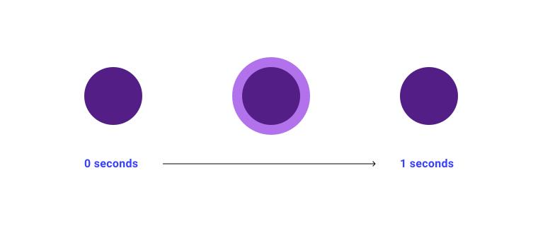
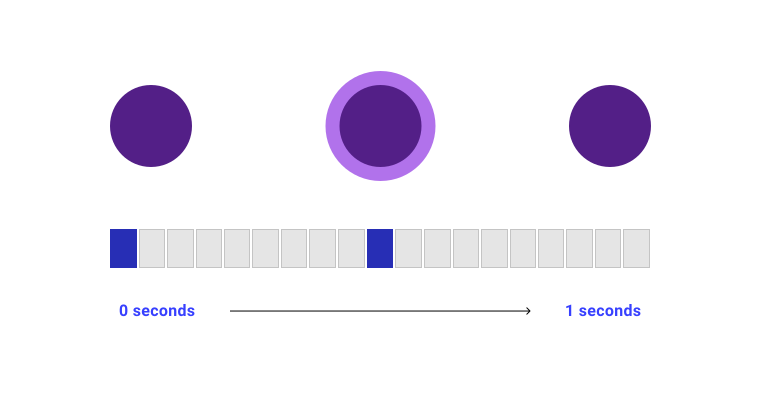
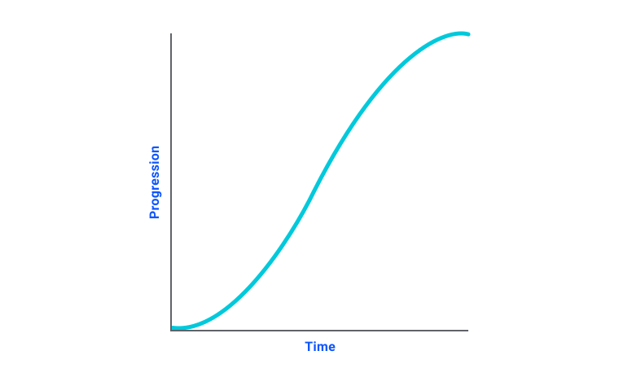

# Анимации

<big>**Анимация** - это отличный способ выделить интерактивные элементы и придать дизайну интерес и увлекательность. В этом модуле вы узнаете, как добавлять и управлять эффектами анимации с помощью CSS.</big>

!!!info "CSS подкаст"

    022: Анимации

    <audio style="width: 100%;" controls src="https://traffic.libsyn.com/secure/thecsspodcast/TCO022_TCP_CSS_Podcast_Episode_022_v1.0.mp3?dest-id=1891556"></audio>

Иногда на интерфейсах встречаются маленькие помощники, которые при нажатии на них предоставляют полезную информацию о конкретном разделе. Часто они имеют пульсирующую анимацию, чтобы ненавязчиво дать понять, что информация здесь и с ней нужно взаимодействовать. Но как это сделать с помощью CSS?

<iframe src="https://codepen.io/web-dot-dev/embed/mdRXGeJ?height=300&amp;theme-id=light&amp;default-tab=result&amp;editable=true" style="height: 500px; width: 100%; border: 0;" loading="lazy"></iframe>

В CSS такой тип анимации можно реализовать с помощью CSS-анимации, которая позволяет задать последовательность анимации, используя ключевые кадры. Анимация может быть простой, состоящей из одного состояния, или даже сложной, основанной на времени.

## Что такое ключевой кадр?

В программах анимации, CSS и большинстве других инструментов, позволяющих анимировать что-либо, ключевые кадры - это механизм, который используется для назначения состояний анимации временным меткам, расположенным на временной шкале.

Давайте рассмотрим "пульсатор" в качестве контекста. Вся анимация длится 1 секунду и состоит из 2 состояний.



Существует определенная точка, в которой начинается и заканчивается каждое из этих состояний анимации. Они обозначаются на временной шкале с помощью ключевых кадров.



### `@keyframes`

Теперь вы знаете, что такое ключевой кадр, и это знание должно помочь вам понять, как работает правило CSS [`@keyframes`](../../css/keyframes.md). Здесь представлено базовое правило с двумя состояниями.

```css
@keyframes my-animation {
    from {
        transform: translateY(20px);
    }
    to {
        transform: translateY(0px);
    }
}
```

Первая часть, на которую следует обратить внимание, - это [custom ident](https://developer.mozilla.org/docs/Web/CSS/custom-ident) (пользовательский идентификатор), или, говоря более человеческим языком, название правила ключевых кадров. Идентификатор этого правила - `my-animation`. Пользовательский идентификатор работает как имя функции. Это, как вы узнали из модуля [Функции](functions.md), позволяет ссылаться на правило ключевых кадров в других местах вашего CSS-кода.

!!!note ""

    Идентификатор `<custom-ident>` используется в различных местах CSS и позволяет задать собственное имя для объектов. Эти идентификаторы чувствительны к регистру, и в некоторых случаях есть слова, которые нельзя использовать. Например, при именовании строк в CSS Grid нельзя использовать слово `span`.

---

Внутри правила ключевых кадров `from` и `to` - это ключевые слова, обозначающие `0%` и `100%`, которые являются началом и концом анимации. Можно переделать это правило следующим образом:

```css
@keyframes my-animation {
    0% {
        transform: translateY(20px);
    }
    100% {
        transform: translateY(0px);
    }
}
```

Можно добавить сколько угодно позиций на таймфрейме. В контексте примера с "пульсатором" имеется 2 состояния, которые соответствуют 2 ключевым кадрам. Это означает, что внутри правила ключевых кадров у вас есть 2 позиции для представления изменений для каждого из этих ключевых кадров.

```css
@keyframes pulse {
    0% {
        opacity: 0;
    }
    50% {
        transform: scale(1.4);
        opacity: 0.4;
    }
}
```

<iframe src="https://codepen.io/web-dot-dev/embed/mdRXGeJ?height=300&amp;theme-id=light&amp;default-tab=css%2Cresult&amp;editable=true" style="height: 500px; width: 100%; border: 0;" loading="lazy"></iframe>

## Свойства `animation`

Чтобы использовать свои `@keyframes` в CSS-правилах, определите различные свойства анимации _или_ используйте сокращенное свойство [`animation`](../../css/animation.md).

### `animation-duration`

```css
.my-element {
    animation-duration: 10s;
}
```

Свойство [`animation-duration`](../../css/animation-duration.md) определяет, насколько длинной должна быть временная шкала `@keyframes`. Это должно быть значение времени. По умолчанию оно равно `0` секунд, т. е. анимация будет продолжаться, но будет слишком быстрой для восприятия. Отрицательные значения времени добавлять нельзя.

### `animation-timing-function`

Для воссоздания естественного движения в анимации можно использовать функции синхронизации, которые рассчитывают скорость анимации в каждой точке. Вычисляемые значения часто бывают _кривыми_, заставляя анимацию работать с переменной скоростью в течение `animation-duration`, а если вычисляемое значение превышает значение, заданное в `@keyframes`, то элемент кажется подпрыгивающим.

В CSS существует несколько ключевых слов, доступных в виде предустановок, которые используются в качестве значения для [`animation-timing-function`](../../css/animation-timing-function.md): `linear`, `ease`, `ease-in`, `ease-out`, `ease-in-out`.

```css
.my-element {
    animation-timing-function: ease-in-out;
}
```

<iframe src="https://codepen.io/web-dot-dev/embed/YzNeJbL?height=500&amp;theme-id=light&amp;default-tab=result&amp;editable=true" style="height: 500px; width: 100%; border: 0;" loading="lazy"></iframe>

Значения выглядят кривыми при использовании функций ослабления, поскольку ослабление рассчитывается с помощью кривой Безье, которая используется для моделирования скорости. Каждое из ключевых слов функции смягчения, например `ease`, ссылается на заранее определенную кривую Безье. В CSS кривую Безье можно задать напрямую, используя функцию `cubic-bezier()`, которая принимает четыре числовых значения: `x1`, `y1`, `x2`, `y2`.

```css
.my-element {
    animation-timing-function: cubic-bezier(
        0.42,
        0,
        0.58,
        1
    );
}
```

Эти значения строят график каждой части кривой по осям X и Y.



Понимание кривых Безье довольно сложно, поэтому очень полезны визуальные инструменты, такие как [этот генератор от Lea Verou](https://cubic-bezier.com/).

#### Функция смягчения `steps`

Иногда требуется более детальный контроль над анимацией, и вместо движения по кривой требуется перемещение по интервалам. Функция ослабления `steps()` позволяет разбить временную шкалу на определенные, **равные интервалы**.

```css
.my-element {
    animation-timing-function: steps(10, end);
}
```

Первый аргумент - количество шагов. Если шаги определены как 10 и имеется 10 ключевых кадров, то каждый ключевой кадр будет воспроизводиться последовательно в течение точного количества времени, без перехода между состояниями. Если ключевых кадров для шагов недостаточно, то в зависимости от второго аргумента добавляются шаги между ключевыми кадрами.

Второй аргумент - это направление. Если он установлен в `end`, что является значением по умолчанию, то шаги завершаются в конце временной шкалы. Если же он имеет значение `start`, то первый шаг анимации завершается сразу после начала, то есть заканчивается на один шаг раньше, чем `end`.

<iframe src="https://codepen.io/web-dot-dev/embed/JjEpege?height=500&amp;theme-id=light&amp;default-tab=result&amp;editable=true" style="height: 500px; width: 100%; border: 0;" loading="lazy"></iframe>

### `animation-iteration-count`

```css
.my-element {
    animation-iteration-count: 10;
}
```

Свойство [`animation-iteration-count`](../../css/animation-iteration-count.md) определяет, сколько раз должна выполняться временная шкала `@keyframes`. По умолчанию это значение равно `1`, что означает, что когда анимация достигнет конца временной шкалы, она остановится в конце. Число не может быть отрицательным.

<iframe src="https://codepen.io/web-dot-dev/embed/oNBEaYB?height=500&amp;theme-id=light&amp;default-tab=css%2Cresult&amp;editable=true" style="height: 500px; width: 100%; border: 0;" loading="lazy"></iframe>

Вы можете использовать ключевое слово `infinite`, которое зацикливает анимацию, как это делает демонстрация "пульсатора" из начала этого урока.

<iframe src="https://codepen.io/web-dot-dev/embed/mdRXGeJ?height=500&amp;theme-id=light&amp;default-tab=css%2Cresult&amp;editable=true" style="height: 500px; width: 100%; border: 0;" loading="lazy"></iframe>

### `animation-direction`

```css
.my-element {
    animation-direction: reverse;
}
```

С помощью параметра [`animation-direction`](../../css/animation-direction.md) можно задать направление движения временной шкалы по ключевым кадрам:

-   `normal`: значение по умолчанию - вперед.
-   `reverse`: движение по временной шкале в обратном направлении.
-   `alternate`: для каждой итерации анимации временная шкала будет последовательно двигаться вперед или назад.
-   `alternate-reverse`: обратный вариант `alternate`.

<iframe src="https://codepen.io/web-dot-dev/embed/JjWPqMv?height=500&amp;theme-id=light&amp;default-tab=result&amp;editable=true" style="height: 500px; width: 100%; border: 0;" loading="lazy"></iframe>

### `animation-delay`

```css
.my-element {
    animation-delay: 5s;
}
```

Свойство [`animation-delay`](../../css/animation-delay.md) определяет время ожидания перед началом анимации. Как и свойство `animation-duration`, оно принимает значение времени.

В отличие от свойства `animation-duration`, вы _можете_ задать его как отрицательное значение. Если задать отрицательное значение, то временная шкала в `@keyframes` будет начинаться с этого момента. Например, если длительность анимации составляет 10 секунд, а для `animation-delay` задано значение `-5s`, то она начнется с половины временной шкалы.

<iframe src="https://codepen.io/web-dot-dev/embed/bGqbyPw?height=500&amp;theme-id=light&amp;default-tab=result&amp;editable=true" style="height: 500px; width: 100%; border: 0;" loading="lazy"></iframe>

### `animation-play-state`

```css
.my-element:hover {
    animation-play-state: paused;
}
```

Свойство [`animation-play-state`](../../css/animation-play-state.md) позволяет воспроизводить и приостанавливать анимацию. По умолчанию используется значение `running`, а если установить значение `paused`, то это приведет к приостановке анимации.

<iframe src="https://codepen.io/web-dot-dev/embed/MWJQZyV?height=400&amp;theme-id=light&amp;default-tab=result&amp;editable=true" style="height: 500px; width: 100%; border: 0;" loading="lazy"></iframe>

### `animation-fill-mode`

Свойство [animation-fill-mode](../../css/animation-fill-mode.md) определяет, какие значения на временной шкале `@keyframes` сохраняются до начала анимации или после ее окончания. По умолчанию используется значение `none`, что означает, что после завершения анимации значения на временной шкале будут удалены. Другими опциями являются:

-   `forwards`: Сохраняется последний ключевой кадр в зависимости от направления анимации.
-   `backwards`: Сохраняется первый ключевой кадр в соответствии с направлением анимации.
-   `both`: следует правилам как для `forwards`, так и для `backwards`.

<iframe src="https://codepen.io/web-dot-dev/embed/rNyBEVK?height=500&amp;theme-id=light&amp;default-tab=result&amp;editable=true" style="height: 500px; width: 100%; border: 0;" loading="lazy"></iframe>

### Короткое обозначение `animation`

Вместо того чтобы определять все свойства по отдельности, можно задать их в скороговорке `animation`, которая позволяет определять свойства анимации в следующем порядке:

1.  `animation-name`
2.  `animation-duration`
3.  `animation-timing-function`
4.  `animation-delay`
5.  `animation-iteration-count`
6.  `animation-direction`
7.  `animation-fill-mode`
8.  `animation-play-state`

```css
.my-element {
    animation: my-animation 10s ease-in-out 1s infinite
        forwards forwards running;
}
```

## Особенности работы с анимацией

Пользователи могут указать в своей операционной системе, что при работе с приложениями и веб-сайтами они предпочитают уменьшать количество движений. Это предпочтение можно определить с помощью медиазапроса [prefers-reduced-motion](https://developer.mozilla.org/docs/Web/CSS/@media/prefers-reduced-motion).

```css
@media (prefers-reduced-motion) {
    .my-autoplaying-animation {
        animation-play-state: paused;
    }
}
```

Не обязательно, чтобы анимация отсутствовала, скорее, лучше сократить количество анимаций - [особенно неожиданных](https://web.dev/prefers-reduced-motion/). Подробнее об этом предпочтении и общей производительности можно узнать из [этого руководства по анимации](https://web.dev/animations/).

<iframe src="https://codepen.io/web-dot-dev/embed/bGqbPwq?height=500&amp;theme-id=light&amp;default-tab=result&amp;editable=true" style="height: 500px; width: 100%; border: 0;" loading="lazy"></iframe>

:information_source: Источник &mdash; [Animations](https://web.dev/learn/css/animations/)
