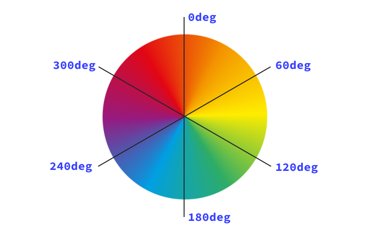
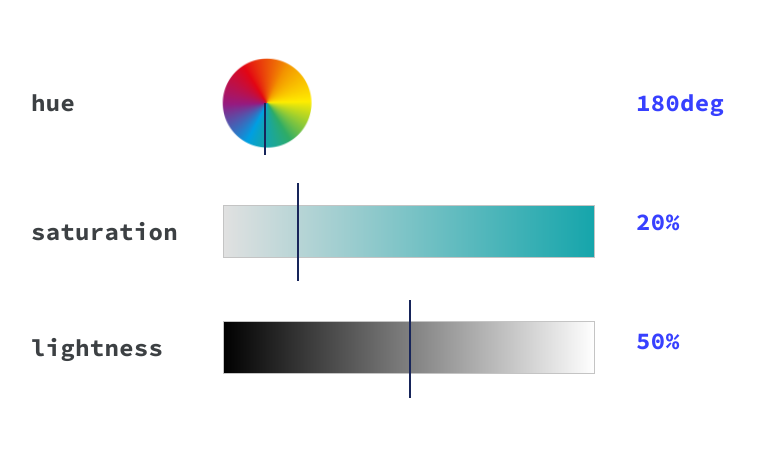

# Цвет

<big>Существует несколько различных способов задания цвета в CSS. В этом модуле мы рассмотрим наиболее часто используемые значения цвета.</big>

!!!info "CSS подкаст"

    006: Цвет Часть первая

    <audio style="width: 100%;" controls src="https://traffic.libsyn.com/secure/thecsspodcast/TCP_CSS_Podcast__Episode_006_v3.0.mp3?dest-id=1891556"></audio>

Цвет является важной частью любого сайта, а в CSS существует множество вариантов типов, функций и обработок цвета.

Как решить, какой тип цвета использовать? Как сделать цвета полупрозрачными? В этом уроке вы узнаете, какие варианты есть, что поможет вам принять правильное решение для вашего проекта и команды.

В CSS существуют [различные типы данных](https://developer.mozilla.org/docs/Web/CSS/CSS_Types), такие как строки и числа. Цвет является одним из этих типов и использует другие типы, такие как числа, для своих определений.

## Числовые цвета

Вполне вероятно, что первое знакомство с цветами в CSS происходит через числовые цвета. Мы можем работать с числовыми значениями цветов в нескольких различных формах.

### Шестнадцатеричные цвета

```css
h1 {
    color: #b71540;
}
```

Шестнадцатеричная нотация (часто сокращаемая до hex) - это сокращенный синтаксис для RGB, который присваивает числовое значение красному, зеленому и синему цветам, которые являются тремя **основными цветами**.

!!!tip ""

    По данным Web Almanac, [hex - самый популярный тип синтаксиса цвета](https://almanac.httparchive.org/en/2019/css#color-types).

Шестнадцатеричные диапазоны - **0-9** и **A-F**. При использовании шестизначной последовательности они переводятся в числовые диапазоны RGB, которые составляют 0-255 и соответствуют красному, зеленому и синему цветовым каналам соответственно.

<iframe src="https://codepen.io/web-dot-dev/embed/BapNrPG?height=430&amp;theme-id=light&amp;default-tab=result&amp;editable=true" style="height: 500px; width: 100%; border: 0;" loading="lazy"></iframe>

Также можно задать альфа-значение для любых числовых цветов. Альфа-значение - это процент прозрачности. В шестнадцатеричном коде к шестизначной последовательности добавляются еще две цифры, и получается восьмизначная последовательность. Например, чтобы задать черный цвет в шестнадцатеричном коде, напишите `#000000`. Чтобы добавить 50% прозрачности, измените его на `#00000080`.

Поскольку шестнадцатеричная шкала имеет вид **0-9** и **A-F**, значения прозрачности, вероятно, не совсем такие, как вы ожидаете. Вот некоторые ключевые, общепринятые значения, добавляемые к черному шестнадцатеричному коду `#000000`:

-   0% альфа, т. е. полная прозрачность - **00**: `#00000000`
-   50% альфа - это **80**: `#00000080`
-   75% альфа - это **BF**: `#000000BF`

<iframe src="https://codepen.io/web-dot-dev/embed/VwPLXdr?height=540&amp;theme-id=light&amp;default-tab=result&amp;editable=true" style="height: 500px; width: 100%; border: 0;" loading="lazy"></iframe>

Чтобы преобразовать двузначное шестнадцатеричное число в десятичное, нужно взять первую цифру и умножить ее на 16 (поскольку шестнадцатеричное число имеет основание 16), а затем прибавить вторую цифру. На примере **BF** для 75% альфа:

1.  B равно 11, что при умножении на 16 равно 176
2.  F равно 15
3.  176 + 15 = 191
4.  Значение альфа равно 191-75% от 255

!!!tip "Сокращенная hex запись"

    Можно также записывать шестнадцатеричные коды в виде трехзначной стенограммы. Трехзначный шестнадцатеричный код - это сокращение эквивалентной шестизначной последовательности. Например, `#a4e` идентичен `#aa44ee`. Если добавить альфу, то `#a4e8` расширится до `#aa44ee88`.

### RGB (Red, Green, Blue)

```css
h1 {
    color: rgb(183, 21, 64);
}
```

Цвета RGB задаются с помощью цветовой функции [`rgb()`](<https://developer.mozilla.org/docs/Web/CSS/color_value/rgb()>), используя в качестве параметров либо числа, либо проценты. Числа должны находиться в диапазоне **0-255**, а проценты - в диапазоне от **0% до 100%**. RGB работает по шкале 0-255, поэтому 255 будет эквивалентно 100%, а 0 - 0%.

Чтобы задать черный цвет в RGB, определите его как `rgb(0 0 0)`, то есть ноль красного, ноль зеленого и ноль синего. Черный цвет также можно определить как `rgb(0%, 0%, 0%)`. Белый цвет - полная противоположность: `rgb(255, 255, 255)` или `rgb(100%, 100%, 100%)`.

Альфа задается в `rgb()` одним из двух способов. Либо добавить символ `/` **после** параметров красного, зеленого и синего цветов, либо использовать функцию [`rgba()`](<https://developer.mozilla.org/docs/Web/CSS/color_value/rgba()>). Альфа может быть задана в процентах или в десятичной дроби от 0 до 1. Например, чтобы задать 50% альфа черного цвета в современных браузерах, напишите: `rgb(0 0 0 / 50%)` или `rgb(0 0 0 / 0,5)`. Для более широкой поддержки, используя функцию `rgba()`, напишите: `rgba(0, 0, 0, 50%)` или `rgba(0, 0, 0, 0.5)`.

<iframe src="https://codepen.io/web-dot-dev/embed/dyNomWW?height=430&amp;theme-id=light&amp;default-tab=result&amp;editable=true" style="height: 500px; width: 100%; border: 0;" loading="lazy"></iframe>

!!!warning "Запятые и пробелы"

    Запятые были удалены из обозначений `rgb()` и `hsl()`, поскольку в новых цветовых функциях, таких как `lab()` и `lch()`, в качестве разделителя используются пробелы, а не запятые. Это изменение обеспечивает большую согласованность не только с новыми цветовыми функциями, но и с CSS в целом. Для лучшей обратной совместимости можно по-прежнему использовать запятые для определения `rgb()` и `hsl()`.

### HSL (Hue, Saturation, Lightness)

```css
h1 {
    color: hsl(344, 79%, 40%);
}
```

HSL расшифровывается как hue, saturation и lightness. **Оттенок** описывает значение на цветовом круге, от 0 до 360 градусов, начиная с красного (это и 0, и 360). Оттенок 180, или 50%, будет находиться в синем диапазоне. Это источник того цвета, который мы видим.



**Насыщенность** - это степень яркости выбранного оттенка. Полностью ненасыщенный цвет (с насыщенностью `0%`) будет выглядеть полутоновым. И, наконец, **светлота** - это параметр, описывающий шкалу от белого до черного цвета добавленного света. Светлота, равная `100%`, всегда будет давать белый цвет.

Используя функцию цвета [`hsl()`](<https://developer.mozilla.org/docs/Web/CSS/color_value/hsl()>), вы определяете истинный черный цвет, написав `hsl(0 0% 0%)` или даже `hsl(0deg 0% 0%)`. Это связано с тем, что параметр hue определяет градус на цветовом круге, который, если использовать числовой тип, равен **0-360**. Можно также использовать тип angle, который имеет вид (`0deg`) или `(0turn)`. Насыщенность и светлота задаются в процентах.



!!!note "Тип angle"

    [Тип angle](https://developer.mozilla.org/docs/Web/CSS/angle) в CSS отлично подходит для определения оттенка, поскольку он очень хорошо представляет угол цветового круга. Этот тип принимает градусы, повороты, радианы и градианы.

    <p class="ciu_embed" data-feature="mdn-css__types__angle" data-periods="future_1,current,past_1,past_2" data-accessible-colours="false"></p>

<iframe src="https://codepen.io/web-dot-dev/embed/poRJLQo?height=430&amp;theme-id=light&amp;default-tab=result&amp;editable=true" style="height: 500px; width: 100%; border: 0;" loading="lazy"></iframe>

Альфа задается в `hsl()`, так же как и в `rgb()`, путем добавления символа `/` после параметров оттенка, насыщенности и светлоты _или_ с помощью функции [`hsla()`](<https://developer.mozilla.org/docs/Web/CSS/color_value/hsla()>). Альфа может быть задана в процентах или десятичных числах от 0 до 1. Например, чтобы задать 50% альфа черного, используйте: `hsl(0 0% 0% / 50%)` или `hsl(0 0% 0% / 0.5)`. Используя функцию `hsla()`, напишите: `hsla(0, 0%, 0%, 50%)` или `hsla(0, 0%, 0%, 0.5)`.

!!!note ""

    В CSS появилось несколько новых типов цветов. К ним относятся [lab()](<https://developer.mozilla.org/docs/Web/CSS/color_value/lab()>) и [lch()](<https://developer.mozilla.org/docs/Web/CSS/color_value/lch()>), которые позволяют задать гораздо более широкий диапазон цветов, чем это возможно в RGB.

## Ключевые слова цветов

В CSS существует [148 названий цветов](https://developer.mozilla.org/docs/Web/CSS/color_value#color_keywords). Это такие простые английские названия, как `purple`, `tomato` и `goldenrod`. По данным [Web Almanac](https://almanac.httparchive.org/en/2019/css), наиболее популярными являются черный, белый, красный, синий и серый. Нашими любимыми являются `goldenrod`, `aliceblue` и `hotpink`.

<iframe src="https://codepen.io/web-dot-dev/embed/ZELGraM?height=500&amp;theme-id=light&amp;default-tab=result&amp;editable=true" style="height: 500px; width: 100%; border: 0;" loading="lazy"></iframe>

Помимо стандартных цветов, существуют также специальные ключевые слова:

-   `transparent` - полностью прозрачный цвет. Он также является начальным значением `background-color`.
-   `currentColor` - это контекстно вычисляемое динамическое значение свойства `color`. Если у вас есть цвет текста `red`, а затем установить `border-color` в значение `currentColor`, то он также будет красным. Если элемент, для которого задается `currentColor`, не имеет определенного значения для `color`, то `currentColor` будет вычисляться каскадом.

!!!note ""

    **Системные ключевые слова** - это цвета, которые определяются темой операционной системы. Примерами таких цветов являются `Background` - цвет фона рабочего стола или `Highlight` - цвет подсветки выделенных элементов. Это только два из [множества вариантов](https://www.w3.org/wiki/CSS/Properties/color/keywords#System_Colors).

    Все ключевые слова цвета не чувствительны к регистру, однако часто можно встретить системные цвета с заглавной буквы, чтобы отличить их от стандартных ключевых слов цвета.

## Где использовать цвет в правилах CSS

Если свойство CSS принимает в качестве значения тип данных [`<color>`](https://developer.mozilla.org/docs/Web/CSS/color_value), то оно будет принимать любой из перечисленных выше способов выражения цвета. Для стилизации текста используются свойства `color`, `text-shadow` и `text-decoration-color`, которые принимают цвет в качестве значения или как часть значения.

Для фона можно задать цвет в качестве значения для `background` или `background-color`. Цвета также могут использоваться в градиентах, например, в `linear-gradient`. **Градиенты** - это тип изображения, который может быть программно задан в CSS. Градиенты могут содержать два или более цветов в любой комбинации цветовых форматов, таких как hex, rgb или hsl.

!!!note ""

    С градиентами можно многому научиться, поэтому мы написали [целый урок](gradients.md) о том, как их использовать.

Наконец, свойства `border-color` и `outline-color` задают цвет границ и контуров боксов. Свойство `box-shadow` также принимает цвет в качестве одного из значений.

<iframe src="https://codepen.io/web-dot-dev/embed/bGgdJKd?height=500&amp;theme-id=light&amp;default-tab=result&amp;editable=true" style="height: 500px; width: 100%; border: 0;" loading="lazy"></iframe>

## Ресурсы

-   [Удобная демонстрация, показывающая, как можно использовать углы с HSL](https://codepen.io/argyleink/pen/ExjReJa)
-   [Исчерпывающее руководство по цвету](https://css-tricks.com/nerds-guide-color-web/)
-   [Исчерпывающее руководство по цвету в широкой гамме](https://developer.chrome.com/articles/high-definition-css-color-guide/)
-   [[видео] Объяснение, как читать шестнадцатеричные коды](https://www.youtube.com/watch?v=eqZqx6lRPe0)
-   [Как работают шестнадцатеричные коды](https://medium.com/basecs/hexs-and-other-magical-numbers-9785bc26b7ee)

:information_source: Источник: [Color](https://web.dev/learn/css/color/)
