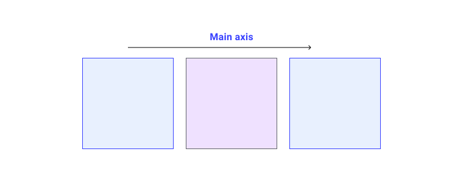
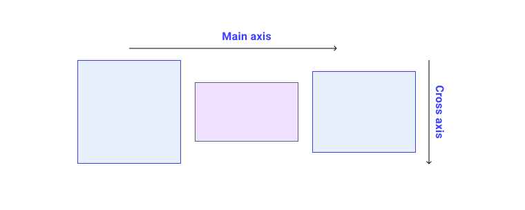
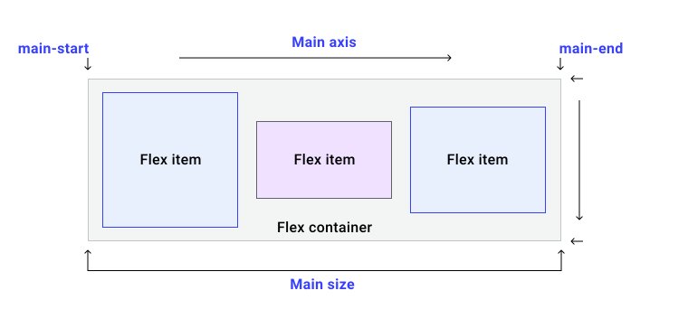

# Flexbox

<big markdown>**Flexbox** — это механизм верстки, предназначенный для размещения групп элементов в одном измерении. В этом модуле вы узнаете, как его использовать.</big>

!!!info "CSS подкаст"

    010: Flexbox

    === "Перевод на русский"

    	<audio style="width: 100%;" controls src="/learn/css3/flexbox.ru.mp3"></audio>

    === "Английский оригинал"

    	<audio style="width: 100%;" controls src="/learn/css3/flexbox.en.ogg"></audio>

В отзывчивом дизайне может возникнуть проблема с боковой панелью, которая располагается на одной линии с контентом. Там, где есть пространство для просмотра, этот паттерн работает отлично, но там, где пространство сжато, такая жесткая компоновка может стать проблематичной.

<iframe src="https://codepen.io/web-dot-dev/embed/poRENWv?height=420&amp;theme-id=light&amp;default-tab=result&amp;editable=true" style="height: 500px; width: 100%; border: 0;" loading="lazy"></iframe>

**Гибкая модель компоновки блоков (flexbox)** — это модель компоновки, предназначенная для одномерного содержимого. Она отлично справляется с задачей получения набора элементов, имеющих различные размеры, и возвращает наилучший вариант расположения этих элементов.

Это идеальная модель компоновки для данного шаблона боковой панели. Flexbox не только помогает расположить боковую панель и содержимое в линию, но и в тех случаях, когда места не хватает, разрывает боковую панель на новую строку. Вместо того чтобы задавать жесткие размеры, которым должен следовать браузер, с помощью flexbox можно задать гибкие границы, которые подскажут, как может отображаться содержимое.

<iframe src="https://codepen.io/web-dot-dev/embed/xxgERMp?height=400&amp;theme-id=light&amp;default-tab=result&amp;editable=true" style="height: 500px; width: 100%; border: 0;" loading="lazy"></iframe>

## Что можно сделать с помощью гибкого макета?

Гибкие макеты обладают следующими возможностями, которые вы сможете изучить в этом руководстве.

-   Они могут отображаться как в виде строки, так и в виде колонки.
-   Они учитывают режим записи документа.
-   По умолчанию они однострочные, но их можно попросить развернуть на несколько строк.
-   Элементы в макете могут быть визуально переупорядочены по сравнению с их порядком в DOM.
-   Пространство внутри элементов может быть распределено таким образом, что они становятся больше или меньше в зависимости от пространства, доступного в их родительском блоке.
-   Пространство вокруг элементов и гибких линий в обернутом макете может быть распределено с помощью свойств выравнивания блоков.
-   Сами элементы могут быть выровнены по поперечной оси.

## Главная ось и поперечная ось

Ключевым моментом в понимании flexbox является понимание концепции главной и поперечной осей. Главной осью является та, которая задается свойством [`flex-direction`](../../css/flex-direction.md). Если это свойство `row`, то главная ось расположена вдоль строки, если `column`, то вдоль столбца.



Гибкие элементы перемещаются по главной оси как группа. Помните: у нас есть несколько элементов, и мы пытаемся получить наилучшую компоновку для них как для группы.

Поперечная ось проходит в направлении, противоположном главной оси, поэтому если `flex-direction` — `row`, то поперечная ось проходит вдоль столбца.



С поперечной осью можно поступить двумя способами. Можно перемещать элементы по отдельности или группой, чтобы они выравнивались относительно друг друга и гибкого контейнера. Кроме того, если у вас есть обернутые гибкие линии, вы можете рассматривать эти линии как группу, чтобы управлять распределением пространства между этими линиями. Как все это работает на практике, вы увидите в этом руководстве, а пока просто помните, что главная ось следует за вашим `flex-direction`.

## Создание гибкого контейнера

Давайте посмотрим, как ведет себя flexbox, взяв группу элементов разного размера и используя flexbox для их расположения.

```html
<div class="container" id="container">
    <div>One</div>
    <div>Item two</div>
    <div>The item we will refer to as three</div>
</div>
```

Для использования flexbox необходимо объявить, что вы хотите использовать контекст гибкого форматирования, а не обычную блочную и инлайн-верстку. Для этого нужно изменить значение свойства `display` на `flex`.

```css
.container {
    display: flex;
}
```

Как вы узнали из руководства [layout guide](layout.md), в результате получится блок с дочерними элементами flexbox. Гибкие элементы сразу же начинают проявлять некоторое поведение flexbox, используя свои **начальные значения**.

!!!note ""

    Все CSS-свойства имеют начальные значения, которые определяют их поведение "из блока", когда вы не применяли никаких CSS для изменения этого начального поведения. Дочерние элементы нашего flex-контейнера становятся flex-элементами, как только их родитель получает `display: flex`, поэтому эти начальные значения означают, что мы начинаем видеть некоторое поведение flexbox.

Начальные значения означают, что:

-   Элементы отображаются в виде строки.
-   Они не оборачиваются.
-   Они не растут, заполняя контейнер.
-   Они выстраиваются в начале контейнера.

## Управление направлением элементов

Даже если вы еще не добавили свойство `flex-direction`, элементы отображаются в виде ряда, поскольку начальное значение `flex-direction` равно `row`. Если вам нужен ряд, то добавлять это свойство не нужно. Чтобы изменить направление, добавьте свойство и одно из четырех значений:

-   `row`: элементы выстраиваются в ряд.
-   `row-reverse:` элементы выстраиваются в ряд от конца гибкого контейнера.
-   `column`: элементы располагаются в виде столбца.
-   `column-reverse`: элементы располагаются в виде столбца, начиная с конца гибкого контейнера.

Вы можете опробовать все значения на примере нашей группы элементов в демонстрационном примере ниже.

<iframe src="https://codepen.io/web-dot-dev/embed/bGgKNXq?height=500&amp;theme-id=light&amp;default-tab=result&amp;editable=true" style="height: 500px; width: 100%; border: 0;" loading="lazy"></iframe>

### Изменение порядка следования элементов и доступность

Следует быть осторожным при использовании свойств, которые изменяют порядок отображения элементов на противоположный тому, как они упорядочены в HTML-документе, поскольку это может негативно сказаться на доступности. Хорошим примером этого являются значения `row-reverse` и `column-reverse`. Переупорядочивание происходит только для визуального, но не для логического порядка. Это важно понимать, поскольку логический порядок — это порядок, в котором считыватель экрана будет считывать содержимое, а человек, осуществляющий навигацию с помощью клавиатуры, будет следовать ему.

В следующем видеоролике показано, как при реверсивном расположении колонок переключение между ссылками с помощью табуляции становится неактуальным, поскольку клавиатурная навигация следует за DOM, а не за визуальным отображением.

<video controls>
<source src="/learn/css3/flexbox-3.mp4" />
</video>

Все, что может изменить порядок элементов в flexbox или grid, может вызвать эту проблему. Поэтому любое изменение порядка элементов должно включать тщательное тестирование, чтобы убедиться, что оно не сделает ваш сайт неудобным для некоторых людей.

Более подробную информацию см:

-   [Переупорядочивание содержимого](https://web.dev/content-reordering/)
-   [Flexbox и отключение клавиатурной навигации](https://tink.uk/flexbox-the-keyboard-navigation-disconnect/)

### Режимы и направление записи

Элементы Flex по умолчанию располагаются в виде строки. Строка располагается в том направлении, в котором предложения идут в вашем режиме написания и направлении сценария. Это означает, что если вы работаете на арабском языке, который имеет право-левое (rtl) направление письма, то элементы будут выстраиваться справа. Порядок табуляции также будет начинаться справа, поскольку именно так читаются предложения на арабском языке.

<iframe src="https://codepen.io/web-dot-dev/embed/ExZgwWN?height=500&amp;theme-id=light&amp;default-tab=result&amp;editable=true" style="height: 500px; width: 100%; border: 0;" loading="lazy"></iframe>

Если вы работаете с вертикальным режимом письма, как, например, некоторые японские шрифты, то строка будет идти вертикально, сверху вниз. Попробуйте изменить `flex-direction` в этом примере, использующем вертикальный режим письма.

<iframe src="https://codepen.io/web-dot-dev/embed/qBRaPXX?height=600&amp;theme-id=light&amp;default-tab=result&amp;editable=true" style="height: 500px; width: 100%; border: 0;" loading="lazy"></iframe>

Поэтому поведение гибких элементов по умолчанию зависит от режима написания документа. Большинство учебных пособий написано на английском языке или в другом горизонтальном, лево-правостороннем стиле. Поэтому легко предположить, что гибкие элементы выстраиваются **слева**, а выполняются **горизонтально**.

Учитывая наличие главной и поперечной осей, а также способ написания текста, может быть проще понять тот факт, что в flexbox мы говорим о **начале** и **конце**, а не о вершине, низе, левом и правом. Каждая ось имеет начало и конец. Начало главной оси обозначается как **main-start**. Таким образом, наши элементы flexbox изначально выстраиваются в линию от main-start. Конец этой оси называется **main-end**. Начало поперечной оси — **cross-start**, а конец — **cross-end**.



## Обертывание гибких элементов

Начальное значение свойства `flex-wrap` равно `nowrap`. Это означает, что если в контейнере недостаточно места, то элементы будут переполнены.

<figure>

<figcaption>При достижении минимального размера содержимого гибкие элементы начнут переполнять свой контейнер</figcaption>
</figure>

Элементы, отображаемые с использованием начальных значений, будут уменьшаться настолько, насколько это возможно, вплоть до размера `min-content`, прежде чем произойдет переполнение.

Чтобы заставить элементы сворачиваться, добавьте к гибкому контейнеру команду `flex-wrap: wrap`.

```css
.container {
    display: flex;
    flex-wrap: wrap;
}
```

<iframe src="https://codepen.io/web-dot-dev/embed/WNRGdNZ?height=601&amp;theme-id=light&amp;default-tab=result&amp;editable=true" style="height: 500px; width: 100%; border: 0;" loading="lazy"></iframe>

Когда флекс-контейнер сворачивается, он создает несколько **линий флекса**. С точки зрения распределения пространства каждая линия действует как новый гибкий контейнер. Поэтому при обертывании строк невозможно добиться того, чтобы что-то в строке 2 совпадало с тем, что находится над ней в строке 1. Это и означает, что flexbox является одномерным. Вы можете управлять выравниванием по одной оси, по строке или по столбцу, а не по обеим вместе, как это можно сделать в сетке.

### Сокращение flex-flow

Свойства `flex-direction` и `flex-wrap` можно задать с помощью сокращения `flex-flow`. Например, чтобы установить `flex-direction` в `column` и разрешить элементам сворачиваться:

```css
.container {
    display: flex;
    flex-flow: column wrap;
}
```

## Управление пространством внутри гибких элементов

Если предположить, что наш контейнер имеет больше места, чем необходимо для отображения элементов, то элементы выстраиваются в линию в самом начале и не растут, чтобы заполнить пространство. Они перестают расти при максимальном размере содержимого. Это происходит потому, что начальное значение свойства `flex-` имеет вид:

-   `flex-grow: 0`: элементы не растут.
-   `flex-shrink: 1`: элементы могут уменьшаться меньше, чем их [`flex-basis`](../../css/flex-basis.md).
-   `flex-basis: auto`: элементы имеют базовый размер `auto`.

Это может быть представлено значением ключевого слова `flex: initial`. К дочерним элементам контейнера flex применяется сокращенное свойство `flex`, или длинные варианты `flex-grow`, `flex-shrink` и `flex-basis`.

<iframe src="https://codepen.io/web-dot-dev/embed/LYxRebE?height=500&amp;theme-id=light&amp;default-tab=result&amp;editable=true" style="height: 500px; width: 100%; border: 0;" loading="lazy"></iframe>

Для того чтобы элементы увеличивались и при этом большие элементы занимали больше места, чем маленькие, используйте `flex:auto`. Попробовать это можно на примере демонстрации, приведенной выше. При этом свойства устанавливаются в следующие значения:

-   `flex-grow: 1`: элементы могут расти больше, чем их `flex-basis`.
-   `flex-shrink: 1`: элементы могут уменьшаться меньше, чем их `flex-basis`.
-   `flex-basis: auto`: элементы имеют базовый размер `auto`.

Использование `flex: auto` приведет к тому, что элементы в итоге будут иметь разные размеры, так как пространство, разделяемое между элементами, распределяется _после_ того, как каждый элемент будет размещен по размеру максимального содержимого. Поэтому большой элемент будет занимать больше места. Чтобы заставить все элементы иметь одинаковый размер и игнорировать размер содержимого, измените `flex:auto` на `flex: 1` в демо-версии.

Это распаковывается на:

-   `flex-grow: 1`: элементы могут увеличиваться больше, чем их `flex-basis`.
-   `flex-shrink: 1`: элементы могут уменьшаться меньше, чем их `flex-basis`.
-   `flex-basis: 0`: элементы имеют базовый размер `0`.

Использование `flex: 1` говорит о том, что все элементы имеют нулевой размер, поэтому все пространство в гибком контейнере доступно для распределения. Поскольку все элементы имеют коэффициент `flex-grow`, равный `1`, они растут одинаково, и пространство распределяется поровну.

!!!note ""

    Существует также значение `flex: none`, которое позволяет получить негибкие гибкие элементы, не увеличивающиеся и не уменьшающиеся. Это может быть полезно, если вы используете flexbox только для доступа к свойствам выравнивания, но не хотите никакого гибкого поведения.

### Разрешение элементам расти с разной скоростью

Не обязательно присваивать всем элементам коэффициент `flex-grow`, равный `1`. Вы можете задать своим гибким элементам различные коэффициенты `flex-grow`. В приведенном ниже примере первый элемент имеет коэффициент `flex: 1`, второй `flex: 2` и третий `flex: 3`. По мере роста этих элементов от `0` свободное место в гибком контейнере делится на шесть частей. Одна часть отводится первому элементу, две части — второму, три части — третьему.

<iframe src="https://codepen.io/web-dot-dev/embed/OJWRzEz?height=500&amp;theme-id=light&amp;default-tab=result&amp;editable=true" style="height: 500px; width: 100%; border: 0;" loading="lazy"></iframe>

То же самое можно сделать и с `flex-basis` из `auto`, но при этом необходимо указать три значения. Первое значение — `flex-grow`, второе — `flex-shrink`, третье — `flex-basis`.

```css
.item1 {
    flex: 1 1 auto;
}

.item2 {
    flex: 2 1 auto;
}
```

Это менее распространенный случай, поскольку причина использования `flex-basis` в `auto` заключается в том, чтобы позволить браузеру самому определить распределение пространства. Однако если вы хотите, чтобы элемент увеличивался немного больше, чем решает алгоритм, это может быть полезно.

## Переупорядочивание элементов flex

Элементы в контейнере flex можно упорядочить с помощью свойства `order`. Это свойство позволяет упорядочивать элементы в **ординарные группы**. Элементы располагаются в направлении, определяемом свойством `flex-direction`, сначала идут наименьшие значения. Если несколько элементов имеют одинаковое значение, то они будут отображаться вместе с другими элементами с этим значением.

Приведенный ниже пример демонстрирует такой порядок.

<iframe src="https://codepen.io/web-dot-dev/embed/NWdRXoL?height=500&amp;theme-id=light&amp;default-tab=result&amp;editable=true" style="height: 500px; width: 100%; border: 0;" loading="lazy"></iframe>

!!!note ""

    Использование `order` имеет те же проблемы, что и значения `row-reverse` и `column-reverse` в `flex-direction`. Очень легко создать несовместимые ощущения для некоторых пользователей. Не используйте `order`, потому что вы исправляете непорядок в документе. Если элементы логически должны располагаться в другом порядке, измените HTML!

## Обзор выравнивания в Flexbox

Flexbox принес с собой набор свойств для выравнивания элементов и распределения пространства между ними. Эти свойства оказались настолько полезными, что с тех пор были перенесены в отдельную спецификацию, и вы можете встретить их и в Grid Layout. Здесь вы узнаете, как они работают при использовании flexbox.

Набор свойств можно разделить на две группы. Свойства для распределения пространства и свойства для выравнивания. К свойствам, распределяющим пространство, относятся:

-   `justify-content`: распределение пространства по главной оси.
-   `align-content`: распределение пространства по поперечной оси.
-   `place-content`: сокращение для установки обоих вышеуказанных свойств.

Свойства, используемые для выравнивания в flexbox:

-   `align-self`: выравнивание отдельного элемента по поперечной оси.
-   `align-items`: выравнивает все элементы как группу по поперечной оси.

Если вы работаете с главной осью, то свойства начинаются с `justify-`. На поперечной оси они начинаются с `align-`.

## Распределение пространства на главной оси

В использованном ранее HTML, когда гибкие элементы располагаются в ряд, на главной оси остается свободное пространство. Элементы не настолько велики, чтобы полностью заполнить контейнер flex. Элементы выстраиваются в начале гибкого контейнера, поскольку начальное значение параметра `justify-content` равно `flex-start`. Элементы выстраиваются в начале, а лишнее пространство остается в конце.

Добавьте свойство `justify-content` к гибкому контейнеру, придайте ему значение `flex-end`, и элементы будут выстраиваться в конце контейнера, а свободное место будет размещено в начале.

```css
.container {
    display: flex;
    justify-content: flex-end;
}
```

Вы также можете распределить пространство между элементами с помощью `justify-content: space-between`.

Попробуйте некоторые из значений в демонстрационном примере, а также [см. MDN](https://developer.mozilla.org/docs/Web/CSS/justify-content) для полного набора возможных значений.

<iframe src="https://codepen.io/web-dot-dev/embed/JjERpGb?height=500&amp;theme-id=light&amp;default-tab=result&amp;editable=true" style="height: 500px; width: 100%; border: 0;" loading="lazy"></iframe>

!!!note ""

    Для того чтобы свойство `justify-content` могло что-то сделать, в контейнере должно быть свободное место на главной оси. Если элементы заполняют ось, то не остается места для распределения, поэтому свойство ничего не даст.

### С `flex-direction: column`.

Если вы изменили `flex-direction` на `column`, то `justify-content` будет работать в колонке. Чтобы в контейнере было свободное место при работе в качестве колонки, необходимо задать контейнеру `height` или `block-size`. В противном случае свободное пространство не будет распределено.

Попробуйте различные значения, на этот раз с компоновкой колонок flexbox.

<iframe src="https://codepen.io/web-dot-dev/embed/bGgwLgz?height=600&amp;theme-id=light&amp;default-tab=result&amp;editable=true" style="height: 500px; width: 100%; border: 0;" loading="lazy"></iframe>

## Распределение пространства между гибкими линиями

При использовании обернутого флекс-контейнера может возникнуть необходимость распределения пространства по поперечной оси. В этом случае можно использовать свойство `align-content` с теми же значениями, что и `justify-content`. В отличие от `justify-content`, которое по умолчанию выравнивает элементы по `flex-start`, начальным значением `align-content` является `stretch`. Добавьте свойство `align-content` в контейнер flex, чтобы изменить это поведение по умолчанию.

```css
.container {
    align-content: center;
}
```

Попробуйте это сделать в демонстрационном примере. Пример имеет обернутые линии гибких элементов, а контейнер имеет `block-size` для того, чтобы у нас было свободное место.

<iframe src="https://codepen.io/web-dot-dev/embed/poREawo?height=500&amp;theme-id=light&amp;default-tab=result&amp;editable=true" style="height: 500px; width: 100%; border: 0;" loading="lazy"></iframe>

### Сокращение `place-content`.

Чтобы задать одновременно `justify-content` и `align-content`, можно использовать `place-content` с одним или двумя значениями. Одно значение будет использоваться для обеих осей, если указать оба значения, то первое будет использоваться для `align-content`, а второе для `justify-content`.

```css
.container {
    place-content: space-between;
    /* sets both to space-between */
}

.container {
    place-content: center flex-end;
    /* wrapped lines on the cross axis are centered,
  on the main axis items are aligned to the end of the flex container */
}
```

## Выравнивание элементов на поперечной оси

На поперечной оси можно также выровнять элементы внутри гибкой линии с помощью `align-items` и `align-self`. Пространство, доступное для такого выравнивания, будет зависеть от высоты флекс-контейнера или флекс-линии в случае обернутого набора элементов.

Начальное значение `align-self` — `stretch`, поэтому по умолчанию гибкие элементы в строке растягиваются до высоты самого высокого элемента. Чтобы изменить это значение, добавьте свойство `align-self` к любому из своих гибких элементов.

```css
.container {
    display: flex;
}

.item1 {
    align-self: flex-start;
}
```

Для выравнивания элемента используйте любое из следующих значений:

-   `flex-start`
-   `flex-end`
-   `center`
-   `stretch`
-   `baseline`

См. [полный список значений](../../css/align-self.md).

Следующий демонстрационный пример содержит одну строку flex-элементов с `flex-direction: row`. Последний элемент задает высоту гибкого контейнера. Первый элемент имеет свойство `align-self` со значением `flex-start`. Попробуйте изменить значение этого свойства, чтобы увидеть, как он перемещается в своем пространстве по поперечной оси.

<iframe src="https://codepen.io/web-dot-dev/embed/RwKGQee?height=600&amp;theme-id=light&amp;default-tab=result&amp;editable=true" style="height: 500px; width: 100%; border: 0;" loading="lazy"></iframe>

Свойство `align-self` применяется к отдельным элементам. Свойство `align-items` может быть применено к гибкому контейнеру, чтобы установить все отдельные свойства `align-self` как группу.

```css
.container {
    display: flex;
    align-items: flex-start;
}
```

В следующем примере попробуйте изменить значение параметра `align-items`, чтобы выровнять все элементы на поперечной оси как группу.

<iframe src="https://codepen.io/web-dot-dev/embed/QWdKmby?height=600&amp;theme-id=light&amp;default-tab=result&amp;editable=true" style="height: 500px; width: 100%; border: 0;" loading="lazy"></iframe>

## Почему в flexbox нет функции justify-self?

Элементы flexbox действуют как группа на главной оси. Поэтому не существует концепции выделения отдельного элемента из этой группы.

В сетчатой верстке свойства `justify-self` и `justify-items` работают с осью inline для выравнивания элементов по этой оси в пределах их области сетки. Из-за того, что в flex-макетах элементы рассматриваются как группа, эти свойства не реализованы в контексте flex.

Стоит отметить, что flexbox очень хорошо работает с автоматическими полями. Если вам необходимо отделить один элемент от группы или разделить группу на две группы, вы можете применить для этого отступ. В приведенном ниже примере последний элемент имеет левое поле `auto`. Автоматическое поле поглощает все пространство в том направлении, в котором оно применяется. Это означает, что он сдвигает элемент вправо, тем самым разделяя группы.

<iframe src="https://codepen.io/web-dot-dev/embed/poRELbR?height=500&amp;theme-id=light&amp;default-tab=result&amp;editable=true" style="height: 500px; width: 100%; border: 0;" loading="lazy"></iframe>

## Как выровнять элемент по вертикали и горизонтали

Для центрирования элемента внутри другого блока можно использовать свойства выравнивания. Свойство `justify-content` выравнивает элемент по главной оси, которой является строка. Свойство `align-items` — по поперечной оси.

```css
.container {
    width: 400px;
    height: 300px;
    display: flex;
    justify-content: center;
    align-items: center;
}
```

!!!note ""

    В будущем мы сможем выполнять такое выравнивание без необходимости делать родительский контейнер гибким. Свойства выравнивания задаются для блочной и линейной верстки. В настоящее время они не реализованы ни в одном браузере. Однако переход в контекст гибкого форматирования позволяет получить доступ к этим свойствам. Если вам нужно что-то выровнять, это отличный способ сделать это.

## Ресурсы

-   [MDN CSS Гибкая компоновка блоков](https://developer.mozilla.org/docs/Web/CSS/CSS_Flexible_Box_Layout) включает серию подробных руководств с примерами.
-   [CSS Tricks Guide to Flexbox](https://css-tricks.com/snippets/css/a-guide-to-flexbox/)
-   [Что происходит при создании гибкого контейнера Flexbox](https://www.smashingmagazine.com/2018/08/flexbox-display-flex-container/)
-   [Все, что нужно знать о выравнивании в Flexbox](https://www.smashingmagazine.com/2018/08/flexbox-alignment/)
-   [Насколько велик этот гибкий блок?](https://www.smashingmagazine.com/2018/09/flexbox-sizing-flexible-box/)
-   [Примеры использования Flexbox](https://www.smashingmagazine.com/2018/10/flexbox-use-cases/)
-   [Проверка и отладка макетов CSS Flexbox в Chrome DevTools](https://developer.chrome.com/docs/devtools/css/flexbox/)

:material-information-outline: Источник: [Flexbox](https://web.dev/learn/css/flexbox/)
