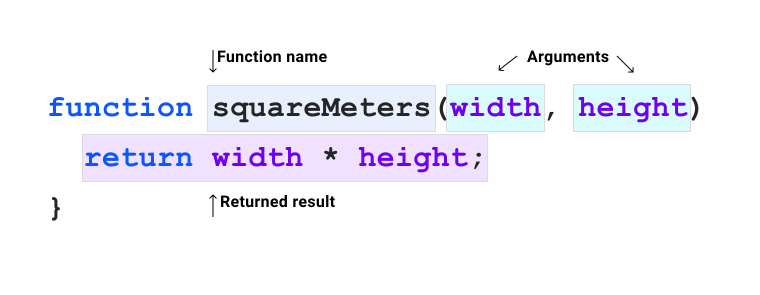

# Функции

<big>CSS обладает целым рядом встроенных функций. В этом модуле вы узнаете о некоторых ключевых функциях и о том, как их использовать.</big>

!!!info "CSS подкаст"

    020: Функции

    <audio style="width: 100%;" controls src="https://traffic.libsyn.com/secure/thecsspodcast/TCP_CSS_Podcast_Episode_020_v1.0.mp3?dest-id=1891556"></audio>

До сих пор в этом курсе вы познакомились с несколькими функциями CSS. В модуле [grid](grid.md) вы познакомились с функциями `minmax()` и `fit-content()`, которые помогают изменять размеры элементов. В модуле [color](color.md) были представлены функции `rgb()` и `hsl()`, помогающие определять цвета.

Как и во многих других языках программирования, в [CSS имеется **множество** встроенных функций](https://developer.mozilla.org/docs/Web/CSS/CSS_Functions), к которым можно обращаться в любой момент.

Каждая функция CSS имеет определенное назначение, и в этом уроке мы рассмотрим их в общих чертах, что позволит вам лучше понять, где и как их использовать.

## Что такое функция?

**Функция** - это именованный, самодостаточный фрагмент кода, который выполняет определенную задачу. Функция называется так, чтобы ее можно было вызывать в коде и передавать в нее данные. Это называется передачей аргументов.



Многие функции CSS являются _чистыми функциями_, что означает, что если передать им одни и те же аргументы, то они всегда будут выдавать один и тот же результат, независимо от того, что происходит в остальной части кода. Эти функции часто будут перевычисляться при изменении значений в CSS, подобно другим элементам языка, например, вычисляемым каскадным значениям типа `currentColor`.

В CSS можно использовать только предоставленные функции, а не писать свои собственные, но в некоторых контекстах функции могут быть вложены друг в друга, что дает им большую гибкость. Мы рассмотрим это более подробно далее в этом модуле.

## Функциональные селекторы

```css
.post :is(h1, h2, h3) {
    line-height: 1.2;
}
```

О функциональных селекторах вы узнали из модуля [Псевдоклассы](pseudo-classes.md), в котором подробно описаны такие функции, как [`:is()`](../../css/is.md) и [`:not()`](../../css/not.md). Аргументами, передаваемыми в эти функции, являются CSS-селекторы, которые затем оцениваются. Если элементы совпадают, то к ним будут применены остальные **CSS-правила**.

## Пользовательские свойства и `var()`

```css
:root {
    --base-color: #ff00ff;
}

.my-element {
    background: var(--base-color);
}
```

Пользовательское свойство - это переменная, которая позволяет токенизировать значения в коде CSS. [Пользовательские свойства также подвержены влиянию каскада](https://piccalil.li/tutorial/getting-started-with-css-custom-properties/), что означает возможность контекстного управления или переопределения. Пользовательское свойство должно иметь префикс из двух тире (`--`) и чувствительно к регистру.

Функция [`var()`](../../css/var.md) принимает один обязательный аргумент: пользовательское свойство, которое вы хотите вернуть в качестве значения. В приведенном выше фрагменте функции `var()` в качестве аргумента передано `--base-color`. Если `--base-color` определено, то функция `var()` вернет его значение.

```css
.my-element {
    background: var(--base-color, hotpink);
}
```

В функцию `var()` можно также передать резервное значение декларации. Это означает, что если `--base-color` не будет найден, то вместо него будет использована переданная **декларация**, которая в данном примере представляет собой цвет `hotpink`.

<iframe src="https://codepen.io/web-dot-dev/embed/zYNPOjP?height=250&amp;theme-id=light&amp;default-tab=css%2Cresult&amp;editable=true" style="height: 400px; width: 100%; border: 0;" loading="lazy"></iframe>

## Функции, возвращающие значение

Функция `var()` является одной из функций CSS, возвращающих значение. Такие функции, как [`attr()`](../../css/attr.md) и [`url()`](../../css/url.md), имеют схожую структуру с `var()` - вы передаете один или несколько аргументов и используете их в **правой части** вашего CSS-объявления.

```css
a::after {
    content: attr(href);
}
```

Функция `attr()` здесь берет содержимое атрибута `href` элемента `<a>` и устанавливает его в качестве `content` псевдоэлемента `::after`. Если значение атрибута `href` элемента `<a>` изменится, то это автоматически отразится в данном атрибуте `content`.

```css
.my-element {
    background-image: url('/path/to/image.jpg');
}
```

Функция `url()` принимает **строку** URL и используется для загрузки изображений, шрифтов и контента. Если не передан корректный URL или ресурс, на который указывает URL, не найден, функция `url()` ничего не вернет.

## Функции цвета

О функциях цвета вы узнали из модуля [color](color.md). Если вы еще не прочитали его, настоятельно рекомендуем это сделать.

Некоторые доступные функции цвета в CSS - это `rgb()`, `rgba()`, `hsl()`, `hsla()`, `hwb()`, `lab()` и `lch()`. Все они имеют схожую форму, в которой передаются аргументы конфигурации и возвращается цвет.

## Математические выражения

Как и многие другие языки программирования, CSS предоставляет полезные математические функции, помогающие выполнять различные виды вычислений.

### `calc()`

<p class="ciu_embed" data-feature="calc" data-periods="future_1,current,past_1,past_2" data-accessible-colours="false">
<picture>
<source type="image/webp" srcset="https://caniuse.bitsofco.de/image/calc.webp">
<source type="image/png" srcset="https://caniuse.bitsofco.de/image/calc.png">

</picture>
</p>

Функция [`calc()`](../../css/calc.md) принимает в качестве параметра одно математическое выражение. Это математическое выражение может быть смешанного типа, например, длина, число, угол, частота. Единицы измерения также могут быть смешанными.

```css
.my-element {
    width: calc(100% - 2rem);
}
```

В данном примере функция `calc()` используется для определения ширины элемента как 100% от ширины содержащего его родительского элемента, после чего от этого вычисленного значения отнимается `2rem`.

<iframe src="https://codepen.io/web-dot-dev/embed/PopYema?height=500&amp;theme-id=light&amp;default-tab=result&amp;editable=true" style="height: 500px; width: 100%; border: 0;" loading="lazy"></iframe>

```css
:root {
    --root-height: 5rem;
}

.my-element {
    width: calc(calc(10% + 2rem) * 2);
    height: calc(var(--root-height) * 3);
}
```

Функция `calc()` может быть вложена внутрь другой функции `calc()`. Пользовательские свойства также можно передавать в функцию `var()` как часть выражения.

### `min()` и `max()`

<p class="ciu_embed" data-feature="css-math-functions" data-periods="future_1,current,past_1,past_2" data-accessible-colours="false">
<picture>
<source type="image/webp" srcset="https://caniuse.bitsofco.de/image/css-math-functions.webp">
<source type="image/png" srcset="https://caniuse.bitsofco.de/image/css-math-functions.png">

</picture>
</p>

Функция [`min()`](../../css/min.md) возвращает наименьшее вычисленное значение одного или нескольких переданных аргументов. Функция [`max()`](../../css/max.md) делает обратное: получает наибольшее значение одного или нескольких переданных аргументов.

```css
.my-element {
    width: min(20vw, 30rem);
    height: max(20vh, 20rem);
}
```

В данном примере ширина должна быть наименьшим значением между `20vw` - что составляет 20% от **ширины области просмотра** и `30rem`. Высота должна быть наибольшей между `20vh`, что составляет 20% от **высоты области просмотра** и `20rem`.

!!!note ""

    Такие единицы, как `vw` и `vh`, мы рассматриваем в модуле [Размеры](sizing.md).

### `clamp()`

<p class="ciu_embed" data-feature="css-math-functions" data-periods="future_1,current,past_1,past_2" data-accessible-colours="false">
<picture>
<source type="image/webp" srcset="https://caniuse.bitsofco.de/image/css-math-functions.webp">
<source type="image/png" srcset="https://caniuse.bitsofco.de/image/css-math-functions.png">

</picture>
</p>

Функция [`clamp()`](../../css/clamp.md) принимает три аргумента: минимальный размер, идеальный размер и максимальный размер.

```css
h1 {
    font-size: clamp(2rem, 1rem + 3vw, 3rem);
}
```

В данном примере размер шрифта `font-size` будет изменяться в зависимости от ширины области просмотра. Единица `vw` добавляется к единице `rem`, чтобы помочь при масштабировании экрана, поскольку независимо от уровня масштабирования единица `vw` будет иметь одинаковый размер. Умножение на единицу `rem`, основанную на размере корневого шрифта, дает функции `clamp()` относительную точку отсчета.

Подробнее о функциях `min()`, `max()` и `clamp`() можно узнать в [этой статье](https://web.dev/min-max-clamp/).

## Фигуры

CSS-свойства [`clip-path`](../../css/clip-path.md), [`offset-path`](../../css/offset-path.md) и [`shape-outside`](../../css/shape-outside.md) используют фигуры для визуальной фиксации блока или создания формы для обтекания содержимого.

Существуют функции фигур, которые можно использовать с обоими этими свойствами. Простые формы, такие как [`circle()`](../../css/circle.md), [`ellipse()`](../../css/ellipse.md) и [`inset()`](../../css/inset-function.md), принимают аргументы конфигурации для определения их размера. Более сложные фигуры, такие как [`polygon()`](../../css/polygon.md), принимают пары значений осей X и Y, разделенных запятыми, для создания пользовательских фигур.

```css
.circle {
    clip-path: circle(50%);
}

.polygon {
    clip-path: polygon(
        0% 0%,
        100% 0%,
        100% 75%,
        75% 75%,
        75% 100%,
        50% 75%,
        0% 75%
    );
}
```

<iframe src="https://codepen.io/web-dot-dev/embed/rNjYNNd?height=500&amp;theme-id=light&amp;default-tab=result&amp;editable=true" style="height: 400px; width: 100%; border: 0;" loading="lazy"></iframe>

Подобно функции `polygon()`, существует также функция `path()`, которая принимает в качестве аргумента правило заливки SVG. Это позволяет создавать очень сложные фигуры, которые могут быть нарисованы в графических инструментах, таких как Illustrator или Inkscape, а затем скопированы в CSS.

## Преобразования {#transforms}

Последними в этом обзоре функций CSS являются функции трансформации, которые позволяют перекосить, изменить размер и даже глубину элемента. Все следующие функции используются со свойством `transform`.

### Вращение

Для поворота элемента используется функция [`rotate()`](../../css/transform.md#rotate), которая поворачивает элемент вокруг его центральной оси. Также можно использовать функции [`rotateX()`](../../css/transform.md#rotatex), [`rotateY()`](../../css/transform.md#rotatey) и [`rotateZ()`](../../css/transform.md#rotatez) для поворота элемента по определенной оси. Для определения степени поворота можно передавать единицы измерения градус, оборот или радиан.

```css
.my-element {
    transform: rotateX(10deg) rotateY(10deg) rotateZ(10deg);
}
```

<iframe src="https://codepen.io/web-dot-dev/embed/MWJOWzP?height=500&amp;theme-id=light&amp;default-tab=result&amp;editable=true" style="height: 500px; width: 100%; border: 0;" loading="lazy"></iframe>

Функция [`rotate3d()`](../../css/transform.md#rotate3d) принимает четыре аргумента.

Первые три аргумента - числа, определяющие координаты X, Y и Z. Четвертый аргумент - вращение, которое, как и в других функциях вращения, принимает значения градусов, угла и оборота.

```css
.my-element {
    transform: rotate3d(1, 1, 1, 10deg);
}
```

<iframe src="https://codepen.io/web-dot-dev/embed/GRrOJxa?height=500&amp;theme-id=light&amp;default-tab=result&amp;editable=true" style="height: 500px; width: 100%; border: 0;" loading="lazy"></iframe>

### Масштаб

Изменить масштаб элемента можно с помощью `transform` и функции [`scale()`](../../css/transform.md#scale). Функция принимает в качестве значения одно или два числа, которые определяют положительное или отрицательное масштабирование. Если задать только один числовой аргумент, то оси X и Y будут масштабироваться одинаково, а определение обоих является сокращением для X и Y. Как и для функции `rotate()`, существуют функции [`scaleX()`](../../css/transform.md#scalex), [`scaleY()`](../../css/transform.md#scaley>) и [`scaleZ()`](../../css/transform.md#scalez) для масштабирования элемента по определенной оси.

```css
.my-element {
    transform: scaleX(1.2) scaleY(1.2);
}
```

<iframe src="https://codepen.io/web-dot-dev/embed/vYgWOoq?height=500&amp;theme-id=light&amp;default-tab=result&amp;editable=true" style="height: 500px; width: 100%; border: 0;" loading="lazy"></iframe>

Также, как и функция `rotate`, существует функция [`scale3d()`](../../css/transform.md#scale3d). Она аналогична `scale()`, но принимает три аргумента: масштабный коэффициент X, Y и Z.

### Translate

Функции [`translate()`](../../css/transform.md#translate) перемещают элемент, сохраняя его положение в потоке документа. В качестве аргументов они принимают значения длины и процента. Функция `translate()` переводит элемент по оси X, если задан один аргумент, и переводит элемент по осям X и Y, если заданы оба аргумента.

```css
.my-element {
    transform: translatex(40px) translatey(25px);
}
```

<iframe src="https://codepen.io/web-dot-dev/embed/RwKjWgP?height=500&amp;theme-id=light&amp;default-tab=result&amp;editable=true" style="height: 500px; width: 100%; border: 0;" loading="lazy"></iframe>

Как и в других функциях преобразования, можно использовать отдельные функции для конкретной оси, например [`translateX`](../../css/transform.md#translatex), [`translateY`](../../css/transform.md#translatey) и [`translateZ`](../../css/transform.md#translatez). Также можно использовать функцию [`translate3d`](../../css/transform.md#translate3d), которая позволяет определить трансляцию по X, Y и Z в одной функции.

### Skewing

Для перекоса элемента можно использовать функции [`skew()`](../../css/transform.md#skew), которые принимают в качестве аргументов углы. Функция `skew()` работает аналогично `translate()`. Если задать только один аргумент, то она будет влиять только на ось X, а если задать оба, то на оси X и Y. Можно также использовать [`skewX`](../../css/transform.md#skewx) и [`skewY`](../../css/transform.md#skewy), чтобы воздействовать на каждую ось независимо.

```css
.my-element {
    transform: skew(10deg);
}
```

<iframe src="https://codepen.io/web-dot-dev/embed/JjEOYMq?height=500&amp;theme-id=light&amp;default-tab=result&amp;editable=true" style="height: 500px; width: 100%; border: 0;" loading="lazy"></iframe>

### Перспектива

Наконец, для изменения расстояния между пользователем и плоскостью Z можно использовать свойство [`perspective`](../../css/perspective.md), которое относится к семейству свойств `transform`. Это создает ощущение дистанции и может быть использовано для создания глубины резкости в дизайне.

Пример Дэвида Десандро из его очень полезной статьи показывает, как можно использовать это свойство вместе со свойствами `perspective-origin-x` и `perspective-origin-y` для создания действительно трехмерных эффектов.

<iframe src="https://codepen.io/web-dot-dev/embed/bMqZmr?height=500&amp;theme-id=light&amp;default-tab=result&amp;editable=true" style="height: 500px; width: 100%; border: 0;" loading="lazy"></iframe>

## Функции анимации, градиентов и фильтров

CSS также предоставляет функции, которые помогают [анимировать](animations.md) элементы, применять к ним [градиенты](gradients.md) и использовать графические [фильтры](filters.md) для изменения их внешнего вида. Чтобы сделать этот модуль как можно более кратким, они рассматриваются в связанных модулях. Все они имеют схожую структуру с функциями, демонстрируемыми в этом модуле.

:information_source: Источник &mdash; [Functions](https://web.dev/learn/css/functions/)
