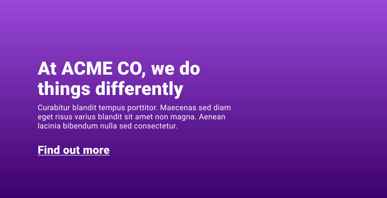

# Градиенты

<big>В этом модуле вы узнаете, как использовать различные типы **градиентов**, доступные в CSS. Градиенты можно использовать для создания множества полезных эффектов, не прибегая к созданию изображения с помощью графического приложения.</big>

!!!info "CSS подкаст"

    021: Градиенты

    <audio style="width: 100%;" controls src="/learn/css3/gradients.en.ogg"></audio>

Представьте, что вам нужно создать сайт, в верхней части которого находится вступление с заголовком, резюме и кнопкой. Дизайнер предоставил проект с фиолетовым фоном для этого вступления. Единственная проблема заключается в том, что фон имеет два оттенка фиолетового в виде градиента. Как это сделать?



Поначалу можно подумать, что для этого потребуется экспортировать изображение из инструмента дизайна, однако вместо этого можно использовать [`linear-gradient()`](../../css/linear-gradient.md).

<iframe src="https://codepen.io/web-dot-dev/embed/XWpzdoV?height=500&amp;theme-id=light&amp;default-tab=result&amp;editable=true" style="height: 500px; width: 100%; border: 0;" loading="lazy"></iframe>

**Градиент** — это изображение, которое можно использовать везде, где можно использовать изображения, но создается он с помощью CSS и состоит из цветов, чисел и углов. CSS-градиенты позволяют создавать все, что угодно: от плавного градиента между двумя цветами до впечатляющих произведений искусства, смешивая и повторяя несколько градиентов.

<p class="ciu_embed" data-feature="css-gradients" data-periods="future_1,current,past_1,past_2" data-accessible-colours="false">
<picture>
<source type="image/webp" srcset="https://caniuse.bitsofco.de/image/css-gradients.webp">
<source type="image/png" srcset="https://caniuse.bitsofco.de/image/css-gradients.png">

</picture>
</p>

## Линейный градиент

Функция [`linear-gradient()`](../../css/linear-gradient.md) формирует изображение из двух или более цветов, постепенно изменяя их. Она принимает несколько аргументов, но в простейшей конфигурации можно передать несколько цветов, как показано здесь, и она автоматически разделит их поровну, одновременно смешивая их.

```css
.my-element {
    background: linear-gradient(black, white);
}
```

<iframe src="https://codepen.io/web-dot-dev/embed/mdRqPoZ?height=400&amp;theme-id=light&amp;default-tab=css%2Cresult&amp;editable=true" style="height: 500px; width: 100%; border: 0;" loading="lazy"></iframe>

Можно также передать угол или ключевые слова, представляющие угол. Если вы решили использовать ключевые слова, укажите направление после ключевого слова `to`. Это означает, что если вы хотите получить черно-белый градиент, идущий слева (черный) на право (белый), то в качестве первого аргумента следует указать угол `to right`.

```css
.my-element {
    background: linear-gradient(to right, black, white);
}
```

<iframe src="https://codepen.io/web-dot-dev/embed/zYNPqXW?height=400&amp;theme-id=light&amp;default-tab=css%2Cresult&amp;editable=true" style="height: 500px; width: 100%; border: 0;" loading="lazy"></iframe>

Значение цветовой остановки определяет, где цвет останавливается и смешивается с соседними. Для градиента, начинающегося с темного оттенка красного, идущего под углом 45 градусов, на 30% от размера градиента переходящего в более светлый красный: это выглядит следующим образом.

```css
.my-element {
    background: linear-gradient(
        45deg,
        darkred 30%,
        crimson
    );
}
```

<iframe src="https://codepen.io/web-dot-dev/embed/NWdwNZr?height=400&amp;theme-id=light&amp;default-tab=css%2Cresult&amp;editable=true" style="height: 500px; width: 100%; border: 0;" loading="lazy"></iframe>

В `linear-gradient()` можно добавлять сколько угодно цветов и цветовых остановок, а также наслаивать градиенты друг на друга, разделяя каждый градиент запятой.

<iframe src="https://codepen.io/web-dot-dev/embed/abpVZbj?height=400&amp;theme-id=light&amp;default-tab=css%2Cresult&amp;editable=true" style="height: 500px; width: 100%; border: 0;" loading="lazy"></iframe>

## Радиальный градиент

Для создания градиента, излучающего по кругу, на помощь приходит функция [`radial-gradient()`](../../css/radial-gradient.md). Она аналогична функции `linear-gradient()`, но вместо указания угла опционально задается позиция и конечная форма. Если просто указать цвета, то функция `radial-gradient()` автоматически выберет позицию `center` и выберет круг или эллипс, в зависимости от размера блока.

```css
.my-element {
    background: radial-gradient(white, black);
}
```

<iframe src="https://codepen.io/web-dot-dev/embed/LYxOZEq?height=400&amp;theme-id=light&amp;default-tab=css%2Cresult&amp;editable=true" style="height: 500px; width: 100%; border: 0;" loading="lazy"></iframe>

Позиция градиента задается аналогично `background-position` с помощью ключевых слов и/или числовых значений. Размер радиального градиента определяет размер конечной формы градиента (круг или эллипс) и по умолчанию будет равен `farthest-corner`, что означает, что он точно соответствует самому дальнему от центра углу блока. Можно также использовать следующие ключевые слова:

-   `closest-corner` будет соответствовать ближайшему к центру углу градиента.
-   `closest-side` будет соответствовать стороне блока, ближайшей к центру градиента.
-   `farthest-side` будет противоположна `closest-side`.

Как и в случае с `linear-gradient`, можно добавить любое количество цветовых остановок. Аналогичным образом можно добавить столько же `radial-gradients`.

<iframe src="https://codepen.io/web-dot-dev/embed/MWJOepV?height=400&amp;theme-id=light&amp;default-tab=css%2Cresult&amp;editable=true" style="height: 500px; width: 100%; border: 0;" loading="lazy"></iframe>

## Конический градиент

Конический градиент имеет центральную точку в блоке, начинается сверху (по умолчанию) и идет по кругу в 360 градусов.

```css
.my-element {
    background: conic-gradient(white, black);
}
```

<iframe src="https://codepen.io/web-dot-dev/embed/qBRVNXG?height=400&amp;theme-id=light&amp;default-tab=css%2Cresult&amp;editable=true" style="height: 500px; width: 100%; border: 0;" loading="lazy"></iframe>

Функция [`conic-gradient()`](../../css/conic-gradient.md) принимает аргументы `position` и `angle`.

По умолчанию угол равен 0 градусов, то есть начинается сверху, в центре. Если задать угол `45deg`, то это будет правый верхний угол. Аргумент `angle` принимает любой тип значения угла, как и линейный и радиальный градиенты.

По умолчанию позицией является центр. Как и в случае радиального и линейного градиентов, позиционирование может быть задано ключевым словом или числовыми значениями.

<iframe src="https://codepen.io/web-dot-dev/embed/vYgWKpO?height=400&amp;theme-id=light&amp;default-tab=css%2Cresult&amp;editable=true" style="height: 500px; width: 100%; border: 0;" loading="lazy"></iframe>

Как и в случае с другими типами градиентов, можно добавить столько цветовых остановок, сколько необходимо. Хорошим примером использования этой возможности с коническими градиентами является отрисовка круговых диаграмм с помощью CSS.

<iframe src="https://codepen.io/web-dot-dev/embed/mdRqExP?height=400&amp;theme-id=light&amp;default-tab=css%2Cresult&amp;editable=true" style="height: 500px; width: 100%; border: 0;" loading="lazy"></iframe>

## Повторение и смешивание

Каждый тип градиента имеет и повторяющийся тип. Это функции [`repeating-linear-gradient()`](../../css/repeating-linear-gradient.md), [`repeating-radial-gradient()`](../../css/repeating-radial-gradient.md) и [`repeating-conic-gradient()`](../../css/repeating-conic-gradient.md). Они аналогичны неповторяющимся функциям и принимают те же аргументы. Разница заключается в том, что если заданный градиент может быть повторен для заполнения блока, исходя из обоих его размеров, то он будет повторен.

Если градиент не повторяется, то, скорее всего, вы не задали длину одного из цветовых упоров. Например, с помощью `repeating-linear-gradient` можно создать полосатый фон, задав длину цветовых упоров.

```css
.my-element {
    background: repeating-linear-gradient(
        45deg,
        red,
        red 30px,
        white 30px,
        white 60px
    );
}
```

<iframe src="https://codepen.io/web-dot-dev/embed/ExZbgdy?height=400&amp;theme-id=light&amp;default-tab=css%2Cresult&amp;editable=true" style="height: 500px; width: 100%; border: 0;" loading="lazy"></iframe>

Кроме того, можно смешивать функции градиента в свойствах `background`, а также задавать любое количество градиентов, как и в случае с фоновым изображением. Например, можно смешать несколько линейных градиентов или два линейных градиента с радиальным градиентом.

<iframe src="https://codepen.io/web-dot-dev/embed/ExZqGxP?height=400&amp;theme-id=light&amp;default-tab=css%2Cresult&amp;editable=true" style="height: 500px; width: 100%; border: 0;" loading="lazy"></iframe>

## Ресурсы

-   [Conic.css](https://www.conic.style/) — полезная коллекция конических градиентов
-   [MDN руководство по градиентам](https://developer.mozilla.org/docs/Web/CSS/CSS_Images/Using_CSS_gradients)
-   [Генератор градиентов](https://www.colorzilla.com/gradient-editor/)

:information_source: Источник &mdash; [Gradients](https://web.dev/learn/css/gradients/)
