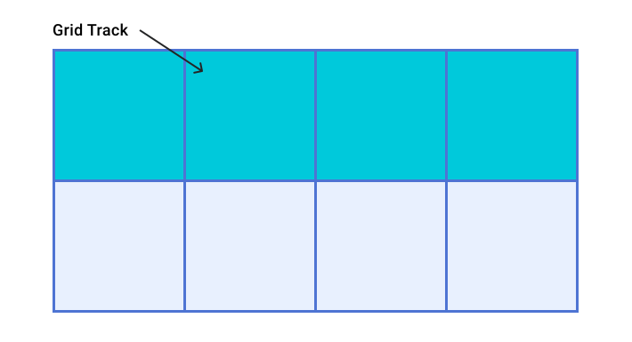
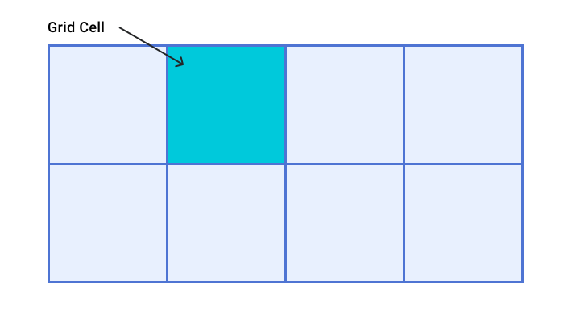
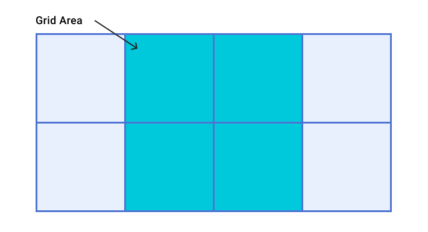
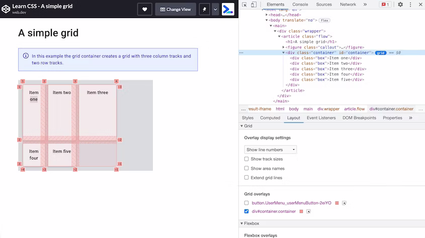
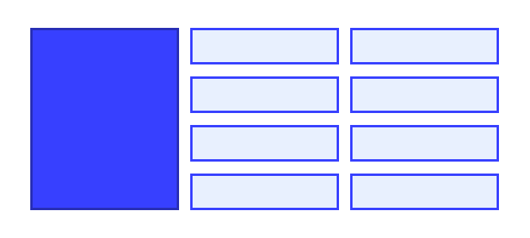

# Grid

<big>CSS **Grid** Layout представляет собой двухмерную систему верстки, управляющую расположением в строках и столбцах. В этом модуле вы узнаете обо всем, что может предложить сетка.</big>

!!!info "CSS подкаст"

    011: Grid

    === "Перевод на русский"

    	<audio style="width: 100%;" controls src="/learn/css3/grid.ru.mp3"></audio>

    === "Английский оригинал"

    	<audio style="width: 100%;" controls src="/learn/css3/grid.en.ogg"></audio>

В веб-дизайне очень часто встречается компоновка, состоящая из верхнего, бокового, основного и нижнего колонтитулов.


На протяжении многих лет существовало множество способов решения этой проблемы, но с помощью CSS grid она не только относительно проста, но и имеет множество вариантов. Сетка позволяет сочетать контроль, обеспечиваемый внешними размерами, с гибкостью внутренних размеров, что делает ее идеальным решением для такого рода макетов. Это связано с тем, что сетка — это метод компоновки, предназначенный для двухмерного содержимого. То есть для одновременной компоновки в строках и столбцах.

При создании макета сетки задается сетка со строками и столбцами. Затем вы размещаете элементы на этой сетке или позволяете браузеру автоматически размещать их в созданных ячейках. Сетка — это очень много, но, ознакомившись с ее возможностями, вы сможете создавать макеты в кратчайшие сроки.

## Обзор

Что же можно делать с помощью сетки? Сетчатые макеты обладают следующими возможностями. В этом руководстве вы узнаете обо всех из них.

1.  Сетка может быть определена с помощью строк и столбцов. Вы можете выбрать размер этих строк и столбцов, или они могут реагировать на размер содержимого.
2.  Прямые дочерние элементы контейнера сетки будут автоматически помещены в эту сетку.
3.  Или вы можете разместить элементы в нужном вам месте.
4.  Линии и области сетки можно назвать, чтобы облегчить размещение.
5.  Свободное место в контейнере сетки может быть распределено между дорожками.
6.  Элементы сетки могут быть выровнены в пределах своей области.

## Терминология Grid

В терминологии Grid много нового, поскольку в CSS впервые появилась реальная система разметки.

### Линии сетки

Сетка состоит из **линий**, которые идут по горизонтали и вертикали. Если сетка имеет четыре колонки, то в ней будет пять линий колонок, включая линию после последней колонки.

Линии нумеруются, начиная с 1, причем нумерация соответствует режиму записи и направлению сценария компонента. Это означает, что строка столбца 1 будет располагаться слева на языке, написанном слева направо, например, на английском, и справа на языке, написанном справа налево, например, на арабском.


### Треки сетки

**Треком** называется пространство между двумя линиями сетки. Треки строк находятся между двумя линиями строк, а треки столбцов — между двумя линиями столбцов. При создании сетки мы создаем эти треки, назначая им размер.



### Ячейка сетки

**Ячейка сетки** — это наименьшее пространство на сетке, определяемое пересечением треков строк и столбцов. Это так же, как ячейка таблицы или ячейка электронной таблицы. Если задать сетку и не разместить ни одного элемента, то они будут автоматически размещены по одному элементу в каждой заданной ячейке сетки.



### Область сетки

Несколько ячеек сетки вместе. **Области сетки** создаются, когда элемент охватывает несколько треков.



### Промежутки

Между треками имеется промежуток или полоса. Для целей определения размеров они действуют как обычные треки. В промежуток нельзя поместить содержимое, но можно расположить элементы сетки через него.


### Контейнер сетки

HTML-элемент, к которому применено `display: grid`, что создает новый контекст форматирования сетки для непосредственных дочерних элементов.

```css
.container {
    display: grid;
}
```

### Элемент сетки

**Элемент сетки** — это элемент, являющийся непосредственным дочерним элементом контейнера сетки.

```html
<div class="container">
    <div class="item"></div>
    <div class="item"></div>
    <div class="item"></div>
</div>
```

## Строки и столбцы

Для создания базовой сетки можно определить сетку с треками трех столбцов, двумя треками строк и промежутком между треками в 10 пикселей следующим образом.

```css
.container {
    display: grid;
    grid-template-columns: 5em 100px 30%;
    grid-template-rows: 200px auto;
    gap: 10px;
}
```

Эта сетка демонстрирует многое из того, что описано в разделе терминологии. Она имеет три трека в столбцах. Каждый трек использует свою единицу длины. В ней есть два трека для строк, один из которых использует единицу длины, а другой — `auto`. При использовании размера трека `auto` можно считать, что он имеет размер, равный размеру содержимого. По умолчанию треки имеют размер `auto`.

Если элемент с классом `.container` имеет дочерние элементы, то они сразу же выстраиваются на этой сетке. Это можно увидеть в действии в демонстрационном примере ниже.

<iframe src="https://codepen.io/web-dot-dev/embed/NWdbrzr?height=500&amp;theme-id=light&amp;default-tab=result&amp;editable=true" style="height: 500px; width: 100%; border: 0;" loading="lazy"></iframe>

Понять различные части сетки поможет [наложение сетки в Chrome DevTools](https://developer.chrome.com/docs/devtools/css/grid/).

Откройте [демонстрационный пример](https://codepen.io/web-dot-dev/full/NWdbrzr) в Chrome. Выделите элемент с серым фоном, имеющий идентификатор `container`. Выделите сетку, выбрав значок сетки в DOM рядом с элементом `.container`. На вкладке Layout выберите в выпадающем списке **Display Line Numbers**, чтобы увидеть номера строк в сетке.

<figure markdown>

<figcaption>
Сетка, выделенная в Chrome DevTools, показывающая номера строк, ячеек и треков.
</figcaption>
</figure>

### Внутренние ключевые слова размера

В дополнение к размерам длины и процента, описанным в разделе [Единицы размера](sizing.md), треки сетки могут использовать внутренние ключевые слова для определения размера. Эти ключевые слова определены в спецификации Box Sizing и добавляют дополнительные методы определения размеров блоков в CSS, а не только треков сетки.

-   `min-content`
-   `max-content`
-   `fit-content()`

Ключевое слово [`min-content`](https://developer.mozilla.org/docs/Web/CSS/min-content) сделает трек настолько маленьким, насколько это возможно без переполнения его содержимым. При изменении макета сетки в примере на трехколоночные треки размером `min-content` они станут узкими, как самое длинное слово в треке.

Ключевое слово [`max-content`](https://developer.mozilla.org/docs/Web/CSS/max-content) имеет обратный эффект. Треки станут достаточно широкими, чтобы все содержимое отображалось в виде одной длинной непрерывной строки. Это может привести к переполнению, так как строка не будет обернута.

Функция [`fit-content()`](<https://developer.mozilla.org/docs/Web/CSS/fit-content()>) поначалу действует подобно `max-content`. Однако, как только трек достигает размера, переданного в функцию, содержимое начинает заворачиваться. Так, функция `fit-content(10em)` создаст трек размером меньше `10em`, если размер `max-content` меньше `10em`, но никогда не больше `10em`.

В следующей демонстрации попробуйте использовать различные ключевые слова внутреннего размера, изменяя размеры треков сетки.

<iframe src="https://codepen.io/web-dot-dev/embed/qBRqNgL?height=600&amp;theme-id=light&amp;default-tab=result&amp;editable=true" style="height: 500px; width: 100%; border: 0;" loading="lazy"></iframe>

!!!note ""

    В этом демонстрационном примере можно заметить, что при использовании функции `auto` столбцы сетки растягиваются, чтобы заполнить контейнер. Треки с автоматическими размерами будут растягиваться по умолчанию, если в контейнере сетки есть дополнительное пространство.

### Единица измерения `fr`

У нас есть существующие размеры длины, проценты, а также новые ключевые слова. Существует также специальный метод определения размеров, который работает только в сеточной компоновке. Это единица `fr` — гибкая длина, описывающая долю доступного пространства в контейнере сетки.

Блок `fr` работает аналогично использованию `flex: auto` в flexbox. Он распределяет пространство после того, как элементы уже размещены. Таким образом, можно получить три колонки, которые получат одинаковую долю свободного пространства:

```css
.container {
    display: grid;
    grid-template-columns: 1fr 1fr 1fr;
}
```

Поскольку блок `fr` делит доступное пространство, его можно комбинировать с пробелами фиксированного размера или треками фиксированного размера. Чтобы компонент имел элемент фиксированного размера, а второй трек занимал все оставшееся пространство, можно использовать в качестве треклиста `grid-template-columns: 200px 1fr`.

Использование различных значений для единицы `fr` позволит разделить пространство пропорционально. Большие значения получают больше свободного места. В демонстрационном примере ниже измените значение третьего трека.

<iframe src="https://codepen.io/web-dot-dev/embed/vYgyXNE?height=600&amp;theme-id=light&amp;default-tab=result&amp;editable=true" style="height: 500px; width: 100%; border: 0;" loading="lazy"></iframe>

### Функция `minmax()`

Эта функция позволяет задать минимальный и максимальный размер трека. Это может быть весьма полезно. Если взять пример блока `fr`, который распределяет оставшееся пространство, то его можно записать с помощью [`minmax()`](<https://developer.mozilla.org/docs/Web/CSS/minmax()>) как `minmax(auto, 1fr)`. Grid смотрит на собственный размер содержимого, а затем распределяет доступное пространство после предоставления содержимому достаточного места. Это означает, что треки могут занимать не все свободное место в контейнере грида.

Чтобы заставить трек занимать равную долю пространства в контейнере сетки за вычетом зазоров, используйте minmax. Замените `1fr` в качестве размера трека на `minmax(0, 1fr)`. Таким образом, минимальный размер трека будет равен 0, а не минимальному размеру содержимого. Тогда Grid возьмет весь доступный размер контейнера, вычтет размер, необходимый для любых зазоров, и разделит оставшуюся часть в соответствии с единицами измерения `fr`.

### `repeat()` нотация

Если необходимо создать 12-колоночную сетку треков с равными колонками, можно использовать следующий CSS.

```css
.container {
    display: grid;
    grid-template-columns: minmax(0, 1fr), minmax(0, 1fr),
        minmax(0, 1fr), minmax(0, 1fr), minmax(0, 1fr),
        minmax(0, 1fr), minmax(0, 1fr), minmax(0, 1fr),
        minmax(0, 1fr), minmax(0, 1fr), minmax(0, 1fr),
        minmax(0, 1fr);
}
```

Или можно записать его с помощью [`repeat()`](<https://developer.mozilla.org/docs/Web/CSS/repeat()>):

```css
.container {
    display: grid;
    grid-template-columns: repeat(12, minmax(0, 1fr));
}
```

Функция `repeat()` может быть использована для повторения любого участка списка треков. Например, можно повторить шаблон треков. Также можно иметь несколько обычных треков и повторяющийся раздел.

```css
.container {
    display: grid;
    grid-template-columns: 200px repeat(2, 1fr 2fr) 200px; /*creates 6 tracks*/
}
```

### `auto-fill` и `auto-fit`

Вы можете объединить все, что узнали о размерах треков, `minmax()` и повторении, чтобы создать полезный шаблон с макетом сетки. Возможно, вы не хотите указывать количество треков в колонках, а хотите создать столько, сколько поместится в контейнере.

Этого можно добиться с помощью `repeat()` и ключевых слов `auto-fill` или `auto-fit`. В демонстрационном примере ниже grid создаст столько треков размером 200 пикселей, сколько поместится в контейнере. Откройте демонстрацию в новом окне и посмотрите, как меняется сетка при изменении размера области просмотра.

<iframe src="https://codepen.io/web-dot-dev/embed/XWpNjgO?height=500&amp;theme-id=light&amp;default-tab=result&amp;editable=true" style="height: 500px; width: 100%; border: 0;" loading="lazy"></iframe>

В демо-версии мы получаем столько треков, сколько поместится. Однако треки не являются гибкими. В конце трека будет пробел, пока не освободится место для другого трека размером 200 пикселей. Если добавить функцию `minmax()`, то можно запросить столько треков, сколько поместится, с минимальным размером 200 пикселей и максимальным `1fr`. Затем Grid выстраивает треки размером 200 пикселей, и все оставшееся пространство распределяется между ними поровну.

Таким образом, создается двухмерный отзывчивый макет, не требующий никаких медиазапросов.

<iframe src="https://codepen.io/web-dot-dev/embed/OJWbRax?height=500&amp;theme-id=light&amp;default-tab=result&amp;editable=true" style="height: 500px; width: 100%; border: 0;" loading="lazy"></iframe>

Между `auto-fill` и `auto-fit` существует тонкая разница. В следующей демонстрации мы рассмотрим макет сетки с использованием синтаксиса, описанного выше, но только с двумя элементами сетки в контейнере сетки. Используя ключевое слово `auto-fill`, можно увидеть, что были созданы пустые треки. Изменим ключевое слово на `auto-fit`, и треки уменьшатся до размера 0. Это означает, что гибкие треки теперь растут и занимают все пространство.

<iframe src="https://codepen.io/web-dot-dev/embed/MWJbbNe?height=500&amp;theme-id=light&amp;default-tab=result&amp;editable=true" style="height: 500px; width: 100%; border: 0;" loading="lazy"></iframe>

В остальном ключевые слова `auto-fill` и `auto-fit` действуют абсолютно одинаково. После заполнения первого трека между ними нет никакой разницы.

## Авторазмещение

В демонстрационных версиях вы уже видели, как работает автоматическое размещение в сетке. Элементы размещаются на сетке по одному в каждой ячейке в том порядке, в котором они появляются в исходном тексте. Для многих макетов это может быть все, что вам нужно. Если же вам требуется больший контроль, то можно сделать несколько вещей. Первое — это настройка авторазмещения.

### Размещение элементов в колонках

По умолчанию в макете сетки элементы размещаются вдоль строк. Вместо этого можно заставить элементы размещаться в столбцах, используя команду `grid-auto-flow: column`. При этом необходимо задать треки в строках, иначе элементы будут создавать собственные треки в колонках и располагаться в одной длинной строке.

Эти значения связаны с режимом записи документа. Строка всегда идет в том направлении, в котором идет предложение в режиме записи документа или компонента. В следующем демонстрационном примере можно изменить значение свойства `grid-auto-flow` и свойства `writing-mode`.

<iframe src="https://codepen.io/web-dot-dev/embed/PoWbWbr?height=600&amp;theme-id=light&amp;default-tab=result&amp;editable=true" style="height: 500px; width: 100%; border: 0;" loading="lazy"></iframe>

### Распространение треков

Вы можете сделать так, чтобы некоторые или все элементы авторазмещаемого макета занимали более одного трека. Для этого используйте ключевое слово `span` плюс количество строк, которые необходимо охватить, в качестве значения для `grid-column-end` или `grid-row-end`.

```css
.item {
    grid-column-end: span 2; /* will span two lines, therefore covering two tracks */
}
```

Поскольку вы не указали `grid-column-start`, то в качестве начального значения используется `auto` и размещение происходит в соответствии с правилами авторазмещения. То же самое можно указать, используя сокращение `grid-column`:

```css
.item {
    grid-column: auto / span 2;
}
```

### Заполнение пробелов

При автоматическом размещении макета, когда некоторые элементы охватывают несколько треков, в сетке могут появиться незаполненные ячейки. Поведение сетки по умолчанию при полностью автоматическом размещении заключается в постоянном продвижении вперед. Элементы будут размещаться в том порядке, в котором они находятся в источнике, или в соответствии с модификацией свойства `order`. Если места для размещения элемента недостаточно, сетка оставит пробел и перейдет на следующий трек.

В следующем демонстрационном примере показано такое поведение. Флажок будет применять режим плотной упаковки. Он включается, если присвоить параметру `grid-auto-flow` значение `dense`. При этом значении сетка будет брать элементы, расположенные позже в макете, и использовать их для заполнения пробелов. Это может привести к тому, что отображение будет оторвано от логического порядка.

<iframe src="https://codepen.io/web-dot-dev/embed/ZELBLrJ?height=600&amp;theme-id=light&amp;default-tab=result&amp;editable=true" style="height: 500px; width: 100%; border: 0;" loading="lazy"></iframe>

## Размещение элементов

Многие функциональные возможности CSS Grid вам уже знакомы. Теперь давайте рассмотрим, как размещать элементы в созданной сетке.

Прежде всего, необходимо помнить, что CSS Grid Layout основана на сетке пронумерованных линий. Самый простой способ размещения элементов в сетке — это размещение их от одной строки к другой. В этом руководстве вы узнаете о других способах размещения элементов, но у вас всегда будет доступ к этим пронумерованным линиям.

Для размещения элементов по номерам строк можно использовать следующие свойства:

-   [`grid-column-start`](../../css/grid-column-start.md)
-   [`grid-column-end`](../../css/grid-column-end.md)
-   [`grid-row-start`](../../css/grid-row-start.md)
-   [`grid-row-end`](../../css/grid-row-end.md)

В них есть скороговорки, позволяющие задавать сразу и начальную, и конечную строки:

-   [`grid-column`](../../css/grid-column.md)
-   [`grid-row`](../../css/grid-row.md)

Для размещения элемента установите начальную и конечную линии области сетки, в которую он должен быть помещен.

```css
.container {
    display: grid;
    grid-template-columns: repeat(4, 1fr);
    grid-template-rows: repeat(2, 200px 100px);
}

.item {
    grid-column-start: 1; /* start at column line 1 */
    grid-column-end: 4; /* end at column line 4 */
    grid-row-start: 2; /*start at row line 2 */
    grid-row-end: 4; /* end at row line 4 */
}
```

[Chrome DevTools](https://developer.chrome.com/docs/devtools/css/grid/) может дать визуальную подсказку по линиям для проверки места расположения элемента.

Нумерация строк соответствует режиму и направлению записи компонента. В следующем демонстрационном примере измените режим или направление написания текста, чтобы увидеть, как расположение элементов согласуется с тем, как течет текст.

<iframe src="https://codepen.io/web-dot-dev/embed/QWdGdzd?height=600&amp;theme-id=light&amp;default-tab=result&amp;editable=true" style="height: 500px; width: 100%; border: 0;" loading="lazy"></iframe>

### Укладка элементов в стопку

Используя позиционирование по линиям, можно помещать элементы в одну и ту же ячейку сетки. Это означает, что элементы можно укладывать друг на друга или частично перекрывать один элемент другим. Элементы, расположенные в источнике позже, будут отображаться поверх элементов, расположенных раньше. Как и в случае с позиционированными элементами, порядок укладки можно изменить с помощью `z-index`.

<iframe src="https://codepen.io/web-dot-dev/embed/BapQWQW?height=600&amp;theme-id=light&amp;default-tab=result&amp;editable=true" style="height: 500px; width: 100%; border: 0;" loading="lazy"></iframe>

### Отрицательные номера строк

При создании сетки с помощью `grid-template-rows` и `grid-template-columns` создается так называемая **явная сетка**. Это сетка, которую вы определили и задали размер треков.

Иногда возникают элементы, которые отображаются вне этой явной сетки. Например, можно определить треки столбцов, а затем добавить несколько рядов элементов сетки, не определяя треки строк. Размер треков будет автоматически задан по умолчанию. Также можно поместить элемент с помощью `grid-column-end`, который находится за пределами явно заданной сетки. В обоих случаях grid создаст треки для работы макета, и эти треки называются **явной сеткой**.

В большинстве случаев нет разницы, с какой сеткой работать — явной или неявной. Однако при размещении объектов на основе линий можно столкнуться с основным различием между ними.

Используя отрицательные номера строк, можно размещать элементы от конечной строки явной сетки. Это может быть полезно, если требуется, чтобы элемент располагался от первой до последней строки столбца. В этом случае можно использовать `grid-column: 1 / -1`. Элемент будет растягиваться прямо по явной сетке.

Однако это работает только для явной сетки. Возьмем макет с тремя рядами автоматически размещаемых элементов, где первый элемент должен простираться до последней строки сетки.



Вы можете подумать, что этому элементу можно придать значение `grid-row: 1 / -1`. В приведенной ниже демонстрации видно, что это не работает. Треки создаются в неявной сетке, и нет возможности добраться до конца сетки с помощью `-1`.

<iframe src="https://codepen.io/web-dot-dev/embed/YzNpZeq?height=500&amp;theme-id=light&amp;default-tab=result&amp;editable=true" style="height: 500px; width: 100%; border: 0;" loading="lazy"></iframe>

#### Изменение размера неявных треков

Треки, созданные в неявной сетке, по умолчанию будут иметь автоматический размер. Однако если вы хотите управлять размерами строк, используйте свойство [`grid-auto-rows`](../../css/grid-auto-rows.md), а для столбцов — [`grid-auto-columns`](../../css/grid-auto-columns.md).

Чтобы создать все неявные строки с минимальным размером `10em` и максимальным размером `auto`:

```css
.container {
    display: grid;
    grid-auto-rows: minmax(10em, auto);
}
```

Создать неявные столбцы с шаблоном из треков шириной `100px` и `200px`. В этом случае первый неявный столбец будет иметь размер `100px`, второй — `200px`, третий — `100px` и т. д.

```css
.container {
    display: grid;
    grid-auto-columns: 100px 200px;
}
```

## Именованные линии сетки

Размещать элементы в макете может быть удобнее, если линии имеют название, а не номер. Вы можете присвоить имя любой линии сетки, добавив ее название между квадратными скобками. Можно добавить несколько имен, разделяя их пробелом внутри тех же скобок. После присвоения строкам имен их можно использовать вместо номеров.

```css
.container {
    display: grid;
    grid-template-columns:
        [main-start aside-start] 1fr
        [aside-end content-start] 2fr
        [content-end main-end]; /* a two column layout */
}

.sidebar {
    grid-column: aside-start / aside-end;
    /* placed between line 1 and 2*/
}

footer {
    grid-column: main-start / main-end;
    /* right across the layout from line 1 to line 3*/
}
```

## Области шаблона сетки

Можно также присвоить области сетки имя и поместить элементы в эти области. Это очень удобная техника, поскольку она позволяет увидеть, как выглядит ваш компонент, прямо в CSS.

Для начала задайте имя прямым дочерним элементам контейнера сетки с помощью свойства [`grid-area`](../../css/grid-area.md):

```css
header {
    grid-area: header;
}

.sidebar {
    grid-area: sidebar;
}

.content {
    grid-area: content;
}

footer {
    grid-area: footer;
}
```

Имя может быть любым, кроме ключевых слов `auto` и `span`. После того как все элементы названы, с помощью свойства [`grid-template-areas`](../../css/grid-template-areas.md) определите, какие ячейки сетки будет занимать каждый элемент. Каждая строка определяется в кавычках.

```css
.container {
    display: grid;
    grid-template-columns: repeat(4, 1fr);
    grid-template-areas:
        'header header header header'
        'sidebar content content content'
        'sidebar footer footer footer';
}
```

При использовании `grid-template-areas` существует несколько правил.

-   Значение должно представлять собой полную сетку без пустых ячеек.
-   Для разделения треков повторяйте имя.
-   Области, созданные повторением имени, должны быть прямоугольными и не могут быть разъединены.

При нарушении любого из перечисленных правил значение будет считаться недействительным и отбрасываться.

Чтобы оставить белое пространство на сетке, используйте символ `.` или несколько символов без пробела между ними. Например, чтобы оставить пустой самую первую ячейку сетки, можно добавить серию символов `.`:

```css
.container {
    display: grid;
    grid-template-columns: repeat(4, 1fr);
    grid-template-areas:
        '....... header header header'
        'sidebar content content content'
        'sidebar footer footer footer';
}
```

Поскольку весь макет задан в одном месте, его легко переопределить с помощью медиазапросов. В следующем примере я создал двухколоночный макет, который переходит в трехколоночный путем переопределения значений `grid-template-columns` и `grid-template-areas`. Откройте пример в новом окне, чтобы поиграть с размером области просмотра и увидеть, как меняется макет.

Вы также можете увидеть, как свойство `grid-template-areas` связано с `write-mode` и направлением, как и в других методах сетки.

<iframe src="https://codepen.io/web-dot-dev/embed/oNBYepg?height=600&amp;theme-id=light&amp;default-tab=result&amp;editable=true" style="height: 500px; width: 100%; border: 0;" loading="lazy"></iframe>

## Короткие свойства

Существуют два свойства, позволяющие задавать многие свойства сетки одним махом. Они могут показаться немного запутанными, пока вы не разберетесь, как именно они связаны между собой. Использовать ли их или предпочесть длинную форму — решать вам.

### `grid-template`

<p class="ciu_embed" data-feature="mdn-css__properties__grid-template" data-periods="future_1,current,past_1,past_2" data-accessible-colours="false"></p>

Свойство [`grid-template`](../../css/grid-template.md) является сокращением для `grid-template-rows`, `grid-template-columns` и `grid-template-areas`. Сначала определяются строки, а затем значение `grid-template-areas`. Размер столбцов добавляется после символа `/`.

```css
.container {
    display: grid;
    grid-template:
        'head head head' minmax(150px, auto)
        'sidebar content content' auto
        'sidebar footer footer' auto / 1fr 1fr 1fr;
}
```

### Свойство `grid`

<p class="ciu_embed" data-feature="mdn-css__properties__grid" data-periods="future_1,current,past_1,past_2" data-accessible-colours="false"></p>

Сокращение [`grid`](../../css/grid.md) может быть использовано точно так же, как и сокращение `grid-template`. При его использовании все остальные свойства сетки, которые он принимает, будут возвращены к исходным значениям. Полный набор таков:

-   `grid-template-rows`
-   `grid-template-columns`
-   `grid-template-areas`
-   `grid-auto-rows`
-   `grid-auto-columns`
-   `grid-auto-flow`

Это сокращение можно использовать, например, для определения поведения неявной сетки:

```css
.container {
    display: grid;
    grid: repeat(2, 80px) / auto-flow 120px;
}
```

## Выравнивание

В сетчатой верстке используются те же свойства выравнивания, о которых вы узнали из руководства по [flexbox](flexbox.md). В сетке свойства, начинающиеся с `justify-`, всегда используются на оси inline — направлении, в котором идут предложения в вашем режиме написания.

Свойства, начинающиеся с `align-`, используются на оси блока, в направлении, в котором располагаются блоки в режиме написания текста.

-   [`justify-content`](../../css/justify-content.md) и [`align-content`](../../css/align-content.md): распределяют дополнительное пространство в контейнере сетки вокруг или между треками.
-   [`justify-self`](../../css/justify-self.md) и [`align-self`](../../css/align-self.md): применяются к элементу сетки для его перемещения внутри области сетки, в которую он помещен.
-   [`justify-items`](../../css/justify-items.md) и [`align-items`](../../css/align-items.md): применяются к контейнеру сетки для установки всех свойств `justify-self` для элементов.

### Распределение дополнительного пространства

В данном примере сетка больше, чем пространство, необходимое для размещения треков фиксированной ширины. Это означает, что у нас есть пространство как в линейных, так и в блочных размерах сетки. Попробуйте различные значения `align-content` и `justify-content`, чтобы увидеть, как ведут себя треки.

<iframe src="https://codepen.io/web-dot-dev/embed/rNjjMVd?height=650&amp;theme-id=light&amp;default-tab=result&amp;editable=true" style="height: 500px; width: 100%; border: 0;" loading="lazy"></iframe>

Обратите внимание, что при использовании таких значений, как `space-between`, зазоры становятся больше, а любой элемент сетки, охватывающий два трека, также увеличивается, чтобы занять дополнительное пространство, добавленное к зазору.

!!!note ""

    Как и в случае с flexbox, эти свойства работают только при наличии дополнительного пространства для распределения. Если треки сетки аккуратно заполняют контейнер, то распределять пространство не придется.

### Перемещение содержимого

Элементы с цветом фона полностью заполняют область сетки, в которую они помещены, поскольку начальным значением для `justify-self` и `align-self` является `stretch`.

!!!note ""

    Если элемент представляет собой изображение или что-то другое с присущим ему соотношением сторон, то во избежание растягивания элементов по форме начальным значением будет `start`, а не `stretch`.

В демонстрационном примере измените значения `justify-items` и `align-items`, чтобы увидеть, как при этом меняется расположение элементов. Область сетки не изменяет размер, вместо этого элементы перемещаются внутри заданной области.

<iframe src="https://codepen.io/web-dot-dev/embed/YzZOOXB?height=650&amp;theme-id=light&amp;default-tab=result&amp;editable=true" style="height: 500px; width: 100%; border: 0;" loading="lazy"></iframe>

## Ресурсы

В данном руководстве представлен обзор различных частей спецификации макета сетки. Чтобы узнать больше, обратитесь к следующим ресурсам.

-   [MDN Сетка CSS Grid Layout](https://developer.mozilla.org/docs/Web/CSS/CSS_Grid_Layout)
-   [Полное руководство по сетке](https://css-tricks.com/snippets/css/complete-guide-grid/)
-   [Создание контейнера сетки](https://www.smashingmagazine.com/2020/01/understanding-css-grid-container/)
-   [Инспектирование CSS-сетки в Chrome DevTools](https://developer.chrome.com/docs/devtools/css/grid/)
-   [Полная коллекция учебных материалов по сетке](https://gridbyexample.com/)

:material-information-outline: Источник: [Grid](https://web.dev/learn/css/grid/)
