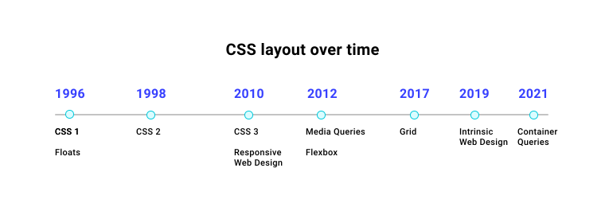

# Разметка

<big>Обзор различных методов **разметки**, которые можно выбрать при создании компонент или макета страницы.</big>

!!!info "CSS подкаст"

    009: Разметка

    <audio style="width: 100%;" controls src="/learn/css3/layout.en.ogg"></audio>

Представьте, что вы работаете разработчиком, а ваш коллега-дизайнер передает вам проект нового сайта. В дизайне присутствуют всевозможные интересные компоновки и композиции: двухмерные макеты, учитывающие ширину и высоту области просмотра, а также макеты, которые должны быть плавными и гибкими. Как решить, каким образом лучше всего стилизовать их с помощью CSS?

CSS предоставляет нам различные способы решения проблем верстки: по горизонтальной оси, по вертикальной оси или даже по обеим. Выбрать правильный способ компоновки для конкретного контекста может быть непросто, и часто для решения проблемы может потребоваться несколько способов компоновки. Чтобы помочь в этом, в следующих модулях вы узнаете об уникальных особенностях каждого механизма CSS-раскладки, что позволит вам принять соответствующие решения.

## Макет: краткая история

На заре развития Интернета для оформления более сложных документов использовались элементы `<table>`. Отделить HTML от визуальных стилей стало проще, когда в конце 90-х годов браузеры стали широко использовать CSS. CSS открыл разработчикам возможность полностью изменить внешний вид сайта, не касаясь HTML. Эта новая возможность вдохновила такие проекты, как [The CSS Zen Garden](http://www.csszengarden.com), который был создан для демонстрации возможностей CSS, чтобы побудить больше разработчиков к его изучению.

CSS развивался по мере того, как менялись наши потребности в веб-дизайне и технологии браузеров. О том, как со временем менялась верстка CSS и наш подход к верстке, можно прочитать в [этой статье Рейчел Эндрю](https://24ways.org/2019/a-history-of-css-through-15-years-of-24-ways/).



## Макет: настоящее и будущее

Современный CSS обладает исключительно мощным инструментарием для верстки. У нас есть специальные системы для верстки, и мы рассмотрим их в общих чертах, прежде чем приступить к более детальному изучению Flexbox и Grid в следующих модулях.

## Понимание свойства `display`

Свойство [`display`](../../css/display.md) выполняет две задачи. Во-первых, оно определяет, является ли блок, к которому оно применяется, встроенным или блочным.

```css
.my-element {
    display: inline;
}
```

Строчные элементы ведут себя как слова в предложении. Они располагаются рядом друг с другом в поточном направлении. Такие элементы, как [`<span>`](../../html/span.md) и [`<strong>`](../../html/strong.md), которые обычно используются для стилизации фрагментов текста внутри содержащих их элементов, таких как [`<p>`](../../html/p.md) (абзац), по умолчанию являются строчными. Они также сохраняют окружающее пробельное пространство.


Для встроенных элементов нельзя задать явную ширину и высоту. Любые поля и подкладки на уровне блока будут игнорироваться окружающими элементами.

```css
.my-element {
    display: block;
}
```

Блочные элементы не располагаются рядом друг с другом. Они создают для себя новую строку. Если он не изменен другим кодом CSS, то блочный элемент будет расширяться до размеров встроенного, поэтому при горизонтальном написании он будет занимать всю ширину. Поле со всех сторон блочного элемента будет соблюдаться.

```css
.my-element {
    display: flex;
}
```

Свойство `display` также определяет, как должны вести себя дочерние элементы элемента. Например, установка свойства `display` в значение `display: flex` делает элемент блоком, а также преобразует его дочерние элементы в элементы flex. Это позволяет использовать свойства flex, которые управляют выравниванием, упорядочиванием и обтеканием.

## Flexbox и Grid

Существует два основных механизма верстки, создающих правила расположения нескольких элементов: _[flexbox](flexbox.md)_ и _[grid](grid.md)_. Они имеют общие черты, но предназначены для решения разных задач компоновки.

!!!note ""

    В последующих модулях мы будем более подробно разбирать эти два параметра, но здесь мы дадим общий обзор того, что они собой представляют и для чего нужны.

### Flexbox

```css
.my-element {
    display: flex;
}
```

Flexbox — это механизм верстки для одномерных макетов. Разметка осуществляется по одной оси, горизонтальной или вертикальной. По умолчанию flexbox выравнивает дочерние элементы элемента рядом друг с другом в направлении inline и растягивает их в направлении block, так что все они имеют одинаковую высоту.

<iframe src="https://codepen.io/web-dot-dev/embed/rNjxmor?height=300&amp;theme-id=light&amp;default-tab=css%2Cresult&amp;editable=true" style="height: 500px; width: 100%; border: 0;" loading="lazy"></iframe>

Элементы будут оставаться на одной оси и не будут сворачиваться, когда у них закончится место. Вместо этого они будут пытаться сжаться в одну линию друг с другом. Это поведение можно изменить с помощью свойств [`align-items`](../../css/align-items.md), [`justify-content`](../../css/justify-content.md) и [`flex-wrap`](../../css/flex-wrap.md).

<iframe src="https://codepen.io/web-dot-dev/embed/jOyWLmg?height=500&amp;theme-id=light&amp;default-tab=result&amp;editable=true" style="height: 500px; width: 100%; border: 0;" loading="lazy"></iframe>

Flexbox также преобразует дочерние элементы в **гибкие элементы**, что означает возможность написания правил их поведения внутри гибкого контейнера. Вы можете изменять выравнивание, порядок и обоснование для отдельного элемента. Кроме того, с помощью свойства [`flex`](../../css/flex.md) можно изменить, как он уменьшается или увеличивается.

```css
.my-element div {
    flex: 1 0 auto;
}
```

Свойство `flex` является сокращением для [`flex-grow`](../../css/flex-grow.md), [`flex-shrink`](../../css/flex-shrink.md) и [`flex-basis`](../../css/flex-basis.md). Приведенный выше пример можно расширить следующим образом:

```css
.my-element div {
    flex-grow: 1;
    flex-shrink: 0;
    flex-basis: auto;
}
```

Разработчики предоставляют эти низкоуровневые правила, чтобы подсказать браузеру, как должен вести себя макет в зависимости от содержимого и размеров области просмотра. Это делает его очень полезным механизмом для отзывчивого веб-дизайна.

### Grid

```css
.my-element {
    display: grid;
}
```

Grid во многом похож на **flexbox**, но предназначен для управления многоосевыми макетами, а не одноосевыми (вертикальное или горизонтальное пространство).

Grid позволяет писать правила компоновки для элемента, имеющего `display: grid`, и вводит несколько новых примитивов для стилизации компоновки, таких как функции `repeat()` и `minmax()`. Одной из полезных единиц сетки является единица `fr`, которая представляет собой долю оставшегося пространства. С помощью 3 CSS-свойств можно строить традиционные 12-колоночные сетки с промежутком между каждым элементом:

```css
.my-element {
    display: grid;
    grid-template-columns: repeat(12, 1fr);
    gap: 1rem;
}
```

<iframe src="https://codepen.io/web-dot-dev/embed/rNjxGVz?height=500&amp;theme-id=light&amp;default-tab=result&amp;editable=true" style="height: 500px; width: 100%; border: 0;" loading="lazy"></iframe>

В приведенном примере показан макет с одной осью. Если flexbox в основном рассматривает элементы как группу, то grid позволяет точно контролировать их размещение в двух измерениях. Мы можем определить, что первый элемент в этой сетке занимает 2 строки и 3 столбца:

```css
.my-element :first-child {
    grid-row: 1/3;
    grid-column: 1/4;
}
```

Свойства [`grid-row`](../../css/grid-row.md) и [`grid-column`](../../css/grid-column.md) предписывают первому элементу сетки переместиться в начало четвертого столбца, начиная с первого столбца, затем переместиться в третью строку, начиная с первой строки.

<iframe src="https://codepen.io/web-dot-dev/embed/YzNwrwB?height=650&amp;theme-id=light&amp;default-tab=result&amp;editable=true" style="height: 500px; width: 100%; border: 0;" loading="lazy"></iframe>

## Потоковая разметка

Если не использовать сетку или flexbox, то элементы отображаются в обычном потоке. Существует несколько методов компоновки, которые можно использовать для настройки поведения и положения элементов в обычном потоке.

### Встраиваемый блок

Помните, как окружающие элементы не соблюдают поля и отступы блока для встроенного элемента? С помощью `inline-block` это можно сделать.

```css
p span {
    display: inline-block;
}
```

Использование `inline-block` позволяет получить блок, обладающий некоторыми характеристиками элемента уровня блока, но при этом располагающийся в линию с текстом.

```css
p span {
    margin-top: 0.5rem;
}
```

<iframe src="https://codepen.io/web-dot-dev/embed/PoWZJKw?height=300&amp;theme-id=light&amp;default-tab=css%2Cresult&amp;editable=true" style="height: 500px; width: 100%; border: 0;" loading="lazy"></iframe>

### Floats

Если у вас есть изображение, помещенное в абзац текста, то было бы удобно, чтобы текст обворачивался вокруг изображения, как в газете? Это можно сделать с помощью плавающих элементов.

```css
img {
    float: left;
    margin-right: 1em;
}
```

Свойство `float` предписывает элементу "плыть" в указанном направлении. В данном примере изображению предписано "плыть" влево, что позволяет "обернуть" вокруг него соседние элементы. Вы можете указать элементу плавать `left`, `right` или `inherit`.

<iframe src="https://codepen.io/web-dot-dev/embed/VwPaLMg?height=300&amp;theme-id=light&amp;default-tab=result&amp;editable=true" style="height: 500px; width: 100%; border: 0;" loading="lazy"></iframe>

!!!warning ""

    При использовании `float` следует помнить, что все элементы, следующие за плавающим элементом, могут быть скорректированы. Чтобы предотвратить это, можно очистить float либо с помощью `clear: both` для элемента, следующего за float, либо с помощью `display: flow-root` для родителя float-элемента.

    Подробнее об этом читайте в статье [Конец хака clearfix](https://rachelandrew.co.uk/archives/2017/01/24/the-end-of-the-clearfix-hack/).

### Многоколоночная верстка

Если у вас есть очень длинный список элементов, например, список всех стран мира, это может привести к _очень_ большой прокрутке и потере времени для пользователя. Кроме того, это может привести к образованию лишнего свободного пространства на странице. С помощью CSS multicolumn можно разделить этот список на несколько колонок, что поможет решить обе эти проблемы.

```html
<h1>All countries</h1>
<ul class="countries">
    <li>Argentina</li>
    <li>Aland Islands</li>
    <li>Albania</li>
    <li>Algeria</li>
    <li>American Samoa</li>
    <li>Andorra</li>
    …
</ul>
```

---

```css
.countries {
    column-count: 2;
    column-gap: 1em;
}
```

При этом длинный список автоматически разбивается на два столбца и между ними добавляется промежуток.

<iframe src="https://codepen.io/web-dot-dev/embed/gOgrpzO?height=500&amp;theme-id=light&amp;default-tab=result&amp;editable=true" style="height: 500px; width: 100%; border: 0;" loading="lazy"></iframe>

```css
.countries {
    width: 100%;
    column-width: 260px;
    column-gap: 1em;
}
```

<iframe src="https://codepen.io/web-dot-dev/embed/jOyqPvB?height=500&amp;theme-id=light&amp;default-tab=result&amp;editable=true" style="height: 500px; width: 100%; border: 0;" loading="lazy"></iframe>

Вместо того чтобы задавать количество колонок, на которые будет разбито содержимое, можно также определить минимальную желаемую ширину, используя `column-width`. При увеличении пространства в области просмотра автоматически будет создаваться больше колонок, а при уменьшении пространства колонки также будут уменьшаться. Это очень полезно в контексте отзывчивого веб-дизайна.

### Позиционирование

Последним в этом обзоре механизмов верстки является позиционирование. Свойство `position` изменяет поведение элемента в нормальном потоке документа и его отношение к другим элементам. Доступны следующие варианты: `relative`, `absolute`, `fixed` и `sticky`, при этом по умолчанию используется значение `static`.

```css
.my-element {
    position: relative;
    top: 10px;
}
```

Этот элемент сдвигается на `10px` вниз в зависимости от его текущей позиции в документе, поскольку он позиционируется относительно самого себя. Добавление `position: relative` к элементу также делает его содержащим блоком всех дочерних элементов с `position: absolute`. Это означает, что при применении абсолютной позиции его дочерний элемент будет перепозиционирован на этот элемент, а не на самого верхнего относительного родителя.

```css
.my-element {
    position: relative;
    width: 100px;
    height: 100px;
}

.another-element {
    position: absolute;
    bottom: 0;
    right: 0;
    width: 50px;
    height: 50px;
}
```

При установке `position` в значение `absolute` элемент вырывается из текущего потока документов. Это означает две вещи:

1.  Вы можете расположить этот элемент где угодно, используя `top`, `right`, `bottom` и `left` в его ближайшем относительном родителе.
2.  Все содержимое, окружающее абсолютный элемент, перетекает, чтобы заполнить оставшееся пространство, оставленное этим элементом.

Элемент со значением `position` `fixed` ведет себя аналогично `absolute`, а его родителем является корневой элемент `<html>`. Элементы с фиксированной позицией закрепляются сверху слева на основе заданных значений `top`, `right`, `bottom` и `left`.

С помощью `sticky` можно добиться фиксированной привязки `fixed` и более предсказуемой привязки к потоку документов `relative`. При таком значении, когда область просмотра прокручивается мимо элемента, он остается привязанным к заданным значениям `top`, `right`, `bottom` и `left`.

<iframe src="https://codepen.io/web-dot-dev/embed/NWdNGZB?height=600&amp;theme-id=light&amp;default-tab=result&amp;editable=true" style="height: 500px; width: 100%; border: 0;" loading="lazy"></iframe>

## Подведение итогов

CSS-верстка обладает широкими возможностями выбора и гибкости. Чтобы глубже погрузиться в возможности CSS [Flexbox](flexbox.md) и [Grid](grid.md), перейдите к следующим модулям.

:information_source: Источник: [Layout](https://web.dev/learn/css/layout/)
