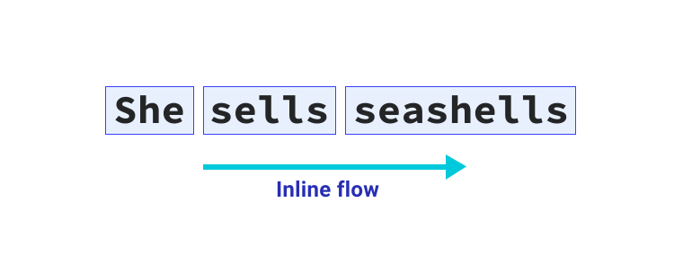

# Логические свойства

<big>**Логические**, относительные для потока свойства и значения связаны с потоком текста, а не с физической формой экрана. Узнайте, как использовать преимущества этого нового подхода к CSS.</big>

!!!info "CSS подкаст"

    012: Логические свойства

    <audio style="width: 100%;" controls src="/learn/css3/logical-properties.en.ogg"></audio>

Очень распространенным шаблоном пользовательского интерфейса является текстовая метка с поддерживающим ее встроенным значком.

<iframe src="https://codepen.io/web-dot-dev/embed/eYgvZBx?height=500&amp;theme-id=light&amp;default-tab=result&amp;editable=true" style="height: 500px; width: 100%; border: 0;" loading="lazy"></iframe>

Значок располагается слева от текста с небольшим промежутком между ними, который обеспечивается параметром `margin-right` на значке. Однако здесь возникает проблема, поскольку это работает только при направлении текста слева направо. Если направление текста изменится на право-лево, что характерно для таких языков, как арабский, то значок будет располагаться напротив текста.

<iframe src="https://codepen.io/web-dot-dev/embed/BapWKWm?height=500&amp;theme-id=light&amp;default-tab=result&amp;editable=true" style="height: 500px; width: 100%; border: 0;" loading="lazy"></iframe>

Как это учесть в CSS? Логические свойства позволяют разрешить эти ситуации. Помимо многих других преимуществ, они обеспечивают бесплатную автоматическую поддержку интернационализации. Они помогают создать более устойчивый и инклюзивный внешний интерфейс.

## Терминология

Физические свойства `top`, `right`, `bottom` и `left` относятся к физическим размерам области просмотра. Их можно представить себе как компасную розу на карте. Логические свойства, с другой стороны, относятся к краям блока, поскольку они связаны с _потоком содержимого_. Поэтому они могут меняться при изменении направления текста или режима написания. Это большой сдвиг по сравнению с направленными стилями, и он дает нам гораздо больше гибкости при оформлении интерфейсов.

## Обтекание блока

Обтекание блоков — это направление, в котором располагаются блоки содержимого. Например, если есть два абзаца, то поток блоков определяет, где будет располагаться второй абзац. В английском документе поток блоков идет сверху вниз. Подумайте об этом в контексте абзацев текста, следующих друг за другом сверху вниз.


## Инлайн-обтекание

Инлайновый поток — это поток текста в предложении. В англоязычном документе инлайн-обтекание происходит слева направо. Если изменить язык документа на арабский (`<html lang="ar">`), то обтекание текста будет происходить справа налево.



Text flows in the direction determined by the document's writing mode. You can change the direction that text is laid out with the `writing-mode` property. This can be applied to the entire document, or to individual elements.

<iframe src="https://codepen.io/web-dot-dev/embed/YzNZGam?height=500&amp;theme-id=light&amp;default-tab=result&amp;editable=true" style="height: 500px; width: 100%; border: 0;" loading="lazy"></iframe>

## Относительный поток

Исторически сложилось так, что в CSS мы могли применять такие свойства, как `margin`, только относительно направления их сторон. Например, `margin-top` применяется к физической верхней части элемента. С логическими свойствами `margin-top` превращается в `margin-block-start`. Это означает, что независимо от языка и направления текста, для **блочного потока** действуют соответствующие правила `margin`.

<iframe src="https://codepen.io/web-dot-dev/embed/ZELeBzM?height=500&amp;theme-id=light&amp;default-tab=result&amp;editable=true" style="height: 500px; width: 100%; border: 0;" loading="lazy"></iframe>


## Sizing

Чтобы запретить элементу превышать определенную ширину или высоту, напишите правило следующего вида:

```css
.my-element {
    max-width: 150px;
    max-height: 100px;
}
```

Относительные по потоку эквиваленты — `max-inline-size` и `max-block-size`. Также можно использовать `min-block-size` и `min-inline-size` вместо `min-height` и `min-width`.

При использовании логических свойств правило максимальной ширины и высоты будет выглядеть следующим образом:

```css
.my-element {
    max-inline-size: 150px;
    max-block-size: 100px;
}
```

## Начало и конец

Вместо таких направлений, как `top`, `right`, `bottom` и `left`, используйте `start` и `end`. Это дает возможность использовать `block-start`, `inline-end`, `block-end` и `inline-start`. Они позволяют применять свойства CSS, реагирующие на изменение режима написания.

Например, для выравнивания текста вправо можно использовать следующий CSS:

```css
p {
    text-align: right;
}
```

Если ваша цель — выравнивание не по физическому правому краю, а по началу направления чтения, это не поможет. Для логических значений существуют более удобные значения `start` и `end`, которые сопоставляются с направлением текста. Теперь правило выравнивания текста выглядит следующим образом:

```css
p {
    text-align: end;
}
```

<iframe src="https://codepen.io/web-dot-dev/embed/QWdpdwo?height=500&amp;theme-id=light&amp;default-tab=result&amp;editable=true" style="height: 500px; width: 100%; border: 0;" loading="lazy"></iframe>

## Интервалы и позиционирование

Логические свойства `margin`, `padding` и `inset` позволяют проще и эффективнее позиционировать элементы и определять, как эти элементы взаимодействуют друг с другом в разных режимах написания. Свойства, связанные с `margin` и `padding`, по-прежнему являются прямыми отображениями на направления, но ключевым отличием является то, что при изменении режима написания они меняются вместе с ним.

```css
.my-element {
    padding-top: 2em;
    padding-bottom: 2em;
    margin-left: 2em;
    position: relative;
    top: 0.2em;
}
```

Это добавляет некоторое вертикальное внутреннее пространство с помощью `padding` и отодвигает его слева с помощью `margin`. Свойство `top` также смещает его вниз. С логическими эквивалентами свойств это выглядело бы следующим образом:

```css
.my-element {
    padding-block-start: 2em;
    padding-block-end: 2em;
    margin-inline-start: 2em;
    position: relative;
    inset-block-start: 0.2em;
}
```

Это добавляет некоторое внутреннее пространство в строке с помощью `padding` и отодвигает ее от начала строки с помощью `margin`. Свойство `inset-block` перемещает его внутрь от начала блока.

Свойство `inset-block` — не единственный вариант сокращения с логическими свойствами. Это правило можно еще больше сократить, используя сокращенные версии свойств `margin` и `padding`.

```css
.my-element {
    padding-block: 2em;
    margin-inline: 2em 0;
    position: relative;
    inset-block: 0.2em 0;
}
```

## Границы

Добавление `border` и `border-radius` также может быть выполнено с помощью логических свойств. Чтобы добавить границу снизу и справа с правым радиусом, можно написать такое правило:

```css
.my-element {
    border-bottom: 1px solid red;
    border-right: 1px solid red;
    border-bottom-right-radius: 1em;
}
```

Или можно использовать логические свойства, например, так:

```css
.my-element {
    border-block-end: 1px solid red;
    border-inline-end: 1px solid red;
    border-end-end-radius: 1em;
}
```

Значение `end-end` в `border-end-end-radius` — это конец блока _и_ конец инлайна.

<iframe src="https://codepen.io/web-dot-dev/embed/yLgMgby?height=500&amp;theme-id=light&amp;default-tab=result&amp;editable=true" style="height: 500px; width: 100%; border: 0;" loading="lazy"></iframe>

## Единицы

В логических свойствах появились две новые единицы измерения: `vi` и `vb`. Единица `vi` составляет 1% от размера области просмотра в направлении inline. Эквивалентом нелогического свойства является `vw`. Единица `vb` составляет 1% от размера области просмотра в направлении блока. Эквивалентом нелогического свойства является `vh`.

Эти единицы всегда сопоставляются с направлением чтения. Например, если вы хотите, чтобы элемент занимал 80% доступного внутристрочного пространства области просмотра, то использование единицы `vi` автоматически изменит этот размер на размер сверху вниз, если режим записи вертикальный.

## Прагматичное использование логических свойств

Логические свойства и режимы записи предназначены не только для интернационализации. Их можно использовать для создания более универсального пользовательского интерфейса.

Если у вас есть график с метками по осям X и Y, вы можете захотеть, чтобы текст на метке Y читался вертикально.

<iframe src="https://codepen.io/web-dot-dev/embed/zYNZNgE?height=500&amp;theme-id=light&amp;default-tab=result&amp;editable=true" style="height: 500px; width: 100%; border: 0;" loading="lazy"></iframe>

Поскольку для метки оси Y в демонстрационном примере установлен `write-mode` (режим записи) `vertical-rl`, для обеих меток можно использовать одинаковые значения `margin`. Значение `margin-block-start` применяется к обеим меткам, поскольку начало блока находится справа для оси Y и сверху для оси X. Стороны начала блока имеют красную рамку, чтобы их было видно.

## Решение проблемы со значками

Теперь, когда мы рассмотрели логические свойства, эти знания можно применить к проблеме проектирования, с которой мы начали.

<iframe src="https://codepen.io/web-dot-dev/embed/eYgvZBx?height=500&amp;theme-id=light&amp;default-tab=result&amp;editable=true" style="height: 500px; width: 100%; border: 0;" loading="lazy"></iframe>

```css
p {
    display: inline-flex;
    align-items: center;
}

p svg {
    width: 1.2em;
    height: 1.2em;
    margin-right: 0.5em;
    flex: none;
}
```

Отступ был применен к правой части элемента иконки. Для того чтобы расстояние между пиктограммой и текстом поддерживало все направления чтения, необходимо использовать свойство `margin-inline-end`.

```css
p {
    display: inline-flex;
    align-items: center;
}

p svg {
    width: 1.2em;
    height: 1.2em;
    margin-inline-end: 0.5em;
    flex: none;
}
```

<iframe src="https://codepen.io/web-dot-dev/embed/qBRrrOy?height=500&amp;theme-id=light&amp;default-tab=result&amp;editable=true" style="height: 500px; width: 100%; border: 0;" loading="lazy"></iframe>

Теперь, независимо от направления чтения, значок будет располагаться и занимать соответствующее место.

:information_source: Источник: [Logical Properties](https://web.dev/learn/css/logical-properties/)
