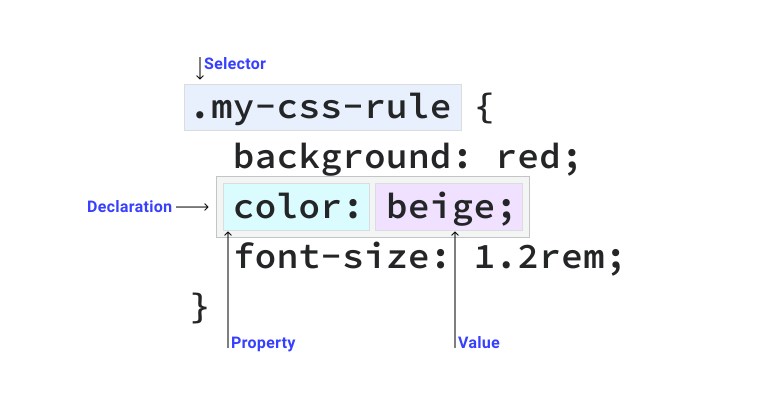

# Селекторы

<big>Чтобы применить CSS к элементу, необходимо его выбрать. CSS предоставляет несколько различных способов сделать это, и в этом модуле вы можете изучить их.</big>

!!!info "CSS подкаст"

    002: Селекторы

    <audio style="width: 100%;" controls src="https://traffic.libsyn.com/secure/thecsspodcast/TCP_CSS_Podcast__Episode_002_v2.0_FINAL.mp3?dest-id=1891556"></audio>

Если у вас есть текст, который вы хотите сделать более крупным и красным, только если это первый абзац статьи, как это сделать?

```html
<article>
    <p>I want to be red and larger than the other text.</p>
    <p>I want to be normal sized and the default color.</p>
</article>
```

С помощью CSS-селектора можно найти конкретный элемент и применить CSS-правило, например, так.

```css
article p:first-of-type {
    color: red;
    font-size: 1.5em;
}
```

CSS предоставляет множество возможностей для выбора элементов и применения к ним правил, от очень простых до очень сложных, чтобы помочь решить подобные ситуации.

<iframe src="https://codepen.io/web-dot-dev/embed/XWprGYz?height=250&amp;theme-id=light&amp;default-tab=result&amp;editable=true" style="height: 400px; width: 100%; border: 0;" loading="lazy"></iframe>

## Части правила CSS

Чтобы понять принцип работы селекторов и их роль в CSS, важно знать составные части правила CSS. Правило CSS - это блок кода, содержащий один или несколько селекторов и одно или несколько объявлений.

<figure markdown>

</figure>

В этом CSS-правиле **селектором** является `.my-css-rule`, который находит все элементы с классом `my-css-rule` на странице. Внутри фигурных скобок находятся три декларации. Объявление - это пара свойств и значений, которая применяет стили к элементам, подобранным селекторами. В правиле CSS может быть сколько угодно деклараций и селекторов.

## Простые селекторы

Наиболее простая группа селекторов предназначена для HTML-элементов, а также классов, идентификаторов и других атрибутов, которые могут быть добавлены к HTML-тегу.

### Универсальный селектор

<p class="ciu_embed" data-feature="mdn-css__selectors__universal" data-periods="future_1,current,past_1,past_2" data-accessible-colours="false"></p>

[Универсальный селектор](https://developer.mozilla.org/docs/Web/CSS/Universal_selectors) - также известный как подстановочный знак - подбирает любой элемент.

```css
* {
    color: hotpink;
}
```

Это правило приводит к тому, что каждый HTML-элемент на странице будет иметь розовый текст.

### Селектор типов

<p class="ciu_embed" data-feature="mdn-css__selectors__type" data-periods="future_1,current,past_1,past_2" data-accessible-colours="false"></p>

[Селектор типа](https://developer.mozilla.org/docs/Web/CSS/Type_selectors) соответствует непосредственно элементу HTML.

```css
section {
    padding: 2em;
}
```

Это правило заставляет каждый элемент `<section>` иметь `2em` отступа со всех сторон.

### Селектор классов

<p class="ciu_embed" data-feature="mdn-css__selectors__class" data-periods="future_1,current,past_1,past_2" data-accessible-colours="false"></p>

HTML-элемент может иметь один или несколько элементов, определенных в его атрибуте `class`. [Селектор class](https://developer.mozilla.org/docs/Web/CSS/Class_selectors) соответствует любому элементу, к которому применен данный класс.

```html
<div class="my-class"></div>
<button class="my-class"></button>
<p class="my-class"></p>
```

Любой элемент, к которому применен данный класс, будет окрашен в красный цвет:

```css
.my-class {
    color: red;
}
```

Обратите внимание, что символ `.` присутствует только в CSS и **не** в HTML. Это связано с тем, что символ `.` указывает языку CSS на соответствие членам атрибута class. Это обычная схема в CSS, когда специальный символ или набор символов используется для определения типов селекторов.

Элемент HTML, имеющий класс `.my-class`, все равно будет соответствовать приведенному выше правилу CSS, даже если у него есть несколько других классов, например, такой:

```html
<div class="my-class another-class some-other-class"></div>
```

Это происходит потому, что CSS ищет атрибут `class`, который _содержит_ определенный класс, вместо того чтобы точно соответствовать этому классу.

!!!note ""

    Значение атрибута `class` может быть практически любым. Одна вещь, которая может поставить вас в тупик, заключается в том, что вы не можете начинать класс (или идентификатор) с числа, например `.1element`. Подробнее об этом можно прочитать [в спецификации](https://www.w3.org/TR/CSS21/syndata.html#characters).

### Селектор ID

<p class="ciu_embed" data-feature="mdn-css__selectors__id" data-periods="future_1,current,past_1,past_2" data-accessible-colours="false"></p>

HTML-элемент с атрибутом `id` должен быть единственным элементом на странице с таким значением ID. Выбираются элементы с помощью [ID-селектора](https://developer.mozilla.org/docs/Web/CSS/ID_selectors) следующим образом:

```css
#rad {
    border: 1px solid blue;
}
```

Этот CSS применит синюю рамку к элементу HTML, имеющему `id` равный `rad`, следующим образом:

```html
<div id="rad"></div>
```

Аналогично селектору класса `.`, используйте символ `#`, чтобы указать CSS на поиск элемента, соответствующего следующему за ним `id`.

!!!note ""

    Если браузер встречает более одного экземпляра `id`, он все равно применит все правила CSS, соответствующие его селектору. Однако любой элемент, имеющий атрибут `id`, должен иметь уникальное значение, поэтому, если вы не пишете очень специфический CSS для одного элемента, избегайте применения стилей с селектором `id`, поскольку это означает, что вы не сможете повторно использовать эти стили в других местах.

### Селектор атрибута

<p class="ciu_embed" data-feature="mdn-css__selectors__attribute" data-periods="future_1,current,past_1,past_2" data-accessible-colours="false"></p>

С помощью селектора [атрибутов](https://developer.mozilla.org/docs/Web/CSS/Attribute_selectors) можно искать элементы, имеющие определенный HTML-атрибут или определенное значение для HTML-атрибута. Чтобы указать CSS на поиск атрибутов, оберните селектор квадратными скобками (`[ ]`).

```css
[data-type='primary'] {
    color: red;
}
```

Этот CSS ищет все элементы, имеющие атрибут `data-type` со значением `primary`, следующим образом:

```html
<div data-type="primary"></div>
```

Вместо того чтобы искать конкретное значение `data-type`, можно также искать элементы с присутствующим атрибутом, независимо от его значения.

```css
[data-type] {
    color: red;
}
```

---

```html
<div data-type="primary"></div>
<div data-type="secondary"></div>
```

Оба этих элемента `<div>` будут иметь красный текст.

Вы можете использовать селекторы атрибутов с учетом регистра, добавив в селектор атрибутов оператор `s`.

```css
[data-type='primary' s] {
    color: red;
}
```

Это означает, что если у элемента HTML `data-type` будет `Primary`, а не `primary`, то он не получит красного текста. Противоположное действие - нечувствительность к регистру - можно осуществить с помощью оператора `i`.

Наряду с операторами регистра, доступны операторы, которые сопоставляют части строк внутри значений атрибутов.

```css
/* A href that contains "example.com" */
[href*='example.com'] {
    color: red;
}

/* A href that starts with https */
[href^='https'] {
    color: green;
}

/* A href that ends with .com */
[href$='.com'] {
    color: blue;
}
```

<figure markdown>
<iframe src="https://codepen.io/web-dot-dev/embed/BapBbOy?height=500&amp;theme-id=light&amp;default-tab=result&amp;editable=true" style="height: 500px; width: 100%; border: 0;" loading="lazy"></iframe>
<figcaption markdown>В данном примере оператор `$` в селекторе атрибутов получает тип файла из атрибута `href`. Это позволяет использовать псевдоэлемент для префиксации метки, основанной на этом файловом типе.</figcaption>
</figure>

### Группировка селекторов

Селектор не обязательно должен соответствовать только одному элементу. Вы можете сгруппировать несколько селекторов, разделив их запятыми:

```css
strong,
em,
.my-class,
[lang] {
    color: red;
}
```

В данном примере изменение цвета распространяется как на элементы `<strong>`, так и на элементы `<em>`. Оно также распространяется на класс с именем `.my-class` и элемент, имеющий атрибут `lang`.

## Псевдоклассы и псевдоэлементы

CSS предоставляет полезные типы селекторов, которые фокусируются на определенном состоянии платформы, например, когда элемент наведен, структуры _внутри_ элемента или части элемента.

### Псевдоэлементы

HTML-элементы оказываются в различных состояниях либо потому, что с ними взаимодействуют, либо потому, что один из их дочерних элементов находится в определенном состоянии.

Например, на HTML-элемент может быть наведен указатель мыши пользователем, или дочерний элемент также может быть наведен пользователем. Для таких ситуаций следует использовать псевдокласс `:hover`.

```css
/* Our link is hovered */
a:hover {
    outline: 1px dotted green;
}

/* Sets all even paragraphs to have a different background */
p:nth-child(even) {
    background: floralwhite;
}
```

Более подробная информация содержится в модуле [pseudo-classes](pseudo-classes.md).

### Псевдоэлемент

Псевдоэлементы отличаются от псевдоклассов тем, что вместо того, чтобы реагировать на состояние платформы, они ведут себя так, как будто вставляют новый элемент с помощью CSS. Псевдоэлементы также синтаксически отличаются от псевдоклассов, поскольку вместо одинарного двоеточия (`:`) мы используем двойное двоеточие (`::`).

!!!note ""

    Двойное двоеточие (`::`) отличает псевдоэлемент от псевдокласса, но поскольку в старых версиях спецификаций CSS это различие отсутствовало, браузеры поддерживают одинарное двоеточие для оригинальных псевдоэлементов, таких как `:before` и `:after`, чтобы обеспечить обратную совместимость со старыми браузерами, например IE8.

```css
.my-element::before {
    content: 'Prefix - ';
}
```

Как и в приведенном выше примере, где в метке ссылки указывался тип файла, псевдоэлемент `::before` можно использовать для вставки содержимого **в начало элемента**, а псевдоэлемент `::after` - в **конец элемента**.

Однако псевдоэлементы не ограничиваются вставкой содержимого. Их также можно использовать для указания конкретных частей элемента. Например, предположим, что у вас есть список. Используйте `::marker` для стилизации каждого пункта (или номера) в списке

```css
/* Your list will now either have red dots, or red numbers */
li::marker {
    color: red;
}
```

Вы также можете использовать `::selection` для стилизации содержимого, которое было выделено пользователем.

```css
::selection {
    background: black;
    color: white;
}
```

Более подробная информация содержится в [модуле по псевдоэлементам](pseudo-elements.md).

## Сложные селекторы

Вы уже познакомились с огромным количеством селекторов, но иногда требуется более тонкий контроль над CSS. В этом случае на помощь приходят сложные селекторы.

Стоит помнить, что, хотя следующие селекторы дают нам больше возможностей, мы можем только **каскадировать вниз**, выбирая дочерние элементы. Мы не можем нацелиться вверх и выбрать родительский элемент. Что такое каскад и как он работает, мы рассмотрим [в одном из следующих уроков](the-cascade.md).

### Комбинаторы

Комбинатор - это то, что находится между двумя селекторами. Например, если селектор был `p > strong`, то комбинатор - это символ `>`. Селекторы, использующие эти комбинаторы, помогают выбирать элементы в зависимости от их положения в документе.

#### Комбинатор-потомок

Чтобы понять, что такое комбинаторы-потомки, необходимо сначала разобраться с родительскими и дочерними элементами.

```html
<p>
    A paragraph of text with some
    <strong>bold text for emphasis</strong>.
</p>
```

Родительским элементом является `<p>`, содержащий текст. Внутри этого элемента `<p>` находится элемент `<strong>`, делающий его содержимое жирным. Поскольку он находится внутри `<p>`, он является дочерним элементом.

Комбинатор потомков позволяет нам нацелиться на дочерний элемент. С помощью пробела (` `) браузеру дается указание искать дочерние элементы:

```css
p strong {
    color: blue;
}
```

Этот фрагмент выбирает все `<strong>` элементы, которые являются дочерними элементами только `<p>` элементов, делая их синими рекурсивно.

<figure>
<iframe src="https://codepen.io/web-dot-dev/embed/BapBbGN?height=500&amp;theme-id=light&amp;default-tab=result&amp;editable=true" style="height: 500px; width: 100%; border: 0;" loading="lazy"></iframe>
<figcaption>Поскольку комбинатор потомков является рекурсивным, то добавляемая к каждому дочернему элементу прокладка применяется, что приводит к ступенчатому эффекту.</figcaption>
</figure>

Этот эффект лучше всего визуализировать в приведенном выше примере, используя комбинаторный селектор `.top div`. Это правило CSS добавляет левую подложку к элементам `<div>`. Поскольку комбинатор является рекурсивным, ко всем элементам `<div>`, находящимся в `.top`, будет применен тот же самый padding.

Посмотрите на HTML-панель в этом примере, чтобы увидеть, как элемент `.top` имеет несколько дочерних элементов `<div>`, которые сами имеют дочерние элементы `<div>`.

#### Комбинатор следующих сиблингов

Вы можете искать элемент, который непосредственно следует за другим элементом, используя в селекторе символ `+`.

<figure>
<iframe src="https://codepen.io/web-dot-dev/embed/JjEPzwB?height=500&amp;theme-id=light&amp;default-tab=result&amp;editable=true" style="height: 500px; width: 100%; border: 0;" loading="lazy"></iframe>
</figure>

Чтобы добавить пространство между сложенными элементами, используйте комбинатор next sibling для добавления пространства _только_ если элемент является **next sibling** дочернего элемента `.top`.

Можно добавить отступ ко всем дочерним элементам `.top`, используя следующий селектор:

```css
.top * {
    margin-top: 1em;
}
```

Проблема заключается в том, что, выбирая каждый дочерний элемент `.top`, это правило потенциально создает дополнительное, ненужное пространство. Комбинатор **next sibling combinator** в сочетании с **универсальным селектором** позволяет не только контролировать, какие элементы получают пространство, но и применять пространство к **любому элементу**. Это обеспечивает определенную долгосрочную гибкость, независимо от того, какие HTML-элементы появляются в `.top`.

#### Комбинатор последующих братьев и сестер

Комбинатор subsequent очень похож на селектор next sibling. Однако вместо символа `+` используется символ `~`. Отличие заключается в том, что элемент просто должен следовать за другим элементом с тем же родителем, а не быть следующим элементом с тем же родителем.

<figure markdown>
<iframe src="https://codepen.io/web-dot-dev/embed/ZELzPPX?height=400&amp;theme-id=light&amp;default-tab=result&amp;editable=true" style="height: 500px; width: 100%; border: 0;" loading="lazy"></iframe>
<figcaption markdown>Используйте последующий селектор вместе с псевдоклассом `:checked` для создания чистого CSS-элемента switch.</figcaption>
</figure>

Этот последующий комбинатор обеспечивает меньшую жесткость, что полезно в контекстах, подобных приведенному выше примеру, где мы изменяем цвет пользовательского переключателя, когда связанный с ним флажок имеет состояние `:checked`.

#### Дочерний комбинатор

Дочерний комбинатор (также известный как прямой потомок) позволяет лучше контролировать рекурсию, присущую комбинаторным селекторам. Используя символ `>`, вы ограничиваете применение комбинаторного селектора **только** к прямым дочерним элементам.

Рассмотрим пример с селектором предыдущего, следующего брата или сестры. Пробел добавляется к каждому **следующему брату**, но если один из этих элементов также имеет в качестве дочерних элементов **следующие братья и сестры**, то это может привести к нежелательным дополнительным пробелам.

<figure>
<iframe src="https://codepen.io/web-dot-dev/embed/ExZYMJL?height=500&amp;theme-id=light&amp;default-tab=result&amp;editable=true" style="height: 500px; width: 100%; border: 0;" loading="lazy"></iframe>
</figure>

Чтобы решить эту проблему, измените селектор **next sibling selector** на комбинатор дочерних элементов: `> * + *`. Теперь правило будет применяться **только** к прямым дочерним элементам `.top`.

<figure>
<iframe src="https://codepen.io/web-dot-dev/embed/dyNbrEr?height=500&amp;theme-id=light&amp;default-tab=result&amp;editable=true" style="height: 500px; width: 100%; border: 0;" loading="lazy"></iframe>
</figure>

### Составные селекторы

Для повышения конкретности и читабельности можно комбинировать селекторы. Например, чтобы выделить элементы `<a>`, которые также имеют класс `.my-class`, напишите следующее:

```css
a.my-class {
    color: red;
}
```

В этом случае красный цвет будет применяться не ко всем ссылкам, а только к `.my-class` **если** он находится на элементе `<a>`. Подробнее об этом см. в модуле [Специфика](specificity.md).

## Ресурсы

-   [Справочник по селекторам CSS](https://developer.mozilla.org/docs/Web/CSS/CSS_Selectors)
-   [Интерактивная игра по селекторам](https://flukeout.github.io/)
-   [Справочник по псевдоклассам и псевдоэлементам](https://developer.mozilla.org/docs/Learn/CSS/Building_blocks/Selectors/Pseudo-classes_and_pseudo-elements)
-   [Инструмент, переводящий CSS-селекторы в понятные объяснения на английском языке](https://kittygiraudel.github.io/selectors-explained/)

:information_source: Источник: [Selectors](https://web.dev/learn/css/selectors/)
