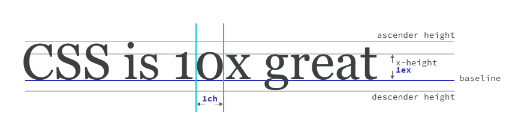

# Единицы измерения

<big>В этом модуле вы узнаете, как определять **размеры элементов** с помощью CSS, работая с гибкой средой Интернета.</big>

!!!info "CSS подкаст"

    008: Единицы измерения

    === "Перевод на русский"

    	<audio style="width: 100%;" controls src="/learn/css3/sizing.ru.mp3"></audio>

    === "Английский оригинал"

    	<audio style="width: 100%;" controls src="/learn/css3/sizing.en.ogg"></audio>

Веб — это отзывчивая среда, но иногда для улучшения общего качества интерфейса необходимо контролировать его размеры. Хорошим примером этого является ограничение длины строк для улучшения читаемости. Как это сделать в такой гибкой среде, как веб?

<iframe src="https://codepen.io/web-dot-dev/embed/bGgEGxj?height=500&amp;theme-id=light&amp;default-tab=css%2Cresult&amp;editable=true" style="height: 500px; width: 100%; border: 0;" loading="lazy"></iframe>

Для этого случая можно использовать единицу `ch`, которая равна ширине символа "0" в отрисованном шрифте при его расчетном размере. Эта единица позволяет ограничить ширину текста с помощью единицы, предназначенной для определения размера текста, что, в свою очередь, обеспечивает предсказуемость управления независимо от размера этого текста. Единица `ch` — одна из нескольких единиц, которые полезны в специфических контекстах, как в данном примере.

## Числа

Числа используются для определения `opacity`, `line-height` и даже для значений цветовых каналов в `rgb`. Числа представляют собой целые числа без единиц измерения (1, 2, 3, 100) и десятичные (.1, .2, .3).

Смысл чисел зависит от их контекста. Например, при определении `line-height` число представляет собой отношение, если оно задано без вспомогательной единицы измерения:

```css
p {
    font-size: 24px;
    line-height: 1.5;
}
```

<iframe src="https://codepen.io/web-dot-dev/embed/yLgYZRK?height=500&amp;theme-id=light&amp;default-tab=css%2Cresult&amp;editable=true" style="height: 500px; width: 100%; border: 0;" loading="lazy"></iframe>

В данном примере `1,5` равно **150%** от **вычисленного пиксельного размера шрифта** элемента `p`. Это означает, что если `p` имеет `font-size` равный `24px`, то высота строки будет вычислена как `36px`.

!!!note ""

    Для `line-height` лучше не указывать единицы измерения, а использовать безразмерное значение. Как вы узнали из модуля [inheritance module](inheritance.md), `font-size` может быть унаследован. При определении `line-height` без единицы измерения высота строки сохраняется относительно размера шрифта. Это обеспечивает лучшее восприятие, чем, скажем, `line-height: 15px`, которая не будет изменяться и может выглядеть странно при определенных размерах шрифта.

Числа также могут использоваться в следующих местах:

-   При задании значений для фильтров: `filter: sepia(0.5)` применяет к элементу `50%` фильтр сепии.
-   При задании непрозрачности: `opacity: 0.5` применяет `50%` непрозрачности.
-   В цветовых каналах: `rgb(50, 50, 50)`, где для задания значения цвета допустимы значения 0-255. [См. урок "Цвет"](color.md).
-   Для преобразования элемента: `transform: scale(1.2)` масштабирует элемент на 120% от его начального размера.

## Проценты

При использовании процентов в CSS необходимо знать, как вычисляется процент. Например, `width` вычисляется как процент от доступной ширины родительского элемента.

```css
div {
    width: 300px;
    height: 100px;
}

div p {
    width: 50%;
}
```

<iframe src="https://codepen.io/web-dot-dev/embed/ZELbwwj?height=500&amp;theme-id=light&amp;default-tab=css%2Cresult&amp;editable=true" style="height: 500px; width: 100%; border: 0;" loading="lazy"></iframe>

В приведенном примере ширина `div p` равна `150px`, предполагая, что в макете используется стандартное значение `box-sizing: content-box`.

Если задать `margin` или `padding` в процентах, то они будут представлять собой часть ширины **родительского элемента**, независимо от направления.

```css
div {
    width: 300px;
    height: 100px;
}

div p {
    margin-top: 50%; /* calculated: 150px */
    padding-left: 50%; /* calculated: 150px */
}
```

<iframe src="https://codepen.io/web-dot-dev/embed/WNRQPqX?height=500&amp;theme-id=light&amp;default-tab=css%2Cresult&amp;editable=true" style="height: 500px; width: 100%; border: 0;" loading="lazy"></iframe>

В приведенном выше фрагменте оба значения `margin-top` и `padding-left` будут вычислены как `150px`.

```css
div {
    width: 300px;
    height: 100px;
}

div p {
    width: 50%; /* calculated: 150px */
    transform: translateX(10%); /* calculated: 15px */
}
```

<iframe src="https://codepen.io/web-dot-dev/embed/xxgwBxv?height=500&amp;theme-id=light&amp;default-tab=css%2Cresult&amp;editable=true" style="height: 500px; width: 100%; border: 0;" loading="lazy"></iframe>

Если значение `transform` задано в процентах, то оно основывается на элементе с заданным преобразованием. В данном примере элемент `p` имеет значение `translateX`, равное `10%`, и `width`, равное `50%`. Сначала вычисляем, какой будет ширина: `150px`, так как она составляет **50% от ширины родителя**. Затем отнимите `10%` от `150px`, что составит `15px`.

!!!tip ""

    Свойство `transform` позволяет изменять внешний вид и положение элемента путем его поворота, перекоса, масштабирования и трансляции. Это можно делать как в двухмерном, так и в трехмерном пространстве.

## Размеры и длины

Если к числу присоединить единицу измерения, то оно становится размерностью. Например, `1rem` — это размерность. В данном контексте единица, присоединяемая к числу, называется в спецификациях маркером измерения. Длина — это **измерение, относящееся к расстоянию**, которое может быть абсолютным или относительным.

### Абсолютные длины

Все абсолютные длины приводятся к одному и тому же основанию, что делает их предсказуемыми, где бы они ни использовались в CSS. Например, если вы используете `cm` для определения размера элемента, а затем выводите его на печать, он должен быть точным, если сравнивать его с линейкой.

```css
div {
    width: 10cm;
    height: 5cm;
    background: black;
}
```

Если распечатать эту страницу, то `div` будет иметь вид черного прямоугольника размером 10x5 см. Не забывайте, что CSS используется не только для цифрового контента, но и для стилизации печатных материалов. Абсолютная длина может оказаться очень полезной при разработке дизайна для печати.

| Единица | Название | Эквивалентно |
| --- | --- | --- |
| [cm](https://www.w3.org/TR/css-values-4/#cm) | Сантиметры | `1cm = 96px/2.54` |
| [mm](https://www.w3.org/TR/css-values-4/#mm) | Миллиметры | `1mm = 1/10th of 1cm` |
| [Q](https://www.w3.org/TR/css-values-4/#q) | Четвертьмиллиметры | `1Q = 1/40th of 1cm` |
| [in](https://www.w3.org/TR/css-values-4/#in) | Дюймы | `1in = 2.54cm = 96px` |
| [pc](https://www.w3.org/TR/css-values-4/#pc) | Пики | `1pc = 1/6th of 1in` |
| [pt](https://www.w3.org/TR/css-values-4/#pt) | Пункты | `1pt = 1/72th of 1in` |
| [px](https://www.w3.org/TR/css-values-4/#px) | Пиксели | `1px = 1/96th of 1in` |

### Относительная длина

Относительная длина рассчитывается по отношению к базовому значению, подобно процентам. Разница между ними и процентами заключается в том, что можно контекстно определять размеры элементов. Это означает, что в CSS существуют такие единицы измерения, как `ch`, использующие в качестве основы размер текста, и `vw`, основанные на ширине области просмотра (окна браузера). Относительные размеры особенно полезны в Интернете из-за его отзывчивой природы.

#### Относительные единицы измерения размера шрифта

CSS предоставляет полезные единицы измерения, которые относятся к размерам элементов типографики, таких как размер самого текста (единицы `em`) или ширина символов шрифта (единицы `ch`).

| Единица | Эквивалентно |
| --- | --- |
| [em](https://www.w3.org/TR/css-values-4/#em) | Относительно размера шрифта, т. е. 1.5em будет на 50% больше базового вычисленного размера шрифта его родителя. (Исторически — высота заглавной буквы "М"). |
| [ex](https://www.w3.org/TR/css-values-4/#ex) | Эвристика, определяющая, использовать ли в текущем вычисленном размере шрифта элемента x-height, букву "x" или .5em. |
| [cap](https://www.w3.org/TR/css-values-4/#cap) | Высота прописных букв в текущем вычисленном размере шрифта элемента. |
| [ch](https://www.w3.org/TR/css-values-4/#ch) | Среднее значение [символьного роста](https://www.w3.org/TR/css-values-4/#length-advance-measure) узкого глифа в шрифте элемента (представленного глифом "0"). |
| [ic](https://www.w3.org/TR/css-values-4/#ic) | Среднее значение [символьного роста](https://www.w3.org/TR/css-values-4/#length-advance-measure) глифа полной ширины в шрифте элемента, представленного глифом "水" (идеограмма воды CJK, `U+6C34`). |
| [rem](https://www.w3.org/TR/css-values-4/#rem) | Размер шрифта корневого элемента (по умолчанию 16px). |
| [lh](https://www.w3.org/TR/css-values-4/#lh) | Высота линии элемента. |
| [rlh](https://www.w3.org/TR/css-values-4/#rlh) | Высота линии корневого элемента. |



#### Относительные единицы измерения области просмотра

В качестве относительных единиц можно использовать размеры области просмотра (окна браузера). Эти единицы делят на части доступное пространство области просмотра.

| Единица | Эквивалентно |
| --- | --- |
| [vw](https://www.w3.org/TR/css-values-4/#vw) | 1% от ширины области просмотра. С помощью этой единицы измерения можно выполнять различные трюки со шрифтами, например, изменять размер шрифта заголовка в зависимости от ширины страницы, чтобы при изменении размера страницы шрифт также изменялся. |
| [vh](https://www.w3.org/TR/css-values-4/#vh) | 1% от высоты области просмотра. Это можно использовать для расположения элементов в пользовательском интерфейсе, например, если у вас есть панель инструментов нижнего колонтитула. |
| [vi](https://www.w3.org/TR/css-values-4/#vi) | 1% от размера области просмотра по оси [инлайна](https://www.w3.org/TR/css-writing-modes-4/#inline-axis) корневого элемента. Ось относится к режимам письма. В горизонтальных шрифтах, таких как английский, ось инлайна расположена горизонтально. При вертикальном начертании, как в некоторых японских шрифтах, ось инлайна проходит сверху вниз. |
| [vb](https://www.w3.org/TR/css-values-4/#vb) | 1% от размера области просмотра по оси [блока](https://www.w3.org/TR/css-writing-modes-4/#block-axis) корневого элемента. Для оси блока это направление языка. Языки LTR, такие как английский, имеют вертикальную ось блока, поскольку читатели английского языка анализируют страницу сверху вниз. Вертикальный способ письма имеет горизонтальную ось блока. |
| [vmin](https://www.w3.org/TR/css-values-4/#vmin) | 1% от меньшего размера области просмотра. |
| [vmax](https://www.w3.org/TR/css-values-4/#vmax) | 1% от большего размера области просмотра. |

```css
div {
    width: 10vw;
}

p {
    max-width: 60ch;
}
```

<iframe src="https://codepen.io/web-dot-dev/embed/JjEYqXa?height=500&amp;theme-id=light&amp;default-tab=result&amp;editable=true" style="height: 500px; width: 100%; border: 0;" loading="lazy"></iframe>

В данном примере `div` будет занимать 10% ширины области просмотра, поскольку `1vw` составляет **1% ширины области просмотра**. Элемент `p` имеет `max-width`, равный `60ch`, что означает, что он не может превышать ширину 60 символов "0" в рассчитанном шрифте и размере.

!!!note ""

    Благодаря использованию относительных единиц измерения, таких как `em` или `rem`, а не абсолютных, например `px`, размер текста может соответствовать предпочтениям пользователя. Это может быть размер системного шрифта или размер шрифта родительского элемента, например, `<body>`. Базовый размер `em` — это родительский размер элемента, а базовый размер `rem` — это базовый размер шрифта документа.

    Если вы не определили `font-size` для элемента `html`, то при использовании относительных размеров, таких как `em` и `rem`, будет учитываться этот предпочитаемый пользователем системный размер шрифта. Если для определения размера текста используются единицы `px`, это предпочтение будет игнорироваться.

    <video controls width="100%">
    <source src="/learn/css3/sizing-2.mp4" />
    </video>

## Разные единицы

Существуют и другие единицы, которые были определены для работы с определенными типами величин.

### Угловые единицы

В модуле [Цвет](color.md) мы рассмотрели **угловые единицы**, которые полезны для определения градусных значений, таких как оттенок в `hsl`. Они также полезны для поворота элементов в функциях преобразования.

```css
div {
    width: 150px;
    height: 150px;
    transform: rotate(60deg);
}
```

<iframe src="https://codepen.io/web-dot-dev/embed/VwPvRbK?height=500&amp;theme-id=light&amp;default-tab=css%2Cresult&amp;editable=true" style="height: 500px; width: 100%; border: 0;" loading="lazy"></iframe>

Используя единицу измерения угла `deg`, можно повернуть `div` на 90° относительно его центральной оси.

```css
div {
    background-image: url('a-low-resolution-image.jpg');
}

@media (-webkit-min-device-pixel-ratio: 2),
    (min-resolution: 192dpi) {
    div {
        background-image: url('a-high-resolution-image.jpg');
    }
}
```

!!!note ""

    К другим единицам измерения угла относятся `rad` (радианы), `grad` (градианы) и `turn` (оборот), представляющие собой часть угла, где `1 оборот` = `360deg`, а `0,5 оборота` = `180deg`.

#### Единицы разрешения

В предыдущем примере значение `min-resolution` равно `192dpi`. Единица `dpi` означает **точек на дюйм**. Полезным контекстом для этого является обнаружение в медиазапросе экранов с очень высоким разрешением, таких как дисплеи Retina, и выдача изображения с более высоким разрешением.

## Ресурсы

-   [CSS Spec Values and Units Level 4](https://www.w3.org/TR/css-values-4)
-   [Размер и единицы измерения на MDN](https://developer.mozilla.org/docs/Learn/CSS/Building_blocks/Values_and_units)
-   [Всё об эммиволах](https://learn.scannerlicker.net/2014/07/31/so-how-much-is-an-em/)
-   [Объяснение по процентам](https://wattenberger.com/blog/css-percents)

:material-information-outline: Источник: [Sizing Units](https://web.dev/learn/css/sizing/)
