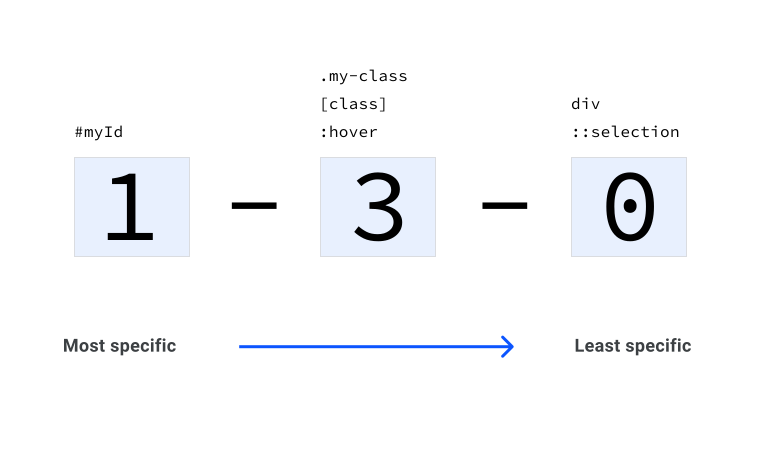

# Специфичность

<big>В данном модуле более подробно рассматривается **специфичность**, являющаяся ключевой частью каскада.</big>

!!!info "CSS подкаст"

    003: Специфичность

    <audio style="width: 100%;" controls src="/learn/css3/specificity.en.mp3"></audio>

Предположим, что вы работаете со следующими HTML и CSS:

```html
<button class="branding">Hello, Specificity!</button>
```

---

```css
button {
    color: red;
}

.branding {
    color: blue;
}
```

Здесь действуют два конкурирующих правила. Одно из них окрашивает кнопку в красный цвет, а другое — в синий. Какое правило будет применено к элементу? Понимание алгоритма спецификации CSS, касающегося специфичности, является ключом к пониманию того, как CSS принимает решение между конкурирующими правилами.

Специфичность — это один из четырех отдельных этапов каскада, который рассматривался в предыдущем модуле, на [the cascade](the-cascade.md).

<iframe src="https://codepen.io/web-dot-dev/embed/YzNKMXm?height=200&amp;theme-id=light&amp;default-tab=result&amp;editable=true" style="height: 500px; width: 100%; border: 0;" loading="lazy"></iframe>

## Оценка специфичности

Каждое правило селектора оценивается в баллах. Специфичность можно представить как общий балл, и каждый тип селектора зарабатывает очки для этого балла. Побеждает тот селектор, который набрал наибольшее количество баллов.

При использовании специфичности в реальном проекте необходимо соблюдать баланс, чтобы правила CSS, которые вы ожидаете применить, действительно _применялись_, но при этом баллы должны быть низкими, чтобы избежать сложностей. Оценка должна быть настолько высокой, насколько это необходимо, а не стремиться к максимально возможной. В будущем может потребоваться применение действительно более важных CSS. Если вы будете стремиться к максимальной оценке, то затрудните эту работу.

## Оценка каждого типа селектора

Каждый тип селектора зарабатывает баллы. Все эти баллы суммируются, чтобы вычислить общую специфичность селектора.

### Универсальный селектор

[Универсальный селектор](https://developer.mozilla.org/docs/Web/CSS/Universal_selectors) (`*`) не имеет **специфичности** и получает **0 баллов**. Это означает, что любое правило, имеющее 1 или более баллов, будет его отменять

```css
* {
    color: red;
}
```

### Селектор элемента или псевдоэлемента

Селектор [элемента](https://developer.mozilla.org/docs/Web/CSS/Type_selectors) (тип) или [псевдо-элемента](https://developer.mozilla.org/docs/Web/CSS/Pseudo-elements) получает **1 балл специфичности**.

#### Селектор типа

```css
div {
    color: red;
}
```

#### Селектор псевдо-элемента

```css
::selection {
    color: red;
}
```

### Селектор класса, псевдокласса или атрибута

Селектор [класса](https://developer.mozilla.org/docs/Web/CSS/Class_selectors), [псевдо-класса](https://developer.mozilla.org/docs/Web/CSS/Pseudo-classes) или [атрибута](https://developer.mozilla.org/docs/Web/CSS/Attribute_selectors) получает **10 баллов специфичности**.

#### Селектор класса

```css
.my-class {
    color: red;
}
```

#### Селектор псевдокласса

```css
:hover {
    color: red;
}
```

#### Селектор атрибутов

```css
[href='#'] {
    color: red;
}
```

Сам по себе псевдокласс [`:not()`](../../css/not.md) ничего не добавляет к вычислению специфичности. Однако селекторы, переданные в качестве аргументов, добавляются к вычислению специфичности.

```css
div:not(.my-class) {
    color: red;
}
```

Этот пример будет иметь **11 баллов** специфичности, поскольку в нем есть один селектор типа (`div`) и один класс _внутри_ `:not()`.

### Селектор ID

Селектор [ID](https://developer.mozilla.org/docs/Web/CSS/ID_selectors) получает **100 баллов специфичности**, если используется селектор ID (`#myID`), а не селектор атрибутов (`[id="myID"]`).

```css
#myID {
    color: red;
}
```

### Атрибут inline style

CSS, применяемый непосредственно к атрибуту `style` элемента HTML, получает оценку **специфичности в 1 000 баллов**. Это означает, что для того, чтобы переопределить его в CSS, необходимо написать очень специфический селектор.

```html
<div style="color: red"></div>
```

### `!important` правило

Наконец, `!important` в конце CSS-значения получает оценку специфичности **10 000 баллов**. Это максимальная специфичность, которую может получить один отдельный элемент.

Правило `!important` применяется к CSS-свойству, поэтому все элементы правила в целом (селектор и свойства) не получают одинакового балла специфичности.

```css
.my-class {
    color: red !important; /* 10,000 points */
    background: white; /* 10 points */
}
```

## Специфичность в контексте

Специфичность каждого селектора, соответствующего элементу, суммируется. Рассмотрим пример HTML:

```html
<a class="my-class another-class" href="#">A link</a>
```

Эта ссылка имеет два класса. Добавьте следующий CSS, и она получит **1 балл специфичности**:

```css
a {
    color: red;
}
```

Обратитесь к одному из классов в этом правиле, теперь он имеет **11 баллов специфичности**:

```css
a.my-class {
    color: green;
}
```

Добавьте к селектору другой класс, теперь он имеет **21 балл специфичности**:

```css
a.my-class.another-class {
    color: rebeccapurple;
}
```

Добавьте в селектор атрибут `href`, теперь он имеет **31 балл специфичности**:

```css
a.my-class.another-class[href] {
    color: goldenrod;
}
```

Наконец, добавьте ко всему этому псевдокласс `:hover`, и селектор получит **41 балл специфичности**:

```css
a.my-class.another-class[href]:hover {
    color: lightgrey;
}
```

## Визуализация специфичности

В диаграммах и калькуляторах специфичности специфичность часто визуализируется следующим образом:



Левая группа — это селекторы `id`. Вторая группа — селекторы классов, атрибутов и псевдоклассов. Последняя группа — селекторы элементов и псевдоэлементов.

В качестве примера можно привести следующий селектор `0-4-1`:

```css
a.my-class.another-class[href]:hover {
    color: lightgrey;
}
```

## Прагматическое увеличение специфичности

Допустим, у нас есть некий CSS, который выглядит следующим образом:

```css
.my-button {
    background: blue;
}

button[onclick] {
    background: grey;
}
```

В HTML это выглядит следующим образом:

```html
<button class="my-button" onclick="alert('hello')">
    Click me
</button>
```

<iframe src="https://codepen.io/web-dot-dev/embed/abpoxdR?height=500&amp;theme-id=light&amp;default-tab=css%2Cresult&amp;editable=true" style="height: 500px; width: 100%; border: 0;" loading="lazy"></iframe>

Кнопка имеет серый фон, поскольку второй селектор набирает **11 баллов специфичности** (`0-1-1`). Это связано с тем, что он имеет один селектор типа (`button`), что составляет **1 балл**, и селектор атрибута (`[onclick]`), что составляет **10 баллов**.

Предыдущее правило — `.my-button` — получает **10 баллов** (`0-1-0`), поскольку имеет один селектор класса.

Если вы хотите усилить это правило, повторите селектор класса следующим образом:

```css
.my-button.my-button {
    background: blue;
}

button[onclick] {
    background: grey;
}
```

<iframe src="https://codepen.io/web-dot-dev/embed/zYNOXBJ?height=500&amp;theme-id=light&amp;default-tab=css%2Cresult&amp;editable=true" style="height: 500px; width: 100%; border: 0;" loading="lazy"></iframe>

Теперь кнопка будет иметь синий фон, поскольку новый селектор получил оценку специфичности **20 баллов** (`0-2-0`).

!!!note ""

    Если вы обнаружили, что вам часто приходится увеличивать специфичность, это может свидетельствовать о том, что вы пишете слишком специфичные селекторы. Подумайте, можно ли изменить CSS так, чтобы уменьшить специфичность других селекторов, чтобы избежать этой проблемы.

## При совпадении показателей специфичности побеждает новейший экземпляр.

Оставим пока пример с кнопкой и изменим CSS следующим образом:

```css
.my-button {
    background: blue;
}

[onclick] {
    background: grey;
}
```

Кнопка имеет серый фон, поскольку **обои селекторы имеют одинаковую оценку специфичности** (`0-1-0`).

<iframe src="https://codepen.io/web-dot-dev/embed/zYNOXKJ?height=500&amp;theme-id=light&amp;default-tab=css%2Cresult&amp;editable=true" style="height: 500px; width: 100%; border: 0;" loading="lazy"></iframe>

Если поменять местами правила в исходном порядке, то кнопка станет синей.

```css
[onclick] {
    background: grey;
}

.my-button {
    background: blue;
}
```

<iframe src="https://codepen.io/web-dot-dev/embed/WNReWRO?height=500&amp;theme-id=light&amp;default-tab=css%2Cresult&amp;editable=true" style="height: 500px; width: 100%; border: 0;" loading="lazy"></iframe>

Это единственный случай, когда новый CSS выигрывает. Для этого он должен соответствовать специфике другого селектора, нацеленного на тот же элемент.

## Ресурсы

-   [CSS SpeciFISHity](http://specifishity.com)
-   [Калькулятор специфичности](https://specificity.keegan.st)
-   [MDN Specificity](https://developer.mozilla.org/docs/Web/CSS/Specificity)
-   [Специфика CSS-специфичности](https://css-tricks.com/specifics-on-css-specificity/)
-   [Еще один калькулятор специфичности](https://polypane.app/css-specificity-calculator)

:information_source: Источник: [Specificity](https://web.dev/learn/css/specificity/)
