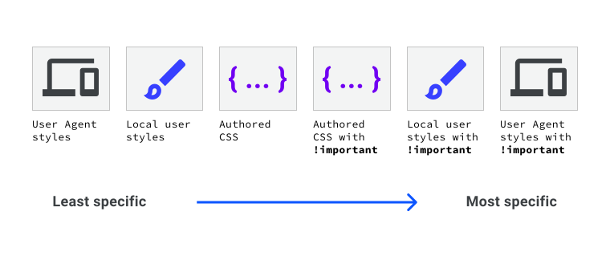
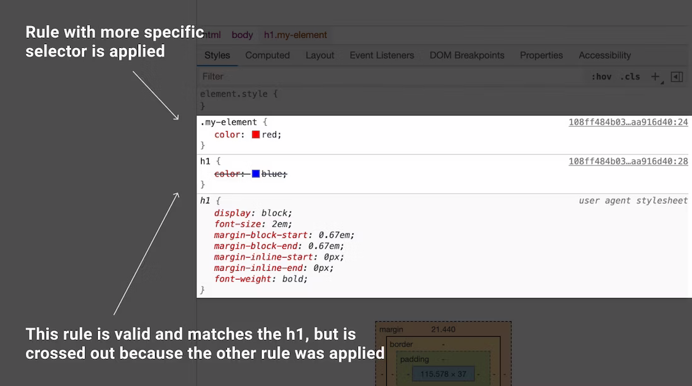

# Каскад

<big>Иногда к элементу могут применяться два или более конкурирующих CSS-правил. В этом модуле вы узнаете, как браузер выбирает, какое из них использовать, и как управлять этим выбором.</big>

!!!info "CSS подкаст"

    004: Каскад

    === "Перевод на русский"

    	<audio style="width: 100%;" controls src="/learn/css3/the-cascade.ru.mp3"></audio>

    === "Английский оригинал"

    	<audio style="width: 100%;" controls src="/learn/css3/the-cascade.en.ogg"></audio>

CSS расшифровывается как Cascading Stylesheets (каскадные таблицы стилей). Каскад — это алгоритм разрешения конфликтов, когда к элементу HTML применяется несколько правил CSS. Именно благодаря ему текст кнопки, стилизованной с помощью следующего CSS, будет синим.

```css
button {
    color: red;
}

button {
    color: blue;
}
```

<iframe src="https://codepen.io/web-dot-dev/embed/GRrgMOm?height=200&amp;theme-id=light&amp;default-tab=result&amp;editable=true" style="height: 500px; width: 100%; border: 0;" loading="lazy"></iframe>

Понимание каскадного алгоритма помогает понять, как браузер разрешает подобные конфликты. Каскадный алгоритм состоит из 4 отдельных этапов.

1.  **Положение и порядок появления**: порядок появления ваших CSS-правил
2.  **Специфичность**: алгоритм, определяющий, какой CSS-селектор имеет наиболее сильное соответствие
3.  **Оригинал**: порядок появления CSS и то, откуда он берется, будь то стиль браузера, CSS из расширения браузера или ваш авторский CSS.
4.  **Важность**: некоторые правила CSS имеют больший вес, чем другие, особенно правило типа `!important`.

## Позиция и порядок отображения

Порядок появления ваших CSS-правил и их расположение учитываются каскадом при расчете разрешения конфликтов.

Демонстрация в начале этого урока является наиболее простым примером позиционирования. Есть два правила, которые имеют селекторы одинаковой специфики, поэтому побеждает то, которое было объявлено последним.

Стили могут поступать из различных источников на HTML-странице, таких как тег `<link>`, встроенный тег `<style>`, а также встроенный CSS, заданный в атрибуте `style` элемента.

Если в верхней части HTML-страницы имеется `<link>`, содержащий CSS, а в нижней — другой `<link>`, содержащий CSS: нижний `<link>` будет обладать наибольшей специфичностью. То же самое происходит и со встроенными элементами `<style>`. Они становятся тем более конкретными, чем ниже по странице они находятся.

<iframe src="https://codepen.io/web-dot-dev/embed/NWdPaWv?height=500&amp;theme-id=light&amp;default-tab=result&amp;editable=true" style="height: 500px; width: 100%; border: 0;" loading="lazy"></iframe>
<figure>
<figcaption markdown>Кнопка имеет синий фон, как определено в CSS, который включен элементом `<link />`. CSS-правило, устанавливающее темный фон, находится во второй связанной таблице стилей и применяется из-за более позднего расположения.</figcaption>
</figure>

Этот порядок распространяется и на встроенные элементы `<style>`. Если они объявлены перед `<link>`, то CSS связанной таблицы стилей будет иметь наибольшую специфику.

<iframe src="https://codepen.io/web-dot-dev/embed/xxgbLoB?height=500&amp;theme-id=light&amp;default-tab=result&amp;editable=true" style="height: 500px; width: 100%; border: 0;" loading="lazy"></iframe>
<figure>
<figcaption markdown>Элемент `<style>` объявляется в `<head>`, а элемент `<link />` — в `<body>`. Это означает, что он получает больше конкретики, чем элемент `<style>`.</figcaption>
</figure>

Встроенный атрибут `style` с объявленным в нем CSS будет иметь приоритет над всеми остальными CSS, независимо от его позиции, если только в объявлении не определено значение `!important`.

Позиция также применяется в порядке следования CSS-правил. В данном примере элемент будет иметь пурпурный фон, поскольку `background: purple` был объявлен последним. Поскольку зеленый фон был объявлен раньше пурпурного, он теперь игнорируется браузером.

```css
.my-element {
    background: green;
    background: purple;
}
```

Возможность указать два значения для одного и того же свойства может быть простым способом создания резервных копий для браузеров, не поддерживающих определенное значение. В следующем примере `font-size` объявляется дважды. Если `clamp()` поддерживается браузером, то предыдущее объявление `font-size` будет отменено. Если `clamp()` не поддерживается браузером, то первоначальное объявление будет выполнено, и размер шрифта будет равен `1.5rem`.

```css
.my-element {
    font-size: 1.5rem;
    font-size: clamp(1.5rem, 1rem + 3vw, 2rem);
}
```

<iframe src="https://codepen.io/web-dot-dev/embed/xxgbPMP?height=500&amp;theme-id=light&amp;default-tab=result&amp;editable=true" style="height: 500px; width: 100%; border: 0;" loading="lazy"></iframe>

!!!note ""

    Такой подход к объявлению одного и того же свойства дважды работает потому, что браузеры игнорируют непонятные им значения. В отличие от некоторых других языков программирования, CSS не выдает ошибку и не нарушает работу программы, когда обнаруживает строку, которую не может разобрать — значение, которое не может разобрать, является недопустимым и поэтому игнорируется. Браузер продолжает обрабатывать остальную часть CSS, не нарушая того, что он уже понял.

## Специфичность

Специфичность — это алгоритм, который определяет, какой CSS-селектор является наиболее специфичным, используя для этого весовую или балльную систему расчетов. Сделав правило более специфичным, можно добиться того, что оно будет применяться даже в том случае, если в CSS появится другой CSS, соответствующий селектору.

В [следующем уроке](specificity.md) вы сможете узнать подробности о том, как рассчитывается специфичность, однако соблюдение нескольких правил поможет вам избежать слишком частых проблем со специфичностью.

CSS, нацеленный на класс элемента, делает это правило более специфичным, а значит, и более важным для применения, чем CSS, нацеленный только на элемент. Это означает, что при использовании следующего CSS элемент `h1` будет окрашен в красный цвет, даже если оба правила совпадают и правило для селектора `h1` находится позже в таблице стилей.

```html
<h1 class="my-element">Heading</h1>
```

---

```css
.my-element {
    color: red;
}

h1 {
    color: blue;
}
```

Идентификатор `id` делает CSS еще более конкретным, поэтому стили, примененные к идентификатору, будут отменять стили, примененные другими способами. Это одна из причин, по которой обычно не стоит привязывать стили к `id`. Это может затруднить перезапись стиля чем-то другим.

### Специфичность имеет кумулятивный характер

Как вы узнаете из следующего урока, каждому типу селектора присваиваются баллы, которые показывают, насколько он специфичен. Баллы за все селекторы, которые вы использовали для выделения элемента, суммируются. Это означает, что при нацеливании элемента с помощью списка селекторов типа `a.my-class.another-class[href]:hover` вы получите нечто, что будет довольно сложно переписать с помощью других CSS. По этой причине, а также для того, чтобы сделать CSS более пригодным для повторного использования, рекомендуется максимально упростить селекторы. Используйте специфику как инструмент для получения доступа к элементам, когда это необходимо, но всегда рассматривайте возможность рефакторинга длинных специфических списков селекторов, если это возможно.

## Origin

Написанный вами CSS — это не единственный CSS, применяемый к странице. Каскад учитывает происхождение CSS. К ним относятся внутренняя таблица стилей браузера, стили, добавленные расширениями браузера или операционной системой, и ваш авторский CSS. Порядок специфичности этих источников, от наименее специфичных до наиболее специфичных, следующий:

1.  **Базовые стили пользовательского агента**. Это стили, которые браузер применяет к HTML-элементам по умолчанию.
2.  **Локальные стили пользователя**. Они могут быть заложены на уровне операционной системы, например, базовый размер шрифта или предпочтение уменьшенного движения. Они также могут быть получены из расширений браузера, например, из расширения, позволяющего пользователю написать собственный пользовательский CSS для веб-страницы.
3.  **Авторский CSS**. CSS, автором которого являетесь вы.
4.  **Авторские `!important`**. Любые `!important`, которые вы добавляете к своим авторским декларациям.
5.  **Локальные пользовательские стили `!important`**. Любые `!important`, которые поступают с уровня операционной системы или CSS уровня расширения браузера.
6.  **Агент пользователя `!important`**. Любые `!important`, которые определены в CSS по умолчанию, предоставляемом браузером.



Если у вас есть тип правила `!important` в CSS, автором которого вы являетесь, а у пользователя есть тип правила `!important` в его пользовательском CSS, то чей CSS победит?

## Важность

Не все правила CSS вычисляются одинаково или имеют одинаковую важность.

Порядок **важности**, от наименее важного к наиболее важному, следующий:

1.  обычный тип правила, например, `font-size`, `background` или `color`.
2.  Тип правила `animation`
3.  Тип правила `!important` (в том же порядке, что и в оригинале)
4.  Тип правила `transition`

Активные типы правил анимации и перехода имеют более высокую важность, чем обычные правила. В случае переходов более высокую важность имеют типы правил `!important`. Это связано с тем, что когда анимация или переход становятся активными, их ожидаемое поведение заключается в изменении визуального состояния.

## Использование DevTools для выяснения причин неприменения некоторых CSS

Браузерные DevTools обычно показывают все CSS, которые могут соответствовать элементу, с вычеркиванием тех, которые не используются.



Если CSS, который вы ожидали применить, вообще не появляется, значит, он не соответствует элементу. В этом случае необходимо искать другое место, возможно, опечатку в имени класса или элемента или недопустимый CSS.

## Ресурсы

-   [Интерактивное объяснение каскада](https://wattenberger.com/blog/css-cascade)
-   [Ссылка на каскад в MDN](https://developer.mozilla.org/docs/Learn/CSS/Building_blocks/Cascade_and_inheritance)

:material-information-outline: Источник: [The cascade](https://web.dev/learn/css/the-cascade/)
