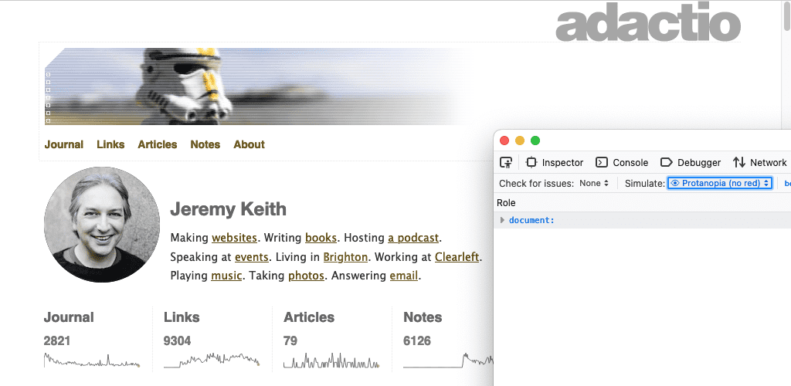
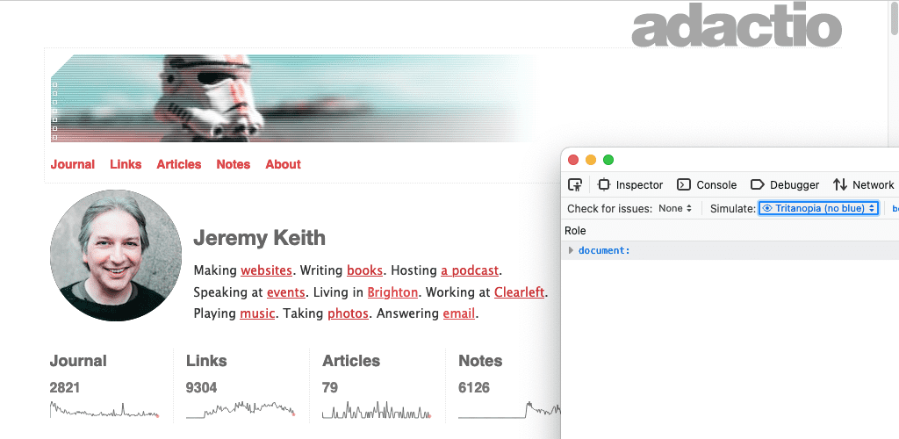
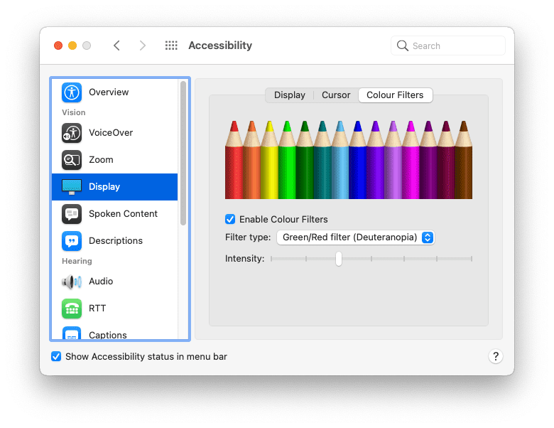
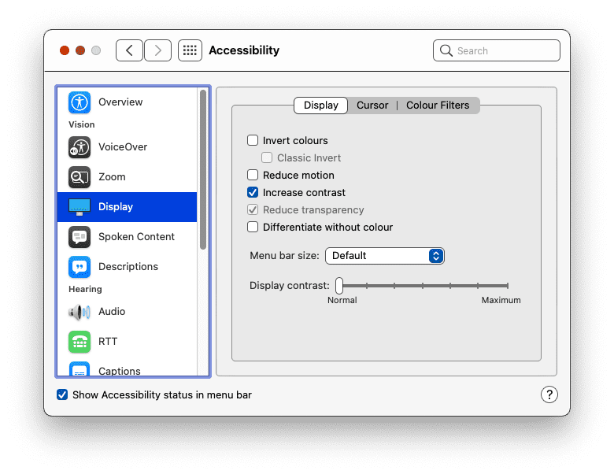
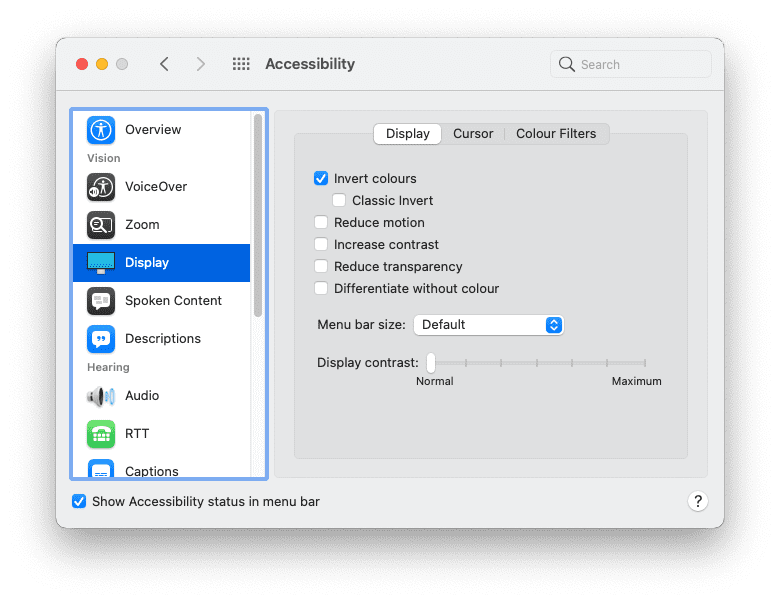
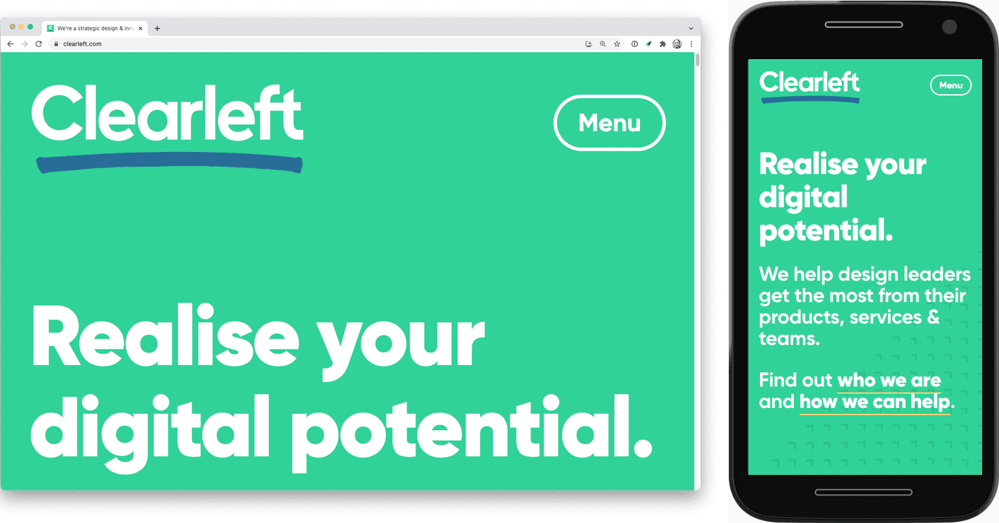

# Доступность

Возможность адаптации страниц к различным размерам экрана - это лишь один из способов обеспечить доступность сайта для максимального числа пользователей. Следует учитывать и другие факторы.

## Дефицит цветового зрения

Разные люди воспринимают цвет по-разному. Люди с протанопией не воспринимают красный цвет как отдельный цвет. При дейтеранопии отсутствует зеленый цвет. Для людей с тританопией - синий.

Некоторые инструменты могут дать общее представление о том, как ваши цветовые схемы выглядят для людей с различными типами цветового зрения.

На вкладке [Firefox's Accessibility tab](https://developer.mozilla.org/docs/Tools/Accessibility_inspector/Simulation) есть выпадающий список **Simulate** со списком опций.

<figure>


<figcaption>Просмотр сайта с имитацией различных видов цветового зрения.</figcaption>
</figure>

В Chrome DevTools вкладка рендеринга позволяет [эмулировать недостатки зрения](https://developer.chrome.com/blog/new-in-devtools-83/#vision-deficiencies).

Это специфические для браузера инструменты. Эмулировать различные типы зрения можно и на уровне операционной системы.

На компьютере Mac перейдите в меню:

1.  Системные настройки
2.  Accessibility
3.  Дисплей
4.  Цветовые фильтры
5.  Включить цветовые фильтры

Выберите один из вариантов.



В общем случае не стоит полагаться только на цвет для различения различных элементов. Например, ссылки можно и нужно выделять цветом, отличным от цвета окружающего текста. Но при этом следует использовать и другие стилистические признаки, например, подчеркивание ссылок или выделение их жирным шрифтом.

:material-thumb-down:{: style="color: red"} Плохо

```css
a {
    color: red;
}
```

:material-thumb-up:{: style="color: green"} Хорошо

```css
a {
    color: red;
    font-weight: bold;
}
```

## Цветовой контраст

Некоторые сочетания цветов могут вызывать проблемы. При недостаточном контрасте между цветом переднего плана и цветом фона текст становится трудночитаемым. Плохой цветовой контраст - одна из наиболее распространенных проблем с доступностью в Интернете, но, к счастью, ее можно выявить на ранних этапах проектирования.

Вот несколько инструментов, которые можно использовать для проверки контрастности цвета текста и фона:

-   [tota11y](https://khan.github.io/tota11y/) - букмарклет, который можно добавить на панель инструментов браузера.
-   [VisBug](https://github.com/GoogleChromeLabs/ProjectVisBug) - расширение браузера, доступное для всех основных настольных браузеров.
-   [Инспектор доступности Firefox](https://developer.mozilla.org/docs/Tools/Accessibility_inspector) позволяет проверить наличие проблем с визуальным контрастом.
-   Также можно [обнаружить и исправить малоконтрастный текст с помощью Chrome DevTools](https://developers.google.com/codelabs/devtools-cvd).
-   В браузере Edge компании Microsoft можно [проверить контрастность цвета текста с помощью цветового фильтра](https://docs.microsoft.com/en-us/microsoft-edge/devtools-guide-chromium/accessibility/color-picker).

В CSS рекомендуется всегда объявлять `color` и `background-color` вместе. Не предполагайте, что цвет фона будет использоваться браузером по умолчанию. Люди могут изменять цвета, используемые их браузером.

:material-thumb-down:{: style="color: red"} Плохо

```css
body {
    color: black;
}
```

:material-thumb-up:{: style="color: green"} Хорошо

```css
body {
    color: black;
    background-color: white;
}
```

## Высокая контрастность

Некоторые пользователи устанавливают в своих операционных системах высококонтрастный режим. Вы можете попробовать сделать это в своей операционной системе.

На компьютере Mac перейдите в:

1.  Системные настройки
2.  Доступность
3.  Дисплей

Выберите опцию для увеличения контрастности.



Существует медиафункция, позволяющая определить, включен ли у пользователя режим высокой контрастности. Функция [`prefers-contrast`](https://developer.mozilla.org/docs/Web/CSS/@media/prefers-contrast) может быть запрошена для трех значений: `no-preference`, `less` и `more`. Эту информацию можно использовать для настройки цветовой палитры сайта.

<iframe allow="camera; clipboard-read; clipboard-write; encrypted-media; geolocation; microphone; midi;" loading="lazy" src="https://codepen.io/web-dot-dev/embed/abLBaya?height=500&amp;theme-id=dark&amp;default-tab=css%2Cresult&amp;editable=true" style="height: 500px; width: 100%; border: 0;" data-title="Pen abLBaya by web-dot-dev on Codepen"></iframe>

!!!note ""

    [Пользовательские свойства CSS](https://developer.mozilla.org/docs/Web/CSS/Using_CSS_custom_properties) - это отличный способ группировки цветовых деклараций. Для обновления значений пользовательских свойств используйте мультимедийную функцию `prefers-contrast`.

Люди также могут установить в своей операционной системе предпочтение для использования инвертированных цветов.

На компьютере Mac перейдите в меню:

1.  Системные настройки
2.  Accessibility
3.  Отображение

Выберите опцию инвертирования цветов.



Убедитесь, что ваш сайт по-прежнему понятен для пользователей, просматривающих его с инвертированными цветами. Обратите внимание на бокс-тени - при инвертировании цветов они могут нуждаться в корректировке.

## Размер шрифта

Цвет - это не единственное, что люди могут настроить в своем браузере, они также могут настроить размер шрифта по умолчанию. По мере ухудшения зрения люди могут изменять размер шрифта по умолчанию в своих браузерах или операционных системах, увеличивая его с годами.

В ответ на эти настройки можно использовать относительные размеры шрифта. Избегайте использования таких единиц, как `px`. Вместо этого используйте относительные единицы, такие как `rem` или `ch`.

Попробуйте изменить настройки размера текста по умолчанию в браузере. Это можно сделать в настройках браузера. Также это можно сделать во время просмотра веб-страницы, увеличив ее масштаб. Будет ли ваш сайт работать, если [размер шрифта по умолчанию увеличить на 200%](https://www.w3.org/WAI/WCAG21/Understanding/resize-text.html)? А как насчет 400%?

Тот, кто посещает ваш сайт на настольном компьютере с увеличенным до 400% размером шрифта, должен получить такое же оформление, как и тот, кто посещает ваш сайт на устройстве с маленьким экраном.

<figure>

<figcaption>Один и тот же сайт на настольном и мобильном устройствах. Размер шрифта в настольном браузере увеличен до 400%.</figcaption>
</figure>

## Клавиатурная навигация

Не все пользуются мышью или трекпадом для навигации по веб-страницам. Клавиатура - еще один способ перемещения по странице, причем особенно удобна клавиша `tab`. Пользователи могут быстро переходить от одной ссылки или поля формы к другой.

Ссылки, стилизованные с помощью [псевдоклассов `:hover` и `:focus`](../css3/pseudo-classes.md), будут отображаться в этих стилях независимо от того, использует ли пользователь мышь, трекпад или клавиатуру. Используйте [псевдокласс `:focus-visible`](../css3/pseudo-classes.md) для стилизации ссылок только для клавиатурной навигации. Вы можете сделать эти стили более заметными.

```css
a:focus,
a:hover {
    outline: 1px dotted;
}
a:focus-visible {
    outline: 3px solid;
}
```

<iframe allow="camera; clipboard-read; clipboard-write; encrypted-media; geolocation; microphone; midi;" loading="lazy" src="https://codepen.io/web-dot-dev/embed/wvroErW?height=400&amp;theme-id=dark&amp;default-tab=result&amp;editable=true" style="height: 400px; width: 100%; border: 0;" data-title="Pen wvroErW by web-dot-dev on Codepen"></iframe>

По мере того как пользователь переходит от ссылки к ссылке или от поля формы к полю формы, эти элементы будут фокусироваться в порядке их появления в структуре документа. Это также должно соответствовать визуальному порядку.

Будьте осторожны со свойством CSS `order`. Его можно использовать в сочетании с flexbox и grid для размещения элементов в визуальном порядке, отличном от их порядка в HTML. Это мощная функция, но она может сбить с толку людей, пользующихся клавиатурой.

<iframe allow="camera; clipboard-read; clipboard-write; encrypted-media; geolocation; microphone; midi;" loading="lazy" src="https://codepen.io/web-dot-dev/embed/XWeNPeY?height=400&amp;theme-id=dark&amp;default-tab=result&amp;editable=true" style="height: 400px; width: 100%; border: 0;" data-title="Pen XWeNPeY by web-dot-dev on Codepen"></iframe>

Протестируйте свои веб-страницы, используя клавишу `tab` на клавиатуре, чтобы убедиться, что порядок табуляции имеет смысл.

В панели **Accessibility** инструментов разработчика браузера Firefox есть опция **Show Tabbing Order**. При ее включении на каждый фокусируемый элемент будут накладываться цифры.


!!!note ""

    Подробнее о проблемах, вызванных использованием [content reordering](https://web.dev/articles/content-reordering).

## Уменьшение анимации

Анимация и динамика - прекрасные способы оживить веб-дизайн. Однако для некоторых людей эти движения могут быть очень дезориентирующими и даже вызывать тошноту.

Существует запрос функции, который сообщает, предпочитает ли пользователь меньше движений. Он называется [`prefers-reduced-motion`](https://web.dev/articles/prefers-reduced-motion). Включите его везде, где используются CSS-переходы или анимация.

```css
a:hover {
    transform: scale(150%);
}
@media (prefers-reduced-motion: no-preference) {
    a {
        transition-duration: 0.4s;
        transition-property: transform;
    }
}
```

Медиазапрос `prefers-reduced-motion` предназначен специально для движения на экране. Если вы используете переходы по цвету элемента, то `prefers-reduced-motion` не должен влиять на это. Это также нормально для переходов непрозрачности и перекрестного затухания. Уменьшение движения не обязательно означает отсутствие анимации.

## Голос

Люди воспринимают веб-страницы по-разному. Не все видят ваш сайт на экране. Вспомогательные технологии, такие как программы чтения с экрана, преобразуют информацию, выводимую на экран, в устные слова.

Программы чтения с экрана работают со всеми видами приложений, включая веб-браузеры. Для того чтобы веб-браузер мог эффективно взаимодействовать с программой чтения с экрана, необходимо, чтобы на веб-странице, к которой осуществляется доступ, была полезная семантическая информация.

Ранее вы узнали, что кнопки [icon-only buttons](icons.md) должны содержать атрибут, указывающий на назначение кнопки для незрячих пользователей. Это лишь один из примеров важности сильного фундаментального HTML.

## Заголовки

Используйте заголовки типа `<h1>`, `<h2>`, `<h3>` и т.д. с умом. Программы чтения с экрана используют эти заголовки для создания контура документа, по которому можно перемещаться с помощью сочетаний клавиш.

:material-thumb-down:{: style="color: red"} Плохо

```html
<div class="heading-main">Welcome to my page</div>
<div class="heading-secondary">About me</div>
<div class="heading-tertiary">My childhood</div>
<div class="heading-secondary">About this website</div>
<div class="heading-tertiary">How this site was built</div>
```

:material-thumb-up:{: style="color: green"} Хорошо

```html
<h1>Welcome to my page</h1>
<h2>About me</h2>
<h3>My childhood</h3>
<h2>About this website</h2>
<h3>How this site was built</h3>
```

## Структура

Для структурирования содержимого страницы используйте такие элементы-земли, как `<main>`, `<nav>`, `<aside>`, `<header>` и `<footer>`. Пользователи устройств чтения с экрана могут сразу перейти к этим элементам.

:material-thumb-down:{: style="color: red"} Плохо

```html
<div class="header">...</div>
<div class="navigation">...</div>
<div class="maincontent">...</div>
<div class="sidebar">...</div>
<div class="footer">...</div>
```

:material-thumb-up:{: style="color: green"} Хорошо

```html
<header>...</header>
<nav>...</nav>
<main>...</main>
<aside>...</aside>
<footer>...</footer>
```

## Формы

Убедитесь, что каждое поле формы имеет соответствующий элемент `<label>`. Вы можете связать метку с полем формы, используя атрибут `for` на элементе `<label>` и соответствующий атрибут `id` на поле формы.

:material-thumb-down:{: style="color: red"} Плохо

```html
<span class="formlabel">Your name</span>
<input type="text" />
```

:material-thumb-up:{: style="color: green"} Хорошо

```html
<label for="name">Your name</label>
<input id="name" type="text" />
```

!!!note ""

    Дополнительную информацию о доступности и формах см. в разделе [Модуль Accessibility в курсе Learn Forms](../forms/accessibility.md).

## Изображения

Всегда указывайте текстовое описание изображений с помощью атрибута `alt`.

:material-thumb-down:{: style="color: red"} Плохо

```html

```

:material-thumb-up:{: style="color: green"} Хорошо

```html

```

Если изображение носит чисто презентационный характер, то атрибут `alt` все равно следует включить, но можно дать ему пустое значение.

:material-thumb-down:{: style="color: red"} Плохо

```html

```

:material-thumb-up:{: style="color: green"} Хорошо

```html

```

Джейк Арчибальд опубликовал статью о [написании отличного `alt` текста](https://jakearchibald.com/2021/great-alt-text/).

## Ссылки

Старайтесь давать описательный текст в ссылках. Избегайте использования фраз типа "щелкните здесь" или "еще".

:material-thumb-down:{: style="color: red"} Плохо

```html
<p>
    To find out more about our latest offers,
    <a href="offers.html">click here</a>.
</p>
```

:material-thumb-up:{: style="color: green"} Хорошо

```html
<p>
    Find out more about
    <a href="offers.html"> our latest offers</a>.
</p>
```

## ARIA

Использование разумного семантического HTML сделает ваши веб-страницы более доступными для вспомогательных технологий, таких как программы чтения с экрана, а также для других аудиосредств, например голосовых помощников.

Некоторые виджеты интерфейса, не имеющие соответствующего HTML-элемента: карусели, вкладки, аккордеоны и т.д. Их необходимо создавать с нуля, используя комбинацию HTML, CSS, JavaScript и ARIA.

ARIA расшифровывается как Accessible Rich Internet Applications. Ее словарь позволяет предоставлять семантическую информацию, когда нет подходящего элемента HTML.

Если вам необходимо создать элементы интерфейса, которые еще не доступны в виде HTML-элементов, [ознакомьтесь с ARIA](https://developer.mozilla.org/docs/Learn/Accessibility/WAI-ARIA_basics).

Чем больше пользовательских функций вы добавляете с помощью JavaScript, тем больше вам потребуется знаний ARIA. Если вы придерживаетесь собственных элементов HTML, то ARIA вам может и не понадобиться.

Если есть возможность, проведите тестирование на реальных пользователях устройств чтения с экрана. Это не только позволит вам лучше понять, как они работают в Интернете, но и избавит вас от необходимости гадать, как разработать сайт с учетом требований доступности.

Тестирование на реальных людях - отличный способ выявить все предположения, которые вы можете сделать. В следующем модуле вы узнаете о различных способах взаимодействия людей с веб-сайтами - еще одна область, где очень легко сделать предположения.
