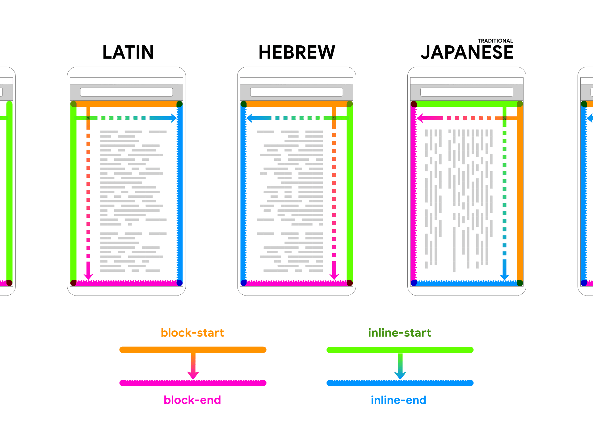

# Интернационализация

Всемирная паутина доступна всем в мире - это следует из ее названия! Это означает, что ваш сайт потенциально может быть доступен любому человеку, имеющему доступ к Интернету, независимо от того, где он находится, какое устройство использует и на каком языке говорит.

Цель адаптивного дизайна - сделать ваш контент доступным для всех. Применение той же философии к человеческим языкам является движущей силой интернационализации - подготовки контента и дизайна для международной аудитории.

## Логические свойства

Английский язык написан слева направо и сверху вниз, но не все языки написаны таким образом. Некоторые языки, например арабский и иврит, пишут справа налево, а некоторые японские шрифты пишут вертикально, а не горизонтально. Чтобы учесть эти способы написания, в CSS были введены логические свойства.

Если вы пишете CSS, то, возможно, использовали такие ключевые слова, как "left", "right", "top" и "bottom". Эти ключевые слова относятся к физическому расположению устройства пользователя.

С другой стороны, [Логические свойства](../css3/logical-properties.md) относятся к границам блока, поскольку они связаны с потоком содержимого. При изменении режима записи CSS, написанный с помощью логических свойств, будет обновляться соответствующим образом. С направленными свойствами дело обстоит иначе.

Если направленное свойство `margin-left` всегда относится к левому краю блока содержимого, то логическое свойство `margin-inline-start` относится к левому краю блока содержимого на языке "слева направо" и к правому краю блока содержимого на языке "справа налево".

Для того чтобы дизайн адаптировался к различным режимам письма, избегайте свойств направления. Вместо этого используйте логические свойства.

:material-thumb-down:{: style="color: red"} Плохо

```css
.byline {
    text-align: right;
}
```

:material-thumb-up:{: style="color: green"} Хорошо

```css
.byline {
    text-align: end;
}
```

Когда в CSS задается определенное значение направления, например `left` или `right`, появляется соответствующее логическое свойство. Там, где раньше было `margin-left`, теперь есть `margin-inline-start`.

В таких языках, как английский, где текст идет слева направо, `inline-start` соответствует `left`, а `inline-end` - `right`.

Аналогично, в таком языке, как английский, где текст пишется сверху вниз, `block-start` соответствует `top`, а `block-end` - `bottom`.



Если использовать логические свойства в CSS, то можно использовать одну и ту же таблицу стилей для перевода страниц. Даже если ваши страницы переведены на языки, написанные справа налево или снизу вверх, дизайн будет соответствующим образом адаптирован. Нет необходимости создавать отдельный дизайн для каждого языка. Благодаря использованию логических свойств ваш дизайн будет реагировать на любой способ написания. Это означает, что ваш дизайн сможет охватить большее количество людей, и вам не придется тратить время на создание отдельного дизайна для каждого языка.

Современные методы CSS-верстки, такие как [grid](../css3/grid.md) и [flexbox](../css3/flexbox.md), по умолчанию используют логические свойства. Если вы будете мыслить в терминах `inline-start` и `block-start`, а не `left` и `top`, то вам будет легче понять эти современные методы.

Возьмем такой распространенный шаблон, как [значок рядом с текстом](../css3/logical-properties.md#solving-the-icon-issue) или ярлык рядом с полем формы. Вместо того чтобы думать "метка должна иметь отступ справа", подумайте "метка должна иметь отступ на конце своей линейной оси".

:material-thumb-down:{: style="color: red"} Плохо

```css
label {
    margin-right: 0.5em;
}
```

:material-thumb-up:{: style="color: green"} Хорошо

```css
label {
    margin-inline-end: 0.5em;
}
```

<iframe allow="camera; clipboard-read; clipboard-write; encrypted-media; geolocation; microphone; midi;" loading="lazy" src="https://codepen.io/web-dot-dev/embed/gOxXOLK?height=300&amp;theme-id=dark&amp;default-tab=css%2Cresult&amp;editable=true" style="height: 300px; width: 100%; border: 0;" data-title="Pen gOxXOLK by web-dot-dev on Codepen"></iframe>

Если эта страница будет переведена на язык с правосторонним переводом, то стили обновлять не нужно. Имитировать эффект от просмотра страниц на языке, переведенном справа налево, можно с помощью атрибута `dir` в элементе `html`. Значение `ltr` означает "слева направо". Значение `rtl` означает "справа налево".

<iframe allow="camera; clipboard-read; clipboard-write; encrypted-media; geolocation; microphone; midi;" loading="lazy" src="https://codepen.io/web-dot-dev/embed/mdMqdOx?height=300&amp;theme-id=dark&amp;default-tab=html%2Cresult&amp;editable=true" style="height: 300px; width: 100%; border: 0;" data-title="Pen mdMqdOx by web-dot-dev on Codepen"></iframe>

Если вы хотите поэкспериментировать со всеми вариантами направления документа (ось block) и режимами записи (ось inline), то вот [интерактивная демонстрация](https://codepen.io/argyleink/pen/vYNwbgM).

<iframe allow="camera; clipboard-read; clipboard-write; encrypted-media; geolocation; microphone; midi;" loading="lazy" src="https://codepen.io/argyleink/embed/vYNwbgM?height=800&amp;theme-id=dark&amp;default-tab=result&amp;editable=true" style="height: 800px; width: 100%; border: 0;" data-title="Pen vYNwbgM by argyleink on Codepen"></iframe>

## Определение языка страницы

Для определения языка страницы полезно использовать атрибут `lang` в элементе `html`.

```html
<html lang="en"></html>
```

Этот пример относится к странице на английском языке. Можно быть еще более конкретным. Вот как можно объявить, что страница использует английский язык США:

```html
<html lang="en-us"></html>
```

Объявление языка документа полезно для поисковых систем. Это также полезно для вспомогательных технологий, таких как программы чтения с экрана и голосовые помощники. Предоставляя языковые метаданные, вы помогаете подобным синтезаторам речи правильно произносить содержимое вашего документа.

Атрибут `lang` может использоваться в любом элементе HTML, а не только в `html`. Если вы переключаете язык на своей веб-странице, укажите это изменение. В данном случае одно слово написано на немецком языке:

```html
<p>I felt some <span lang="de">schadenfreude</span>.</p>
```

## Определение языка связанного документа

Существует еще один атрибут `hreflang`, который можно использовать в ссылках. Атрибут `hreflang` использует ту же кодовую нотацию языка, что и атрибут `lang`, и описывает язык ссылающегося документа. Если есть перевод всей страницы на немецкий язык, то ссылка на него выглядит следующим образом:

```html
<a href="/path/to/german/version" hreflang="de"
    >German version</a
>
```

Если вы используете текст на немецком языке для описания ссылки на немецкую версию, используйте `hreflang` и `lang`. Здесь текст "Немецкая версия" помечен как текст на немецком языке, и целевая ссылка также помечена как немецкая:

```html
<a href="/path/to/german/version" hreflang="de" lang="de"
    >Deutsche Version</a
>
```

Также можно использовать атрибут `hreflang` на элементе `link`. Он помещается в `head` документа:

```html
<link
    href="/path/to/german/version"
    rel="alternate"
    hreflang="de"
/>
```

Но в отличие от атрибута `lang`, который может использоваться в любом элементе, `hreflang` может применяться только к элементам `a` и `link`.

## Учитывайте интернационализацию при проектировании

При разработке сайтов, которые будут переводиться на другие языки и способы написания, следует учитывать следующие факторы:

-   В некоторых языках, например в немецком, в обиходе имеются длинные слова. Ваш интерфейс должен быть адаптирован к этим словам, поэтому избегайте создания узких колонок. Вы также можете [использовать CSS для введения дефисов](https://developer.mozilla.org/docs/Web/CSS/hyphens).
-   Убедитесь, что значения `line-height` могут учитывать такие символы, как ударения и другие диакритические знаки. Строки текста, которые хорошо смотрятся на английском языке, могут перекрываться на другом языке.
-   Если вы используете веб-шрифт, убедитесь, что он имеет достаточно широкий набор символов, чтобы охватить все языки, на которые вы будете переводить.
-   Не создавайте изображения, содержащие текст. В противном случае придется создавать отдельные изображения для каждого языка. Вместо этого разделите текст и изображение и используйте CSS для наложения текста на изображение.

## Думайте по-международному

Такие атрибуты, как `lang` и `hreflang`, делают HTML более осмысленным для интернационализации. Аналогично, логические свойства делают CSS более адаптируемым.

Если вы привыкли мыслить в терминах `top`, `bottom`, `left` и `right`, вам может быть трудно начать думать о `block start`, `block end`, `inline start` и `inline end`. Но это того стоит. Логические свойства - это ключ к созданию действительно адаптивных макетов.

Далее вы узнаете, как работать с макетами на уровне страницы, известными также как [макроразметка](macro-layouts.md).
