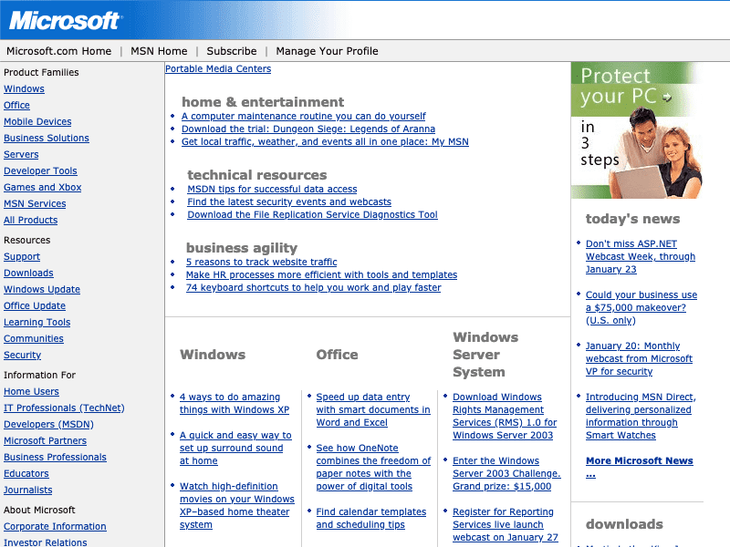
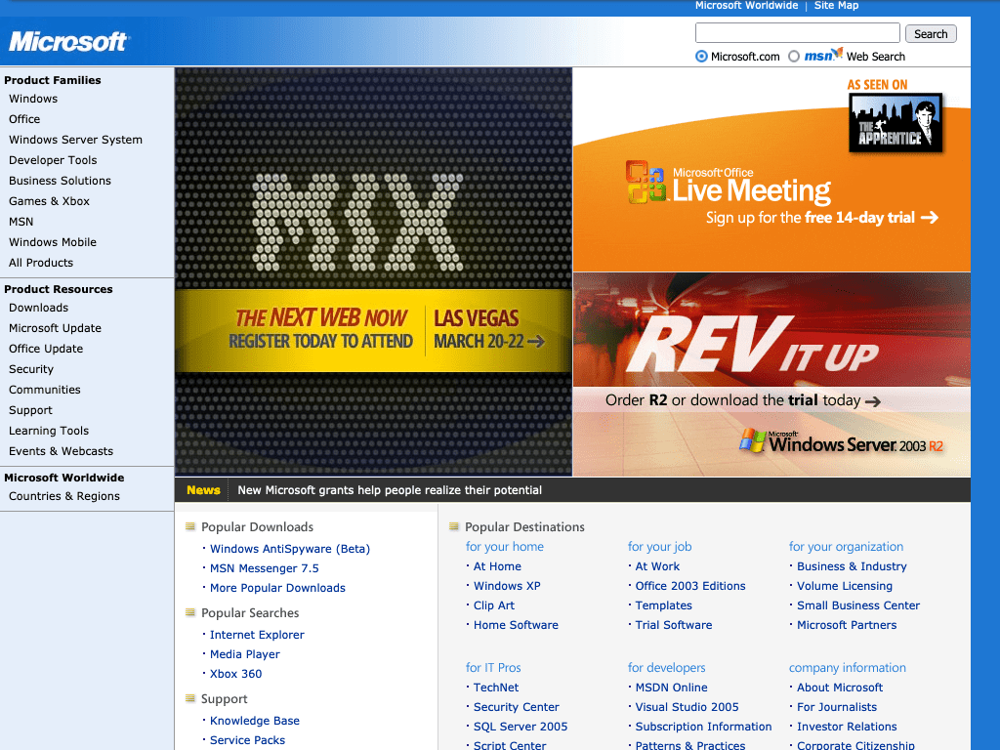
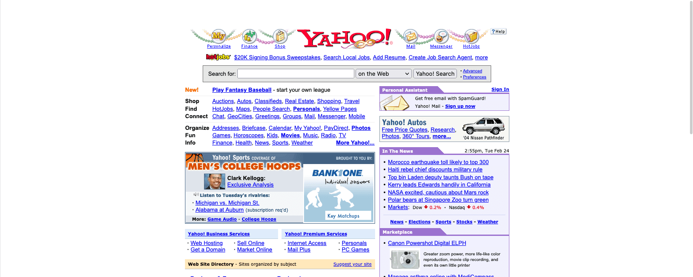
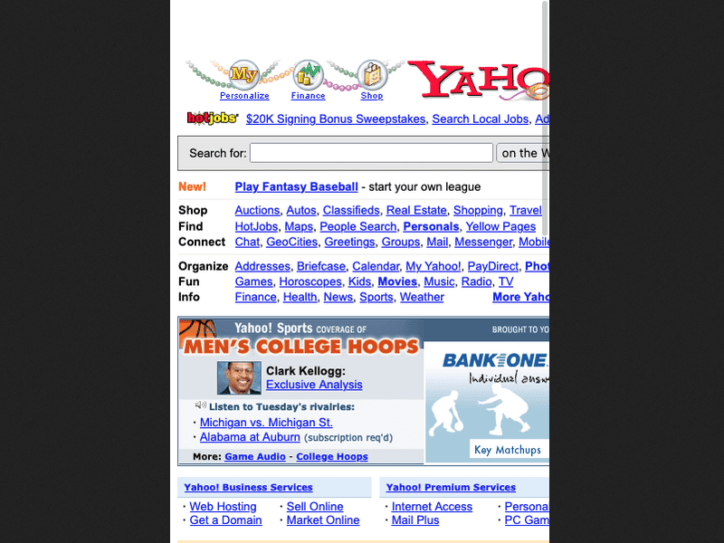
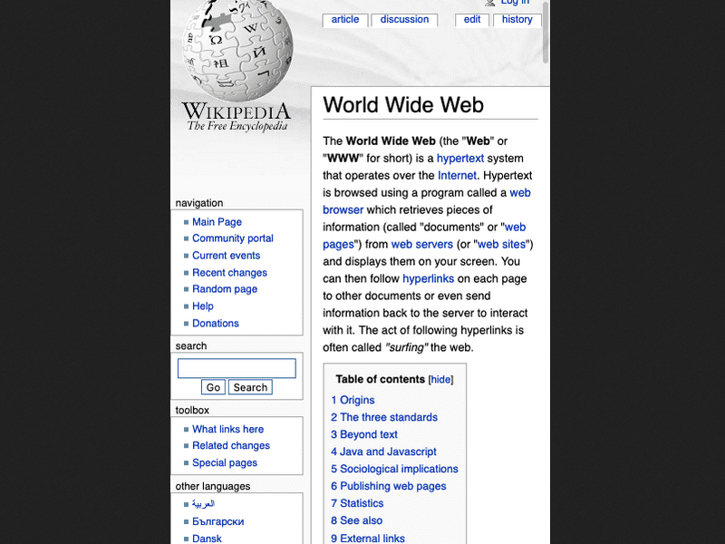
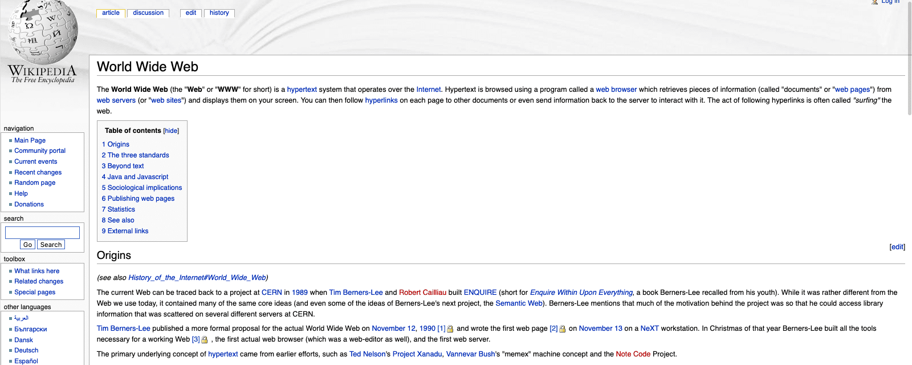
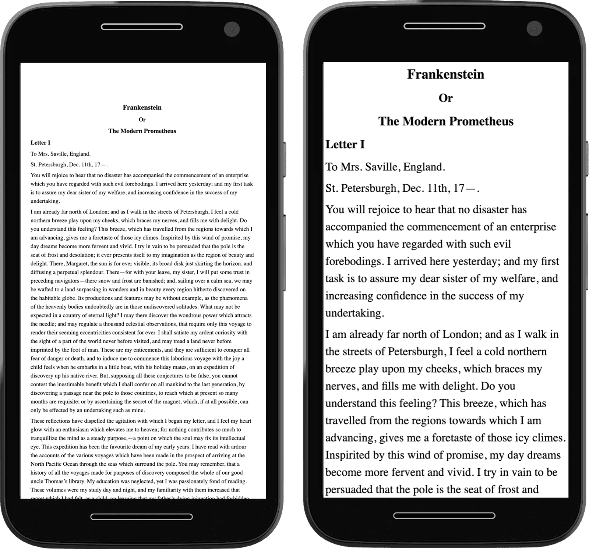

# Введение

С самого начала Всемирная паутина была задумана как агностическая система. Неважно, какое у вас оборудование. Не имеет значения, под управлением какой операционной системы работает ваше устройство. Пока вы можете подключиться к Интернету, Всемирная паутина доступна для вас.

На заре развития Интернета большинство людей пользовались настольными компьютерами. Сегодня веб-страницы доступны на настольных компьютерах, ноутбуках, планшетах, телефонах-раскладушках, холодильниках и автомобилях. Люди справедливо ожидают, что сайты будут хорошо выглядеть независимо от того, на каком устройстве они работают. Адаптивный дизайн делает это возможным.

Адаптивный дизайн - это не первый подход к созданию сайтов. За годы до появления адаптивного дизайна веб-дизайнеры и разработчики перепробовали множество различных техник.

## Дизайн с фиксированной шириной экрана

В начале 1990-х годов, когда веб только начинал становиться популярным, большинство мониторов имели размеры экрана 640 пикселей по ширине и 480 пикселей по высоте. Это были выпуклые катодно-лучевые трубки, не похожие на плоские жидкокристаллические дисплеи, которые мы имеем сейчас.

<figure markdown>

<figcaption markdown>Веб-сайт Microsoft в конце 90-х годов был рассчитан на ширину 640 пикселей. Снимок экрана из [archive.org](https://archive.org)</figcaption>
</figure>

На заре становления веб-дизайна можно было смело создавать веб-страницы шириной 640 пикселей. Но в то время как другие технологии, такие как телефоны и фотоаппараты, миниатюризировались, экраны становились все больше (и, в конце концов, плоскими). Вскоре размеры большинства экранов составляли 800 на 600 пикселей. Соответственно изменился и веб-дизайн. Дизайнеры и разработчики стали считать, что 800 пикселей - это безопасное значение по умолчанию.

<figure markdown>

<figcaption markdown>Веб-сайт Microsoft в начале 2000-х годов был рассчитан на ширину 800 пикселей. Снимок экрана из [archive.org](https://archive.org)</figcaption>
</figure>

Затем экраны снова стали больше. По умолчанию стало использоваться разрешение 1024 на 768. Это было похоже на гонку вооружений между веб-дизайнерами и производителями оборудования.

​​<figure markdown> 

<figcaption markdown>Веб-сайт Microsoft в середине 2000-х годов был рассчитан на ширину 1024 пикселя. Снимок экрана из [archive.org](https://archive.org)</figcaption>
</figure>

Выбор одной определенной ширины, будь то 640, 800 или 1024 пикселя, называется дизайном с фиксированной шириной.

Если задать фиксированную ширину макета, то он будет хорошо выглядеть только при этой ширине. Если у посетителя вашего сайта экран шире, чем выбранная ширина, то на экране будет пустое пространство. Можно выровнять содержимое страниц по центру, чтобы распределить его более равномерно (вместо пустого пространства с одной стороны), но при этом все равно не удастся в полной мере использовать имеющееся пространство.

<figure markdown>

<figcaption markdown>Сайт Yahoo начала 2000-х годов в браузере, ширина которого превышает 800 пикселей. Снимок экрана из [archive.org](https://archive.org)</figcaption>
</figure>

Аналогично, если посетитель приходит с экраном меньшей ширины, чем выбранная вами ширина, то содержимое страницы не поместится по горизонтали. Браузер создает полосу прокрутки - горизонтальный аналог полосы прокрутки, и пользователю приходится перемещать всю страницу влево и вправо, чтобы увидеть все содержимое.

<figure markdown>

<figcaption markdown>Сайт Yahoo начала 2000-х годов в браузере, ширина которого меньше ширины сайта на 800 пикселей. Снимок экрана из [archive.org](https://archive.org)</figcaption>
</figure>

<iframe allow="camera; clipboard-read; clipboard-write; encrypted-media; geolocation; microphone; midi;" loading="lazy" src="https://codepen.io/web-dot-dev/embed/RwZjwoQ?height=500&amp;theme-id=dark&amp;default-tab=result&amp;editable=true" style="height: 500px; width: 100%; border: 0;" data-title="Pen RwZjwoQ by web-dot-dev on Codepen"></iframe>

## Резиновые верстки

Хотя большинство дизайнеров использовали макеты с фиксированной шириной колонок, некоторые решили сделать их гибкими. Вместо использования фиксированной ширины макета можно создать гибкий макет, используя проценты для ширины колонок. Такие макеты работают в большем количестве ситуаций, чем макеты с фиксированной шириной, которые выглядят правильно только при одном конкретном размере.

Такие макеты называются резиновыми верстками. Но если резиновая верстка хорошо смотрится в широком диапазоне ширины, то в крайних случаях она начинает ухудшаться. На широком экране макет выглядит растянутым. На узком экране макет выглядит сжатым. Оба сценария не являются идеальными.

<figure markdown>

<figcaption markdown>Резиновая верстка Википедии середины 2000-х годов в узком окне браузера. Снимок экрана из [archive.org](https://archive.org)</figcaption>
</figure>
​​
<figure markdown>

<figcaption markdown>Резиновая верстка Википедии середины 2000-х годов в широком окне браузера. Снимок экрана из [archive.org](https://archive.org)</figcaption>
</figure>

Смягчить эти проблемы можно, используя для макета значения `min-width` и `max-width`. Но тогда при любом размере, меньшем минимальной или большем максимальной ширины, возникают те же проблемы, что и при макете с фиксированной шириной. На широком экране неиспользуемое пространство будет пропадать. На узком экране пользователю придется перемещать всю страницу влево и вправо, чтобы все увидеть.

<iframe allow="camera; clipboard-read; clipboard-write; encrypted-media; geolocation; microphone; midi;" loading="lazy" src="https://codepen.io/web-dot-dev/embed/YzxEzpE?height=500&amp;theme-id=dark&amp;default-tab=result&amp;editable=true" style="height: 500px; width: 100%; border: 0;" data-title="Pen YzxEzpE by web-dot-dev on Codepen"></iframe>

Слово _резиновый_ - это лишь один из терминов, используемых для описания такого рода макетов. Подобные конструкции также назывались "текучими" или "гибкими". Терминология была столь же подвижна, как и техника.

## Маленькие экраны

В XXI веке Интернет продолжал становиться все больше и больше. Увеличивались и мониторы. Но появились новые экраны, которые были меньше любого настольного устройства. С появлением мобильных телефонов с полнофункциональными веб-браузерами перед дизайнерами встала дилемма. Как сделать так, чтобы их дизайн хорошо смотрелся и на настольном компьютере, и на мобильном телефоне? Нужен был способ стилизации контента для экранов шириной 240 и тысячи пикселей.

## Отдельные сайты

Один из вариантов - сделать отдельный поддомен для мобильных посетителей. Но тогда придется поддерживать две отдельные кодовые базы и дизайн. А для перенаправления посетителей на мобильных устройствах придется использовать [user-agent sniffing](https://ru.wikipedia.org/wiki/%D0%90%D0%BD%D0%B0%D0%BB%D0%B8%D0%B7_%D0%B1%D1%80%D0%B0%D1%83%D0%B7%D0%B5%D1%80%D0%B0), который может быть ненадежным и легко подделываемым. По соображениям конфиденциальности Chrome будет отказываться от строки `user-agent`. Кроме того, нет четкой границы между мобильным и немобильным. На какой сайт вы отправляете планшетные устройства?

## Адаптивные макеты

Вместо того чтобы иметь отдельные сайты на разных поддоменах, можно иметь один сайт с двумя или тремя макетами фиксированной ширины.

Когда медиазапросы впервые появились в CSS, они открыли возможность сделать макеты более гибкими. Однако многим разработчикам по-прежнему было удобно создавать макеты с фиксированной шириной. Одна из техник предполагает переключение между несколькими макетами с фиксированной шириной при заданных значениях ширины. Некоторые называют это адаптивным дизайном.

Адаптивный дизайн позволяет дизайнерам создавать макеты, которые хорошо выглядят при нескольких различных размерах, но при просмотре между этими размерами дизайн никогда не выглядел правильно. Проблема избыточного пространства сохранялась, хотя и не так сильно, как при макете с фиксированной шириной.

Используя медиазапросы CSS, можно предоставить людям макет, максимально соответствующий ширине их браузера. Однако, учитывая разнообразие размеров устройств, есть вероятность, что для большинства людей такой макет будет выглядеть не совсем идеально.

<iframe allow="camera; clipboard-read; clipboard-write; encrypted-media; geolocation; microphone; midi;" loading="lazy" src="https://codepen.io/web-dot-dev/embed/oNeoNYw?height=500&amp;theme-id=dark&amp;default-tab=result&amp;editable=true" style="height: 500px; width: 100%; border: 0;" data-title="Pen oNeoNYw by web-dot-dev on Codepen"></iframe>

## Адаптивный веб-дизайн

Если адаптивные макеты представляют собой смесь медиазапросов и макетов фиксированной ширины, то адаптивный веб-дизайн - это смесь медиазапросов и резиновой верстки.

<iframe allow="camera; clipboard-read; clipboard-write; encrypted-media; geolocation; microphone; midi;" loading="lazy" src="https://codepen.io/web-dot-dev/embed/JjyOjbE?height=500&amp;theme-id=dark&amp;default-tab=result&amp;editable=true" style="height: 500px; width: 100%; border: 0;" data-title="Pen JjyOjbE by web-dot-dev on Codepen"></iframe>

Этот термин был введен [Итаном Маркотте](https://ethanmarcotte.com/) в [статье в журнале A List Apart](https://alistapart.com/article/responsive-web-design/) в 2010 году.

Итан определил три критерия адаптивного дизайна:

1.  Гибкие сетки
2.  Гибкие медиа
3.  Медиазапросы

Макет и изображения адаптивного сайта будут хорошо смотреться на любом устройстве. Но есть одна проблема.

## Элемент `meta` для `viewport`

Браузеры на мобильных телефонах вынуждены были иметь дело с сайтами, которые были разработаны с фиксированной шириной макета для более широких экранов. По умолчанию мобильные браузеры предполагали, что ширина сайта составляет 980 пикселей (и они не ошибались). Поэтому даже если вы использовали резиновую верстку, браузер применял ширину 980 пикселей, а затем уменьшал масштаб отображаемой веб-страницы до реальной ширины экрана.

Если вы используете адаптивный дизайн, вам необходимо указать браузеру, чтобы он не выполнял такое масштабирование. Это можно сделать с помощью элемента `meta` в `head` веб-страницы:

```html
<meta
    name="viewport"
    content="width=device-width, initial-scale=1"
/>
```

Имеются два значения, разделенные запятыми. Первое - `width=device-width`. Оно указывает браузеру, что ширина сайта должна соответствовать ширине устройства (вместо того чтобы считать, что ширина сайта равна 980 пикселам). Второе значение - `initial-scale=1`. Оно указывает браузеру, насколько сильно или слабо нужно масштабировать сайт. При адаптивном дизайне браузер вообще не должен выполнять никакого масштабирования.

<figure markdown>

<figcaption>Телефон слева показывает, как выглядит макет до установки мета-тега, в сравнении с макетом справа.</figcaption>
</figure>

После установки элемента `meta` ваши веб-страницы становятся адаптивными.

## Современный адаптивный дизайн

Сегодня у нас есть возможность создавать адаптивные сайты, размеры которых выходят далеко за пределы области просмотра. Медиафункции предоставляют разработчикам доступ к предпочтениям пользователей и позволяют создавать индивидуальный опыт. Контейнерные запросы позволяют компонентам владеть собственной адаптивной информацией. Элемент `picture` позволяет дизайнерам принимать решения о художественном оформлении в зависимости от соотношения размеров экрана.

Адаптивный дизайн - это захватывающий, растущий мир возможностей. В оставшейся части курса вы узнаете об этих технологиях и о том, как их использовать для создания красивых адаптивных веб-сайтов для всех.
