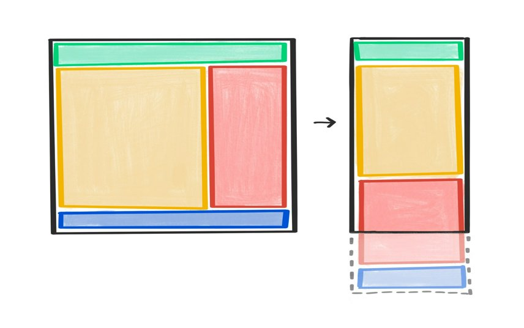

# Макроразметка

Макроразметка описывает более крупную, в масштабах всей страницы, организацию интерфейса.



Перед применением любого макета необходимо убедиться в том, что поток содержимого имеет смысл. На небольших экранах по умолчанию используется одноколоночная верстка.

```html
<body>
    <header>…</header>
    <main>
        <article>…</article>
        <aside>…</aside>
    </main>
    <footer>…</footer>
</body>
```

<iframe allow="camera; clipboard-read; clipboard-write; encrypted-media; geolocation; microphone; midi;" loading="lazy" src="https://codepen.io/web-dot-dev/embed/oNeePOX?height=500&amp;theme-id=dark&amp;default-tab=result&amp;editable=true" style="height: 500px; width: 100%; border: 0;" data-title="Pen oNeePOX by web-dot-dev on Codepen"></iframe>

При расположении этих отдельных компонентов на уровне страницы создается макроразметка - высокоуровневый вид страницы. Используя медиазапросы, можно задать в CSS правила, описывающие, как это представление должно адаптироваться к различным размерам экрана.

<video controls autoplay loop>
<source src="/learn/design/macro-layouts-2.mp4" />
</video>

## Grid

[CSS grid](../css3/grid.md) - это отличный инструмент для применения макета на странице. В приведенном выше примере, скажем, требуется двухколоночная верстка при достаточной ширине экрана. Чтобы применить эту двухколоночную верстку, когда браузер станет достаточно широким, используйте медиазапрос для определения стилей сетки выше указанной точки разрыва.

```css
@media (min-width: 45em) {
    main {
        display: grid;
        grid-template-columns: 2fr 1fr;
    }
}
```

!!!note ""

    Хотя логичнее было бы указать `min-inline-size` вместо `min-width`, логические свойства пока не работают в медиазапросах.

<iframe allow="camera; clipboard-read; clipboard-write; encrypted-media; geolocation; microphone; midi;" loading="lazy" src="https://codepen.io/web-dot-dev/embed/vYJJzMK?height=500&amp;theme-id=dark&amp;default-tab=result&amp;editable=true" style="height: 500px; width: 100%; border: 0;" data-title="Pen vYJJzMK by web-dot-dev on Codepen"></iframe>

## Flexbox

Для данного конкретного макета можно также использовать [flexbox](../css3/flexbox.md). Стили будут выглядеть следующим образом:

```css
@media (min-width: 45em) {
    main {
        display: flex;
        flex-direction: row;
    }

    main article {
        flex: 2;
    }

    main aside {
        flex: 1;
    }
}
```

<iframe allow="camera; clipboard-read; clipboard-write; encrypted-media; geolocation; microphone; midi;" loading="lazy" src="https://codepen.io/web-dot-dev/embed/gOxxdym?height=500&amp;theme-id=dark&amp;default-tab=result&amp;editable=true" style="height: 500px; width: 100%; border: 0;" data-title="Pen gOxxdym by web-dot-dev on Codepen"></iframe>

Однако версия flexbox требует больше CSS. Каждый столбец имеет отдельное правило, описывающее, сколько места он должен занимать. В примере с сеткой эта же информация заключена в одно правило для содержащего элемента.

## Нужен ли вам медиазапрос?

Возможно, не всегда нужно использовать медиазапрос. Медиазапросы хорошо работают, когда изменения вносятся в несколько элементов, но если макет нужно обновлять часто, то медиазапросы могут выйти из-под контроля из-за большого количества точек останова.

Скажем, у вас есть страница, заполненная компонентами карточек. Карточки никогда не бывают шире `15em`, и вы хотите разместить на одной строке столько карточек, сколько поместится. Можно написать медиа-запросы с точками разрыва `30em`, `45em`, `60em` и т.д., но это довольно утомительно и сложно в обслуживании.

Вместо этого можно применить правила, чтобы карточки сами автоматически занимали нужное пространство.

```css
.cards {
    display: grid;
    grid-template-columns: repeat(
        auto-fill,
        minmax(15em, 1fr)
    );
    grid-gap: 1em;
}
```

<iframe allow="camera; clipboard-read; clipboard-write; encrypted-media; geolocation; microphone; midi;" loading="lazy" src="https://codepen.io/web-dot-dev/embed/QWMMVPm?height=500&amp;theme-id=dark&amp;default-tab=result&amp;editable=true" style="height: 500px; width: 100%; border: 0;" data-title="Pen QWMMVPm by web-dot-dev on Codepen"></iframe>

Аналогичного расположения можно добиться с помощью flexbox. В этом случае, если не хватает карточек для заполнения последнего ряда, оставшиеся карточки растягиваются, заполняя свободное пространство, а не выстраиваются в столбцы. Если необходимо выстроить строки и столбцы, то используйте сетку.

```css
.cards {
    display: flex;
    flex-direction: row;
    flex-wrap: wrap;
    gap: 1em;
}
.cards .card {
    flex-basis: 15em;
    flex-grow: 1;
}
```

<iframe allow="camera; clipboard-read; clipboard-write; encrypted-media; geolocation; microphone; midi;" loading="lazy" src="https://codepen.io/web-dot-dev/embed/abyyaMg?height=500&amp;theme-id=dark&amp;default-tab=result&amp;editable=true" style="height: 500px; width: 100%; border: 0;" data-title="Pen abyyaMg by web-dot-dev on Codepen"></iframe>

Применяя некоторые "умные" правила в flexbox или grid, можно создавать динамические макеты макросов с минимальным количеством CSS и без каких-либо медиазапросов. Таким образом, вы получаете меньше работы для себя - вместо этого вы заставляете браузер выполнять вычисления. Примеры современных CSS-макетов, которые работают плавно и не требуют медиазапросов, можно посмотреть на сайте [1linelayouts.com](https://1linelayouts.glitch.me/).

Теперь, когда у вас есть несколько идей по макроразметке на уровне страницы, обратите внимание на компоненты внутри страницы. Это сфера [micro layouts](micro-layouts.md).
