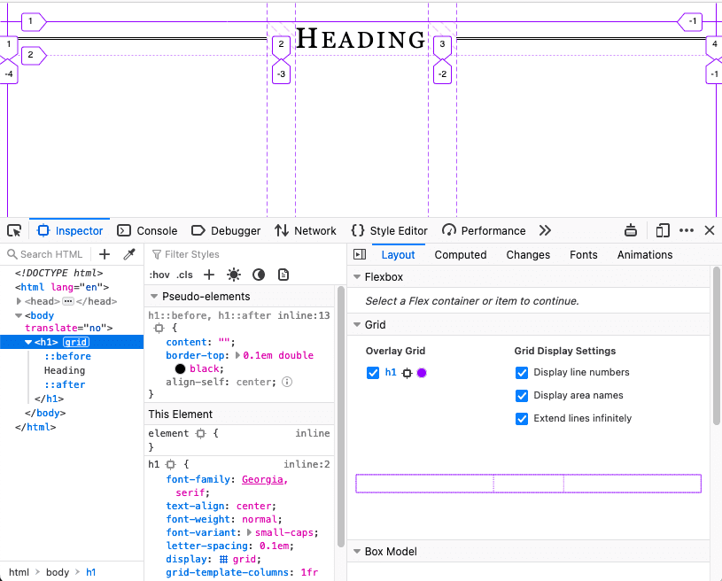
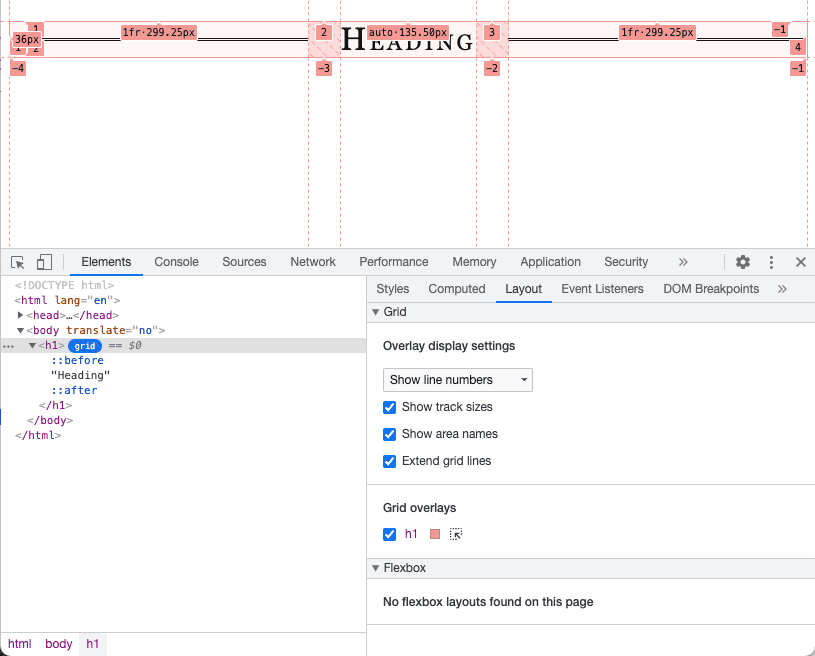
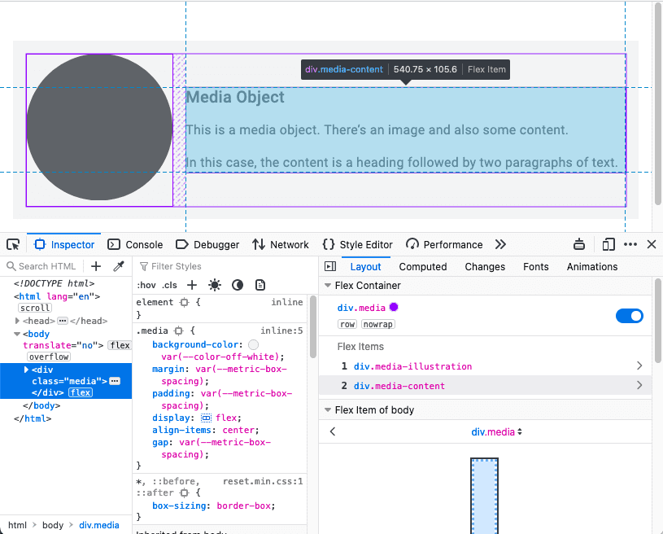
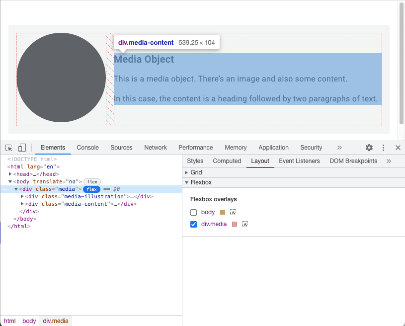
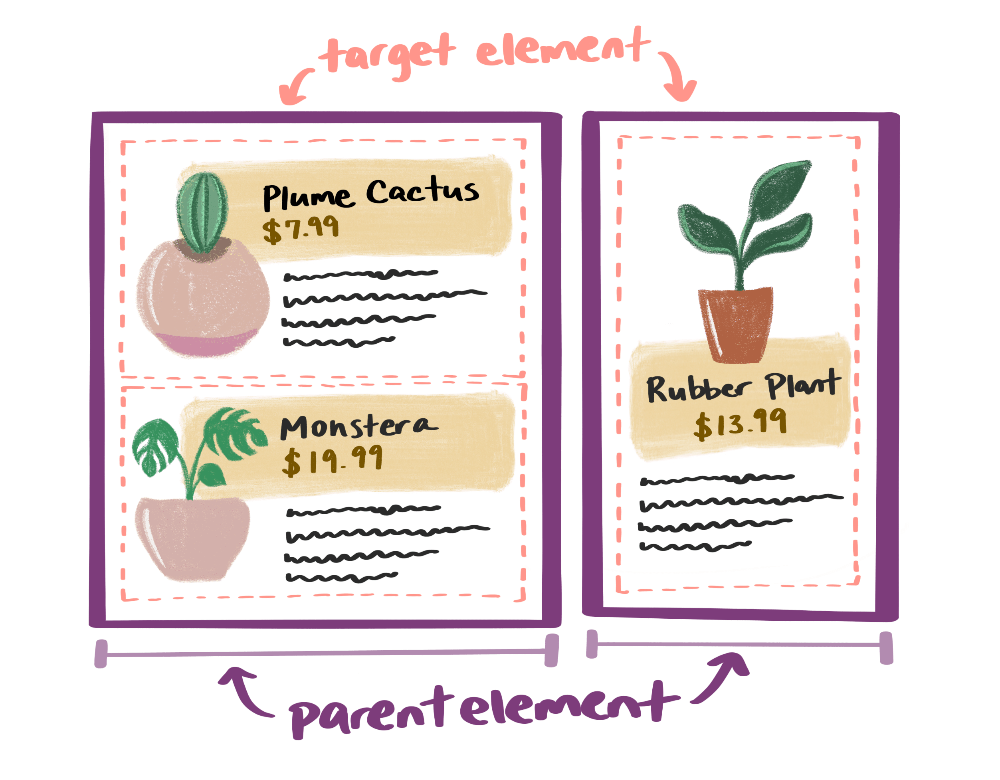
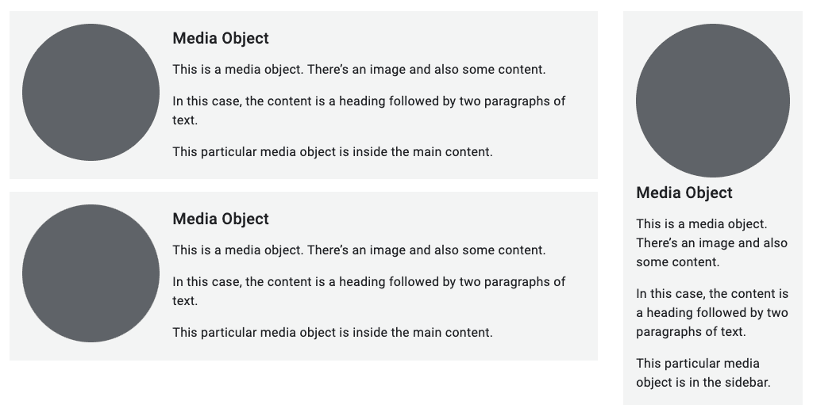

# Микроразметка

Когда мы думаем о макетах, мы часто имеем в виду макеты на уровне страницы. Однако небольшие компоненты внутри страницы могут иметь свои собственные макеты.

В идеале эти макеты на уровне компонентов должны настраиваться автоматически, независимо от их положения на странице. Возможны ситуации, когда неизвестно, куда будет помещен компонент - в колонку основного содержания или в боковую панель, или в обе. Не зная точно, где окажется компонент, необходимо убедиться в том, что он может подстраиваться под свой контейнер.


!!!note ""

    В будущем создание компонентов, способных адаптироваться к своему контейнеру, значительно упростится с реализацией [Container Queries](https://developer.mozilla.org/docs/Web/CSS/CSS_Container_Queries). Пока же следует обратить внимание на существующие способы создания многократно используемых адаптивных микромакетов. О том, как Container Queries вписываются в существующие методы адаптивного дизайна, читайте в конце этого модуля.

## Grid

[CSS grid](../css3/grid.md) предназначена не только для макетов на уровне страниц. Она также хорошо подходит для компонентов, которые находятся внутри них.

В данном примере [псевдоэлементы](../css3/pseudo-elements.md) `::before` и `::after` создают декоративные линии по обе стороны от заголовка. Сам заголовок является контейнером сетки. Отдельные элементы располагаются таким образом, чтобы линии всегда заполняли свободное пространство.

```css
h1 {
    display: grid;
    grid-template-columns: 1fr auto 1fr;
    gap: 1em;
}
h1::before,
h1::after {
    content: '';
    border-top: 0.1em double black;
    align-self: center;
}
```

<iframe allow="camera; clipboard-read; clipboard-write; encrypted-media; geolocation; microphone; midi;" loading="lazy" src="https://codepen.io/web-dot-dev/embed/rNzYvxm?height=200&amp;theme-id=dark&amp;default-tab=result&amp;editable=true" style="height: 200px; width: 100%; border: 0;" data-title="Pen rNzYvxm by web-dot-dev on Codepen"></iframe>

<figure markdown>


<figcaption>В настольных браузерах, таких как Firefox и Chrome, имеются инструменты разработчика, позволяющие отображать линии и области сетки, наложенные на дизайн.</figcaption>
</figure>

Узнайте, как [осмотреть макеты сетки](https://developer.chrome.com/docs/devtools/css/grid/) в Chrome DevTools.

## Flexbox

Как следует из названия, [flexbox](../css3/flexbox.md) позволяет сделать компоненты гибкими. Вы можете указать, какие элементы в компоненте должны иметь минимальный или максимальный размер, и позволить другим элементам подстраиваться под них.

В данном примере изображение занимает четверть доступного пространства, а текст - остальные три четверти. При этом размер изображения никогда не превышает 200 пикселей.

```css
.media {
    display: flex;
    align-items: center;
    gap: 1em;
}
.media-illustration {
    flex: 1;
    max-inline-size: 200px;
}
.media-content {
    flex: 3;
}
```

<iframe allow="camera; clipboard-read; clipboard-write; encrypted-media; geolocation; microphone; midi;" loading="lazy" src="https://codepen.io/web-dot-dev/embed/qBXVYZo?height=300&amp;theme-id=dark&amp;default-tab=result&amp;editable=true" style="height: 300px; width: 100%; border: 0;" data-title="Pen qBXVYZo by web-dot-dev on Codepen"></iframe>

<figure markdown>


<figcaption>The developer tools in Firefox and Chrome can help you visualize the shape of your flexbox components.</figcaption>
</figure>

Узнайте, как [проверять макеты flexbox](https://developer.chrome.com/docs/devtools/css/flexbox/) в Chrome DevTools.

## Запросы к контейнерам

Flexbox позволяет создавать дизайн от содержимого наружу. Вы можете указать параметры элементов (насколько узкими они должны быть, насколько широкими) и предоставить браузеру самому решать, как их реализовать.

Но сам компонент не имеет представления о своем контексте. Он не знает, используется ли он в основном содержимом или в боковой панели. Это может сделать компонентную компоновку более сложной, чем страничную. Чтобы применять контекстно-зависимые стили, компоненты должны знать не только размер области просмотра, в которой они находятся.

При компоновке страницы вы _знаете_ ширину контейнера, поскольку контейнер является областью просмотра браузера; медиа-запросы сообщают размеры контейнера на уровне страницы.

В настоящее время разрабатывается технология CSS, которая сообщает размеры любого родительского контейнера: [container queries](https://developer.mozilla.org/docs/Web/CSS/CSS_Container_Queries).

!!!warning ""

    Запросы к контейнерам - это новая экспериментальная технология, которая еще не получила широкого распространения в браузерах. Чтобы протестировать приведенный ниже код и убедиться в работоспособности примера, включите контейнерные запросы в Chrome.

    Перейдите по адресу `chrome://flags/`, найдите **Container Queries** и включите флаг `#enable-container-queries`. При включенном флаге можно [проверять и отлаживать запросы к контейнерам](https://developer.chrome.com/docs/devtools/css/container-queries/) в Chrome DevTools.

Для начала определите, какие элементы будут выступать в качестве контейнеров.

```css
main,
aside {
    container-type: inline-size;
}
```

Это означает, что вы хотите иметь возможность запрашивать встроенное измерение. Для англоязычных документов это горизонтальная ось. Вы собираетесь изменять стили в зависимости от ширины контейнера.

Если компонент находится внутри одного из таких контейнеров, то можно применить стили способом, весьма похожим на медиазапросы.

```css
.media-illustration {
    max-width: 200px;
    margin: auto;
}

@container (min-width: 25em) {
    .media {
        display: flex;
        align-items: center;
        gap: 1em;
    }

    .media-illustration {
        flex: 1;
    }

    .media-content {
        flex: 3;
    }
}
```

Если медиаобъект находится внутри контейнера, ширина которого меньше `25em`, то стили flexbox не применяются. Изображение и текст располагаются в вертикальном порядке.

Если же содержащий элемент шире, чем `25em`, то изображение и текст располагаются рядом.

Запросы к контейнерам позволяют создавать независимые стили для компонентов. Ширина области просмотра больше не имеет значения. Вы можете писать правила, основанные на ширине содержащего элемента.



## Комбинирование запросов

Вы можете использовать медиа-запросы для оформления страницы и контейнерные запросы для компонентов внутри страницы.

Здесь общая структура страницы имеет элемент `main` и элемент `aside`. В обоих элементах присутствуют медиаобъекты.

```html
<body>
    <main>
        <div class="media">…</div>
        <div class="media">…</div>
    </main>
    <aside>
        <div class="media">…</div>
    </aside>
</body>
```

Медиазапрос применяет сетчатую компоновку к элементам `main` и `aside` при ширине области просмотра более `45em`.

```css
@media (min-width: 45em) {
    body {
        display: grid;
        grid-template-columns: 3fr 1fr;
    }
}
```

Правило запроса контейнера для медиаобъектов остается прежним: применять горизонтальную компоновку flexbox только в том случае, если содержащий элемент имеет ширину более `25em`.



!!!warning ""

    Данная демонстрация будет работать не во всех браузерах. В Google Chrome флаг `#enable-container-queries` можно найти по адресу `chrome://flags`.

<iframe allow="camera; clipboard-read; clipboard-write; encrypted-media; geolocation; microphone; midi;" loading="lazy" src="https://codepen.io/web-dot-dev/embed/RwZjyRv?height=500&amp;theme-id=dark&amp;default-tab=result&amp;editable=true" style="height: 500px; width: 100%; border: 0;" data-title="Pen RwZjyRv by web-dot-dev on Codepen"></iframe>

Запросы к контейнерам - это революционное решение для микромакетов. Ваши компоненты могут быть автономными, не зависящими от области просмотра браузера.

Ранее вы узнали о макроразметке на уровне страницы. Теперь вы знаете о микроразметке на уровне компонентов. Далее мы углубимся в изучение самих структурных элементов контента. Вы узнаете, как сделать изображения адаптивными. А сейчас давайте рассмотрим адаптивную типографику.
