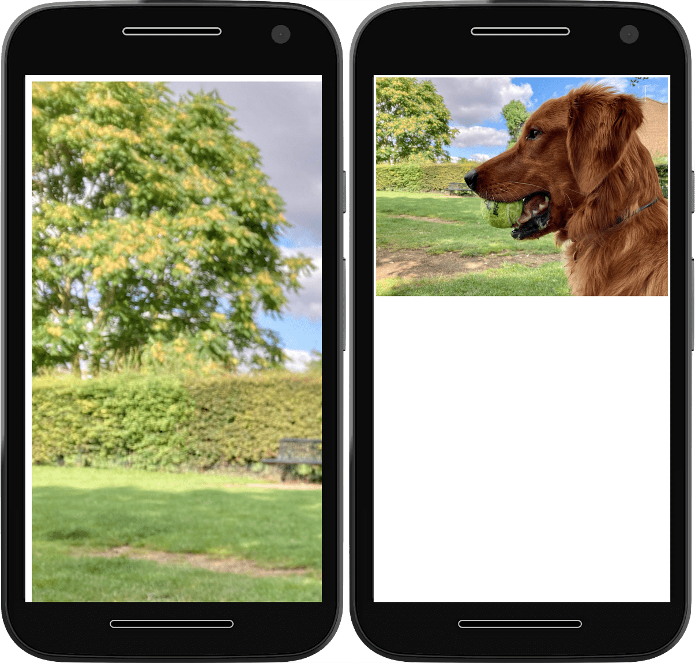

# Адаптивные изображения

Текст в Интернете автоматически заворачивается за край экрана, чтобы не выходить за его пределы. С изображениями дело обстоит иначе. Изображения имеют собственный размер. Если изображение шире экрана, оно будет переполняться, что приведет к появлению горизонтальной полосы прокрутки.

К счастью, в CSS можно принять меры, чтобы этого не происходило.

## Ограничение изображений

В таблице стилей можно объявить, что изображения никогда не должны отображаться в размере, превышающем размер содержащего их элемента, используя параметр [`max-inline-size`](../../css/max-inline-size.md).

```css
img {
    max-inline-size: 100%;
    block-size: auto;
}
```

!!!note ""

    При желании можно использовать `max-width` вместо `max-inline-size`, но помните, что полезно привыкнуть мыслить в терминах [логических свойств](internationalization.md#logical-properties).

Это же правило можно применить и к другим видам встраиваемого содержимого, например, к видео и iframe.

```css
img,
video,
iframe {
    max-inline-size: 100%;
    block-size: auto;
}
```

При соблюдении этого правила браузеры будут автоматически уменьшать масштаб изображений, чтобы они помещались на экране.



Добавление к [`block-size`](../../css/block-size.md) значения `auto` означает, что соотношение сторон изображений будет оставаться постоянным.

Иногда размеры изображения могут быть неподконтрольны пользователю - например, если изображение добавляется через систему управления контентом. Если в вашем дизайне требуется, чтобы соотношение сторон изображения отличалось от его реальных размеров, используйте свойство [`aspect-ratio`](../../css/aspect-ratio.md) в CSS.

```css
img {
    max-inline-size: 100%;
    block-size: auto;
    aspect-ratio: 2/1;
}
```

Однако в этом случае браузер может сжать или растянуть изображение, чтобы оно соответствовало выбранному вами соотношению сторон.


Чтобы этого не происходило, используйте свойство [`object-fit`](../../css/object-fit.md).

Свойство `object-fit` со значением `contain` указывает браузеру на необходимость сохранения соотношения сторон изображения, даже если это означает оставление пустого пространства сверху и снизу.

```css
img {
    max-inline-size: 100%;
    block-size: auto;
    aspect-ratio: 2/1;
    object-fit: contain;
}
```

Значение `object-fit`, равное `cover`, указывает браузеру на необходимость сохранения соотношения сторон изображения, даже если это означает его обрезку сверху и снизу.

```css
img {
    max-inline-size: 100%;
    block-size: auto;
    aspect-ratio: 2/1;
    object-fit: cover;
}
```

<figure markdown>


<figcaption markdown>Одно и то же изображение с двумя различными значениями `object-fit`. В первом случае значение `object-fit` равно `contain`. Для второго значение `object-fit` равно `cover`.</figcaption>
</figure>

Если обрезка сверху и снизу равномерно является проблемой, используйте CSS-свойство [object-position](../../css/object-position.md) для настройки фокуса обрезки.

Вы можете сделать так, чтобы наиболее важное содержимое изображения оставалось видимым.

```css
img {
    max-inline-size: 100%;
    block-size: auto;
    aspect-ratio: 2/1;
    object-fit: cover;
    object-position: top center;
}
```


## Доставка изображений

Эти правила CSS указывают браузеру, как следует отображать изображения. В HTML можно также дать подсказки о том, как браузер должен работать с этими изображениями.

### Подсказки по размерам

Если известны размеры изображения, то следует включить атрибуты `width` и `height`. Даже если изображение будет отображаться в другом размере (из-за правила `max-inline-size: 100%`), браузер все равно будет знать соотношение ширины и высоты и сможет отвести нужное количество места. Это позволит избежать "прыжков" остального содержимого при загрузке изображения.

```html

```

<figure>
<video controls loop>
<source src="/learn/design/responsive-images-6.mp4" />
</video>
<video controls loop>
<source src="/learn/design/responsive-images-7.mp4" />
</video>
<figcaption>В первом видеоролике показан макет без заданных размеров изображений. Обратите внимание, как прыгает текст после загрузки изображений. Во втором видеоролике размеры изображений заданы; для них оставлено место, чтобы после загрузки текст не прыгал.</figcaption>
</figure>

### Подсказки по загрузке

С помощью атрибута `loading` можно указать браузеру, следует ли отложить загрузку изображения до тех пор, пока оно не окажется в области просмотра или рядом с ней. Для изображений, расположенных ниже сгиба, используйте значение `lazy`. Браузер не будет загружать "ленивые" изображения до тех пор, пока пользователь не прокрутит страницу вниз настолько, что изображение вот-вот появится в поле зрения. Если пользователь не прокручивает страницу, то изображение не загружается.

```html

```

<video controls loop>
<source src="/learn/design/responsive-images-8.mp4" />
</video>

Для изображения героя, расположенного над сгибом, `loading` использовать не следует. Если ваш сайт автоматически применяет атрибут `loading="lazy"`, вы можете установить атрибут `eager` (который используется по умолчанию), чтобы предотвратить его применение:

```html

```

### Fetch Priority

Для важных изображений, таких как изображение [LCP](https://web.dev/articles/lcp), можно дополнительно определить приоритет загрузки с помощью [Fetch Priority](https://web.dev/articles/fetch-priority), установив атрибут `fetchpriority` в значение `high`:

```html

```

Это позволит браузеру получить изображение сразу и с высоким приоритетом, а не ждать, пока браузер завершит верстку, когда обычно происходит загрузка изображений.

Но помните: когда вы просите браузер установить приоритет загрузки одного ресурса - например, изображения, - браузеру придется отменить приоритет загрузки другого ресурса, например, скрипта или файла шрифта. Устанавливайте `fetchpriority="high"` для изображения только в том случае, если оно действительно жизненно необходимо.

### Подсказки по предварительной загрузке

Некоторые изображения могут быть недоступны в исходном HTML - если они добавлены с помощью JavaScript или как фоновое изображение в CSS. Вы можете использовать предварительную загрузку, чтобы эти важные изображения были получены заранее. Это можно сочетать с атрибутом `fetchpriority` для действительно важных изображений:

```html
<link
    rel="preload"
    href="hero.jpg"
    as="image"
    fetchpriority="high"
/>
```

Опять же, это следует использовать осторожно, чтобы не переопределить эвристику приоритетов браузера, что может привести к снижению производительности.

Предварительная загрузка адаптивных изображений на основе srcset (о которой речь пойдет ниже) с помощью атрибутов `imagesrcset` и `imagesizes` является более продвинутой и [поддерживается в некоторых браузерах](https://web.dev/articles/preload-responsive-images), но не во всех:

```html
<link
    rel="preload"
    imagesrcset="hero_sm.jpg 1x hero_med.jpg 2x hero_lg.jpg 3x"
    as="image"
    fetchpriority="high"
/>
```

Исключение фаллбека `href` позволяет гарантировать, что браузеры, не поддерживающие его, не будут загружать неправильное изображение.

Предварительная загрузка изображений различных форматов в зависимости от их поддержки браузером в настоящее время не поддерживается и может привести к дополнительным загрузкам.

Идеальным вариантом является отказ от предварительной загрузки и размещение изображения в исходном HTML, чтобы избежать повторения кода и обеспечить доступ к полному набору опций, поддерживаемых браузером.

### Декодирование изображений

Существует также атрибут `decoding`, который можно добавить к элементам `img`. Вы можете указать браузеру, что изображение может быть декодировано асинхронно. В этом случае браузер может отдать предпочтение обработке другого содержимого.

```html

```

Значение `sync` можно использовать в том случае, если само изображение является наиболее важным элементом содержимого для приоритезации.

```html

```

Атрибут `decoding` не изменяет скорость декодирования изображения, а лишь определяет, будет ли браузер ожидать декодирования этого изображения перед выводом другого содержимого.

В большинстве случаев это не оказывает существенного влияния, однако в некоторых сценариях может позволить отобразить изображение или содержимое несколько быстрее. Например, для большого документа с большим количеством элементов, требующих времени для рендеринга, и с большими изображениями, которые требуют времени для декодирования, установка `sync` для важных изображений позволит браузеру дождаться изображения и рендерить их одновременно. В качестве альтернативы установка `async` может позволить отображать содержимое быстрее, не дожидаясь декодирования изображения.

Однако лучшим вариантом обычно является попытка [избежать чрезмерных размеров DOM](https://developer.chrome.com/docs/lighthouse/performance/dom-size/) и обеспечить использование адаптивных изображений для сокращения времени декодирования, что означает, что атрибут decoding будет иметь незначительный эффект.

## Адаптивные изображения с `srcset`

Благодаря объявлению `max-inline-size: 100%` ваши изображения никогда не вырвутся за пределы своих контейнеров. Но даже если большое изображение, уменьшенное до нужного размера, выглядит нормально, это не так уж и хорошо. Если кто-то использует устройство с маленьким экраном в сети с низкой пропускной способностью, он будет загружать неоправданно большие изображения.

Если вы создаете несколько версий одного и того же изображения с разными размерами, вы можете сообщить о них браузеру с помощью атрибута [`srcset`](https://developer.mozilla.org/docs/Web/HTML/Element/img#attr-srcset).

### Дескриптор ширины

Вы можете передать список значений, разделенных запятыми. Каждое значение должно представлять собой URL-адрес изображения, за которым через пробел следует некоторая метаданная об изображении. Эти метаданные называются дескриптором.

В данном примере метаданные описывают ширину каждого изображения, используя единицу измерения `w`. Один `w` - это один пиксель.

```html

```

Атрибут `srcset` не заменяет атрибут `src`. Вместо этого атрибут `srcset` дополняет атрибут `src`. Вам по-прежнему необходимо иметь корректный атрибут `src`, но теперь браузер может заменить его значение на один из вариантов, перечисленных в атрибуте `srcset`.

Браузер не будет загружать большие изображения, если в них нет необходимости. Это позволяет экономить пропускную способность.

### Размеры

При использовании дескриптора ширины необходимо также использовать атрибут [`sizes`](https://developer.mozilla.org/docs/Web/HTML/Element/img#attr-sizes), чтобы предоставить браузеру дополнительную информацию. Он сообщает браузеру, какого размера изображение должно быть отображено при различных условиях. Эти условия задаются в медиазапросе.

Атрибут `sizes` принимает список медиазапросов и ширины изображения, разделенный запятыми.

!!!note ""

    Странно, когда медиазапросы CSS находятся внутри HTML-элемента. Это нарушает разделение представления и структуры. Но это единственный способ своевременно предоставить необходимую информацию о размерах изображений.

```html

```

В данном примере вы указываете браузеру при ширине области просмотра `66em` отображать изображение не шире одной трети экрана (например, в трехколоночной верстке).

При ширине области просмотра от `44em` до `66em` отображать изображение на половину ширины экрана (двухколоночный макет).

При ширине экрана менее `44em` изображение выводится на всю ширину экрана.

Это означает, что самое большое изображение не обязательно будет использоваться для самого широкого экрана. В широком окне браузера, способном отображать многоколоночную верстку, будет использоваться изображение, умещающееся в одной колонке. Это изображение может быть меньше, чем изображение, используемое для одноколоночной разметки на более узком экране.

<iframe allow="camera; clipboard-read; clipboard-write; encrypted-media; geolocation; microphone; midi;" loading="lazy" src="https://codepen.io/web-dot-dev/embed/XWerLJm?height=500&amp;theme-id=dark&amp;default-tab=result&amp;editable=true" style="height: 500px; width: 100%; border: 0;" data-title="Pen XWerLJm by web-dot-dev on Codepen"></iframe>

<video controls loop>
<source src="/learn/design/responsive-images-9.mp4" />
</video>

### Дескриптор плотности пикселей

Существует еще одна ситуация, когда может потребоваться предоставить несколько версий одного и того же изображения.

Некоторые устройства имеют дисплеи с высокой плотностью пикселей. На дисплее с двойной плотностью пикселей в один пиксель помещается два пикселя информации. Это позволяет сохранить четкость изображения на таких дисплеях.


Дескриптор плотности используется для описания плотности пикселей изображения по отношению к изображению в атрибуте `src`. Дескриптор плотности представляет собой число, за которым следует буква x: `1x`, `2x` и т. д.

```html

```

Если размер `small-image.png` составляет 300 на 200 пикселей, а `medium-image.png` - 600 на 400 пикселей, то `medium-image.png` может иметь в списке `srcset` после себя значение `2x`.

Не обязательно использовать целые числа. Если другой вариант изображения имеет размер 450 на 300 пикселей, то его можно описать с помощью `1.5x`.

!!!note ""

    Вы можете использовать _либо_ дескрипторы ширины, либо_ дескрипторы плотности, но не оба вместе.

## Презентационные изображения

Изображения в HTML являются контентом. Поэтому всегда используется атрибут `alt` с описанием изображения для программ чтения с экрана и поисковых систем.

Если вы вставляете изображение, которое является чисто визуальным изыском без какого-либо содержательного наполнения, используйте пустой атрибут `alt`.

```html

```

Атрибут `alt` все равно должен быть включен. Отсутствие атрибута `alt` - это не то же самое, что пустой атрибут `alt`. Пустой атрибут `alt` сообщает программе чтения с экрана, что данное изображение является презентационным.

В идеале презентационные или декоративные изображения вообще не должны присутствовать в HTML. HTML - это структура. CSS - для представления.

## Фоновые изображения

Для загрузки презентационных изображений используйте свойство `background-image` в CSS.

```css
element {
    background-image: url(flourish.png);
}
```

С помощью функции [`image-set`](<https://developer.mozilla.org/docs/Web/CSS/image/image-set()>) для `background-image` можно указать несколько изображений-кандидатов.

Функция `image-set` в CSS работает аналогично атрибуту `srcset` в HTML. Предоставьте список изображений с дескриптором плотности пикселей для каждого из них.

```css
element {
    background-image: image-set(
        small-image.png 1x,
        medium-image.png 2x,
        large-image.png 3x
    );
}
```

Браузер выберет наиболее подходящее изображение с учетом плотности пикселей устройства.

При добавлении изображений на сайт необходимо учитывать множество факторов:

Резервирование необходимого пространства для каждого изображения. Определение необходимого количества размеров. Решить, является ли изображение содержательным или декоративным.

Стоит потратить время на то, чтобы правильно подобрать изображения. Плохая стратегия работы с изображениями приводит к разочарованию и раздражению пользователей. Хорошая стратегия работы с изображениями обеспечивает быстрое и четкое отображение сайта независимо от устройства пользователя или его сетевого подключения.

В вашем арсенале есть еще один элемент HTML, который поможет вам лучше контролировать изображения: [элемент `picture`](picture-element.md).
