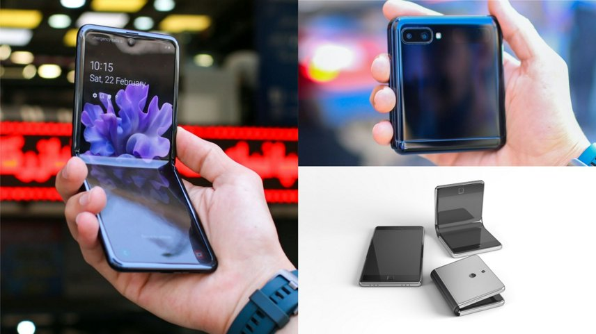
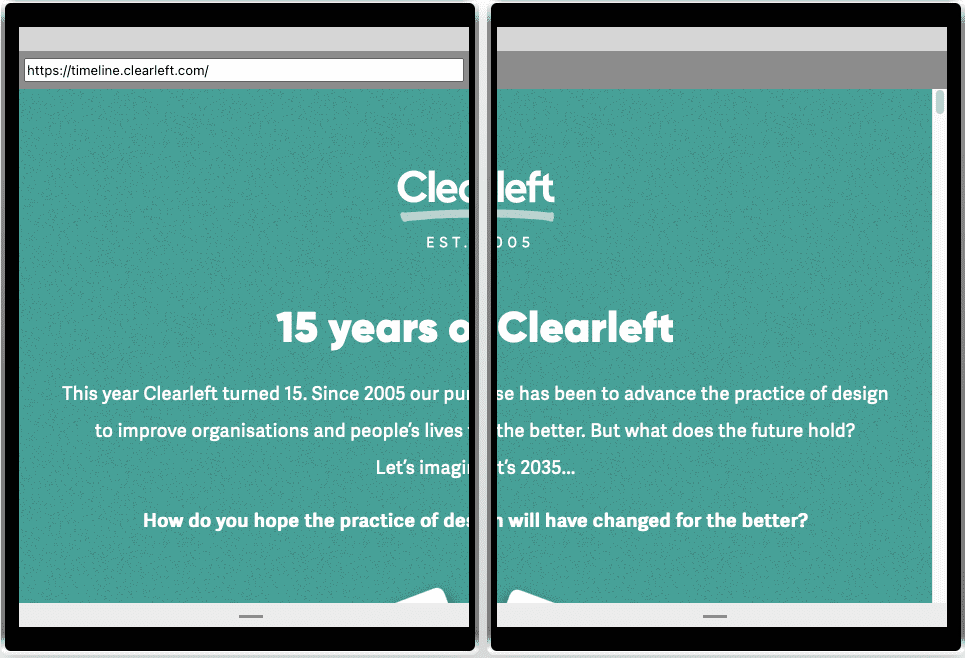
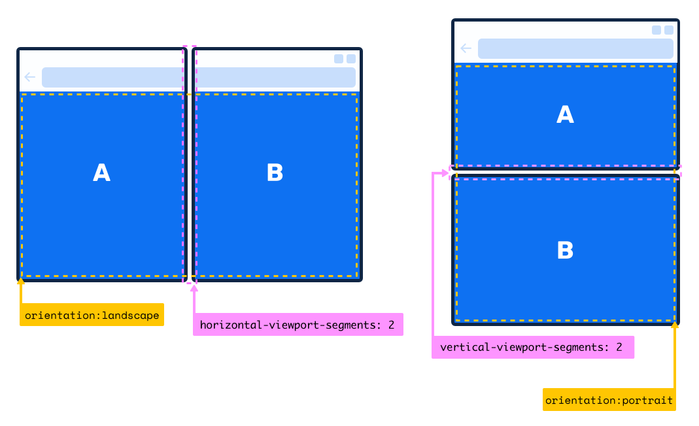
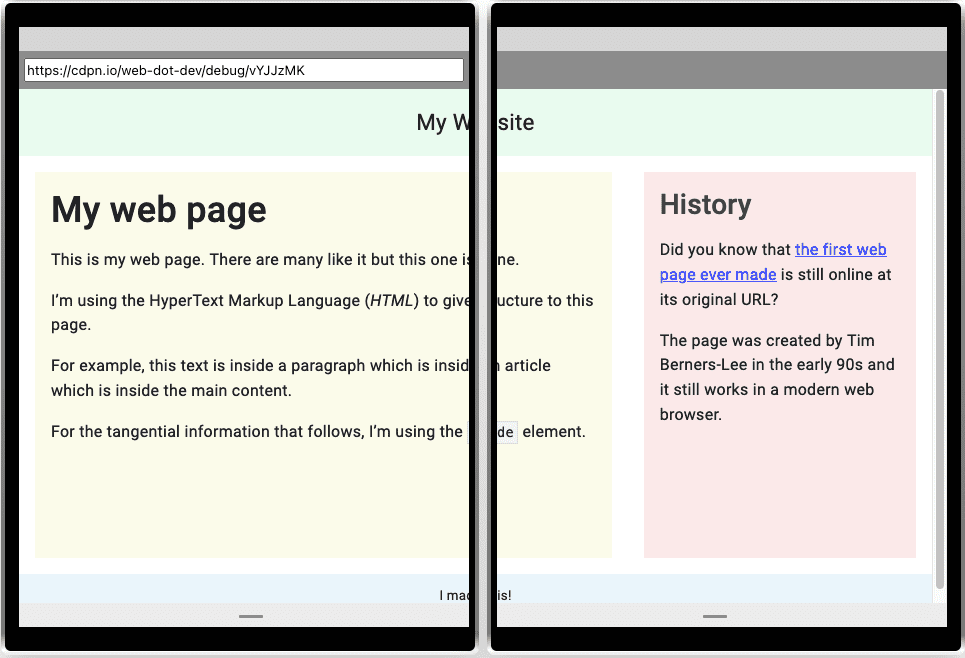
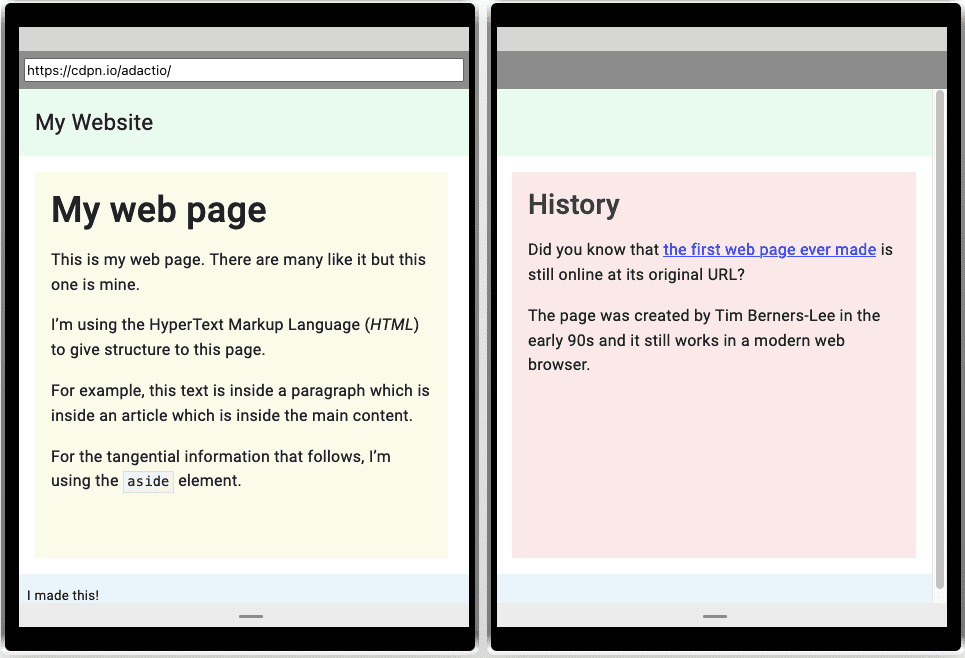
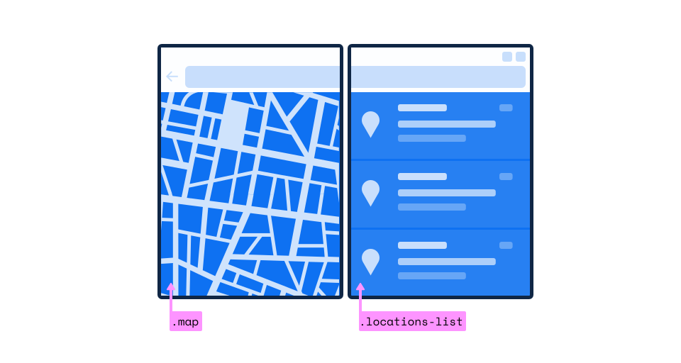

# Конфигурации экрана

Адаптивный веб-дизайн во многом стал реакцией на появление мобильных телефонов. До появления смартфонов мало кто всерьез задумывался о том, как должны выглядеть и восприниматься веб-сайты на портативных устройствах. Ситуация изменилась после стремительного роста числа мобильных телефонов со встроенными веб-браузерами.

Адаптивный веб-дизайн способствовал формированию мышления, которое ставило под сомнение сложившиеся представления. Если раньше было принято считать, что сайт можно просматривать только на стационарном компьютере, то теперь стандартной практикой является разработка такого же сайта для телефонов и планшетов. Более того, [использование мобильных устройств в настоящее время превысило использование настольных компьютеров](https://www.statista.com/statistics/277125/share-of-website-traffic-coming-from-mobile-devices/) в Интернете.

Адаптивное мышление поможет вам в будущем. Вполне возможно, что ваши сайты будут просматриваться на устройствах и экранах, которые сегодня мы даже не можем себе представить. И это мышление распространяется не только на экраны. Уже сейчас люди используют устройства без экранов для доступа к вашему контенту. Голосовые помощники могут использовать ваши сайты, если вы используете прочную основу семантического HTML.

В мире экранов тоже проводятся эксперименты. Сегодня на рынке представлены устройства со складными экранами. Это создает определенные трудности для дизайна.



## Двойные экраны

Пользователи складных устройств могут выбирать, будет ли их веб-браузер занимать только один из экранов или охватывать оба экрана. Если браузер будет занимать оба экрана, то отображаемый веб-сайт будет разделен петлей между двумя экранами. Выглядит это не очень красиво.



## Сегменты видового экрана

Существует экспериментальная медиафункция, предназначенная для определения того, отображается ли ваш сайт на устройстве с двумя экранами. Предлагаемое название медиафункции - `viewport-segments`. Существует две разновидности: `horizontal-viewport-segments` и `vertical-viewport-segments`.

!!!warning ""

    Функция `viewport-segments` является экспериментальным предложением, и ее синтаксис может измениться. Синтаксис уже изменился по сравнению с первоначальным предложением функции `spanning` media.

Если медиафункция `horizontal-viewport-segments` показывает значение `2`, а `vertical-viewport-segments` показывает значение `1`, это означает, что петля на устройстве проходит сверху вниз, разделяя содержимое на две панели, расположенные рядом друг с другом.

```css
@media (horizontal-viewport-segments: 2) and (vertical-viewport-segments: 1) {
    /* Styles for side-by-side screens. */
}
```

Если медиафункция `vertical-viewport-segments` имеет значение `2`, а `horizontal-viewport-segments` имеет значение `1`, то петля проходит из стороны в сторону, разделяя содержимое на две панели, одна на другую.

```css
@media (vertical-viewport-segments: 2) and (horizontal-viewport-segments: 1) {
    /* Styles for stacked screens. */
}
```

<figure markdown>

<figcaption markdown>Диаграмма из [Microsoft Edge Explainers](https://github.com/MicrosoftEdge/MSEdgeExplainers/blob/main/Foldables/explainer.md).</figcaption>
</figure>

Если оба значения `vertical-viewport-segments` и `horizontal-viewport-segments` равны `1`, это означает, что сайт отображается только на одном экране, даже если устройство имеет несколько экранов. Это эквивалентно отсутствию медиазапросов.

## Переменные окружения

Медиафункция `viewport-segments` сама по себе не поможет вам обойти эту раздражающую петлю. Необходимо знать размер петли. Именно здесь могут помочь переменные [environment](<https://developer.mozilla.org/docs/Web/CSS/env()>).

Переменные окружения в CSS позволяют учитывать в стилях неудобства, возникающие при работе с устройствами. Например, вырез на iPhone X можно оформить с помощью значений окружения `safe-area-inset-top`, `safe-area-inset-right`, `safe-area-inset-bottom` и `safe-area-inset-left`. Эти ключевые слова обернуты в функцию `env()`.

```css
body {
    padding-top: env(safe-area-inset-top);
    padding-right: env(safe-area-inset-right);
    padding-bottom: env(safe-area-inset-bottom);
    padding-left: env(safe-area-inset-left);
}
```

Переменные окружения работают как пользовательские свойства. Это означает, что можно передать запасной вариант на случай, если переменная окружения не существует.

```css
body {
    padding-top: env(safe-area-inset-top, 1em);
    padding-right: env(safe-area-inset-right, 1em);
    padding-bottom: env(safe-area-inset-bottom, 1em);
    padding-left: env(safe-area-inset-left, 1em);
}
```

Чтобы эти переменные окружения работали на iPhone X, обновите элемент `meta`, в котором указывается информация о `viewport`:

```html
<meta
    name="viewport"
    content="width=device-width, initial-scale=1, viewport-fit=cover"
/>
```

Теперь макет страницы будет занимать всю область просмотра и безопасно размещать документ с учетом значений вставки, предоставляемых устройством.

Для складных экранов предлагается ввести шесть новых переменных окружения: `viewport-segment-width`, `viewport-segment-height`, `viewport-segment-top`, `viewport-segment-left`, `viewport-segment-bottom`, `viewport-segment-right`.

!!!warning ""

    Помните, что сейчас это только на стадии предложения. Синтаксис переменных окружения может измениться.

<figure markdown>

<figcaption markdown>Диаграмма из [Microsoft Edge Explainers](https://github.com/MicrosoftEdge/MSEdgeExplainers/blob/main/Foldables/explainer.md).</figcaption>
</figure>

!!!note ""

    Может показаться несколько странным, что в качестве имен предлагаются `left`, `right`, `top` и `bottom`. Если бы вы использовали логические свойства, то ожидали бы таких терминов, как `inline-start`, `inline-end`, `block-start` и `block-end`. Однако в данном случае эти имена относятся к физическим свойствам оборудования, независимо от режима записи, используемого отображаемым сайтом.

Приведем пример макета с двумя колонками, одна из которых шире другой.

```css
@media (min-width: 45em) {
    main {
        display: flex;
        flex-direction: row;
    }
    main article {
        flex: 2;
    }
    main aside {
        flex: 1;
    }
}
```



Для двух экранов с вертикальным шарниром установите первый столбец равным ширине первого экрана, а второй - ширине второго.

```css
@media (horizontal-viewport-segments: 2) and (vertical-viewport-segments: 1) {
    main article {
        flex: 1 1 env(viewport-segment-width 0 0);
    }
    main aside {
        flex: 1;
    }
}
```



Рассматривайте двойные экраны как возможность. Возможно, на одном экране можно отображать прокручиваемый текстовый контент, а на другом - фиксированный элемент, например изображение или карту.

<figure markdown>

<figcaption markdown>Диаграмма из [Microsoft Edge Explainers](https://github.com/MicrosoftEdge/MSEdgeExplainers/blob/main/Foldables/explainer.md).</figcaption>
</figure>

## Будущее

Станут ли складные дисплеи следующей большой вещью? Кто знает. Никто не мог предсказать, насколько популярными станут мобильные устройства, поэтому стоит непредвзято относиться к будущим форм-факторам.

Прежде всего, стоит позаботиться о том, чтобы ваши сайты могли реагировать на любые изменения, которые могут произойти в будущем. Адаптивный дизайн - это не только набор практических приемов, но и образ мышления, который поможет вам в создании Интернета будущего.
