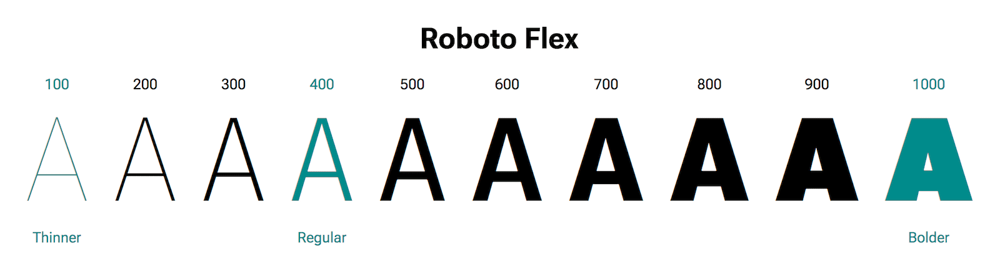

# Типографика

Если не указать стили для текста, браузеры будут применять свои собственные стили по умолчанию. Они называются таблицами стилей агента пользователя (_User Agent stylesheets_) и могут отличаться от браузера к браузеру. Пользователи также могут задавать свои собственные предпочтения при отображении текста.

Если не указать длину строки, браузеры будут заворачивать строки текста за край экрана. Таким образом, текст в Интернете по умолчанию является адаптивным - он подстраивается под область просмотра пользователя.

Но если текст помещается на экране, это еще не значит, что его удобно читать. Хорошая типографика - это представление текста в нужном виде. В типографике есть не только выбор подходящих шрифтов. Необходимо учитывать предпочтения пользователя, размер текста, длину строки и расстояние между строками текста.

!!!note ""

    Возможно, потребуется учесть и основной язык пользователя, так как в этом случае необходимо оставить место для акцентов и других специальных символов. Подробнее об этом можно узнать в модуле [интернационализация](internationalization.md).

## Размер текста

Сложно определить, какого размера должен быть текст в Интернете.

Если человек использует небольшой экран, то можно с уверенностью сказать, что экран будет находиться достаточно близко к глазам - на расстоянии вытянутой руки.

Однако с увеличением размеров экранов такую связь установить все труднее. Экран ноутбука, вероятно, будет находиться достаточно близко к зрителю, но широкоформатный монитор настольного компьютера по размеру примерно соответствует экрану телевизора. Люди сидят на расстоянии вытянутой руки от экрана настольного компьютера, но от телевизора они сидят гораздо дальше.

Тем не менее, хотя вы не можете знать наверняка, на каком расстоянии от экрана находится человек, вы можете попытаться использовать размеры текста, которые, как можно надеяться, окажутся подходящими. Используйте меньшие размеры текста для маленьких экранов и большие - для больших.

Можно использовать медиа-запросы для изменения свойства `font-size` при увеличении размера экрана.

```css
@media (min-width: 30em) {
    html {
        font-size: 125%;
    }
}

@media (min-width: 40em) {
    html {
        font-size: 150%;
    }
}

@media (min-width: 50em) {
    html {
        font-size: 175%;
    }
}

@media (min-width: 60em) {
    html {
        font-size: 200%;
    }
}
```

<iframe allow="camera; clipboard-read; clipboard-write; encrypted-media; geolocation; microphone; midi;" loading="lazy" src="https://codepen.io/web-dot-dev/embed/WNZeBWY?height=500&amp;theme-id=dark&amp;default-tab=result&amp;editable=true" style="height: 500px; width: 100%; border: 0;" data-title="Pen WNZeBWY by web-dot-dev on Codepen"></iframe>

<video controls loop autoplay>
<source src="/learn/design/typography-1.mp4" />
</video>

## Масштабирование текста

Переключение между фиксированными размерами текста в определенных точках останова происходит довольно нестабильно. Более адаптивный подход заключается в том, чтобы позволить ширине устройства пользователя влиять на размер текста.

Единица `vw` в CSS означает "ширину области просмотра". Привязка размера шрифта к ширине области просмотра означает, что текст будет увеличиваться и уменьшаться пропорционально ширине браузера. Таким образом, трудно предсказать, каким будет размер текста при любой конкретной ширине, но можно быть уверенным, что размер текста будет соответствовать ширине браузера пользователя.

Важно, чтобы в объявлении размера шрифта не использовалось само по себе выражение `vw`.

:material-thumb-down:{: style="color: red"} Плохо

```css
html {
    font-size: 2.5vw;
}
```

В противном случае пользователь не сможет изменить размер текста. Текст можно будет изменять, если использовать относительные единицы измерения, например `em`, `rem` или `ch`. Для этого отлично подходит функция CSS [`calc()`](../../css/calc.md).

:material-thumb-up:{: style="color: green"} Хорошо

```css
html {
    font-size: calc(0.75rem + 1.5vw);
}
```

Пусть браузер сам все просчитает. Таким образом, трудно точно предсказать, каким будет размер текста при определенной ширине, но вы знаете, что размер текста будет в нужном диапазоне. Браузер пользователя берет на себя заботу о точном расчете размера текста.

<iframe allow="camera; clipboard-read; clipboard-write; encrypted-media; geolocation; microphone; midi;" loading="lazy" src="https://codepen.io/web-dot-dev/embed/zYEOQQG?height=500&amp;theme-id=dark&amp;default-tab=result&amp;editable=true" style="height: 500px; width: 100%; border: 0;" data-title="Pen zYEOQQG by web-dot-dev on Codepen"></iframe>

<video controls loop autoplay>
<source src="/learn/design/typography-2.mp4" />
</video>

Но теперь есть вероятность того, что текст станет _слишком_ маленьким на узких экранах и _слишком_ большим на широких.

## Сжатие текста

Вероятно, вы не хотите, чтобы ваш текст уменьшался и увеличивался до крайних пределов. Вы можете контролировать, где начинается и где заканчивается масштабирование, используя функцию CSS [`clamp()`](../../css/clamp.md). Она "зажимает" масштабирование в определенном диапазоне.

Функция `clamp()` похожа на функцию `calc()`, но принимает три значения. Среднее значение совпадает с тем, которое вы передаете в функцию `calc()`. Открывающее значение задает минимальный размер, в данном случае 1rem, чтобы не опускаться ниже предпочитаемого пользователем размера шрифта. Закрывающее значение задает максимальный размер.

```css
html {
    font-size: clamp(1rem, 0.75rem + 1.5vw, 2rem);
}
```

<iframe allow="camera; clipboard-read; clipboard-write; encrypted-media; geolocation; microphone; midi;" loading="lazy" src="https://codepen.io/web-dot-dev/embed/wvrwbbx?height=500&amp;theme-id=dark&amp;default-tab=result&amp;editable=true" style="height: 500px; width: 100%; border: 0;" data-title="Pen wvrwbbx by web-dot-dev on Codepen"></iframe>

Теперь размер текста уменьшается и увеличивается пропорционально экрану пользователя, но размер текста никогда не будет ниже `1rem` или выше `2rem`.

<video controls loop autoplay>
<source src="learn/design/typography-3.mp4" />
</video>

## Длина строки

Интернет - это не печать, но мы можем извлечь уроки из мира печати и применить их в Интернете.

В своей классической книге [_The Elements of Typographic Style_](http://webtypography.net/2.1.2) Роберт Бринхерст так высказался по поводу длины строки (или меры):

> Любые от 45 до 75 символов считаются удовлетворительной длиной строки для одноколоночной страницы, набранной шрифтом с засечками и размером текста. Идеальной считается строка в 66 символов (считая буквы и пробелы). Для многоколоночной работы более оптимальным является среднее значение 40-50 символов.

В CSS нельзя задать длину строки напрямую. Свойства `line-length` не существует. Но вы можете предотвратить слишком большое увеличение ширины текста, ограничив ширину контейнера. Для этого отлично подходит свойство [`max-inline-size`](https://developer.mozilla.org/docs/Web/CSS/max-inline-size).

Не задавайте длину строки в фиксированных единицах, таких как `px`. Пользователи могут изменять размер шрифта в большую или меньшую сторону, и длина строки должна подстраиваться под них. Используйте [относительную единицу](../css3/sizing.md#relative-lengths), например `rem` или `ch`.

:material-thumb-down:{: style="color: red"} Плохо

```css
article {
    max-inline-size: 700px;
}
```

:material-thumb-up:{: style="color: green"} Хорошо

```css
article {
    max-inline-size: 66ch;
}
```

Использование единиц `ch` для ширины приведет к тому, что новые строки будут обернуты на 66-м символе при данном размере шрифта.

<iframe allow="camera; clipboard-read; clipboard-write; encrypted-media; geolocation; microphone; midi;" loading="lazy" src="https://codepen.io/web-dot-dev/embed/MWEgddN?height=500&amp;theme-id=dark&amp;default-tab=result&amp;editable=true" style="height: 500px; width: 100%; border: 0;" data-title="Pen MWEgddN by web-dot-dev on Codepen"></iframe>

<video controls loop autoplay>
<source src="/learn/design/typography-4.mp4" />
</video>

## Высота строки

Хотя в CSS не существует свойства `line-length`, есть свойство [`line-height`](../../css/line-height.md).

Более короткие строки текста могут иметь большие значения `line-height`. Но если использовать большие значения `line-height` для длинных строк текста, то читателю будет трудно переместиться от конца одной строки к началу следующей.

```css
article {
    max-inline-size: 66ch;
    line-height: 1.65;
}
blockquote {
    max-inline-size: 45ch;
    line-height: 2;
}
```

<iframe allow="camera; clipboard-read; clipboard-write; encrypted-media; geolocation; microphone; midi;" loading="lazy" src="https://codepen.io/web-dot-dev/embed/oNGvRrZ?height=500&amp;theme-id=dark&amp;default-tab=result&amp;editable=true" style="height: 500px; width: 100%; border: 0;" data-title="Pen oNGvRrZ by web-dot-dev on Codepen"></iframe>

<video controls loop autoplay>
<source src="/learn/design/typography-5.mp4" />
</video>

Для объявления `line-height` используйте значения без единиц измерения. Это гарантирует, что высота строки будет относительной по отношению к `font-size`.

:material-thumb-down:{: style="color: red"} Плохо

```css
line-height: 24px;
```

:material-thumb-up:{: style="color: green"} Хорошо

```css
line-height: 1.5;
```

## Комбинации и масштабы

При построении пользовательских интерфейсов не забывайте отдавать предпочтение иерархии для большей ясности и удобства работы со страницей. Отличным способом сделать это является [шкала типографики, встроенная в вашу систему дизайна](https://material.io/design/typography/the-type-system.html#type-scale).

## Веб-шрифты

Шрифт - это как голос для ваших слов. Долгое время в Интернете было очень мало вариантов шрифтов. Единственным вариантом были системные шрифты. Но теперь вы можете выбрать веб-шрифт, который будет соответствовать вашему содержанию.

Используйте `@font-face`, чтобы указать браузерам, где искать файлы веб-шрифтов. В качестве формата веб-шрифта используйте woff2. Он хорошо поддерживается и имеет наилучший прирост производительности.

```css
@font-face {
    font-family: Roboto;
    src: url('/fonts/roboto-regular.woff2') format('woff2');
}
body {
    font-family: Roboto, sans-serif;
}
```

Однако каждый добавленный файл веб-шрифта может ухудшить качество работы пользователя, поскольку увеличивает время загрузки страницы. Помните, что дизайн - это не только то, как выглядят конечные пиксели. То, как быстро эти пиксели прорисовываются, является важнейшей частью пользовательского опыта. Если пользователь чувствует себя быстро, это значит, что он работает хорошо.

## Загрузка шрифтов

Вы можете потребовать, чтобы браузеры начали загрузку файла шрифта как можно быстрее. Добавьте в `head` документа элемент `link`, ссылающийся на файл веб-шрифта. Атрибут `rel` со значением `preload` указывает браузеру на приоритетность этого файла. Атрибут `as` со значением `font` сообщает браузеру, что это за файл. Атрибут `type` позволяет быть еще более конкретным.

```html
<link
    href="/fonts/roboto-regular.woff2"
    type="font/woff2"
    rel="preload"
    as="font"
    crossorigin
/>
```

Атрибут `crossorigin` необходимо включать, даже если вы размещаете файлы шрифтов самостоятельно.

Используйте свойство CSS [`font-display`](https://developer.mozilla.org/docs/Web/CSS/@font-face/font-display), чтобы указать браузеру, как управлять переходом от системного шрифта к веб-шрифту. Можно выбрать вариант, при котором текст вообще не будет отображаться до тех пор, пока не загрузится веб-шрифт. Можно сразу отобразить системный шрифт, а затем переключиться на веб-шрифт после его загрузки. Обе стратегии имеют свои недостатки. Если ждать, пока загрузится веб-шрифт, то пользователь может долго смотреть на пустую страницу. Если сначала показать текст системным шрифтом, а затем переключиться на веб-шрифт, пользователи могут ощутить резкое смещение содержимого страницы.

!!!note ""

    Уменьшить эффект смещения текста можно, используя `size-adjust` в правиле `@font-face`.

Хорошим компромиссом является выжидание некоторого времени перед отображением текста. Если веб-шрифт загрузится до истечения этого времени, то текст будет отображаться с использованием веб-шрифта без смещения содержимого. Если по истечении этого времени веб-шрифт так и не загрузился, то текст отображается системным шрифтом, чтобы пользователь мог хотя бы прочитать содержимое.

Используйте значение `font-display`, равное `swap`, если вы хотите, чтобы веб-шрифт заменял системный шрифт, когда он наконец загрузится.

```css
body {
    font-family: Roboto, sans-serif;
    font-display: swap;
}
```

Используйте значение `font-display` равное `fallback`, если вы хотите сохранить системный шрифт после отрисовки текста.

```css
body {
    font-family: Roboto, sans-serif;
    font-display: fallback;
}
```

## Переменные шрифты

Если вы используете много разных весов или стилей одного и того же шрифта, то в итоге может получиться много отдельных файлов шрифтов - отдельный файл шрифта для каждого веса или стиля.

[Variable fonts](https://web.dev/articles/variable-fonts) решает эту проблему за счет использования одного файла. Вместо того чтобы иметь отдельные файлы для обычного, жирного, сверхжирного и т.д., файл переменного шрифта является адаптивным. Он содержит всю информацию, необходимую для отображения в различных весах и стилях.



Это означает, что один файл переменного шрифта больше, чем один файл обычного шрифта, но один файл переменного шрифта, вероятно, будет меньше, чем несколько файлов обычного шрифта. Если вы используете большое количество шрифтов разного веса, то переменный шрифт может дать большой выигрыш в производительности.

!!!note ""

    Если для стилизации элементов используется значение `system-ui` для свойства `font-face`, то можно получить все преимущества переменных шрифтов без загрузки файлов шрифтов. [Все больше и больше системных шрифтов становятся переменными](https://web.dev/articles/more-variable-font-options-in-chromium-83).

Хорошая типографика в Интернете - это не только выбор шрифта, который вы делаете как дизайнер. Адаптивная типографика - это еще и уважение к устройству пользователя и его сетевому подключению. Конечный результат - дизайн, который воспринимается правильно независимо от того, как его просматривают.

Теперь, когда вы освоили адаптивный текст, самое время перейти к [адаптивным изображениям](responsive-images.md).
