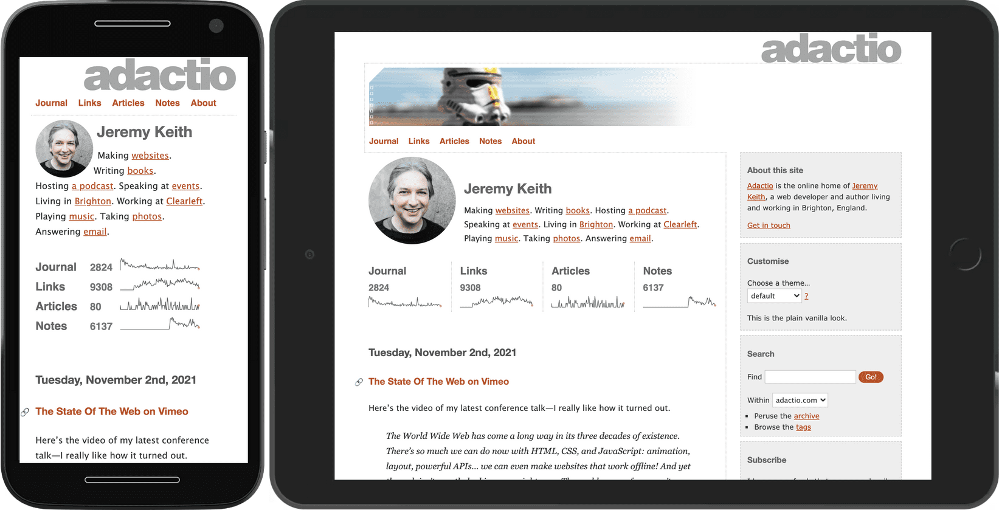
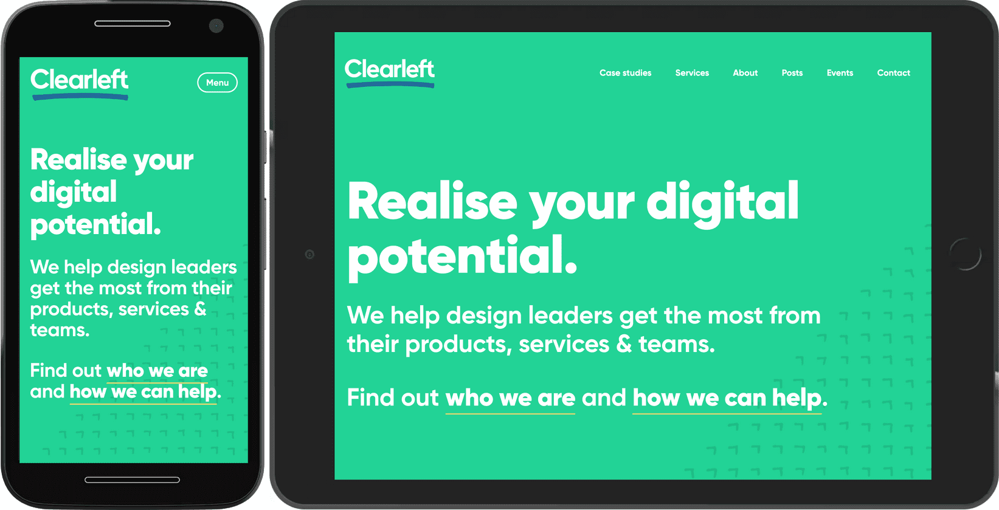
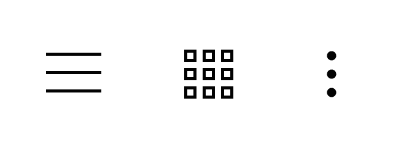

# Шаблоны UI

Дизайн, представленный на маленьком экране, не должен выглядеть как уменьшенная версия макета на большом экране. Аналогичным образом, дизайн на большом экране не должен выглядеть как увеличенная версия макета на маленьком экране. Вместо этого дизайн должен быть достаточно гибким, чтобы адаптироваться ко всем размерам экрана. Успешный адаптивный дизайн позволяет максимально использовать все форм-факторы.

Это означает, что некоторые элементы интерфейса могут выглядеть совершенно по-разному в зависимости от того, в каком контексте они рассматриваются. Возможно, придется применить совершенно разные CSS к одной и той же кодовой базе HTML, чтобы максимально использовать разные размеры экрана. Это может быть довольно сложной задачей!

Вот некоторые общие проблемы, с которыми вы можете столкнуться.

## Навигация

Отображение списка навигационных ссылок на большом экране довольно простое. Там достаточно места для размещения этих ссылок.

На маленьком экране места больше. При проектировании в такой ситуации возникает соблазн спрятать навигацию за кнопкой. Проблема такого решения заключается в том, что пользователю придется сделать два шага: открыть меню и выбрать нужный пункт. Пока меню не открыто, пользователь остается в недоумении: "Куда же мне идти?".

Попробуйте найти стратегию, позволяющую избежать скрытия навигации. Если у вас относительно небольшое количество пунктов, вы можете оформить навигацию так, чтобы она хорошо смотрелась на небольших экранах.



Эта схема не будет работать, если в навигации много ссылок. Навигация будет выглядеть загроможденной, если ссылки будут занимать две или три строки на маленьком экране.

Одним из возможных решений является размещение ссылок в одной строке, но усечение списка у края экрана. Пользователи могут провести пальцем по горизонтали, чтобы открыть ссылки, которые не видны сразу. Это и есть схема переполнения.

<video controls>
<source src="/learn/design/ui-patterns-2.mp4" />
</video>

Преимущество этого метода заключается в том, что он масштабируется под любую ширину устройства и любое количество ссылок. Недостатком является то, что пользователи могут пропустить ссылки, которые изначально не видны. Если вы используете этот прием для основной навигации, убедитесь, что первые несколько ссылок являются наиболее важными, и визуально укажите, что в списке есть еще пункты. В предыдущем примере для этого используется градиент.

В крайнем случае, можно сделать навигацию скрытой по умолчанию и предоставить пользователям механизм переключения для показа и скрытия ее содержимого. Это называется прогрессивным раскрытием.



Убедитесь, что кнопка, переключающая отображение навигации, снабжена ярлыком. Не полагайтесь на то, что вас поймут по пиктограмме.



Пиктограмма без надписи - это навигация "с загадочным мясом": пользователь не поймет, что там находится, пока не откусит кусочек. Поместите текстовую метку, чтобы пользователи знали, что откроет кнопка.

<video controls loop>
<source src="/learn/design/ui-patterns-5.mp4" />
</video>

## Карусели

То, что справедливо для навигации, справедливо и для другого контента: старайтесь ничего не скрывать. Карусель - один из распространенных способов скрыть содержимое. Она может выглядеть довольно аккуратно, но велика вероятность того, что пользователи никогда не обнаружат скрытый контент. Карусели лучше решают организационные задачи - например, определяют, какой контент должен быть размещен на главной странице, - чем обслуживают пользователей.

Тем не менее, в условиях ограниченного пространства карусели могут предотвратить слишком длинные и загроможденные страницы. Можно использовать гибридный подход: показывать контент в виде карусели для маленьких экранов, а для больших - в виде сетки.

Для узких экранов можно отображать элементы в ряд с помощью flexbox. Ряд элементов будет выходить за границы экрана. Используйте `overflow-x: auto`, чтобы обеспечить горизонтальное пролистывание.

```css
@media (max-width: 50em) {
    .cards {
        display: flex;
        flex-direction: row;
        overflow-x: auto;
        scroll-snap-type: inline mandatory;
        scroll-behavior: smooth;
    }
    .cards .card {
        flex-shrink: 0;
        flex-basis: 15em;
        scroll-snap-align: start;
    }
}
```

!!!note ""

    Логической версией `overflow-x` является [`overflow-inline`](https://developer.mozilla.org/docs/Web/CSS/overflow-inline), что лучше сочетается со значением для `scroll-snap-type`. В данном примере используется физическая версия для лучшей кроссбраузерной поддержки.

Свойства [`scroll-snap`](https://web.dev/articles/css-scroll-snap) обеспечивают плавное пролистывание элементов. Благодаря `scroll-snap-type: inline mandatory` элементы защелкиваются на месте.

Если экран достаточно большой - в данном случае шире `50em` - переключитесь на сетку и отобразите элементы в строках и столбцах, ничего не скрывая.

```css
@media (min-width: 50em) {
    .cards {
        display: grid;
        grid-template-columns: repeat(
            auto-fill,
            minmax(15em, 1fr)
        );
    }
}
```

<iframe allow="camera; clipboard-read; clipboard-write; encrypted-media; geolocation; microphone; midi;" loading="lazy" src="https://codepen.io/web-dot-dev/embed/XWeNPzY?height=500&amp;theme-id=dark&amp;default-tab=result&amp;editable=true" style="height: 500px; width: 100%; border: 0;" data-title="Pen XWeNPzY by web-dot-dev on Codepen"></iframe>

<video controls loop>
<source src="/learn/design/ui-patterns-6.mp4" />
</video>

Очень важно, что элемент в карусели не занимает всю ширину. Если бы это было так, то не было бы никаких признаков того, что за границей области просмотра имеется дополнительное содержимое.

Карусели - это еще один пример действия паттерна переполнения. Если у вас есть много элементов, которые люди могут просматривать, вы можете продолжать использовать шаблон переполнения даже на больших экранах, включая телевизоры. В этом [media scroller](https://gui-challenges.web.app/media-scroller/dist/) используется несколько каруселей для управления значительным количеством опций.

И снова свойства `scroll-snap` обеспечивают плавность взаимодействия. Также обратите внимание, что к изображениям в карусели применено свойство `loading="lazy"`. В данном случае изображения находятся не под сгибом, а за его краем, но действует тот же принцип: если пользователь никогда не прокручивает страницу до этого элемента, изображение не загружается, что позволяет сэкономить полосу пропускания.

<iframe allow="camera; clipboard-read; clipboard-write; encrypted-media; geolocation; microphone; midi;" loading="lazy" src="https://codepen.io/argyleink/embed/bGgyOGP?height=500&amp;theme-id=dark&amp;default-tab=result&amp;editable=true" style="height: 500px; width: 100%; border: 0;" data-title="Pen bGgyOGP by argyleink on Codepen"></iframe>

!!!note ""

    В предыдущем примере показана более полная демонстрация, подробнее о ней можно прочитать в статье [построение компонента media scroller](https://web.dev/articles/building/a-media-scroller-component).

С помощью JavaScript в карусель можно добавить интерактивные элементы управления. Можно даже сделать так, чтобы она автоматически переходила от одного элемента к другому. Но прежде чем делать это, хорошо подумайте - автоматическое воспроизведение может сработать, если карусель является единственным содержимым страницы, но автоматически воспроизводящаяся карусель будет невероятно раздражать, если кто-то пытается взаимодействовать с другим содержимым (например, читать текст). Вы можете прочитать больше [лучшие практики использования карусели](https://web.dev/articles/carousel-best-practices).

## Таблицы данных

Элемент `table` прекрасно подходит для структурирования табличных данных: строк и столбцов связанной информации. Но если таблица будет слишком большой, она может нарушить верстку на малом экране.

Для таблиц можно применить шаблон переполнения. В данном примере таблица обернута в `div` с классом `table-container`.

```css
.table-container {
    max-inline-size: 100%;
    overflow-x: auto;
    scroll-snap-type: inline mandatory;
    scroll-behavior: smooth;
}
.table-container th,
.table-container td {
    scroll-snap-align: start;
    padding: var(--metric-box-spacing);
}
```

<iframe allow="camera; clipboard-read; clipboard-write; encrypted-media; geolocation; microphone; midi;" loading="lazy" src="https://codepen.io/web-dot-dev/embed/MWEbqQQ?height=500&amp;theme-id=dark&amp;default-tab=result&amp;editable=true" style="height: 500px; width: 100%; border: 0;" data-title="Pen MWEbqQQ by web-dot-dev on Codepen"></iframe>

## Рекомендации

Шаблон переполнения является хорошим компромиссом для небольших экранов, но при этом необходимо убедиться, что содержимое за пределами экрана доступно для просмотра. Рассмотрите возможность размещения тени или градиента над краем, где содержимое усекается.

Прогрессивное раскрытие - полезный способ экономии пространства, но будьте осторожны с его использованием для очень важного контента. Оно лучше подходит для второстепенных действий. Убедитесь, что элемент интерфейса, вызывающий раскрытие, четко обозначен - не полагайтесь только на иконографию.

В первую очередь разрабатывайте дизайн для небольших экранов. Легче адаптировать дизайн малых экранов к большим, чем наоборот. Если сначала разрабатывать дизайн для большого экрана, то есть опасность, что дизайн для малого экрана будет казаться второстепенным.

Другие шаблоны верстки и элементов пользовательского интерфейса можно найти в разделе web.dev [Patterns](https://web.dev/patterns).

При адаптации элементов интерфейса к различным размерам экрана медиазапросы очень полезны для определения размеров устройства. Но такие медиафункции, как `min-width` и `min-height`, - это только начало. Далее вы познакомитесь с целым рядом других медиафункций.
