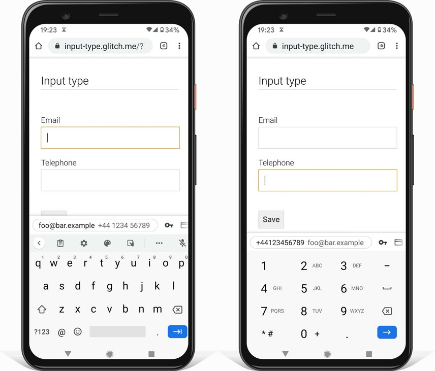
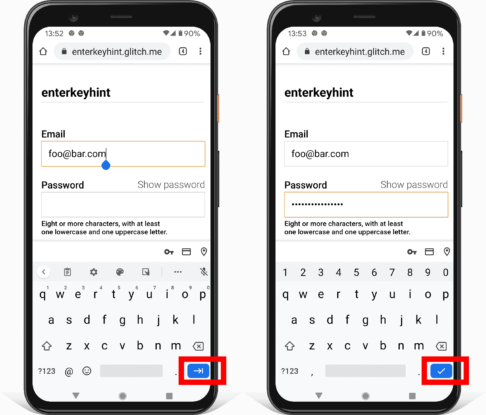

# Подробно об атрибутах формы

<big>Узнайте все об атрибутах формы: как изменить расположение экранных клавиатур, активировать встроенную валидацию и многое другое.</big>

Атрибуты HTML-элементов могут улучшить `<form>` и элементы управления формы.

## Помогите пользователям заполнять элементы управления формами

Чтобы облегчить пользователям заполнение форм, используйте соответствующий атрибут `type` для элементов `<input>`.

Браузеры отображают пользовательский интерфейс, соответствующий `типу`, например, переключатель даты для `<input>` типа `date`. Браузеры на мобильных устройствах отображают адаптированную экранную клавиатуру, например, клавиатуру телефонного номера для `type="tel"`.

Некоторые типы `<input>` также изменяют правила валидации элемента при отправке формы. `<input type="url">`, например, действителен только в том случае, если он не пуст и его значением является URL.

## Обеспечьте ввод данных пользователями

Существуют различные атрибуты для обеспечения соответствующей экранной клавиатуры на сенсорных устройствах. Первый вариант - это использование атрибута `type`, о котором говорилось выше.

Другой вариант - атрибут `inputmode`, поддерживаемый на [Android и iOS](https://caniuse.com/?search=inputmode). В отличие от атрибута `type`, атрибут `inputmode` изменяет только предоставляемую экранную клавиатуру, а не поведение самого элемента. Использование `inputmode` является хорошим вариантом, если вы хотите сохранить стандартный пользовательский интерфейс и стандартные правила валидации для `<input>`, но при этом хотите получить оптимизированную экранную клавиатуру.

!!!note ""

    Используйте `type="number"` только для инкрементных полей, таких как количество товара. Браузеры показывают стрелку вверх/вниз для `type="number"`, что не имеет смысла для телефонных номеров, номеров платежных карт или счетов. Для телефонных номеров используйте `type="tel"`. Для других номеров используйте `inputmode="numeric"`, чтобы получить цифровую экранную клавиатуру.



С помощью атрибута `enterkeyhint` можно изменить значение клавиши `Enter` на экранных клавиатурах. Например, `enterkeyhint="next"` или `enterkeyhint="done"` изменяет метку кнопки на соответствующий значок. Таким образом, пользователю становится понятнее, что происходит при отправке текущей формы.



!!!warning ""

    Автоматическая фокусировка элемента управления формы с помощью атрибута `autofocus` может сбить с толку людей, в том числе пользователей программ чтения с экрана и людей с когнитивными нарушениями. Поэтому мы рекомендуем не использовать атрибут `autofocus`.

## Убедитесь, что пользователи могут отправить форму

Допустим, вы заполнили `<form>`, нажали кнопку **Submit**, но ничего не произошло. Проблема может заключаться в том, что кнопка была отключена с помощью атрибута `disabled`. Обычно кнопка **Submit** отключается до тех пор, пока форма не станет действительной.

Теоретически это звучит разумно, но не стоит отключать кнопку **Submit** в ожидании полного и корректного ввода данных пользователем. Вместо этого выделите недопустимые данные при их вводе и выделите проблемные поля при отправке формы пользователю.

Однако вы можете отключить кнопку **Submit** после того, как форма успешно отправлена, но еще не обработана. Подробнее о [отключенных кнопках](https://www.smashingmagazine.com/2021/08/frustrating-design-patterns-disabled-buttons/#when-disabled-buttons-and-states-work-well).

## Помогите пользователям, показывая введенные ими ранее данные

Представьте, что у вас есть форма оформления заказа, состоящая из нескольких шагов. Как обеспечить сохранение ранее введенных значений, когда пользователь возвращается на предыдущий шаг? Используйте атрибут `value` для отображения уже введенных значений.

```html
<label for="name">Name</label>
<input value="Hilda" name="name" id="name" type="text" />
```

В JavaScript существует несколько способов получения значения элемента управления формы. Можно использовать свойство [`value`](https://developer.mozilla.org/docs/Web/HTML/Element/input#attr-value), а можно получить доступ к значению с помощью [`getAttribute('value')`](https://developer.mozilla.org/docs/Web/API/Element/getAttribute). Есть одно существенное отличие - свойство `value` всегда возвращает текущее значение, а использование `getAttribute()` всегда возвращает начальное значение.

[Попробуйте](https://codepen.io/web-dot-dev/pen/20359edfc39a65c291c3c186a33ab0db?editors=0011)! Измените текст поля name и посмотрите в консоль. Обратите внимание, что свойство `value` возвращает текущий видимый текст, а `getAttribute('value')` всегда возвращает начальное значение.

Подробнее о разнице между [DOM-атрибутами и DOM-свойствами](https://stackoverflow.com/questions/6003819/what-is-the-difference-between-properties-and-attributes-in-html/6004028#6004028).

!!!note ""

    Чтобы получить все значения элементов управления формы, используйте метод [`FormData`](https://developer.mozilla.org/docs/Web/API/FormData). Объект `FormData` представляет собой набор пар ключ/значение, представляющих элементы управления формы, и имеет тот же формат, что и метод [`submit()`](https://developer.mozilla.org/docs/Web/API/HTMLFormElement/submit).

Для элементов `<input>` типа `checkbox` или `radio` используется атрибут `checked`. Добавьте его, если пользователь выбрал опцию, и удалите в противном случае.

## Убедитесь, что пользователи понимают ожидаемый формат.

Значение атрибута `placeholder` является подсказкой, какого рода информация ожидается.

```html
<label for="name">Name</label>
<input
    type="text"
    name="name"
    id="name"
    placeholder="Karin"
/>
```

Это может ввести пользователей в заблуждение, поскольку может показаться нелогичным, почему элемент управления формы оказывается уже заполненным. Кроме того, добавление заполнителя может затруднить понимание того, какие поля формы еще необходимо заполнить. Кроме того, стандартный стиль текста заполнителя может быть трудночитаемым.

В общем, будьте осторожны при использовании атрибута `placeholder` и никогда не используйте атрибут `placeholder` для пояснения элемента управления формой. Вместо него используйте элемент `<label>`. Подробнее о [почему следует избегать атрибута `placeholder`](https://www.smashingmagazine.com/2018/06/placeholder-attribute/).

Лучший способ дать пользователям подсказку о том, какая информация ожидается, - использовать дополнительный HTML-элемент под элементом управления формой, чтобы добавить пояснение или пример.

<iframe loading="lazy" src="https://codepen.io/web-dot-dev/embed/90199b1fdcbfbcea425686884344352d?height=300&amp;theme-id=light&amp;default-tab=result&amp;editable=true" style="height: 300px; width: 100%; border: 0;"></iframe>

## Убедитесь, что элементы управления формы готовы к валидации

Для активации встроенной проверки существуют различные HTML-атрибуты. Для предотвращения ввода пустых полей используйте атрибут `required`. Дополнительные проверки могут быть выполнены с помощью атрибута `type`. Например, значение обязательного `<input>` с `type="url"` должно быть URL.

Чтобы убедиться, что пользователь вводит минимальное количество символов, используйте атрибут `minlength`. Чтобы запретить ввод значения, превышающего максимальное количество символов, используйте атрибут `maxlength`. Для числовых типов ввода, таких как `<input type="number">`, вместо этого используйте атрибуты `min` и `max`.

Подробнее о валидации: [Помогите пользователям вводить правильные данные в формы](validation.md).

## Resources

-   [Атрибуты `<input>`](../../html/input.md#атрибуты)
-   [Глобальные атрибуты](../../html/uni-attr.md)

:material-information-outline: Источник &mdash; [Form attributes in depth](https://web.dev/learn/forms/attributes/)
