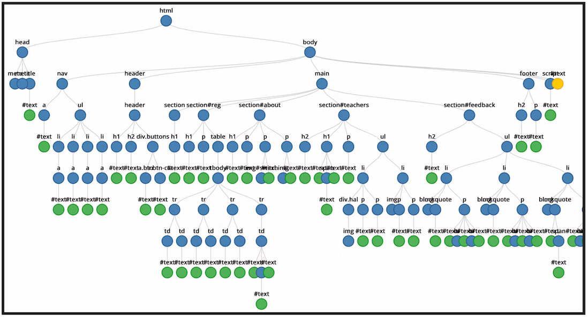
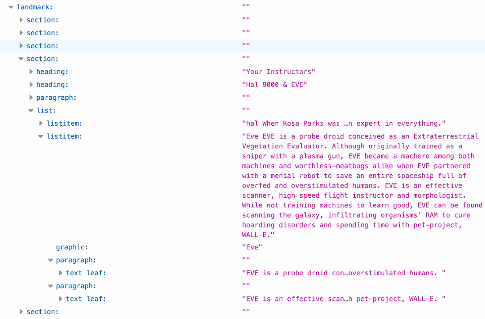

# HTML API

<big>Узнайте, как можно раскрывать информацию HTML и манипулировать ею с помощью JavaScript.</big>

Во введении к этой серии статей говорится: "Элементы HTML - это узлы, из которых состоит [Document Object Model](https://developer.mozilla.org/docs/Web/API/Document_Object_Model)". Мы рассмотрели типы узлов элементов. В этом разделе мы рассмотрим API элементов, которые позволяют выполнять запросы к этим узлам.

## DOM и AOM

**DOM** - это API для доступа к документам и манипулирования ими. DOM - это дерево всех узлов документа. Некоторые узлы могут иметь дочерние элементы, другие - нет. Дерево включает в себя элементы с их атрибутами и текстовые узлы.



Инструменты браузера не предоставляют визуализации дерева, подобной приведенной выше, но вы можете увидеть узлы в инспекторе элементов.


Древовидное представление, которое можно проверить в инструментах разработчика браузера, - это [дерево доступности](../accessibility/aria-html.md#the-accessibility-tree). **AOM** основан на DOM; аналогичным образом дерево доступности содержит объекты, представляющие все элементы разметки, атрибуты и текстовые узлы:



## API элементов HTML

Средняя буква DOM - "объект". Подобно примерам с объектами `person` или `car` из большинства вводных курсов по объектно-ориентированному программированию, каждый узел в дереве документа является объектом, которым можно манипулировать с помощью JavaScript.

Браузер предоставляет многочисленные API, обеспечивающие встроенную поддержку методов, событий, запросов и обновления свойств. Узлы элементов содержат информацию обо всех атрибутах, установленных для данного элемента. Для доступа к информации об атрибутах элемента можно использовать HTML-интерфейсы. Например, с помощью [`HTMLImageElement.alt`](https://developer.mozilla.org/docs/Web/API/HTMLImageElement/alt) можно получить атрибуты `alt` всех изображений:

```js
let allImages = document.querySelectorAll('img');
allImages.forEach((imageInstance) => {
    console.log(imageInstance.alt);
});
```

HTML-интерфейсы предоставляют не только доступ к атрибутам элемента; можно получить доступ к гораздо большему количеству информации. Мы можем найти доступный только для чтения параметр [`HTMLElement.offsetHeight`](https://developer.mozilla.org/docs/Web/API/HTMLElement/offsetHeight), чтобы получить высоту каждой секции на нашей странице относительно макета.

```js
let allSections = document.querySelectorAll('section');
allSections.forEach((sectionInstance) => {
    console.log(sectionInstance.offsetHeight);
});
```

Если пользователь меняет ориентацию устройства или иным образом изменяет ширину области просмотра, то высота каждого `<section>` будет меняться, и свойства DOM будут автоматически обновляться вместе с ней.

API-интерфейс HTML не ограничивается доступом к значениям атрибутов. DOM предоставляет информацию о текущем состоянии пользовательского интерфейса. API-интерфейсы HTML могут получить доступ ко всей этой информации. Вы можете получить доступ к длительности видеоролика, к тому, где находится вид в текущем воспроизведении, и к тому, закончилось ли воспроизведение видео (или аудио) с помощью функций [`HTMLMediaElement.duration`](https://developer.mozilla.org/docs/Web/API/HTMLMediaElement/duration), [`HTMLMediaElement.currentTime`](https://developer.mozilla.org/docs/Web/API/HTMLMediaElement/currentTime) и [`HTMLMediaElement.ended`](https://developer.mozilla.org/docs/Web/API/HTMLMediaElement/ended) соответственно.

## Доступные интерфейсы элементов

Большинство элементов HTML, которые мы уже рассмотрели в этой серии статей и которые нам еще предстоит рассмотреть, за исключением некоторых [секционных элементов](headings-and-sections.md), имеют соответствующий интерфейс DOM. Базовый интерфейс для всех элементов носит меткое название [Element](https://developer.mozilla.org/docs/Web/API/Element). От `Element` наследуется [`HTMLElement`](https://developer.mozilla.org/docs/Web/API/HTMLElement), а от него - все специфические для HTML-элементов интерфейсы. Некоторые специфические для элементов интерфейсы реализуются несколькими похожими элементами.

К таким интерфейсам относятся:

-   [`HTMLAnchorElement`](https://developer.mozilla.org/docs/Web/API/HTMLAnchorElement) - `<a>`
-   [`HTMLAreaElement`](https://developer.mozilla.org/docs/Web/API/HTMLAreaElement) - `<area>`
-   [`HTMLAudioElement`](https://developer.mozilla.org/docs/Web/API/HTMLAudioElement) - `<audio>`
-   [`HTMLBaseElement`](https://developer.mozilla.org/docs/Web/API/HTMLBaseElement) - `<base>`
-   [`HTMLButtonElement`](https://developer.mozilla.org/docs/Web/API/HTMLButtonElement) - `<button>`
-   [`HTMLCanvasElement`](https://developer.mozilla.org/docs/Web/API/HTMLCanvasElement) - `<canvas>`
-   [`HTMLDataElement`](https://developer.mozilla.org/docs/Web/API/HTMLDataElement) - `<data>`
-   [`HTMLDataListElement`](https://developer.mozilla.org/docs/Web/API/HTMLDataListElement) - `<datalist>`
-   [`HTMLDetailsElement`](https://developer.mozilla.org/docs/Web/API/HTMLDetailsElement) - `<details>`
-   [`HTMLDialogElement`](https://developer.mozilla.org/docs/Web/API/HTMLDialogElement) - `<dialog>`
-   [`HTMLEmbedElement`](https://developer.mozilla.org/docs/Web/API/HTMLEmbedElement) - `<embed>`
-   [`HTMLFieldSetElement`](https://developer.mozilla.org/docs/Web/API/HTMLFieldSetElement) - `<fieldset>`
-   [`HTMLFormElement`](https://developer.mozilla.org/docs/Web/API/HTMLFormElement) - `<form>`
-   [`HTMLHtmlElement`](https://developer.mozilla.org/docs/Web/API/HTMLHtmlElement) - `<html>`
-   [`HTMLIFrameElement`](https://developer.mozilla.org/docs/Web/API/HTMLIFrameElement) - `<iframe>`
-   [`HTMLImageElement`](https://developer.mozilla.org/docs/Web/API/HTMLImageElement) - ``
-   [`HTMLInputElement`](https://developer.mozilla.org/docs/Web/API/HTMLInputElement) - `<input>`
-   [`HTMLLabelElement`](https://developer.mozilla.org/docs/Web/API/HTMLLabelElement) - `<label>`
-   [`HTMLLegendElement`](https://developer.mozilla.org/docs/Web/API/HTMLLegendElement) - `<legend>`
-   [`HTMLLIElement`](https://developer.mozilla.org/docs/Web/API/HTMLLIElement) - `<li>`
-   [`HTMLLinkElement`](https://developer.mozilla.org/docs/Web/API/HTMLLinkElement) - `<link>`
-   [`HTMLMapElement`](https://developer.mozilla.org/docs/Web/API/HTMLMapElement) - `<map>`
-   [`HTMLMediaElement`](https://developer.mozilla.org/docs/Web/API/HTMLMediaElement) - `<audio>`, `<video>`
-   [`HTMLMenuElement`](https://developer.mozilla.org/docs/Web/API/HTMLMenuElement) - `<menu>`
-   [`HTMLMetaElement`](https://developer.mozilla.org/docs/Web/API/HTMLMetaElement) - `<meta>`
-   [`HTMLMeterElement`](https://developer.mozilla.org/docs/Web/API/HTMLMeterElement) - `<meter>`
-   [`HTMLModElement`](https://developer.mozilla.org/docs/Web/API/HTMLModElement) - `<ins>`, `<del>`
-   [`HTMLObjectElement`](https://developer.mozilla.org/docs/Web/API/HTMLObjectElement) - `<object>`
-   [`HTMLOListElement`](https://developer.mozilla.org/docs/Web/API/HTMLOListElement) - `<ol>`
-   [`HTMLOptGroupElement`](https://developer.mozilla.org/docs/Web/API/HTMLOptGroupElement)- `<optgroup>`
-   [`HTMLOptionElement`](https://developer.mozilla.org/docs/Web/API/HTMLOptionElement) - `<option>`
-   [`HTMLOutputElement`](https://developer.mozilla.org/docs/Web/API/HTMLOutputElement) - `<output>`
-   [`HTMLPictureElement`](https://developer.mozilla.org/docs/Web/API/HTMLPictureElement) - `<picture>`
-   [`HTMLProgressElement`](https://developer.mozilla.org/docs/Web/API/HTMLProgressElement) - `<progress>`
-   [`HTMLQuoteElement`](https://developer.mozilla.org/docs/Web/API/HTMLQuoteElement) - `<q>`, `<blockquote>`, `<cite>`
-   [`HTMLScriptElement`](https://developer.mozilla.org/docs/Web/API/HTMLScriptElement) - `<script>`
-   [`HTMLSelectElement`](https://developer.mozilla.org/docs/Web/API/HTMLSelectElement) - `<select>`
-   [`HTMLSlotElement`](https://developer.mozilla.org/docs/Web/API/HTMLSlotElement) - `<slot>`
-   [`HTMLSourceElement`](https://developer.mozilla.org/docs/Web/API/HTMLSourceElement) - `<source>`
-   [`HTMLStyleElement`](https://developer.mozilla.org/docs/Web/API/HTMLStyleElement) - `<style>`
-   [`HTMLTableCellElement`](https://developer.mozilla.org/docs/Web/API/HTMLTableCellElement) - `<td>`, `<th>`
-   [`HTMLTableColElement`](https://developer.mozilla.org/docs/Web/API/HTMLTableColElement) - `<col>`, `<colgroup>`
-   [`HTMLTableElement`](https://developer.mozilla.org/docs/Web/API/HTMLTableElement) - `<table>`
-   [`HTMLTableRowElement`](https://developer.mozilla.org/docs/Web/API/HTMLTableRowElement) - `<tr>`
-   [`HTMLTableSectionElement`](https://developer.mozilla.org/docs/Web/API/HTMLTableSectionElement) - `<thead>`, `<tbody>`, `<tfoot>`
-   [`HTMLTemplateElement`](https://developer.mozilla.org/docs/Web/API/HTMLTemplateElement) - `<template>`
-   [`HTMLTextAreaElement`](https://developer.mozilla.org/docs/Web/API/HTMLTextAreaElement) - `<textarea>`
-   [`HTMLTimeElement`](https://developer.mozilla.org/docs/Web/API/HTMLTimeElement) - `<time>`
-   [`HTMLTitleElement`](https://developer.mozilla.org/docs/Web/API/HTMLTitleElement) - `<title>`
-   [`HTMLTrackElement`](https://developer.mozilla.org/docs/Web/API/HTMLTrackElement) - `<track>`
-   [`HTMLVideoElement`](https://developer.mozilla.org/docs/Web/API/HTMLVideoElement) - `<video>`

В качестве именования используется слово "HTML", затем элемент или группа элементов в верхнем верблюжьем регистре, за которым следует "Element", но часть элемента или группы элементов не имеет точного соответствия. Не волнуйтесь. Нет необходимости их запоминать. Просто важно знать, что они существуют, чтобы при необходимости их можно было найти.

Если у вас есть коллекция элементов, то существуют интерфейсы коллекций. Например, метод [`HTMLCollection.namedItem()`](https://developer.mozilla.org/docs/Web/API/HTMLCollection/namedItem) возвращает первый элемент в коллекции, атрибут `id` или `name` которого соответствует параметру, или null, если ни один элемент не соответствует.

Более 30 элементов не имеют связанного с DOM интерфейса, отличного от `HTMLElement`, включая `<address>`, `<article>`, `<section>`, `<nav>`, `<header>`, `<footer>`, `<aside>` и `<hgroup>`. Многие элементы, которые не поддерживают никаких не устаревших, не глобальных атрибутов, имеют специфические интерфейсы, такие как `HTMLPElement` (элемент `<p>`) и [`HTMLUnknownElement`](https://developer.mozilla.org/docs/Web/API/HTMLUnknownElement) (`<😃>` или любые другие элементы, которые не определены), но эти интерфейсы не реализуют никаких дополнительных свойств или методов поверх свойств и методов, унаследованных от `HTMLElement`, и не перечислены выше.

### Избыточные методы и свойства API

Если интерфейс имеет такое же имя метода или свойства, как и наследуемый им интерфейс, то наследуемый метод или свойство перезаписывает наследуемый метод или свойство. Когда мы выше обращались к свойствам `alt` и `offsetHeight` с помощью `imageInstance.alt` и `ectionInstance.offsetHeight` соответственно, в коде не было указано, к какому API происходит обращение.

Обычно, как и в этих двух примерах, это не является проблемой. Однако она может возникнуть. Например, свойство [`HTMLCollection.length`](https://developer.mozilla.org/docs/Web/API/HTMLCollection/length) предназначено только для чтения, а наследующее свойство длины интерфейса [`HTMLOptionsCollection`](https://developer.mozilla.org/docs/Web/API/HTMLOptionsCollection) (возвращаемое только свойством `options` в `<select>`) также может быть использовано для установки размера коллекции.

## Другие интерфейсы

Существуют дополнительные интерфейсы, позволяющие манипулировать расположением ветвей узлов DOM. Интерфейс [`EventTarget`](https://developer.mozilla.org/docs/Web/API/EventTarget), предоставляющий нам возможности [`addEventListener()`](https://developer.mozilla.org/docs/Web/API/EventTarget/addEventListener) и [`removeEventListener()`](https://developer.mozilla.org/docs/Web/API/EventTarget/removeEventListener), наследуется интерфейсами [`Node`](https://developer.mozilla.org/docs/Web/API/Node) и [`Window`](https://developer.mozilla.org/docs/Web/API/Window). В свою очередь, интерфейсы `Element`, `Document` и `DocumentFragment` (которые мы рассматривали в [custom elements](template.md)) наследуются от `Node`, а интерфейс `HTMLElement` - от `Element`.

### Интерфейс `node`

Каждый тип узла DOM представлен интерфейсом на основе [`Node`](https://developer.mozilla.org/docs/Web/API/Node), который предоставляет информацию и методы, как элементы относятся к дереву DOM. Интерфейс `Node` позволяет запрашивать и добавлять узлы в дерево узлов.

Знаменитая функция Дугласа Крокфорда "прогулка по DOM" использует свойства Node [`firstChild`](https://developer.mozilla.org/docs/Web/API/Node/firstChild) и [`nextSibling`](https://developer.mozilla.org/docs/Web/API/Node/nextSibling).

```javascript
const walk_the_DOM = function walk(node, callback) {
    callback(node);
    node = node.firstChild;
    while (node) {
        walk(node, callback);
        node = node.nextSibling;
    }
};
```

При определении [пользовательских элементов](template.md) мы использовали методы Node [`appendChild()`](https://developer.mozilla.org/docs/Web/API/Node/appendChild) и [`cloneNode()`](https://developer.mozilla.org/docs/Web/API/Node/cloneNode). Интерфейс Node предоставляет множество полезных свойств и методов для запросов и манипуляций с DOM.

```javascript
customElements.define(
    'star-rating',
    class extends HTMLElement {
        constructor() {
            super(); // Always call super first in constructor
            const starRating = document.getElementById(
                'star-rating-template'
            ).content;
            const shadowRoot = this.attachShadow({
                mode: 'open',
            });
            shadowRoot.appendChild(
                starRating.cloneNode(true)
            );
        }
    }
);
```

Метод [`attachShadow()`](https://developer.mozilla.org/docs/Web/API/Element/attachShadow) является методом интерфейса Element. Существует также интерфейс [`shadowRoot`](https://developer.mozilla.org/docs/Web/API/ShadowRoot) для [Shadow DOM API](https://developer.mozilla.org/docs/Web/Web_Components/Using_shadow_DOM), визуализируемый отдельно от основного дерева DOM документа.

### Интерфейсы `Document` и `HTMLDocument`

Интерфейс [`Document`](https://developer.mozilla.org/docs/Web/API/Document) наследуется от `Node`. Он представляет веб-страницу, загруженную в браузер, независимо от того, является ли этот документ HTML, SVG, XML, MathML или другим. Интерфейс `Document` также наследуется от интерфейса `HTMLDocument`.

`Document` обеспечивает быстрый доступ к типам узлов и возможность создания коллекций определенных типов элементов, таких как `document.body` и `document.styleSheets`. HTMLDocument позволяет получить доступ к информации, относящейся к документу, которая не содержится в узлах HTML, например [`Document.location`](https://developer.mozilla.org/docs/Web/API/Document/location), [`Document.lastModified`](https://developer.mozilla.org/docs/Web/API/Document/lastModified), и [`Document.Cookie`](https://developer.mozilla.org/docs/Web/API/Document/cookie).

На основе возможностей интерфейса документа существует несколько API, в том числе [Drag and Drop API](https://developer.mozilla.org/docs/Web/API/HTML_Drag_and_Drop_API) и [FullScreen API](https://developer.mozilla.org/docs/Web/API/Fullscreen_API). Оба они наследуются от `Element`.

### Интерфейс `Window`

Интерфейс Window включает в себя глобально доступные элементы за пределами DOM, которые могут быть использованы для манипулирования DOM. Window предоставляет функции, пространства имен, объекты и конструкторы, документированные в MDN's [JavaScript](https://developer.mozilla.org/docs/Web/JavaScript/Reference) и [DOM References](https://developer.mozilla.org/docs/Web/API/Document_Object_Model).

Интерфейс Window является API для объекта, содержащего документ. Глобальный объект `window` - это окно, в котором выполняется скрипт. Каждая вкладка браузера содержит свой собственный объект Window. Интерфейс Window может запрашивать содержимое вкладки, а также всего окна и устройства. Например, метод [`resizeTo()`](https://developer.mozilla.org/docs/Web/API/Window/resizeTo) может использоваться для изменения размеров окна браузера, свойство [`devicePixelRatio`](https://developer.mozilla.org/docs/Web/API/Window/devicePixelRatio) обеспечивает доступ к пикселям дисплея устройства. При получении информации о вкладке, в которой находится содержимое, а не о дереве DOM, в котором отображается вкладка, окно, скорее всего, является тем интерфейсом, который вы ищете.

На основе возможностей интерфейса Window доступно несколько API, в том числе API [Web Workers](https://developer.mozilla.org/docs/Web/API/Worker) и [IndexedDB](https://developer.mozilla.org/docs/Web/API/IndexedDB_API).

Источник: [HTML APIs](https://web.dev/learn/html/apis/)
