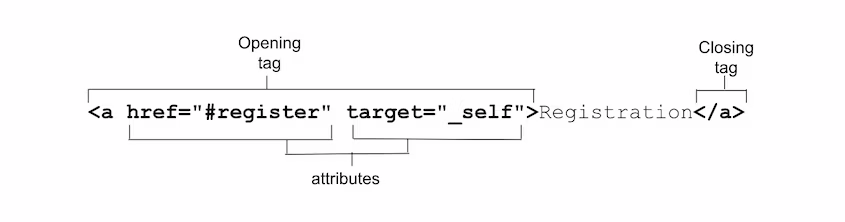

# Атрибуты

<big>Узнайте о различных глобальных атрибутах, а также об атрибутах, характерных для конкретных элементов HTML.</big>

Атрибуты были кратко рассмотрены в [Обзоре HTML](overview.md#attributes); настало время для более глубокого погружения.

Атрибуты — это то, что делает HTML таким мощным. **Атрибуты** — это разделенные пробелами имена и пары имя/значение, появляющиеся в открывающем теге и предоставляющие информацию об элементе и его функциональности.



Атрибуты определяют поведение, связи и функциональность элементов. Некоторые атрибуты являются глобальными, то есть могут присутствовать в открывающем теге любого элемента. Другие атрибуты относятся к нескольким элементам, но не ко всем, а третьи являются специфическими для конкретного элемента и относятся только к нему. В HTML все атрибуты, кроме `boolean` и, в некоторой степени, перечислительных атрибутов, требуют значения.

Если значение атрибута содержит пробел или специальные символы, то значение должно быть заключено в кавычки. По этой причине, а также для повышения разборчивости, всегда рекомендуется использовать кавычки.

Хотя HTML не чувствителен к регистру, некоторые значения атрибутов чувствительны к нему. Значения, являющиеся частью спецификации HTML, нечувствительны к регистру. Определенные значения строк, такие как имена классов и `id`, чувствительны к регистру. Если значение атрибута чувствительно к регистру в HTML, то оно чувствительно к регистру при использовании в качестве части [селектора атрибутов](https://developer.mozilla.org/docs/Web/CSS/Attribute_selectors) в CSS и JavaScript; в противном случае оно не чувствительно к регистру.

```html
<!-- the type attribute is case insensitive: these are equivalent -->
<input type="text" />
<input type="TeXt" />

<!-- the id attribute is case sensitive: they are not equivalent -->
<div id="myId">
    <div id="MyID"></div>
</div>
```

## Булевы атрибуты {#boolean-attributes}

Если присутствует булевский атрибут, то он всегда истинен. К булевым атрибутам относятся `autofocus`, `inert`, `checked`, `disabled`, `required`, `reversed`, `allowfullscreen`, `default`, `loop`, `autoplay`, `controls`, `muted`, `readonly`, `multiple,` и `selected`. Если один (или несколько) из этих атрибутов присутствует, то элемент является отключенным, обязательным, доступным для чтения и т. д. Если не присутствует, то нет.

Булевы значения могут быть либо опущены, либо установлены в пустую строку, либо являться именем атрибута; при этом значение не обязательно должно быть установлено в строку `true`. Все значения, включая `true`, `false` и `😀`, даже если они недействительны, примут значение `true`.

Эти три тега эквивалентны:

```html
<input required />
<input required="" />
<input required="required" />
```

Если значение атрибута равно `false`, опустите атрибут. Если значение атрибута истинно, включите атрибут, но не указывайте его значение. Например, `required="required"` не является допустимым значением в HTML; но поскольку `required` является булевой функцией, недействительные значения приводятся к true. Но поскольку недействительные перечислимые атрибуты не обязательно приводят к тому же значению, что и отсутствующие значения, проще взять за привычку опускать значения, чем запоминать, какие атрибуты являются булевыми, а какие перечислимыми и потенциально могут давать недействительное значение.

При переключении между `true` и `false` добавляйте и удаляйте атрибут с помощью JavaScript, а не переключая его значение.

```js
const myMedia = document.getElementById('mediaFile');
myMedia.removeAttribute('muted');
myMedia.setAttribute('muted');
```

Обратите внимание, что в языках XML, таких как SVG, все атрибуты должны содержать значение, в том числе и булевы атрибуты.

## Перечислимые атрибуты

Перечислимые атрибуты иногда путают с булевыми атрибутами. Это атрибуты HTML, имеющие ограниченный набор предопределенных допустимых значений. Как и у булевых атрибутов, у них есть значение по умолчанию, если атрибут присутствует, но значение отсутствует. Например, если включить `<style contenteditable>`, то по умолчанию будет установлено значение `<style contenteditable="true">`.

Однако, в отличие от булевых атрибутов, отсутствие атрибута не означает его ложности; присутствующий атрибут с отсутствующим значением не обязательно является истинным; а значение по умолчанию для недействительных значений не обязательно равно нулевой строке. Продолжая пример, `contenteditable` по умолчанию принимает значение `inherit`, если оно отсутствует или недействительно, и может быть явно установлено в значение `false`.

Значение по умолчанию зависит от атрибута. В отличие от булевых значений, атрибуты не являются автоматически "истинными", если они присутствуют. Если вы включите `<style contenteditable="false">`, то элемент не будет редактируемым. Если значение недопустимо, например, `<style contenteditable="😀">`, или, что удивительно, `<style contenteditable="contenteditable">`, то значение недействительно и по умолчанию принимает значение `inherit`.

В большинстве случаев с перечисляемыми атрибутами отсутствующие и недопустимые значения совпадают. Например, если атрибут `type` в `<input>` отсутствует, присутствует, но не имеет значения, или имеет недопустимое значение, то по умолчанию он принимает значение `text`. Хотя такое поведение встречается часто, оно не является правилом. В связи с этим важно знать, какие атрибуты являются булевыми, а какие — перечислимыми; по возможности опускать значения, чтобы не ошибиться, и искать значение по мере необходимости.

## Глобальные атрибуты

Глобальные атрибуты — это атрибуты, которые могут быть установлены на любом элементе HTML, включая элементы в `<head>`. Существует более [30 глобальных атрибутов](../../html/uni-attr.md). Хотя теоретически все они могут быть добавлены к любому элементу HTML, некоторые глобальные атрибуты не имеют эффекта при установке на некоторые элементы; например, установка `hidden` на `<meta>` не отображает мета-содержимое.

### `id`

Глобальный атрибут **[`id`](../../html/uni-attr.md#id)** используется для определения уникального идентификатора элемента. Он служит для многих целей, в том числе:

-   Целевой идентификатор фрагмента ссылки.
-   Идентификация элемента для сценариев.
-   Связывание элемента формы с его меткой.
-   Предоставление метки или описания для вспомогательных технологий.
-   Адресация стилей (с высокой специфичностью или в качестве селекторов атрибутов) в CSS.

Значение `id` представляет собой строку без пробелов. Если оно содержит пробел, то документ не будет нарушен, но в HTML, CSS и JS придется использовать для обозначения `id` управляющие символы. Все остальные символы являются допустимыми. Значение `id` может быть `😀` или `.class`, но это не очень хорошая идея. Чтобы облегчить программирование для себя настоящего и будущего, сделайте первый символ `id` буквой и используйте только буквы ASCII, цифры, `_` и `-`. Рекомендуется выработать соглашение об именовании `id` и придерживаться его, поскольку значения `id` чувствительны к регистру.

Идентификатор `id` должен быть уникальным для данного документа. Если `id` используется более одного раза, то макет страницы, скорее всего, не нарушится, но JavaScript, ссылки и взаимодействие элементов могут работать не так, как ожидалось.

#### Идентификатор фрагмента ссылки {#link_fragment_identifier}

Панель навигации содержит четыре ссылки. Мы рассмотрим элемент ссылки позже, а пока поймем, что ссылки не ограничиваются HTTP-адресами; они могут быть идентификаторами фрагментов страниц в текущем документе (или в других документах).

На сайте семинара по машинному обучению панель навигации в шапке страницы содержит четыре ссылки:

<iframe src="https://codepen.io/web-dot-dev/embed/GRGzbXR?height=300&amp;theme-id=dark&amp;default-tab=html%2Cresult&amp;editable=true" style="height: 500px; width: 100%; border: 0;" loading="lazy"></iframe>

Атрибут `href` указывает гиперссылку, на которую направляет пользователя активация ссылки. Если URL-адрес включает хэш-знак (`#`), за которым следует строка символов, то эта строка является идентификатором фрагмента. Если эта строка совпадает с `id` элемента веб-страницы, то фрагмент является якорем, или закладкой, на этот элемент. Браузер прокручивает страницу до того места, где определен якорь.

Эти четыре ссылки указывают на четыре раздела нашей страницы, обозначенные атрибутом `id`. Когда пользователь щелкает на любой из четырех ссылок в навигационной панели, на экран прокручивается элемент, на который указывает идентификатор фрагмента — элемент, содержащий соответствующий id за вычетом `#`.

Содержание `<main>` части семинара по машинному обучению состоит из четырех разделов с идентификаторами. Когда посетитель сайта нажимает на одну из ссылок в `<nav>`, то в поле зрения прокручивается раздел с идентификатором фрагмента. Разметка выглядит следующим образом:

```html
<section id="reg">
    <h2>Machine Learning Workshop Tickets</h2>
</section>

<section id="about">
    <h2>What you'll learn</h2>
</section>

<section id="teachers">
    <h2>Your Instructors</h2>
    <h3>Hal 9000 <span>&amp;</span> EVE</h3>
</section>

<section id="feedback">
    <h2>
        What it's like to learn good and do other stuff good
        too
    </h2>
</section>
```

Сравнивая идентификаторы фрагментов в ссылках `<nav>`, можно заметить, что каждый из них совпадает с `id`ом `<section>` в `<main>`. Браузер предоставляет нам бесплатную ссылку "верх страницы". Установка `href="#top"`, без учета регистра, или просто `href="#"`, приведет к прокрутке пользователя в верхнюю часть страницы.

Разделитель хэш-знаков в `href` не является частью идентификатора фрагмента. Идентификатор фрагмента всегда является последней частью URL и не передается на сервер.

#### Селекторы CSS

В CSS для каждого раздела можно использовать селектор `id`, например `#feedback`, или, для меньшей [специфичности](https://developer.mozilla.org/docs/Web/CSS/Specificity), [селектор атрибутов](../css3/selectors.md#attribute-selector) с учетом регистра, `[id="feedback"]`.

#### Скриптинг

На сайте MLW.com есть пасхальное яйцо, предназначенное только для пользователей мыши. Щелчок на выключателе света включает и выключает страницу.

Разметка для изображения выключателя выглядит следующим образом:

```html

```

Атрибут `id` может использоваться в качестве параметра метода [`getElementById()`](https://developer.mozilla.org/docs/Web/API/Document/getElementById) и, с префиксом `#`, как часть параметра методов [`querySelector()`](https://developer.mozilla.org/docs/Web/API/Document/querySelector) и [`querySelectorAll()`](https://developer.mozilla.org/docs/Web/API/Document/querySelectorall).

```js
const switchViaID = document.getElementById('switch');
const switchViaSelector = document.querySelector('#switch');
```

Наша одна функция JavaScript использует эту возможность для нацеливания на элементы по их атрибуту `id`:

```html
<script>
    /* switch is a reserved word in js, so we us onoff instead */
    const onoff = document.getElementById('switch');
    onoff.addEventListener('click', function () {
        document.body.classList.toggle('black');
    });
</script>
```

#### `<label>`

Элемент HTML [`<label>`](../../html/label.md) имеет атрибут [`for`](../../html/label.md#for), который принимает в качестве значения `id` элемента управления формой, с которым он связан. Создание явной метки путем включения `id` в каждый элемент управления формы и сопоставления его с атрибутом `for` метки гарантирует, что каждый элемент управления формы имеет связанную с ним метку.

<iframe src="https://codepen.io/web-dot-dev/embed/JjZxQOB?height=300&amp;theme-id=dark&amp;default-tab=html%2Cresult&amp;editable=true" style="height: 500px; width: 100%; border: 0;" loading="lazy"></iframe>

Хотя каждая метка может быть связана только с одним элементом управления формой, элемент управления формой может иметь более одной связанной с ним метки.

<iframe src="https://codepen.io/web-dot-dev/embed/dyKaBda?height=300&amp;theme-id=dark&amp;default-tab=html%2Cresult&amp;editable=true" style="height: 500px; width: 100%; border: 0;" loading="lazy"></iframe>

Если элемент управления формы вложен между открывающим и закрывающим тегами `<label>`, то атрибуты `for` и `id` не требуются: это называется "неявной" меткой. Благодаря меткам все пользователи знают, для чего предназначен тот или иной элемент управления формой.

```html
<label>
    Send me a reminder
    <input type="number" name="min" /> before the workshop
    resumes </label
>.
```

Связь между `for` и `id` делает информацию доступной для пользователей вспомогательных технологий. Кроме того, при щелчке в любом месте метки фокус переходит на связанный с ней элемент, расширяя область щелчка элемента управления. Это полезно не только тем, у кого проблемы с ловкостью рук, делающие манипуляции менее точными, но и всем пользователям мобильных устройств, у которых пальцы шире радиокнопки.

<iframe src="https://codepen.io/web-dot-dev/embed/BaVMgxo?height=300&amp;theme-id=dark&amp;default-tab=html%2Cresult&amp;editable=true" style="height: 500px; width: 100%; border: 0;"></iframe>

В данном примере кода фальшивый пятый вопрос фальшивой викторины представляет собой вопрос с множественным выбором. Каждый элемент управления формы имеет явную метку и уникальное значение `id` для каждого. Чтобы случайно не продублировать id, значение id представляет собой комбинацию номера вопроса и его значения.

При включении радиокнопок, поскольку их метки описывают значение, мы объединяем все одноименные кнопки в [`<fieldset>`](../../html/fieldset.md), а [`<legend>`](../../html/legend.md) является меткой или вопросом для всего набора.

#### Другие варианты использования доступности

Использование `id` в доступности и юзабилити не ограничивается метками. В [introduction to text](text-basics.md), `<section>` был преобразован в региональный ориентир путем ссылки на `id` из `<h2>` в качестве значения `aria-labelledby` в `<section>` для обеспечения доступного имени:

```html
<section id="about" aria-labelledby="about_heading">
    <h2 id="about_heading">What you'll learn</h2>
</section>
```

Существует более 50 состояний и свойств `aria-*`, которые могут быть использованы для обеспечения доступности. [`aria-labelledby`](https://developer.mozilla.org/docs/Web/Accessibility/ARIA/Attributes/aria-labelledby), [`aria-describedby`](https://developer.mozilla.org/docs/Web/Accessibility/ARIA/Attributes/aria-describedby), [`aria-details`](https://developer.mozilla.org/docs/Web/Accessibility/ARIA/Attributes/aria-details) и [`aria-owns`](https://developer.mozilla.org/docs/Web/Accessibility/ARIA/Attributes/aria-owns) принимают в качестве значения разделенный пробелами список ссылок `id`. [`aria-activedescendant`](https://developer.mozilla.org/docs/Web/Accessibility/ARIA/Attributes/aria-activedescendant), идентифицирующий текущий элемент-потомок, принимает в качестве значения единственную ссылку `id`: ссылку на единственный элемент, находящийся в фокусе (одновременно в фокусе может находиться только один элемент).

!!!note ""

    Используя `aria-labelledby`, вы можете создать обратную ассоциацию от элемента управления формы к нескольким меткам, включая текст, не вложенный в `<label>`, независимо от того, является ли этот текст меткой более чем одного элемента управления формы или нет. Если элемент управления имеет и `<label>`, и `aria-labelledby`, то приоритет имеет `aria-labelledby`; пользователи не услышат текст `<label>`, если в `aria-labelledby` не указан идентификатор метки.

### `class`

Атрибут **[`class`](../../html/uni-attr.md#class)** предоставляет дополнительный способ адресации элементов с помощью CSS (и JavaScript), но не имеет другого назначения в HTML (хотя фреймворки и библиотеки компонентов могут их использовать). Атрибут class принимает в качестве значения разделенный пробелами список классов элемента с учетом регистра.

!!!note ""

    Элементы могут быть выбраны с помощью селекторов CSS и методов DOM на основе их имен, атрибутов, значений атрибутов, положения в дереве DOM и т.д. Семантический HTML предоставляет значимые хуки, что делает добавление имен классов зачастую излишним. Уникальная разница между включением имени класса и использованием [`document.getElementsByClassName()`](https://developer.mozilla.org/docs/Web/API/Document/getElementsByClassName) в сравнении с выбором элементов на основе атрибутов и структуры страницы с помощью более надежной функции document.querySelectorAll() заключается в том, что первая возвращает живой список узлов, а вторая — статический.

Построение продуманной семантической структуры позволяет нацеливать элементы на основе их расположения и функций. Продуманная структура позволяет использовать селекторы элементов-потомков, реляционные селекторы и селекторы атрибутов. Изучая атрибуты в этом разделе, обратите внимание на то, как могут быть стилизованы элементы с одинаковыми атрибутами или значениями атрибутов. Дело не в том, что не следует использовать атрибут class, просто большинство разработчиков не понимают, что часто в этом нет необходимости.

До сих пор в MLW не использовались никакие классы. Можно ли запустить сайт без единого имени класса? Посмотрим.

### `style`

Атрибут **[`style`](../../html/uni-attr.md#style)** позволяет применять инлайн-стили, то есть стили, применяемые к одному элементу, для которого установлен атрибут. Атрибут `style` принимает в качестве значения пары значений CSS-свойств, причем синтаксис значений аналогичен содержимому блока стилей CSS: после свойств ставится двоеточие, как и в CSS, а точка с запятой завершает каждое объявление, идущее после значения.

Стили применяются только к тому элементу, для которого задан атрибут, причем потомки наследуют унаследованные значения свойств, если они не отменены другими объявлениями стилей во вложенных элементах, блоках `<style>` или таблицах стилей. Поскольку значение представляет собой эквивалент содержимого одного блока стилей, применяемого только к данному элементу, его нельзя использовать для генерируемого содержимого, создания анимации ключевых кадров или применения каких-либо других at-правил.

Хотя `style` действительно является глобальным атрибутом, использовать его не рекомендуется. Лучше определить стили в отдельном файле или файлах. Тем не менее, атрибут `style` может пригодиться в процессе разработки для быстрого создания стилей, например, в целях тестирования. Затем возьмите стиль "solution" и поместите его в связанный файл [CSS](../css3/index.md).

### `tabindex` {#tabindex}

Атрибут **[`tabindex`](../../html/uni-attr.md#tabindex)** может быть добавлен к любому элементу для того, чтобы он мог получать фокус. Значение `tabindex` определяет, будет ли он добавлен к порядку табуляции и, как вариант, к порядку табуляции, не заданному по умолчанию.

Атрибут `tabindex` принимает в качестве значения целое число. Отрицательное значение (принято использовать `-1`) делает элемент способным получать фокус, например, с помощью JavaScript, но не добавляет его в порядок табуляции. Значение `tabindex`, равное `0`, делает элемент фокусируемым и доступным через табуляцию, добавляя его в порядок табуляции страницы по умолчанию в порядке исходного кода. Значение `1` или больше переводит элемент в приоритетную последовательность фокусировки и не рекомендуется.

На этой странице реализована функция совместного доступа с использованием пользовательского элемента `<share-action>`, выполняющего роль `<button>`. Для добавления пользовательского элемента в порядок табуляции клавиатуры по умолчанию используется значение `tabindex`, равное нулю:

```html
<share-action
    authors="@estellevw"
    data-action="click"
    data-category="web.dev"
    data-icon="share"
    data-label="share, twitter"
    role="button"
    tabindex="0"
>
    <svg
        aria-label="share"
        role="img"
        xmlns="http://www.w3.org/2000/svg"
    >
        <use href="#shareIcon" />
    </svg>
    <span>Share</span>
</share-action>
```

Указание [`role` для `button`](https://developer.mozilla.org/docs/Web/Accessibility/ARIA/Roles/button_role) информирует пользователей программ чтения с экрана о том, что данный элемент должен вести себя как кнопка. JavaScript используется для обеспечения выполнения обещания функциональности кнопки, включая обработку событий [click](https://developer.mozilla.org/docs/Web/API/Element/click_event) и [keydown](https://developer.mozilla.org/docs/Web/API/Element/keydown_event), а также обработку нажатий клавиш ++enter++ и ++space++.

Элементы управления формы, ссылки, кнопки и элементы [content editable](#contenteditable) могут получать фокус; когда пользователь на клавиатуре нажимает клавишу табуляции, фокус перемещается на следующий фокусируемый элемент, как если бы для него был установлен `tabindex="0"`. Остальные элементы по умолчанию не фокусируются. Добавление атрибута `tabindex` к этим элементам позволяет им получать фокус в тех случаях, когда в противном случае они не могли бы его получить.

Если в документе присутствуют элементы с `tabindex`, равным `1` или более, то они включаются в отдельную последовательность вкладок. Как видно из codepen, табуляция начинается с отдельной последовательности, в порядке от наименьшего значения к наибольшему, а затем переходит к элементам обычной последовательности в исходном порядке.

<iframe src="https://codepen.io/web-dot-dev/embed/ExRGBPE?height=300&amp;theme-id=light&amp;default-tab=html%2Cresult&amp;editable=true" style="height: 500px; width: 100%; border: 0;" loading="lazy"></iframe>

Изменение порядка табуляции может создать очень неприятные впечатления у пользователей. Это затрудняет навигацию по содержимому с помощью вспомогательных технологий — клавиатур и устройств чтения с экрана. Кроме того, разработчику трудно управлять и поддерживать этот порядок. Фокусировка очень важна; существует целый модуль, посвященный фокусу и порядку фокусировки.

### `role`

Атрибут [`role`](https://developer.mozilla.org/docs/Web/Accessibility/ARIA/Roles) является частью спецификации [ARIA](https://w3c.github.io/aria/#introroles), а не спецификации [WHATWG HMTL](https://html.spec.whatwg.org/#global-attributes:attr-aria-role). Атрибут `role` может использоваться для придания семантического смысла содержимому, позволяя программам чтения с экрана информировать пользователей сайта о предполагаемом взаимодействии объекта с пользователем.

Существует несколько распространенных виджетов пользовательского интерфейса, таких как [comboboxes](https://developer.mozilla.org/docs/Web/Accessibility/ARIA/Roles/combobox_role), [menubars](https://developer.mozilla.org/docs/Web/Accessibility/ARIA/Roles/menubar_role), [tablists](https://developer.mozilla.org/docs/Web/Accessibility/ARIA/Roles/tablist_role) и [treegrids](https://developer.mozilla.org/docs/Web/Accessibility/ARIA/Roles/treegrid_role), которые не имеют собственного HTML-эквивалента. Например, при создании шаблона дизайна с вкладками можно использовать роли [`tab`](https://developer.mozilla.org/docs/Web/Accessibility/ARIA/Roles/tab_role), `tablist` и [`tabpanel`](https://developer.mozilla.org/docs/Web/Accessibility/ARIA/Roles/tabpanel_role). Тот, кто физически видит пользовательский интерфейс, на собственном опыте знает, как перемещаться по виджету и делать видимыми различные панели, щелкая на связанных с ними вкладках. Включение роли `tab` с `<button role="tab">`, когда группа кнопок используется для отображения различных панелей, позволяет пользователю программы чтения с экрана знать, что `<button>`, имеющая в данный момент фокус, может переключать соответствующую панель на просмотр, а не реализовывать типичную функциональность, подобную кнопкам.

Атрибут `role` не меняет поведения браузера и не изменяет взаимодействия с клавиатурой или указателем устройства — добавление `role="button"` к `<span>` не превращает его в `<button>`. Именно поэтому рекомендуется использовать семантические элементы HTML по их прямому назначению. Тем не менее, когда использование нужного элемента невозможно, атрибут `role` позволяет информировать пользователей программ чтения с экрана о том, что несемантический элемент был переделан под роль семантического элемента.

### `contenteditable` {#contenteditable}

Элемент с атрибутом `contenteditable`, установленным в `true`, является редактируемым, фокусируемым и добавляется в порядок вкладок, как если бы был установлен `tabindex="0"`. `Contenteditable` — это перечисляемый атрибут, поддерживающий значения `true` и `false`, по умолчанию значение `inherit`, если атрибут отсутствует или имеет недопустимое значение.

Эти три открывающих тега эквивалентны:

```html
<style contenteditable>
<style contenteditable="">
<style contenteditable="true">
```

Если указать `<style contenteditable="false">`, то элемент не будет редактируемым (если только он не является редактируемым по умолчанию, как, например, `<textarea>`). Если значение недопустимо, например, `<style contenteditable="😀">` или `<style contenteditable="contenteditable">`, то по умолчанию устанавливается значение `inherit`.

Чтобы переключиться между состояниями, запросите значение свойства [HTMLElement.isContentEditable](https://developer.mozilla.org/docs/Web/API/HTMLElement/contentEditable) readonly.

```js
const editor = document.getElementById('myElement');
if (editor.contentEditable) {
    editor.setAttribute('contenteditable', 'false');
} else {
    editor.setAttribute('contenteditable', '');
}
```

В качестве альтернативы это свойство может быть задано установкой `editor.contentEditable` в `true`, `false` или `inherit`.

Глобальные атрибуты могут применяться ко всем элементам, даже к элементам `<style>`. Используя атрибуты и немного CSS, можно создать живой CSS-редактор.

```css
<style contenteditable>
style {
  color: inherit;
  display:block;
  border: 1px solid;
  font: inherit;
  font-family: monospace;
  padding:1em;
  border-radius: 1em;
  white-space: pre;
}
</style>
```

Попробуйте изменить `color` в `style` на что-то отличное от `inherit`. Затем попробуйте изменить `style` на селектор `p`. Не удаляйте свойство `display`, иначе блок стилей исчезнет.

<style contenteditable>
style {
  color: inherit;
  display:block;
  border: 1px solid;
  font: inherit;
  font-family: monospace;
  padding: 1em;
  border-radius: 1em;
  white-space: pre;
}
</style>

## Пользовательские атрибуты

Мы только коснулись поверхности глобальных атрибутов HTML. Существует еще больше атрибутов, которые применяются только к одному или ограниченному набору элементов. Даже при наличии сотен определенных атрибутов у вас может возникнуть потребность в атрибуте, которого нет в спецификации. HTML позаботился об этом.

Вы можете создать любой пользовательский атрибут, добавив префикс [`data-`](https://developer.mozilla.org/docs/Web/HTML/Global_attributes/data-*). Вы можете назвать свой атрибут любым именем, начинающимся с `data-`, за которым следует любая строчная серия символов, не начинающаяся с `xml` и не содержащая двоеточия (`:`).

Хотя HTML снисходителен и не сломается, если вы создадите неподдерживаемые атрибуты, не начинающиеся с `data`, или даже если вы начнете свой пользовательский атрибут с `xml` или включите `:`, есть свои преимущества в создании корректных пользовательских атрибутов, начинающихся с `data-`. Используя пользовательские атрибуты данных, вы можете быть уверены, что случайно не используете существующее имя атрибута. Пользовательские атрибуты данных являются перспективными.

Хотя браузеры не будут реализовывать поведение по умолчанию для какого-либо конкретного атрибута с префиксом `data-`, существует встроенный API набора данных для итерации по вашим пользовательским атрибутам. Пользовательские свойства — это отличный способ передачи специфической для приложения информации с помощью JavaScript. Добавьте к элементам пользовательские атрибуты в виде `data-name` и получайте к ним доступ через DOM, используя `dataset[name]` на соответствующем элементе.

```html
<blockquote
    data-machine-learning="workshop"
    data-first-name="Blendan"
    data-last-name="Smooth"
    data-formerly="Margarita Maker"
    data-aspiring="Load Balancer"
    data-year-graduated="2022"
>
    HAL and EVE could teach a fan to blow hot air.
</blockquote>
```

Можно использовать `getAttribute()`, используя полное имя атрибута, или воспользоваться более простым свойством [`dataset`](https://developer.mozilla.org/docs/Web/API/HTMLElement/dataset).

```js
el.dataset[machineLearning]; // workshop
e.dataset.machineLearning; // workshop
```

Свойство `dataset` возвращает объект `DOMStringMap`, содержащий атрибуты `data-` каждого элемента. У элемента [`<blockquote>`](../../html/blockquote.md) есть несколько пользовательских атрибутов. Свойство `dataset` означает, что вам не нужно знать, что это за пользовательские атрибуты, чтобы получить доступ к их именам и значениям:

```js
for (let key in el.dataset) {
    customObject[key] = el.dataset[key];
}
```

Атрибуты, приведенные в этой статье, являются глобальными, то есть могут применяться к любому элементу HTML (хотя не все они оказывают влияние на эти элементы). Далее мы рассмотрим два атрибута из вводного изображения, которые не были рассмотрены, — `target` и `href` — и несколько других атрибутов, специфичных для конкретного элемента, при более глубоком изучении ссылок.

## Источник

-   [Attributes](https://web.dev/learn/html/attributes/)
