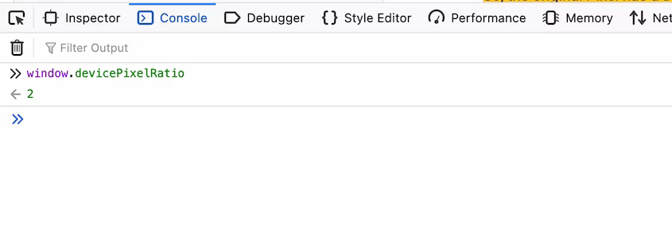

# Дескриптивные синтаксисы

<big>Использование `srcset` и `sizes` позволяет предоставить браузеру информацию об источниках изображений и о том, как они будут использоваться.</big>

В этом модуле вы узнаете, как предоставить браузеру возможность выбора изображений, чтобы он мог принимать оптимальные решения о том, что ему показывать. Синтаксис `srcset` не является методом замены источников изображений в определенных точках останова и не предназначен для замены одного изображения на другое. Эти синтаксисы позволяют браузеру независимо от нас решать очень сложную задачу: беспрепятственно запрашивать и отображать источник изображения в соответствии с условиями просмотра, включая размер области просмотра, плотность экрана, предпочтения пользователя, пропускную способность и множество других факторов.

Это очень сложная задача - конечно, более сложная, чем та, которую мы хотим учитывать, когда просто размечаем изображение для Web, и для ее решения требуется больше информации, чем мы можем получить.

## Описание размеров с помощью `x`

Изображение `` с фиксированной шириной будет занимать одинаковую часть области просмотра в любом контексте просмотра, независимо от _плотности_ дисплея пользователя - количества физических пикселей, составляющих его экран. Например, изображение с собственной шириной `400px` будет занимать почти все поле зрения браузера как на оригинальном Google Pixel, так и на гораздо более новом Pixel 6 Pro - оба устройства имеют нормализованное поле зрения шириной `412px` [логический пиксель](https://developer.mozilla.org/docs/Glossary/CSS_pixel).

Однако у Pixel 6 Pro дисплей гораздо более узкий: у 6 Pro _физическое_ разрешение составляет 1440 × 3120 пикселей, а у Pixel - 1080 × 1920 пикселей, то есть количество аппаратных пикселей, составляющих сам экран.

Соотношение между логическими и физическими пикселями устройства - это _отношение пикселей устройства_ для данного дисплея (DPR). Значение DPR рассчитывается путем деления фактического разрешения экрана устройства на количество CSS-пикселей области просмотра.



Так, у оригинального Pixel DPR составляет 2,6, а у Pixel 6 Pro - 3,5.

У iPhone 4, первого устройства с DPR больше 1, соотношение пикселей устройства равно 2 - физическое разрешение экрана в два раза больше логического. Все устройства до iPhone 4 имели DPR, равный 1: один логический пиксель к одному физическому пикселю.

При просмотре изображения шириной `400px` на дисплее с DPR `2` каждый логический пиксель отображается на четырех физических пикселях дисплея: двух горизонтальных и двух вертикальных. Изображение не выигрывает от высокой плотности - оно будет выглядеть так же, как и на дисплее с DPR `1`. Конечно, все, что "рисуется" механизмом рендеринга браузера - текст, CSS-фигуры или SVG, например, - будет рисоваться в соответствии с более высокой плотностью отображения. Но, как вы узнали из раздела [Форматы и сжатие изображений](raster-images.md), растровые изображения представляют собой фиксированные сетки пикселей. И хотя это не всегда заметно, растровое изображение, увеличенное для отображения на дисплее с более высокой плотностью, будет выглядеть низкоразрешенным по сравнению с окружающей страницей.

Чтобы предотвратить такое увеличение, необходимо, чтобы выводимое изображение имело собственную ширину не менее `800` пикселей. При уменьшении масштаба для размещения в макете шириной 400 логических пикселей 800-пиксельное изображение будет иметь вдвое большую плотность пикселей, и на дисплее с DPR `2` оно будет выглядеть хорошо и четко.


<iframe src="https://codepen.io/web-dot-dev/embed/QWBGVyo?height=300&amp;theme-id=light&amp;default-tab=html%2Ccss%2Cresult&amp;editable=true" style="height: 300px; width: 100%; border: 0;" loading="lazy"></iframe>

Поскольку дисплей с DPR `1` не может использовать повышенную плотность изображения, оно будет _уменьшено_ для соответствия дисплею, а, как известно, _уменьшенное_ изображение выглядит просто замечательно. На дисплее с низкой плотностью изображение, подходящее для дисплеев с более высокой плотностью, будет выглядеть как любое другое изображение с низкой плотностью.

Как вы узнали в [Images and Performance](performance-issues.md), пользователю с дисплеем низкой плотности, просматривающему источник изображения, масштабированный до `400px`, нужен источник только с шириной `400px`. В то время как изображение гораздо большего размера будет визуально работать для всех пользователей, огромный источник изображения с высоким разрешением, выводимый на маленький дисплей с низкой плотностью, будет выглядеть так же, как и любое другое маленькое изображение с низкой плотностью, но ощущаться гораздо медленнее.

Как можно догадаться, на _мобильных_ устройствах DPR, равный 1, встречается [крайне редко](https://jakearchibald.com/2021/serving-sharp-images-to-high-density-screens/), хотя в контексте "настольных" браузеров он все еще [распространен](https://twitter.com/TimVereecke/status/1587878439729725442). Согласно данным, предоставленным [Matt Hobbs](https://nooshu.com), примерно 18% сеансов просмотра сайта [GOV.UK](https://www.gov.uk/) с ноября 2022 г. имеют DPR, равный 1. Хотя изображения высокой плотности будут выглядеть так, как ожидают эти пользователи, они будут требовать гораздо больших затрат на пропускную способность и обработку, что особенно важно для пользователей старых и менее мощных устройств, которые все еще имеют дисплеи низкой плотности.

Использование `srcset` гарантирует, что только устройства с дисплеями высокого разрешения получат источники изображения, достаточно большие для того, чтобы оно выглядело четким, не перекладывая эти затраты на пропускную способность на пользователей с дисплеями низкого разрешения.

Атрибут `srcset` определяет один или несколько разделенных запятыми _кандидатов_ для рендеринга изображения. Каждый кандидат состоит из двух частей: URL, как и в `src`, и синтаксиса, описывающего источник изображения. Каждый кандидат в `srcset` описывается присущей ему _шириной_ (синтаксис `w`) или предполагаемой _плотностью_ (синтаксис `x`).

Синтаксис `x` является сокращением для выражения "этот источник подходит для дисплея с такой плотностью" - кандидат, за которым следует `2x`, подходит для дисплея с DPR, равным 2.

```html

```

Браузерам, поддерживающим `srcset`, будет предложено два кандидата: `double-density.jpg`, который `2x` описывает как подходящий для дисплеев с DPR равным 2, и `low-density.jpg` в атрибуте `src` - кандидат, выбранный, если в `srcset` не найдено ничего более подходящего. Для браузеров, не поддерживающих `srcset`, атрибут и его содержимое будут проигнорированы - будет запрошено содержимое `src`, как обычно.

Значения, указанные в атрибуте `srcset`, легко принять за инструкции. То, что `2x` сообщает браузеру, что связанный с ним исходный файл подходит для использования на дисплее с DPR, равным 2, - это информация о самом источнике. Он не указывает браузеру, как использовать этот источник, а лишь информирует его о том, как этот источник может быть использован. Это тонкое, но важное различие: это _изображение_ двойной плотности, а не изображение для использования на _дисплее_ двойной плотности.

Разница между синтаксисом, который говорит "этот источник подходит для дисплеев `2x`", и синтаксисом, который говорит "используйте этот источник на дисплеях `2x`", незначительна в печатном виде, но плотность дисплея - это только один из огромного количества взаимосвязанных факторов, которые браузер использует для принятия решения о кандидате для рендеринга, и только некоторые из них вы можете знать. Например: по отдельности можно определить, что пользователь включил в браузере предпочтение экономии полосы пропускания с помощью медиазапроса `prefers-reduced-data`, и использовать его для того, чтобы всегда выбирать для пользователей изображения с низкой плотностью, независимо от плотности отображения, но если это не будет реализовано последовательно, каждым разработчиком, на каждом сайте, то это не принесет большой пользы пользователю. На одном сайте его предпочтения могут быть учтены, а на другом он столкнется со стеной изображений, отнимающих полосу пропускания.

Намеренно расплывчатый алгоритм выбора ресурсов, используемый в `srcset`/`sizes`, оставляет возможность браузерам принимать решение о выборе изображений с меньшей плотностью при пропуске полосы пропускания или на основе предпочтений по минимизации использования данных, не беря на себя ответственность за то, как, когда и при каком пороговом значении. Нет смысла брать на себя ответственность и дополнительную работу, с которой лучше справится браузер.

## Описание ширины с помощью `w`

`srcset` принимает второй тип дескрипторов для кандидатов в источники изображения. Он гораздо более мощный и для наших целей гораздо более понятный. Синтаксис `w` описывает ширину, присущую каждому кандидату, а не отмечает, что он имеет размеры, соответствующие заданной плотности отображения. Опять же, каждый кандидат идентичен, за исключением размеров - то же содержание, та же обрезка и то же соотношение сторон. Но в данном случае необходимо, чтобы браузер пользователя выбирал между двумя кандидатами: `small.jpg` - источником с собственной шириной `600px` и `large.jpg` - источником с собственной шириной `1200px`.

```html
srcset="small.jpg 600w, large.jpg 1200w"
```

Это не указывает браузеру, что _делать_ с этой информацией, а лишь предоставляет ему список кандидатов на отображение изображения. Прежде чем браузер примет решение о выборе источника, необходимо предоставить ему еще немного информации: описание того, как изображение будет отображаться на странице. Для этого используется атрибут `sizes`.

## Описание использования с помощью `sizes`

Браузеры невероятно производительны при передаче изображений. Запросы к изображениям инициируются задолго до запросов к таблицам стилей или JavaScript - зачастую даже до того, как разметка будет полностью разобрана. Когда браузер выполняет эти запросы, он не имеет никакой информации о самой странице, кроме разметки - возможно, он еще даже не инициировал запросы на внешние таблицы стилей, не говоря уже об их применении. В тот момент, когда браузер разбирает вашу разметку и начинает выполнять внешние запросы, он располагает только информацией на уровне браузера: размер области просмотра пользователя, плотность пикселей на его дисплее, предпочтения пользователя и т. д. Это не говорит ни о чем.

Это ничего не говорит нам о том, как изображение должно быть отображено в макете страницы, он даже не может использовать область просмотра для определения верхней границы размера `img`, поскольку изображение может занимать горизонтально прокручиваемый контейнер. Поэтому нам необходимо предоставить браузеру эту информацию и сделать это с помощью разметки. Это все, что мы сможем использовать для этих запросов.

Как и `srcset`, `sizes` предназначен для того, чтобы сделать информацию об изображении доступной сразу же после разбора разметки. Подобно тому, как атрибут `srcset` является сокращением для "вот исходные файлы и присущие им размеры", атрибут `sizes` является сокращением для "вот размер отрисованного изображения _в макете_". То, как вы описываете изображение, относится к области просмотра - опять же, размер области просмотра является единственной информацией о макете, которой располагает браузер в момент запроса изображения.

Возможно, в печатном виде это звучит несколько запутанно, но на практике это гораздо проще понять:

```html

```

Здесь значение `sizes` сообщает браузеру, что пространство в нашем макете, которое занимает `img`, имеет ширину `80vw` - 80% от области просмотра. Помните, что это не _инструкция_, а описание размера изображения в макете страницы. Здесь не говорится "сделайте так, чтобы это изображение занимало 80% области просмотра", а говорится "это изображение будет занимать 80% области просмотра после рендеринга страницы".

<iframe src="https://codepen.io/web-dot-dev/embed/PoBWLYP?height=500&amp;theme-id=light&amp;default-tab=html%2Cresult&amp;editable=true" style="height: 500px; width: 100%; border: 0;" loading="lazy"></iframe>

Ваша задача как разработчика выполнена. Вы точно описали список источников-кандидатов в `srcset` и ширину изображения в `sizes`, и, как и в случае с синтаксисом `x` в `srcset`, остальное зависит от браузера.

Но для того чтобы полностью понять, как используется эта информация, давайте рассмотрим, какие решения принимает браузер пользователя, встретив эту разметку:

Вы сообщили браузеру, что это изображение будет занимать 80% доступного пространства просмотра, поэтому, если мы отобразим это `img` на устройстве с пространством просмотра шириной 1000 пикселей, это изображение будет занимать 800 пикселей. Затем браузер возьмет это значение и разделит на него ширину каждого из кандидатов в источники изображения, которые мы указали в `srcset`. Самый маленький источник имеет собственный размер 600 пикселей, поэтому: `600÷800=.75`. Наше среднее изображение имеет ширину 1200 пикселей: `1200÷800=1.5`. Самое большое изображение имеет ширину 2000 пикселей: `2000÷800=2.5`.

Результаты этих вычислений (`.75`, `1.5` и `2.5`) фактически являются параметрами DPR _специфически адаптированными к размеру области просмотра пользователя_. Поскольку браузер также располагает информацией о плотности изображения на экране пользователя, он принимает ряд решений:

При данном размере области просмотра кандидат `small.jpg` отбрасывается независимо от плотности изображения на экране пользователя - при расчетном DPR меньше `1` этот источник потребует увеличения для любого пользователя, поэтому он не подходит. На устройстве с DPR `1` наиболее близкое соответствие обеспечивает `medium.jpg` - этот источник подходит для отображения при DPR `1,5`, поэтому он немного больше, чем нужно, но помните, что уменьшение масштаба - визуально плавный процесс. На устройстве с DPR 2 наиболее близким по размеру является `large.jpg`, поэтому он и выбирается.

Если то же самое изображение будет отображаться на экране просмотра шириной 600 пикселей, результат всей этой математики будет совершенно иным: 80vw теперь равно `480px`. Разделив ширину наших источников на это значение, мы получим `1.25`, `2.5` и `4.1666666667`. При таком размере области просмотра `small.jpg` будет выбран на устройствах с шириной 1х, а `medium.jpg` - на устройствах с шириной `2х`.

Во всех этих контекстах просмотра данное изображение будет выглядеть одинаково: все наши исходные файлы, кроме размеров, абсолютно идентичны, и каждый из них отображается настолько резко, насколько позволяет плотность изображения на экране пользователя. Однако вместо того, чтобы предлагать каждому пользователю `large.jpg`, чтобы удовлетворить потребности самых больших видовых экранов и дисплеев с самой высокой плотностью, пользователям всегда будет предлагаться самый маленький подходящий кандидат. Благодаря использованию описательного, а не предписывающего синтаксиса, вам не нужно вручную устанавливать точки останова и учитывать будущие области просмотра и DPR - вы просто предоставляете браузеру информацию и позволяете ему самому определять ответы.

Поскольку значение `sizes` относительно области просмотра и совершенно не зависит от макета страницы, это добавляет дополнительный уровень сложности. Редко можно встретить изображение, которое занимает только один процент области просмотра, без каких-либо фиксированных по ширине полей, подкладок или влияния других элементов на странице. Часто требуется выразить ширину изображения, используя комбинацию единиц измерения: проценты, `em`, `px` и т. д.

К счастью, здесь можно использовать `calc()` - любой браузер с встроенной поддержкой отзывчивых изображений будет поддерживать `calc()`, что позволит нам смешивать и сочетать единицы CSS - например, изображение, занимающее всю ширину области просмотра пользователя, за вычетом поля `1em` по обеим сторонам:

```html

```

## Описание брекпоинтов

Если вы много времени проводите в работе с отзывчивыми макетами, то, скорее всего, заметили, что в этих примерах чего-то не хватает: пространство, занимаемое изображением в макете, с большой вероятностью будет меняться в зависимости от брекпоинтов макета. В этом случае необходимо передать браузеру немного больше деталей: `sizes` принимает набор кандидатов на размер изображения, разделенных запятыми, точно так же, как `srcset` принимает кандидатов на источник изображения, разделенных запятыми. Эти условия используют привычный синтаксис медиазапроса. Этот синтаксис является первоочередным: как только медиаусловие совпадает, браузер прекращает разбор атрибута `sizes`, и применяется указанное значение.

Допустим, у вас есть изображение, которое должно занимать 80% области просмотра за вычетом одного `em` отступа с каждой стороны на экранах более `1200px`, на меньших экранах оно занимает всю ширину области просмотра.

```html

```

<iframe src="https://codepen.io/web-dot-dev/embed/RwBoYRx?height=500&amp;theme-id=light&amp;default-tab=html%2Cresult&amp;editable=true" style="height: 500px; width: 100%; border: 0;" loading="lazy"></iframe>

Если область просмотра пользователя больше `1200px`, то `calc(80vw - 2em)` описывает ширину изображения в нашем макете. Если условие `(min-width: 1200px)` не выполняется, браузер переходит к следующему значению. Поскольку к этому значению не привязано конкретное медиаусловие, по умолчанию используется `100vw`. Если бы вы написали этот атрибут `sizes` с использованием медиазапросов `max-width`:

```html

```

<iframe src="https://codepen.io/web-dot-dev/embed/BaPQOzO?height=500&amp;theme-id=light&amp;default-tab=html%2Cresult&amp;editable=true" style="height: 500px; width: 100%; border: 0;" loading="lazy"></iframe>

На обычном языке: "соответствует ли `(max-width: 1200px)`? Если нет, переходим к следующему значению. Следующее значение - `calc(80vw - 2em)` - не имеет условия отбора, поэтому выбирается именно оно.

Теперь, когда вы предоставили браузеру всю эту информацию об элементе `img` - потенциальные источники, присущую ему ширину и то, как вы собираетесь представить изображение пользователю, - браузер использует нечеткий набор правил для определения того, что делать с этой информацией. Если это звучит расплывчато, то так оно и есть. Алгоритм выбора источника, заложенный в спецификации HTML, явно нечетко определяет, как следует выбирать источник. После разбора источников, их дескрипторов и того, как будет выводиться изображение, браузер волен делать все, что ему заблагорассудится - вы не можете знать наверняка, какой источник выберет браузер.

Синтаксис, гласящий "использовать этот источник на экране с высоким разрешением", был бы предсказуем, но он не решал бы основную проблему, связанную с изображениями в отзывчивой верстке: экономию полосы пропускания пользователя. Плотность пикселей экрана имеет лишь косвенное отношение к скорости интернет-соединения, если вообще имеет. Если вы пользуетесь ноутбуком высшего класса, но выходите в Интернет по счетчику, с телефона или по шаткому Wi-Fi в самолете, вам лучше отказаться от источников изображений высокого разрешения, независимо от качества вашего дисплея.

Оставляя последнее слово за браузером, можно добиться гораздо большего повышения производительности, чем при использовании строго предписывающего синтаксиса. Например: в большинстве браузеров `img`, использующий синтаксис `srcset` или `sizes`, никогда не станет запрашивать источник с меньшими размерами, чем тот, который уже есть в кэше браузера. Какой смысл делать новый запрос к источнику, который будет выглядеть идентично, если браузер может без проблем уменьшить размеры уже имеющегося источника изображения? Но если пользователь изменит масштаб области просмотра до такой степени, что потребуется новое изображение, чтобы избежать увеличения, то _этот_ запрос все равно будет сделан, и все будет выглядеть так, как вы ожидаете.

Такое отсутствие явного контроля может показаться немного пугающим, но, поскольку вы используете исходные файлы с идентичным содержимым, вероятность того, что пользователь получит "сломанный" результат, не выше, чем при использовании `src` с одним источником, независимо от решений, принимаемых браузером.

## Использование `sizes` и `srcset`

Это очень много информации - как для вас, читателя, так и для браузера. Синтаксисы `srcset` и `sizes` - это плотные синтаксисы, описывающие огромное количество информации в относительно небольшом количестве символов. Это, к счастью или к худшему, так и задумано: если сделать эти синтаксисы менее лаконичными и более удобными для разбора человеком, то это могло бы усложнить их разбор для _браузера_. Чем больше сложностей добавляется к строке, тем больше вероятность ошибок парсера или непреднамеренных различий в поведении браузера. Однако в этом есть и положительная сторона: синтаксис, который легче читается машинами, легче ими же и пишется.

`srcset` - явный пример для автоматизации. Вряд ли вы будете вручную создавать несколько версий своих образов для производственной среды, вместо этого вы сможете автоматизировать этот процесс с помощью программы запуска задач, например Gulp, пакета Webpack, сторонней CDN, например Cloudinary, или функциональности, уже встроенной в выбранную вами CMS. Имея достаточно информации для генерации наших исходных текстов, система будет иметь достаточно информации, чтобы записать их в жизнеспособный атрибут `srcset`.

Автоматизировать `sizes` несколько сложнее. Как известно, единственный способ, которым система может вычислить размер изображения в отрисованном макете, - это _отрисовать_ макет. К счастью, появился ряд инструментов для разработчиков, позволяющих абстрагироваться от процесса ручного написания атрибутов `sizes`, причем с такой эффективностью, с которой вы никогда не сможете справиться вручную. Например, [respImageLint](https://github.com/ausi/respimagelint) - это фрагмент кода, предназначенный для проверки точности атрибутов `sizes` и предложения по их улучшению. В проекте [Lazysizes](https://github.com/aFarkas/lazysizes) в угоду эффективности немного снижается скорость, поскольку запросы к изображениям откладываются до момента создания макета, а JavaScript сам генерирует значения `sizes`. Если вы используете фреймворк с полностью клиентским рендерингом, например React или Vue, то существует ряд решений для создания и/или генерации атрибутов `srcset` и `sizes`, которые мы рассмотрим далее в разделе [CMS и фреймворки](cms.md).

:material-information-outline: Источник &mdash; [Descriptive syntaxes](https://web.dev/learn/images/descriptive/)
