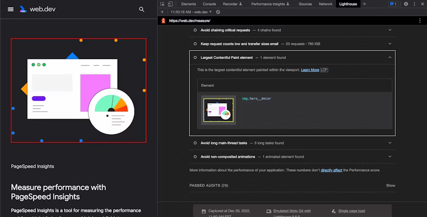

# Ключевые вопросы производительности

<big>Узнайте, как сделать так, чтобы ваши запросы к изображениям были как можно меньше и производительнее.</big>

В настоящее время изображения являются самыми большими ресурсами Интернета как по [общему объему передачи данных](https://almanac.httparchive.org/en/2022/page-weight#fig-8), так и по [количеству запросов](https://almanac.httparchive.org/en/2022/page-weight#fig-3) на страницу. Средний размер веб-страницы составляет примерно [2 МБ, по состоянию на июнь 2022 года](https://httparchive.org/reports/page-weight), причем почти половина этого объема приходится только на изображения. Не будет преувеличением сказать, что оптимизация запросов к изображениям может стать самым важным шагом в оптимизации производительности.

Позже вы узнаете, как развивались отзывчивые изображения, чтобы решить проблемы, возникающие при попытке предоставить одно изображение на все случаи жизни. В этом разделе мы рассмотрим основные показатели производительности, связанные с изображениями, и способы их улучшения.

## Откладывание запросов к изображениям

Хотя сейчас вы узнаете о нескольких способах обеспечения минимальной и эффективной обработки запросов к изображениям, самым быстрым запросом к изображению всегда будет тот, который никогда не будет выполнен. Поэтому сразу хочу сказать, что это, возможно, самое значительное изменение, которое вы можете внести в способ доставки изображений пользователям: атрибут `loading="lazy"`.

```html

```

Этот атрибут гарантирует, что запросы к изображениям не будут выполняться до тех пор, пока они не попадут в область просмотра пользователя, откладывая их от начальной загрузки страницы - времени, когда браузер наиболее загружен, - и убирая эти запросы с критического пути рендеринга.

Как бы ни было просто на практике, использование этого атрибута может оказать огромное положительное влияние на производительность: изображение, которое никогда не попадет в область просмотра пользователя, никогда не будет запрошено, и пропускная способность не будет тратиться на изображения, которые пользователь никогда не увидит.

Однако есть одна загвоздка: откладывая эти запросы, вы не используете преимущества гипер-оптимизированных процессов браузеров, позволяющих запрашивать изображения как можно раньше. Если `loading="lazy"` используется для элементов `img`, расположенных в верхней части макета и, следовательно, с большей вероятностью находящихся в области просмотра пользователя при первой загрузке страницы, то эти изображения могут показаться конечному пользователю значительно медленнее.

## Приоритет выборки

Атрибут `loading` является примером более масштабных усилий в области веб-стандартов, направленных на предоставление разработчикам большей власти над тем, как браузеры определяют приоритетность запросов.

Вы, вероятно, знаете о [базовых подходах браузеров к приоритету выборки](https://docs.google.com/document/d/1bCDuq9H1ih9iNjgzyAL0gpwNFiEP4TZS-YLRp_RuMlc/edit#): например, запрос на внешний CSS-файл в `<head>` документа считается достаточно важным, чтобы заблокировать рендеринг, в то время как запрос на внешний JavaScript-файл чуть выше `</body>` будет отложен до завершения рендеринга. Если значение атрибута `loading` для `` равно 'lazy', то запрос соответствующего изображения будет отложен до тех пор, пока браузер не определит, что оно будет показано пользователю. В противном случае это изображение будет иметь такой же приоритет, как и любое другое изображение на странице.

Атрибут [`fetchpriority`](https://caniuse.com/mdn-html_elements_img_fetchpriority) предназначен для предоставления разработчикам [более тонкого контроля над приоритетом ресурсов](https://web.dev/fetch-priority/), позволяя отмечать ресурсы как "высоко" и "низко" приоритетные по отношению к ресурсам того же типа. Варианты использования `fetchpriority` аналогичны атрибуту `loading`, но гораздо шире. Например, вы можете использовать `fetchpriority="low"` для изображения, которое появляется только после взаимодействия с пользователем (независимо от того, попадает ли это изображение в область просмотра пользователя или нет), чтобы отдать приоритет видимым изображениям в других местах страницы, или `fetchpriority="high"` для приоритета изображения, которое, как вы знаете, будет сразу видно в области просмотра, как только страница будет отрисована.

Обратите внимание, что `fetchpriority` отличается от `loading` тем, что не меняет принципиально поведение браузера. Она не предписывает браузеру загружать одни активы раньше других, а предоставляет ему жизненно важный контекст для принятия решений о запросе активов.

## Измерение влияния изображений

При оптимизации изображений часто важнее и сложнее измерить _воспринимаемую_ производительность, чем только общий размер передачи.

Web Vitals - это измеримые, применимые на практике показатели и рекомендации по улучшению работы пользователей в Интернете, выявляющие такие проблемы, как медленное время отклика веб-сервера, проблемы рендеринга и задержки интерактивности. Основные показатели Web Vitals - это подмножество этих целей, сфокусированное на непосредственном восприятии пользователем отдельной страницы - набор технических измерений, которые в совокупности определяют, насколько быстрой кажется пользователю страница.

### Кумулятивный сдвиг верстки

[Кумулятивный сдвиг верстки](https://web.dev/cls/) (CLS) - это показатель визуальной стабильности. Это метрика, позволяющая определить, насколько сильно изменяется расположение содержимого на странице в процессе загрузки активов и рендеринга страницы. Любой, кто провел значительное время в Интернете, терял свое место в длинном тексте из-за того, что страница "прыгала", когда внезапно отображался отложенный веб-шрифт или источник изображения, или интерактивный элемент внезапно уходил от указателя. Высокий CLS - это в лучшем случае неприятность, а в худшем - причина ошибки пользователя: например, кнопка "отмена" перемещается на место, ранее занимаемое кнопкой "подтверждение", как раз в тот момент, когда пользователь щелкает мышью.

Учитывая большое время загрузки и занимаемое ими место в макете, вполне логично, что изображения являются частой причиной высоких показателей CLS.

<iframe src="https://codepen.io/web-dot-dev/embed/NWBbxqo?height=500&amp;theme-id=light&amp;default-tab=css%2Cresult&amp;editable=true" style="height: 500px; width: 100%; border: 0;" loading="lazy"></iframe>

Благодаря относительно недавним изменениям в современных браузерах, избежать высоких оценок CLS из-за изображений стало проще, чем кажется.

Если вы уже несколько лет работаете с фронтендом, то вам наверняка знакомы атрибуты `width` и `height` на ``: до широкого распространения CSS они были единственным способом управления размером изображения.

```html

```

Эти атрибуты вышли из употребления в связи с тем, что мы стремились отделить вопросы стилизации от вопросов разметки, особенно когда в отзывчивом веб-дизайне возникла необходимость задавать размеры в процентах с помощью CSS. На заре развития отзывчивого веб-дизайна распространенным советом было "удалить неиспользуемые атрибуты `width` и `height`", поскольку значения, которые мы указывали в CSS - `max-width: 100%` и `height: auto` - должны были их отменять.

```html

```

```css
img {
    max-width: 100%;
    height: auto;
}
```

После удаления атрибутов `height` и `width`, как в предыдущем примере, единственным способом определения высоты изображения в данной ситуации для браузера остается запрос источника, его разбор и рендеринг с присущим ему соотношением сторон, основанным на ширине занимаемого им места в макете после применения таблиц стилей. Большая часть этого процесса происходит уже после рендеринга страницы, при этом вновь рассчитанная высота приводит к дополнительным сдвигам макета.

[Начиная с 2019 года](https://caniuse.com/mdn-html_elements_img_aspect_ratio_computed_from_attributes) поведение браузера было изменено, чтобы по-другому обрабатывать атрибуты `width` и `height`. Вместо того чтобы использовать значения этих атрибутов для определения фиксированного, основанного на пикселях размера элемента `img` в макете, можно считать, что эти атрибуты представляют собой _аспектное соотношение_ изображения, хотя синтаксис остался прежним. Современные браузеры делят эти значения друг на друга, чтобы определить собственное _аспектное отношение_ элемента `img` до начала рендеринга страницы, что позволяет зарезервировать место, которое изображение будет занимать при рендеринге макета.

Как правило, в элементе `` всегда следует использовать атрибуты `height` и `width` со значениями, соответствующими собственным размерам источника изображения, при условии, что вы указали `height: auto` и `max-width: 100%` для переопределения высоты из атрибута HTML.

```html

```

```css
img {
    max-width: 100%;
    height: auto;
}
```

Использование атрибутов `width` и `height` в элементах `` позволяет избежать высокой оценки CLS из-за изображений.

<iframe src="https://codepen.io/web-dot-dev/embed/YzjpwyE?height=300&amp;theme-id=light&amp;default-tab=html%2Cresult&amp;editable=true" style="height: 300px; width: 100%; border: 0;" loading="lazy"></iframe>

Важно отметить, что недостатков у такого подхода нет, поскольку он опирается на давно известное поведение браузеров - любой браузер с поддержкой базового CSS будет работать так, как работал всегда, атрибуты `height` и `width` в вашей разметке будут переопределены стилями.

Хотя атрибуты `width` и `height` позволяют ловко избежать проблем с CLS, резервируя необходимое пространство макета для изображений, представлять пользователям пустой пробел или [низкокачественный placeholder](https://www.guypo.com/introducing-lqip-low-quality-image-placeholders), пока они ожидают передачи и рендеринга изображения, тоже не идеально. Несмотря на то, что есть способы уменьшить ощутимое и заметное влияние медленно загружающихся изображений, единственный способ быстрее представить пользователю полностью отрендеренное изображение - это уменьшить его размер при передаче.

### Самый большой объем содержимого

Показатель Largest Contentful Paint (LCP) измеряет время, необходимое для отрисовки самого большого "содержательного" элемента, видимого во вьюпорте пользователя, - элемента содержимого, занимающего наибольший процент видимой части страницы. На первый взгляд может показаться, что это слишком специфическая метрика, но этот элемент служит практическим приближением к моменту, когда с точки зрения пользователя была отрисована большая часть страницы. LCP является важным показателем (воспринимаемой) производительности.

Такие метрики, как `DOMContentLoaded` или событие `window.onload`, могут быть полезны для определения момента технического завершения процесса загрузки текущей страницы, но они не всегда соответствуют восприятию страницы пользователем. Небольшая задержка при отрисовке элемента за пределами области просмотра пользователя будет учтена в любой из этих метрик, но, скорее всего, останется незамеченной реальным пользователем. Длинный LCP означает, что первое впечатление пользователя от страницы - наиболее важного контента в текущем окне просмотра - заключается в том, что страница работает медленно или вообще не работает.

Восприятие пользователем LCP оказывает непосредственное влияние на его опыт. [Эксперимент, проведенный компанией Vodafone](https://web.dev/vodafone/) в прошлом году, показал, что улучшение LCP на 31% не только привело к увеличению продаж на 8%, что само по себе является сильным результатом, но и позволило на 15% увеличить количество посетителей, ставших потенциальными клиентами ("visitor-to-lead rate"), и на 11% увеличить количество пользователей, посетивших корзину ("cart to visit rate").

Более чем на [70%](https://almanac.httparchive.org/en/2021/media#images) веб-страниц самым крупным элементом в начальной области просмотра является изображение - либо отдельный элемент ``, либо элемент с фоновым изображением. Другими словами, 70% оценок LCP страниц основаны на работе с изображениями. Не нужно обладать большим воображением, чтобы понять причину этого: крупные, привлекающие внимание изображения и логотипы с большой вероятностью будут находиться "выше сгиба".



Чтобы избежать задержек LCP, можно предпринять несколько шагов: во-первых, никогда не указывайте `loading="lazy"` для изображений, расположенных "над сгибом", поскольку задержка запроса до завершения рендеринга страницы, скорее всего, окажет значительное негативное влияние на оценку LCP. Во-вторых, использование `fetchpriority="high"` может сообщить браузеру, что передача этого изображения должна быть приоритетнее, чем других изображений на странице.

Учитывая эти правила, самое важное, что можно сделать для повышения LCP-показателя страницы, - это сократить время, затрачиваемое на передачу и рендеринг изображений. Для этого необходимо, чтобы источники изображений были как можно меньше и эффективнее (разумеется, без снижения их качества), а пользователи получали только те изображения, которые наиболее целесообразно использовать в контексте их просмотра.

### Заключение

Изображения - это самый большой расход пропускной способности канала связи, который отнимается у пользователей при передаче всех остальных ресурсов, необходимых для рендеринга страницы. Изображения создают значительные проблемы с точки зрения воспринимаемой производительности, как во время, так и после отрисовки окружающего макета страницы. Короче говоря, графические активы _повреждают_.

Как бы это ни было непонятно, но "лучше бы в Интернете было меньше изображений", конечно, верно только с точки зрения производительности, но это также нанесло бы огромный вред пользователям. Изображения - важнейшая часть Интернета, и не стоит жертвовать качеством содержательного контента ради одной лишь производительности.

В оставшейся части этого курса вы узнаете о технологиях, на которых основаны наши графические ресурсы, и о методах снижения их влияния на производительность без ущерба для качества.

:information_source: Источник &mdash; [Key performance issues](https://web.dev/learn/images/performance-issues/)
