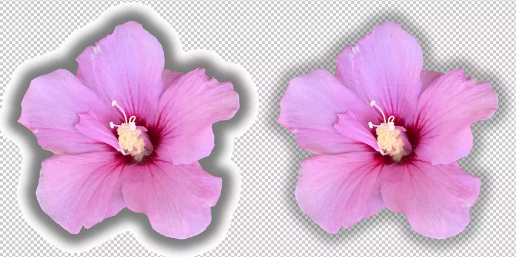
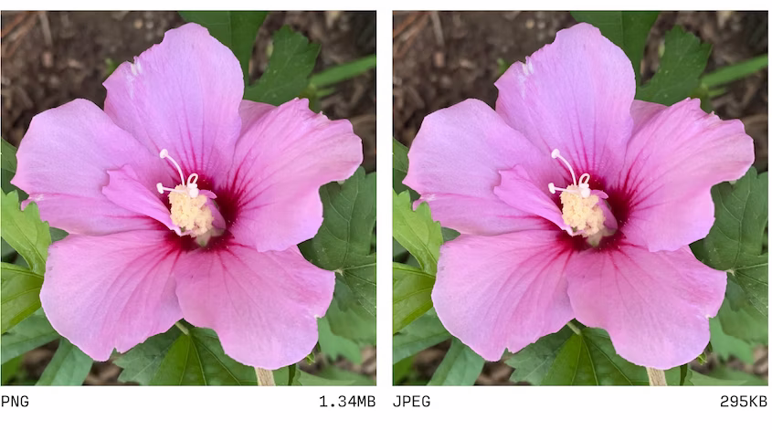
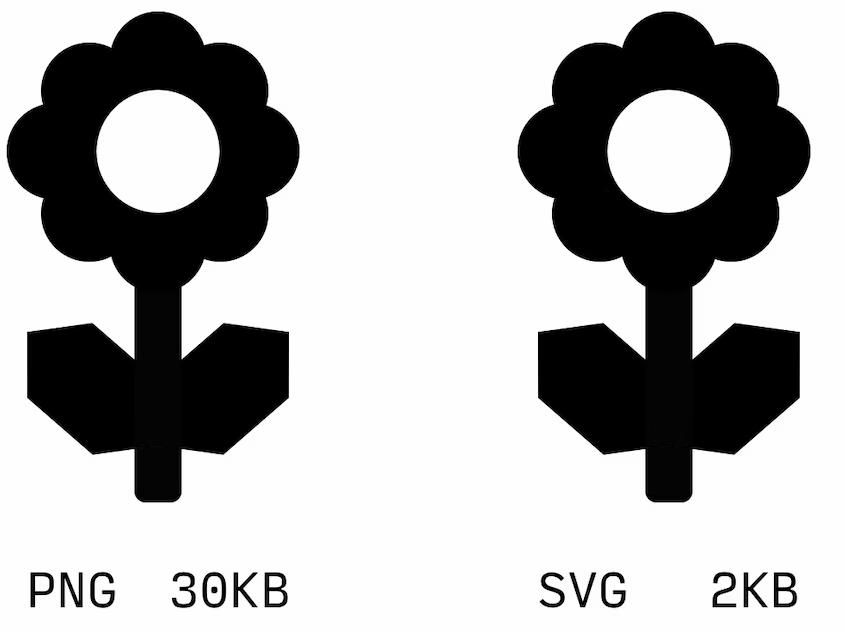

# Форматы изображений: PNG

<big>Узнайте, в каких случаях лучше всего выбирать формат изображения PNG.</big>

Есть несколько особенностей, отличающих PNG (Portable Network Graphics) от других форматов, хотя, поскольку он был задуман как замена GIF (из-за патентных споров, возникших очень и очень давно), он похож на GIF по нескольким параметрам. PNG также использует сжатие без потерь, что означает, что данные изображения будут _сжаты_ без потери визуальной достоверности. Цветовая палитра изображения может быть квантована - "индексированный цвет", при этом PNG использует палитру, ограниченную 256 цветами, как и GIF. Гораздо более распространенный "truecolor" PNG может содержать гораздо больше цветов - до 16 миллионов.

PNG и GIF поддерживают прозрачность, но с существенным отличием. В GIF прозрачность рассматривается как двоичное представление - пиксель либо непрозрачного цвета, либо полностью прозрачный. PNG поддерживает прозрачность "альфа-канала", т.е. для каждого пиксела можно установить уровень прозрачности в диапазоне от 0 (полностью прозрачный) до 255 (полностью непрозрачный).

С практической точки зрения, отсутствие существенного квантования и сжатие без потерь означают, что сохранение изображения в формате PNG никогда не приведет к снижению его визуального качества. Однако это почти всегда приводит к чрезмерно большим размерам файлов по сравнению с более современными кодировками, удобными для использования в Интернете. Размер PNG при передаче означает, что они практически никогда не подходят для фотоконтента.

В прошлые годы PNG был более распространен в основном из-за единственного случая использования - как единственное растровое кодирование, поддерживающее полупрозрачность. Сегодня PNG следует рассматривать только для простых работ, требующих полупрозрачности, например, для логотипа компании с падающей тенью, и внимательно сравнивать его с более современными форматами, поддерживающими полупрозрачность, такими как WebP.

PNG, как и GIF, был разработан для решения задач, для которых SVG часто оказывается лучше с точки зрения масштабируемости и размера файла. По этой причине PNG иногда используется в качестве запасного варианта элементов пользовательского интерфейса в исчезающе малом количестве браузеров, не поддерживающих SVG, хотя такие случаи становятся все более редкими.

С практической точки зрения PNG является оптимальным вариантом для сохранения "канонической" версии исходного изображения в локальной среде разработки или в репозитории проекта на случай, если в будущем потребуется отредактировать или пересохранить версию изображения в альтернативном формате.

Следует отметить, что, несмотря на стандартизацию кодировок, различные средства редактирования используют разные методы их выполнения - одни гораздо эффективнее других. Прежде чем передавать PNG в любом контексте, обязательно прогоните файлы через такие инструменты, как [Squoosh](https://squoosh.app/) или [ImageOptim](https://imageoptim.com).

:material-information-outline: Источник &mdash; [Image formats: PNG](https://web.dev/learn/images/png/)
