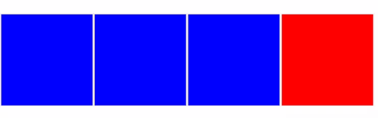

# Растровые изображения

<big>Откройте для себя растровые изображения, такие как JPEG, GIF, PNG и WebP.</big>

Растровые изображения можно рассматривать как набор попиксельных инструкций для визуализации двумерной сетки. К распространенным форматам растровых изображений относятся GIF (.gif), JPEG (.jpg), PNG (.png) и WebP (.webp). Способ сжатия и кодирования этих инструкций в каждом формате отличается, что приводит к огромному разбросу размеров файлов: фотографическое изображение, закодированное в JPEG, может занимать всего несколько сотен килобайт, а то же самое изображение, закодированное в PNG, - несколько мегабайт, причем конечный пользователь не заметит никакой разницы в качестве.

Источник растрового изображения, масштабированный сверх присущих ему размеров, будет выглядеть искаженным, блочным или размытым:

<iframe src="https://codepen.io/web-dot-dev/embed/ZEjBQqB?height=500&amp;theme-id=light&amp;default-tab=css%2Cresult&amp;editable=true" style="height: 500px; width: 100%; border: 0;" loading="lazy"></iframe>

Для работ, содержащих реальные уровни детализации, растровые изображения являются оптимальным инструментом.

Как и при выборе между растровыми и векторными изображениями, выбор подходящего типа растрового изображения в конечном счете зависит от конкретной задачи. Когда мы разбиваем растровые изображения на кодировки, мы говорим о методах, используемых для описания их содержимого, и о методах сжатия (или их отсутствии), которые мы применяем. Помните, что сервер передает браузеру по проводам не изображение, а поток байтов, описывающих сетку пикселей, из которых состоит это изображение, для последующей компоновки клиентом.

Чтобы лучше представить себе процесс кодирования сетки пикселей в виде байтового потока данных, представьте, что вы выступаете в роли веб-браузера. У вас есть лист [миллиметровой графической бумаги](https://en.wikipedia.org/wiki/Graph_paper#Formats) и определенная упаковка фирменных мелков. У меня, как у веб-сервера, есть точно такие же вещи, но я уже использовал свои мелки, чтобы заполнить лист бумаги исходным изображением. Если бы я послал вам обычное текстовое сообщение, я не смог бы отправить вам само изображение, но я мог бы передать информацию об источнике изображения на понятном нам обоим языке, используя наш общий стандарт для "пиксельной" сетки и цветов:

> Начните с левого верхнего угла. Первая строка, первый столбец - синий. Строка 1, столбец 2 - синий. Строка 1, столбец 3 - синий. Первая строка, четвертый столбец - красный.

Используя эту текстовую информацию, вы сможете идеально воссоздать то изображение, которое есть у меня на листе графической бумаги.

Различия в форматах изображений и способах их кодирования в виде данных можно условно считать тем, как эта информация была отформатирована. Например, информацию, которую я вам отправил, можно было бы выразить следующим образом:

> Начните с левого верхнего угла. Первая строка, столбцы с первого по третий - синие. Первая строка, четвертый столбец - красный.

Любое из этих описаний приведет к одному и тому же изображению, но во втором случае удается описать то же самое изображение меньшим количеством символов. Это метод сжатия данных изображения без потерь: вся та же информация - и, следовательно, не снижается точность изображения - но меньше байт передается по проводам от меня к вам - от сервера к механизму рендеринга. Это эквивалент "кодирования по длине строки" для данных изображения, когда данные кодируются как повторяющееся значение и счетчик, а не повторяют полное значение несколько раз.

Обратное сжатие, сжатие с потерями, на первый взгляд может показаться бессмысленным - зачем вообще нужно, чтобы ваши изображения выглядели _хуже_? Однако это не совсем так, и стоит помнить, что наши глаза тоже не обладают идеальной точностью. Выбор правильного формата и параметров сжатия изображения - это поиск баланса между уровнем визуальной детализации, который мы способны воспринять, и объемом данных, передаваемых браузеру. Оба эти фактора определяются содержанием исходного изображения.

Форматы растровых изображений - это те, с которыми вы, как разработчик, скорее всего, хорошо знакомы: GIF, JPEG, PNG, WebP и другие. О возможностях каждого из них вы узнаете в следующих модулях.

:material-information-outline: Источник &mdash; [Raster images](https://web.dev/learn/images/raster-images/)
