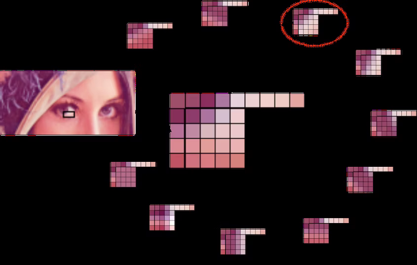

# Форматы изображений: WebP

<big>Узнайте о WebP и поймите разницу между этим форматом и другими.</big>

<p class="ciu_embed" data-feature="webp" data-periods="future_1,current,past_1,past_2" data-accessible-colours="false">
<picture>
<source type="image/webp" srcset="https://caniuse.bitsofco.de/image/webp.webp">
<source type="image/png" srcset="https://caniuse.bitsofco.de/image/webp.png">

</picture>
</p>

Изначально компания Google разрабатывала WebP как формат изображений с потерями, пришедший на смену JPEG, который позволял создавать файлы меньшего размера, чем файлы изображений сопоставимого качества, закодированные в JPEG. В последующих обновлениях формата появилась возможность сжатия без потерь, прозрачность альфа-канала, подобная PNG, и анимация, подобная GIF, - все это может использоваться наряду со сжатием с потерями, подобным JPEG. WebP - невероятно универсальный формат.

Алгоритм сжатия WebP с потерями основан на методе, который использует [видеокодек VP8](https://datatracker.ietf.org/doc/html/draft-bankoski-vp8-bitstream-01#page-7) для сжатия ключевых кадров в видео. На высоком уровне он похож на кодирование JPEG: WebP работает в терминах "блоков", а не отдельных пикселей, и имеет аналогичное разделение на яркость и цветность. Блоки света в WebP имеют размер 16x16, блоки цветности - 8x8, и эти "макроблоки" далее делятся на субблоки 4x4.

Кардинальное отличие WebP от JPEG заключается в двух особенностях: "предсказание блоков" и "адаптивное квантование блоков".

## Предсказание блоков

Предсказание блоков - это процесс, в ходе которого содержимое каждого блока цветности и яркости предсказывается на основе значений окружающих блоков, то есть блоков, расположенных выше и левее текущего блока. Как вы можете себе представить, алгоритмы, выполняющие эту работу, достаточно сложны, но если говорить простым языком, то: "если над текущим блоком есть синий цвет, а слева от него - синий, считайте, что этот блок синий".

По правде говоря, и PNG, и JPEG также в той или иной степени выполняют подобное предсказание. Однако WebP уникален тем, что он делает выборку данных из окружающих блоков, а затем пытается заполнить текущий блок с помощью нескольких различных "режимов предсказания", фактически пытаясь "нарисовать" недостающую часть изображения. Результаты, полученные в каждом режиме предсказания, сравниваются с реальными данными изображения, и выбирается наиболее близкое к ним предсказание.

<div style="background: #fff;" markdown>

</div>

Конечно, даже самое близкое прогнозирование не может быть полностью верным, поэтому различия между прогнозируемыми и реальными значениями блока кодируются в файле. При декодировании изображения механизм рендеринга использует те же данные для применения той же логики прогнозирования, что приводит к получению тех же прогнозируемых значений для каждого блока. Разница между прогнозом и ожидаемым изображением, которое было закодировано в файле, затем применяется к прогнозам - подобно тому, как коммит в Git представляет собой дифференциальный патч, который применяется к локальному файлу, а не к совершенно новой копии файла.

Для примера: вместо того чтобы вникать в сложную математику, связанную с настоящим алгоритмом предсказания, мы придумаем WebP-подобную кодировку с одним режимом предсказания и будем использовать ее для эффективной передачи сетки чисел так же, как это было сделано в старых форматах. Наш алгоритм имеет единственный режим предсказания, который мы назовем "режимом предсказания один": значение каждого блока равно сумме значений блоков, расположенных над ним и слева от него, начиная с 1.

Итак, предположим, что мы имеем следующие данные реального изображения:

```text
111151111
122456389
```

Используя нашу прогностическую модель для определения содержимого сетки 2x9, мы получим следующий результат:

```text
111111111
123456789
```

Наши данные хорошо подходят для разработанного нами алгоритма прогнозирования - прогнозируемые данные близко совпадают с реальными. Конечно, это не совсем так - в реальных данных есть несколько блоков, которые отличаются от предсказанных. Поэтому в кодировке, которую мы отправляем, указывается не только метод предсказания, но и различие между блоками, которые должны отличаться от предсказанных значений:

```text
_ _ _ _ +4 _ _ _ _
_ _ -1 _ _ _ -4 _ _
```

Выражаясь тем же простым языком, что и некоторые из обсуждавшихся нами кодировок устаревших форматов:

> сетка 2x9 с использованием первого режима предсказания. +4 - 1x5, -1 - 2x3, -4 - 2x7.

В итоге получается невероятно эффективный кодированный файл.

## Адаптивное блочное квантование

JPEG-сжатие - это сплошная операция, при которой к каждому блоку изображения применяется один и тот же уровень квантования. Для изображений с однородной композицией это, конечно, имеет смысл, но реальные фотографии не более однородны, чем окружающий нас мир. На практике это означает, что параметры сжатия JPEG определяются не высокочастотными деталями, в которых JPEG-компрессия превосходит все остальные, а теми частями изображения, где наиболее вероятно появление артефактов сжатия.


Как видно из этого утрированного примера, крылья монарха на переднем плане выглядят относительно четко - немного зернисто, если сравнивать с оригиналом высокого разрешения, но, конечно, не заметно без оригинала, чтобы сравнить с ним. Аналогично, детальное соцветие молочая и листья на переднем плане - мы с вами можем увидеть следы артефактов сжатия, но даже при компрессии, превышающей разумные пределы, все на переднем плане выглядит достаточно четким. Низкочастотная информация в левой верхней части изображения - размытый зеленый фон из листьев - выглядит просто ужасно. Даже неподготовленный зритель сразу же заметит проблему качества - тонкие градиенты на заднем плане округляются до рваных сплошных цветовых блоков.

Чтобы избежать этого, в WebP используется _адаптивный_ подход к квантованию: изображение разбивается на четыре визуально похожих сегмента, и параметры сжатия для них настраиваются независимо. Использование такого же чрезмерного сжатия в WebP:


Размер обоих файлов изображений примерно одинаков. Качество изображения примерно одинаково, когда мы смотрим на крылья монарха - можно заметить несколько крошечных различий в конечном результате, если присмотреться очень-очень внимательно, но реальной разницы в общем качестве нет. В WebP цветки молочая чуть более резкие - опять же, скорее всего, не настолько, чтобы это было заметно, если только вы не сравниваете два снимка рядом и не ищете разницу в качестве, как это делаем мы. Фон - совсем другая история: на нем почти нет следов явно выраженных артефактов JPEG. WebP дает тот же размер файла, но гораздо более высокое качество изображения - плюс-минус несколько мелких деталей, которые наши психовизуальные системы не смогли бы обнаружить, если бы мы не сравнивали их так близко.

## Использование WebP

Внутреннее устройство WebP может быть значительно сложнее, чем кодирование JPEG, но столь же просто для целей нашей повседневной работы: вся сложность кодирования WebP стандартизирована вокруг одного значения "качества", выражаемого в пределах 0-100, как и в JPEG. И опять же, это не означает, что вы _ограничены_ одним общим значением "качества". Вы можете и даже должны попробовать разобраться во всех тонкостях кодирования WebP, хотя бы для того, чтобы лучше понять, как эти обычно невидимые настройки могут влиять на размер и качество файла.

Google предлагает кодировщик командной строки `cwebp`, который позволяет конвертировать или сжимать отдельные файлы или целые каталоги изображений:

```shell
$ cwebp -q 80 butterfly.jpg -o butterfly.webp

Saving file 'butterfly.webp'
File:  	butterfly.jpg
Dimension: 1676 x 1418
Output:	208418 bytes Y-U-V-All-PSNR 41.00 43.99 44.95   41.87 dB
       	(0.70 bpp)
block count:    intra4:     7644  (81.80%)
          	   Intra16:     1701  (18.20%)
          	   Skipped:       63  (0.67%)
bytes used:  header:            249  (0.1%)
         	  mode-partition:  36885  (17.7%)
Residuals bytes  |segment 1|segment 2|segment 3|segment 4|  total
macroblocks:     |       8%|      22%|      26%|      44%|   9345
quantizer:       |      27 |      25 |      21 |      13 |
filter level:    |       8 |       6 |      19 |      16 |
```

Если же вы не склонны к работе с командной строкой, то Squoosh также хорошо подойдет для кодирования WebP. Он позволяет сравнивать различные кодировки, настройки, уровни качества и размер файла, отличающийся от размера файла при кодировании JPEG.

:information_source: Источник &mdash; [Image formats: WebP](https://web.dev/learn/images/webp/)
