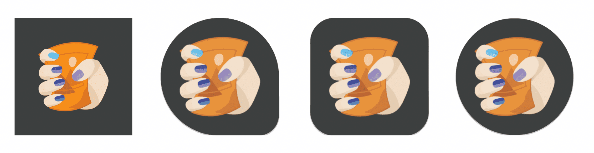
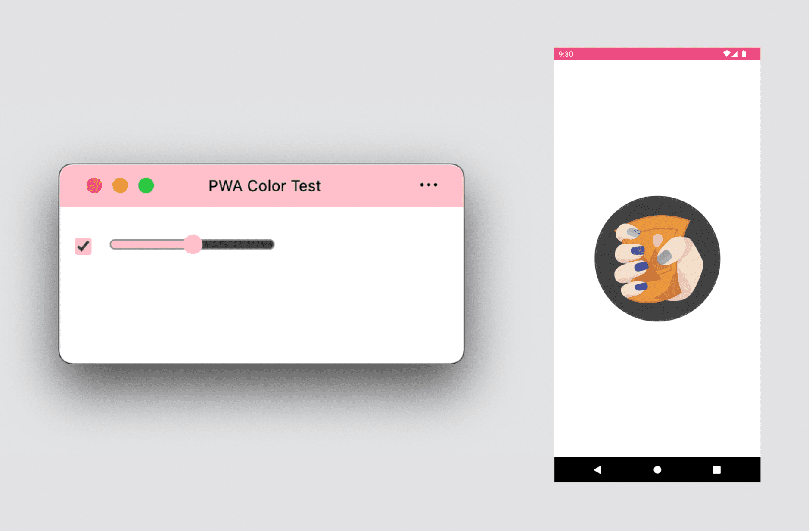
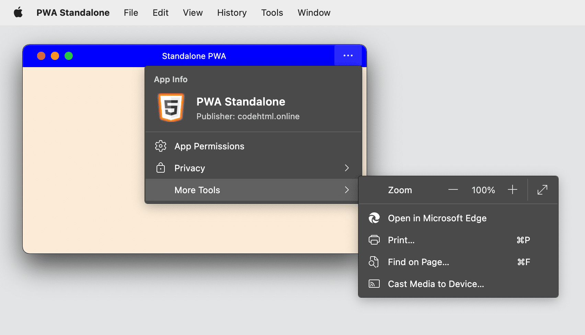
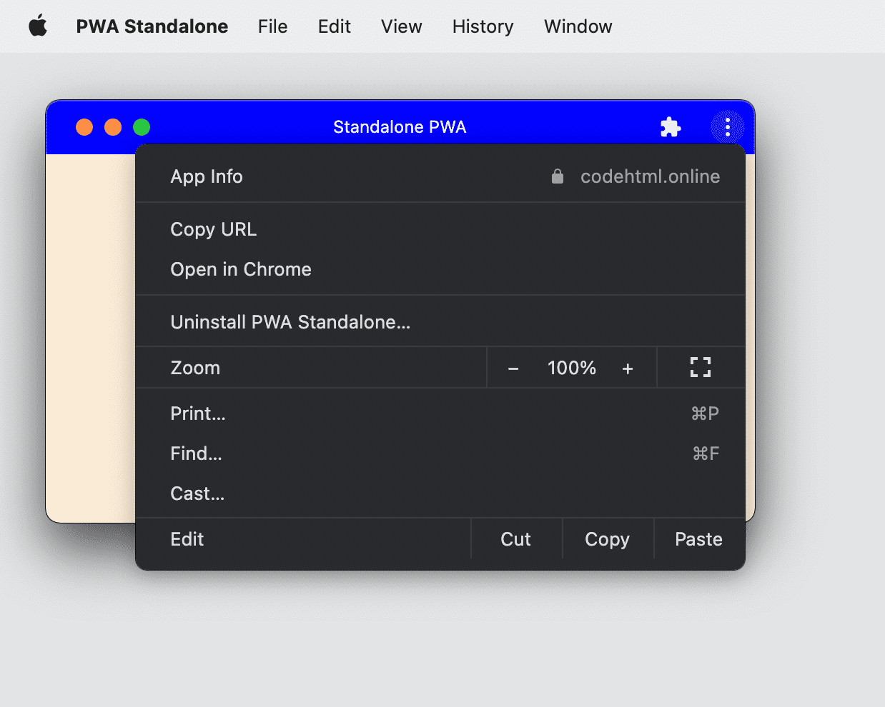
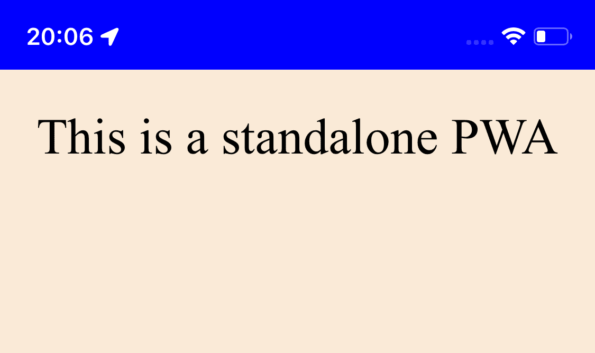
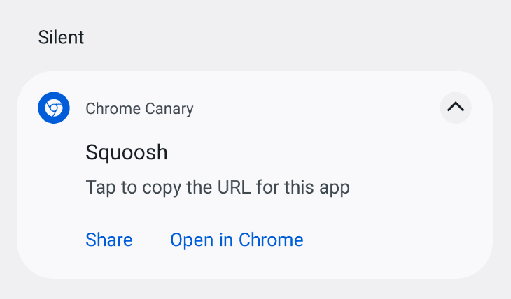
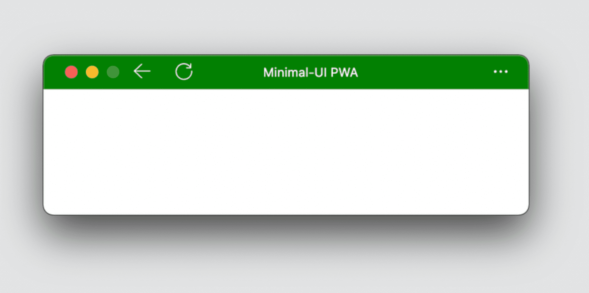
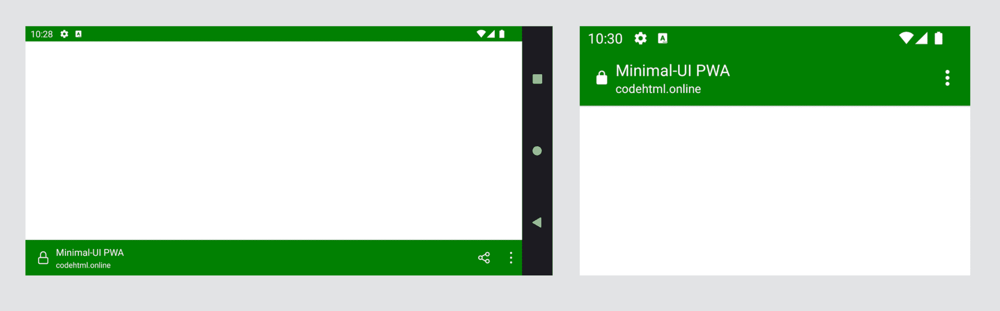
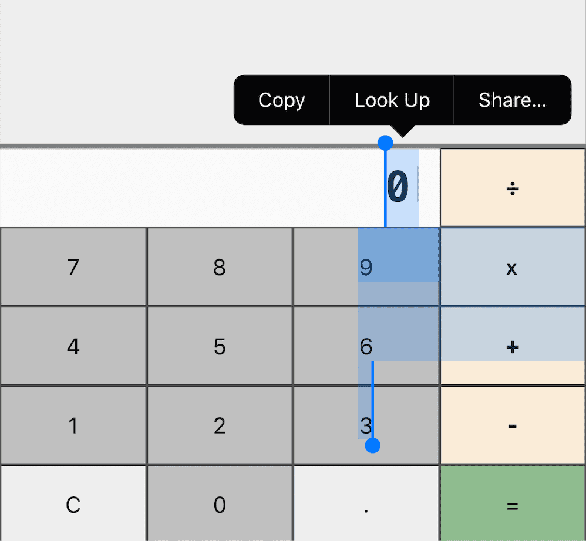
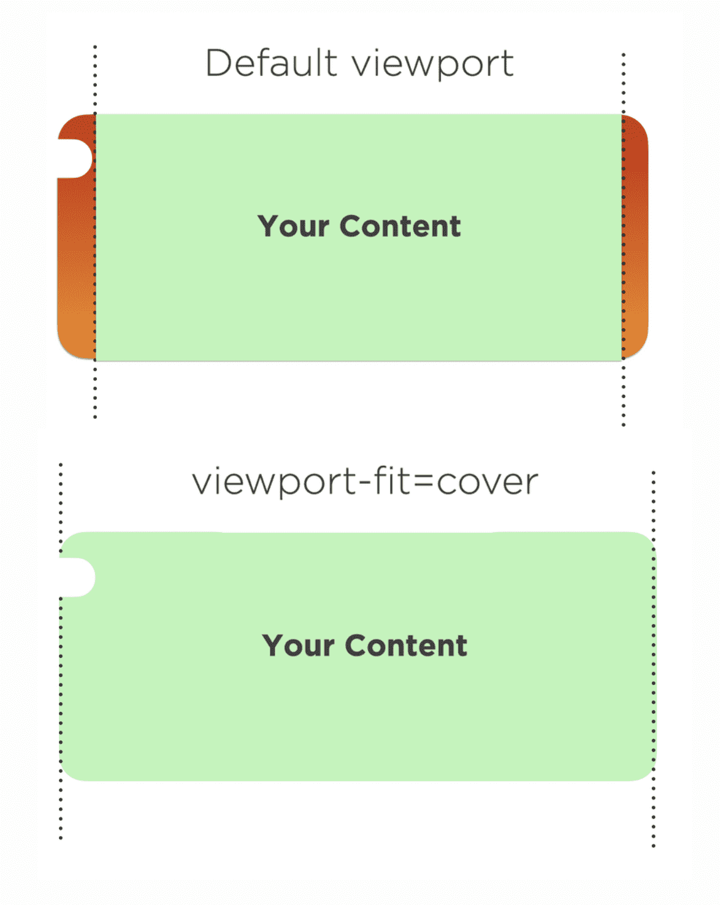

# Дизайн приложений

<big>Одним из ключевых отличий Progressive Web Apps от классических веб-сайтов и веб-приложений является возможность установки. Это позволяет создать автономный опыт, более интегрированный в платформу и операционную систему. Установка обеспечивает новую гибкость и новую ответственность, поскольку вокруг нашего контента не будет пользовательского интерфейса браузера.</big>

В этой главе рассматриваются некоторые важные аспекты вывода содержимого за пределы вкладки браузера.

## Окно

В разных операционных системах существуют различные представления об окне приложения. Например, на телефонах iPhone приложение всегда занимает 100% экрана. На Android и iPad приложения обычно работают в полноэкранном режиме, но есть возможность разделить экран между двумя приложениями, при этом одновременно может быть открыт только один экземпляр приложения. На настольных компьютерах, напротив, одновременно может быть открыто более одного экземпляра приложения. Оно делит доступное пространство экрана со всеми остальными открытыми приложениями. Каждый экземпляр приложения может быть изменен по размеру и размещен в любом месте экрана, даже перекрывая другие приложения.

## Иконка

Мы узнаем приложения по их значку. Этот значок появляется при поиске приложений, в настройках, при запуске приложений, а также при отображении запущенных приложений.

К ним относятся:

-   Главный экран (iOS, iPadOS, Android).
-   App Launcher (macOS, Android).
-   Меню "Пуск" или "Меню приложений" (Windows, ChromeOS, Linux).
-   Dock, TaskBar или многозадачные панели (все операционные системы).

При создании иконки для своего Progressive Web App убедитесь, что она не зависит от платформы, поскольку каждая операционная система может отображать иконки и применять к ним различные маски формы, как на рисунке ниже.



## Оформление приложения

Существует несколько способов настройки стиля приложения в PWA, в том числе:

-   Цвет темы: определяет цвет строки заголовка окна на настольных компьютерах и цвет строки состояния на мобильных устройствах. С помощью метатега можно выбрать различные схемы, например, темный или светлый режим, и они будут использоваться в зависимости от предпочтений пользователя.
-   Цвет фона: определяет цвет окна до загрузки приложения и его CSS.
-   Цвет акцента: определяет цвет встроенных компонентов браузера, таких как элементы управления формами.

<figure markdown>

<figcaption>PWA для настольных ПК, демонстрирующий тему и акцентные цвета, и заставка PWA для Android, демонстрирующая тему и фоновые цвета.</figcaption>
</figure>

При планировании пользовательского интерфейса Progressive Web App следует помнить, что для темы нельзя использовать изображения или градиенты, только обычные цвета. Лучше всего выбирать цвета без прозрачности, использовать цвета `rgb` или `hsl`, шестнадцатеричные коды или именованные цвета. Тематизация приложения может также влиять на тематизацию браузера даже без установки приложения, например, при использовании элемента [`<meta name="theme-color">`](https://web.dev/articles/add-manifest#theme-color).

## Режимы отображения

Вы можете определить, какой вид окна вы хотите получить для своего Progressive Web App. На выбор предлагается три варианта:

-   Полноэкранный
-   Автономный
-   Минимальный пользовательский интерфейс

!!!note ""

    Если тот или иной режим отображения не поддерживается или по каким-либо другим причинам не может быть использован для отображения PWA, он переходит в следующий доступный режим отображения. Fullscreen переходит в standalone, standalone - в минимальный пользовательский интерфейс, а минимальный пользовательский интерфейс - в браузер, используемый по умолчанию. В режиме браузера PWA не отображается в виде собственного окна, а выводится на вкладку браузера, из которого он был установлен, подобно веб-закладке на домашнем экране.

### Полноэкранный режим

Полноэкранный режим работы подходит для иммерсивного опыта, такого как игры, VR или AR. В настоящее время он доступен только на устройствах Android. Он скрывает строку состояния и навигационную панель, предоставляя вашему PWA 100% экрана для контента.

На настольных компьютерах и iPadOS полноэкранные PWA не поддерживаются, однако вы можете использовать [Fullscreen API](https://developer.mozilla.org/docs/Web/API/Fullscreen_API) внутри своего PWA для отображения приложения в полноэкранном режиме по запросу пользователя.

### Автономный режим

Наиболее распространенный вариант для Progressive Web App - автономный режим, при котором PWA отображается в стандартном для ОС окне без навигационного пользовательского интерфейса браузера. В окне также может присутствовать меню, управляемое браузером, в котором пользователь может:

-   Скопировать текущий URL-адрес.
-   Посмотреть, применить или отключить расширения браузера.
-   Посмотреть и изменить разрешения.
-   Проверить текущее происхождение и SSL-сертификат.

В строке заголовка вместо омнибокса или строки URL может также отображаться информация о разрешениях и использовании оборудования, когда PWA отображается на вкладке.

<figure markdown>


<figcaption>На изображениях выше показано, как PWA отображается в автономном режиме на рабочем столе в Microsoft Edge и Chrome.</figcaption>
</figure>

На мобильных устройствах автономные PWA-системы создают стандартный экран, на котором сохраняется строка состояния, что позволяет пользователю видеть уведомления, время и уровень заряда батареи. При этом часто отсутствует какое-либо меню, управляемое браузером, как это может быть в автономных решениях для настольных ПК.



Некоторые браузеры на Android создают фиксированное и бесшумное уведомление, когда PWA находится на переднем плане, которое позволяет пользователю скопировать текущий URL-адрес или воспользоваться другими опциями.



### Минимальный пользовательский интерфейс

Этот режим доступен для Progressive Web Apps на Android и настольных операционных системах. При его использовании браузер, отображающий PWA, будет показывать минимальный пользовательский интерфейс, помогающий пользователю ориентироваться в приложении.

На Android отображается строка заголовка, в которой отображается текущий элемент `<title>` и начало страницы с небольшим выпадающим меню. На настольных компьютерах в строке заголовка отображается набор кнопок для навигации, включая кнопку "Назад" и элемент управления, который переключается между остановкой и перезагрузкой в зависимости от текущего состояния загрузки.





!!!warning ""

    Safari на iOS и iPadOS не поддерживает режим минимального пользовательского интерфейса для PWA. Вместо этого в качестве запасного варианта используется ярлык браузера. Пользователь может добавить значок на главный экран, но этот значок будет указывать на Safari как на закладку, и у него не будет возможности пользоваться приложением из вкладки браузера.

## Оптимизация дизайна для настольных компьютеров

При разработке Progressive Web App для работы на настольном компьютере необходимо подумать о безграничных возможностях размера окна по сравнению с размещением во вкладке браузера или в виде приложения в мобильной операционной системе.

В [Главе 3](foundations.md) мы упоминали о мини-режиме: приложение для настольных компьютеров может быть размером всего 200 на 100 пикселей. В качестве заголовка этого окна будет использоваться содержимое элемента `<title>` в вашем HTML. Это содержимое также будет отображаться при переходе между приложениями и в других местах при помощи ++alt+tab++.

Обратите внимание на элемент `<title>` в HTML и переосмыслите его использование. Элемент `<title>` нужен не только для SEO или для отображения первых символов на вкладке браузера; он будет частью пользовательского опыта вашего отдельного окна на рабочем столе.

!!!note ""

    Если вы разрабатываете приложение с использованием библиотеки клиент-сайд, например React или Vue, не забудьте изменить `<title>` на какую-то практическую ценность при переходе между разделами или маршрутами вашего приложения. Пришло время переосмыслить `<title>`!

## Лучшие практики CSS

Весь ваш опыт работы с [CSS-макетом, дизайном и анимацией](../css3/index.md) действителен при отображении содержимого в автономном режиме. Тем не менее, существует несколько советов и приемов, позволяющих улучшить работу с автономным окном.

!!!note ""

    Помните, что CSS определяет стили только для содержимого PWA; позже в этом курсе мы рассмотрим, как задать декларации стилей для окна вокруг вашего содержимого, например, свойства в [манифесте веб-приложения](web-app-manifest.md).

### Медиазапросы

Первый [media query](../design/media-queries.md), который вы можете использовать в своем PWA, - это свойство `display-mode`, принимающее значения `browser`, `standalone`, `minimal-ui` или `fullscreen`.

Этот медиазапрос применяет различные стили для каждого режима. Например, можно отобразить [приглашение к установке](installation.md) только в режиме браузера, или отобразить определенную информацию только тогда, когда пользователь использует ваше приложение с системного значка. Сюда же можно отнести добавление кнопки "Назад", которая будет использоваться при запуске приложения в автономном режиме.

```css
/* It targets only the app used within the browser */
@media (display-mode: browser) {
}
/* It targets only the app used with a system icon in standalone mode */
@media (display-mode: standalone) {
}
/* It targets only the app used with a system icon in all mode */
@media (display-mode: standalone),
    (display-mode: fullscreen),
    (display-mode: minimal-ui) {
}
```

!!!note ""

    Пользователи ожидают от приложений интеграции с платформой, поэтому следует предусмотреть темный и светлый режимы с использованием [`prefers-colors-scheme`](https://developer.mozilla.org/docs/Web/CSS/@media/prefers-color-scheme) и соблюдение медиазапросов [`prefers-reduced-motion`](https://web.dev/articles/prefers-reduced-motion) для отключения или уменьшения переходов и анимации.

## Работа с приложениями

Когда пользователи используют установленный PWA, они ожидают поведения приложения. Хотя определить, что оно означает, не так просто, в некоторых ситуациях веб-поведение по умолчанию не дает наилучшего опыта.

### Выделение

Контент обычно выделяется с помощью мыши или указателя, либо жестом нажатия и удержания. Хотя это и полезно для контента, это не обеспечивает наилучшего опыта для элементов навигации, меню и кнопок в PWA.



Поэтому целесообразно отключить возможность выделения пользователем этих элементов с помощью `user-select: none` и его префиксной версии `-webkit-`:

```css
.unselectable {
    user-select: none;
}
```

!!!note ""

    Выбор пользователя - важнейшая функция любого веб-приложения, обеспечивающая удобство и доступность. Не отключайте выбор пользователя для всего содержимого, а только для элементов пользовательского интерфейса, если отказ от этого приводит к плохому или неожиданному опыту.

### Акцентный цвет

В PWA вы можете задать цвет, соответствующий вашему бренду, в элементах управления HTML-формы с помощью свойства [`accent-color`](https://web.dev/articles/accent-color).

### Системные шрифты

Если вы хотите, чтобы элементы, например диалоги или сообщения, соответствовали шрифту платформы, используемому пользователем по умолчанию, вы можете использовать следующее семейство шрифтов:

```css
selector {
    font-family: -apple-system, BlinkMacSystemFont,
        'Segoe UI', system-ui, Roboto, Oxygen-Sans, Ubuntu,
        Cantarell, 'Helvetica Neue', sans-serif;
}
```

### Потянуть для обновления

Современные мобильные браузеры, такие как Google Chrome и Safari, оснащены функцией обновления страницы, когда она тянется вниз. В некоторых браузерах, например в Chrome на Android, эта функция включена и для автономных PWA.

Возможно, вы захотите отключить это действие. Например, если вы предоставляете собственное управление жестами или действие обновления, или если есть вероятность, что пользователь вызовет это действие непреднамеренно.

Отключить это действие можно с помощью `overscroll-behavior-y: contain`:

```css
body {
    overscroll-behavior-y: contain;
}
```

### Безопасные области

Некоторые устройства не имеют беспрепятственных прямоугольных экранов; вместо этого их экран может иметь другую форму, например круг, или иметь части экрана, которые не могут быть использованы, как, например, вырез iPhone 13. В таких случаях некоторые браузеры открывают [переменные окружения](<https://developer.mozilla.org/docs/Web/CSS/env()>) с безопасными областями, в которых может отображаться содержимое.



Если вы хотите получить полный доступ к экрану, даже к невидимой области, для отображения цвета или изображения, включите `viewport-fit=cover` в содержимое тега `<meta name="viewport">`. Затем используйте переменные окружения `safe-area-inset-*` для безопасного расширения содержимого в эти области.

!!!warning ""

    Применяя `viewport-fit=cover`, помните, что теперь можно выводить пиксели за закругленными углами и выемками, поэтому всегда используйте безопасные поля или отступы для критически важного содержимого и интерактивных элементов.

## Ресурсы

-   [CSS display-mode медиазапрос](https://developer.mozilla.org/docs/Web/CSS/@media/display-mode)
-   [Возьмите под контроль прокрутку: настройка эффектов pull-to-refresh и overflow](https://developer.chrome.com/blog/overscroll-behavior)
-   [prefers-color-scheme: Здравствуй, тьма, мой старый друг](https://web.dev/articles/prefers-color-scheme)
-   [prefers-reduced-motion: Иногда меньше движения - больше](https://web.dev/articles/prefers-reduced-motion)
-   [env() CSS-функция](<https://developer.mozilla.org/docs/Web/CSS/env()>)
-   [CSS Цвет акцента](https://web.dev/articles/accent-color)

:material-information-outline: Источник &mdash; [App design](https://web.dev/learn/pwa/app-design)
