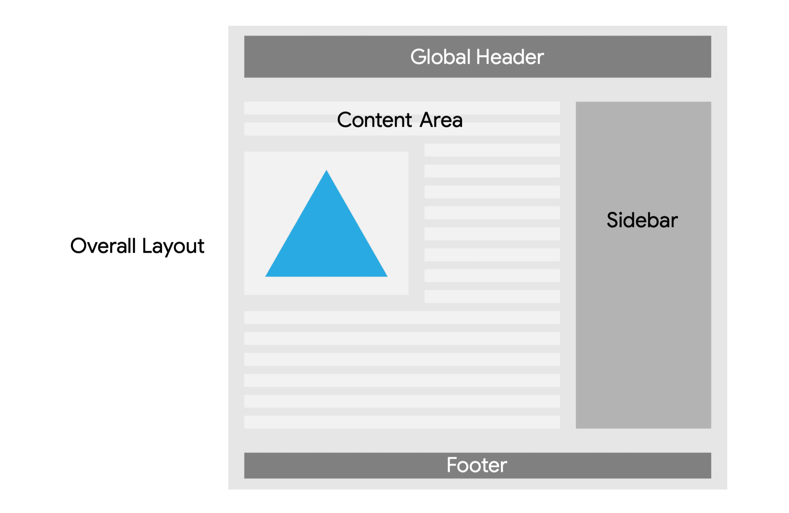

# Архитектура

<big>При разработке PWA необходимо принять ряд решений, например, создать одностраничное или многостраничное приложение, разместить его в корне домена или в папке.</big>

Проектирование приложения с целью максимального использования технологий, которые делают PWA надежными, инсталлируемыми и функциональными, начинается с понимания приложения и его ограничений, а также выбора подходящей архитектуры для обоих вариантов.

## SPA против MPA

Сегодня в веб-разработке существует два основных архитектурных паттерна: одностраничные приложения, или SPA, и многостраничные приложения, или MPA.

Одностраничные приложения определяются тем, что JavaScript на стороне клиента управляет большей частью или всем HTML-рендерингом страницы на основе данных, полученных приложением или предоставленных ему. Приложение переопределяет встроенную навигацию браузера, заменяя ее своей функциональностью маршрутизации и обработки представлений.

Многостраничные приложения обычно имеют предварительно отрендеренный HTML, отправляемый непосредственно в браузер, часто дополняемый клиентским JavaScript после завершения загрузки HTML, и полагаются на встроенные в браузер механизмы навигации для отображения последующих представлений.

Для создания PWA могут использоваться обе архитектуры.

Каждая из них имеет свои преимущества и недостатки, и выбор подходящей для конкретного случая использования и контекста является ключевым фактором для обеспечения быстрой и надежной работы пользователей.

### Одностраничные приложения

:material-thumb-up:{: style="color: green"} Плюсы

-   В основном атомарные обновления внутри страницы.
-   Зависимости на стороне клиента загружаются при запуске.
-   Последующие загрузки происходят быстро благодаря использованию кэша.

:material-thumb-down:{: style="color: red"} Минусы

-   Высокая стоимость начальной загрузки.
-   Производительность зависит от аппаратного обеспечения устройства и сетевого подключения.
-   Требуется дополнительная сложность приложения.

Одностраничные приложения хорошо подходят для архитектуры, если:

-   Взаимодействие с пользователем в основном сосредоточено на атомарном обновлении взаимосвязанных данных, отображаемых на одной странице, например, приборная панель данных в реальном времени или приложение для редактирования видео.
-   Ваше приложение имеет зависимости инициализации только со стороны клиента, например, сторонний провайдер аутентификации с непомерно высокими затратами на запуск.
-   Данные, необходимые для загрузки представления, зависят от определенного контекста, доступного только клиенту, например, отображение элементов управления для подключенного оборудования.
-   Приложение небольшое и простое настолько, что его размер и сложность не влияют на перечисленные выше недостатки.

SPA может оказаться не самым удачным выбором архитектуры, если:

-   Важна производительность при начальной загрузке. SPA обычно требуют загрузки большего количества JavaScript для определения того, что загружать и как это отображать. Разбор и выполнение этого JavaScript в сочетании с получением содержимого происходит медленнее, чем отправка HTML.
-   Ваше приложение работает в основном на устройствах с низким и средним уровнем мощности. Поскольку SPA зависят от JavaScript для рендеринга, пользовательский опыт зависит от мощности конкретного устройства гораздо сильнее, чем в случае с MPA.

Поскольку SPA должны заменять встроенную навигацию браузера своей маршрутизацией, SPA требуют минимального уровня сложности для эффективного обновления текущего представления, управления изменениями навигации и очистки предыдущих представлений, которые в противном случае выполнялись бы браузером, что делает их в целом более сложными в обслуживании и более нагружающими пользовательское устройство.

### Многостраничные приложения

:material-thumb-up:{: style="color: green"} Плюсы

-   В основном полностраничные обновления.
-   Скорость начального рендеринга критична.
-   Сценарии на стороне клиента могут быть улучшением.

:material-thumb-down:{: style="color: red"} Минусы

-   Вторичные представления требуют еще одного вызова сервера.
-   Контекст не переносится между представлениями.
-   Требуется сервер или предварительный рендеринг.

Многостраничные приложения являются хорошим архитектурным выбором, если:

-   Взаимодействие с пользователем в основном сосредоточено на просмотре одного фрагмента данных с дополнительными контекстными данными, например, в новостях или приложении электронной коммерции.
-   Скорость первоначального рендеринга критична, поскольку отправка уже отрендеренного HTML в браузер быстрее, чем сборка его из запроса данных после загрузки, разбора и выполнения альтернативы на основе JavaScript.
-   Интерактивность или контекст на стороне клиента могут быть включены в качестве дополнения после первоначальной загрузки, например, наложение профиля на отрисованную страницу или добавление вторичных компонентов, зависящих от контекста на стороне клиента.

MPA может оказаться не самым удачным выбором архитектуры, если:

-   Повторная загрузка, повторный разбор и повторное выполнение JavaScript или CSS являются непомерно дорогими. Эта проблема решается в PWA с помощью сервис-воркеров.
-   Контекст на стороне клиента, например, местоположение пользователя, не переносится между представлениями, и повторное получение этого контекста может быть дорогостоящим. Его нужно либо перехватывать и извлекать, либо повторно запрашивать между представлениями.

Поскольку отдельные представления должны динамически отображаться на сервере или предварительно рендериться перед доступом, это может ограничить хостинг или усложнить работу с данными.

### Что выбрать?

Несмотря на все эти плюсы и минусы, обе архитектуры подходят для создания PWA. Можно даже смешивать их для разных частей приложения в зависимости от его потребностей, например, для размещения объявлений в магазине использовать архитектуру MPA, а для оформления заказа - архитектуру SPA.

Независимо от выбора, следующим шагом будет понимание того, как лучше использовать сервис-ворк для обеспечения наилучшего опыта.

## Возможности сервис-воркера

Сервис-воркер обладает большими возможностями, чем базовая маршрутизация и доставка кэшированных и сетевых ответов. Мы можем создавать сложные алгоритмы, способные улучшить пользовательский опыт и производительность.

### Сервис-воркер включает (SWI)

Появившийся паттерн использования сервис-воркеров в качестве неотъемлемой части архитектуры сайта - это сервис-ворк includes (SWI). SWI разделяет отдельные ресурсы, обычно HTML-страницы, на части в соответствии с их потребностями в кэшировании, а затем сшивает их вместе в сервисе-воркере для повышения согласованности, производительности и надежности, уменьшая при этом размер кэша.

Это изображение представляет собой образец веб-страницы. Она состоит из пяти различных разделов, на которые разбита страница:

-   Общий макет.
-   Глобальный заголовок (верхняя темная полоса).
-   Область содержимого (средние левые строки и изображение).
-   Боковая панель (высокая средне-темная полоса справа посередине).
-   Нижний колонтитул (темная нижняя полоса).

#### Общий макет

Общий макет вряд ли будет часто меняться и не имеет зависимостей. Это хороший кандидат для [предварительного кэширования](assets-and-data.md#frequently-used-cache-approaches).

#### Верхний и нижний колонтитулы

Глобальные верхний и нижний колонтитулы содержат такие элементы, как верхнее меню и нижний колонтитул сайта, и представляют собой особую проблему: если бы страница кэшировалась как единое целое, они могли бы меняться между загрузками страницы в зависимости от того, когда была кэширована данная страница.

Разделив их и кэшировав независимо от содержимого, можно гарантировать, что пользователи всегда будут получать одну и ту же версию, независимо от того, когда она была кэширована. Поскольку они обновляются нечасто, они также являются хорошими кандидатами для предварительного кэширования. Однако у них есть зависимость: CSS и JavaScript сайта.

#### CSS и JavaScript

В идеале CSS и JavaScript сайта должны кэшироваться со стратегией stale while revalidate, чтобы обеспечить возможность инкрементных обновлений без необходимости обновления сервис-воркера, как это происходит в случае с ресурсами с предварительным кэшированием. Тем не менее, они также должны поддерживаться в минимальной версии каждый раз, когда сервис-воркер обновляет новый глобальный заголовок или нижний колонтитул. В связи с этим при установке сервис-воркера его кэш также должен обновляться последней версией ресурсов.

#### Область содержимого

Далее находится область содержимого. В зависимости от частоты обновлений хорошей стратегией здесь будет либо "сначала сеть", либо "устаревшее с последующей проверкой". Изображения следует кэшировать по стратегии "кэш в первую очередь", как это уже [обсуждалось ранее](serving.md#caching-strategies).

#### Боковая панель

Наконец, если предположить, что содержимое боковой панели содержит вторичное содержимое, такое как теги и связанные элементы, то оно не настолько критично, чтобы извлекать его из сети. В этом случае работает стратегия "устаревание при перепроверке".

Теперь, после всего вышесказанного, вы можете подумать, что подобное кэширование для каждого раздела возможно только в одностраничных приложениях. Но, приняв паттерны, вдохновленные [edge side includes](https://en.wikipedia.org/wiki/Edge_Side_Includes) или [server side includes](<https://ru.wikipedia. org/wiki/SSI_(%D0%BF%D1%80%D0%BE%D0%B3%D1%80%D0%B0%D0%BC%D0%BC%D0%B8%D1%80%D0%BE%D0%B2%D0%B0%D0%BD%D0%B8%D0%B5)>) в вашем сервис-воркере, с некоторыми расширенными возможностями сервис-воркера, вы можете сделать это для любой архитектуры.

#### Попробуйте сами

Вы можете попробовать включить сервис-воркер в следующий коделаб:

!!!note ""

    [Сервис-воркер включает](https://developers.google.com/codelabs/pwa-training/pwa06--service-worker-includes).

### Потоковые ответы

Предыдущая страница могла быть создана с использованием модели оболочки приложения в мире SPA, когда оболочка приложения кэшируется, затем обслуживается, а содержимое загружается на стороне клиента. С появлением и широкой доступностью [Streams API](https://developer.mozilla.org/docs/Web/API/Streams_API) оболочка приложения и контент могут быть объединены в сервисе-воркере и переданы в браузер, что обеспечивает гибкость кэширования оболочки приложения и скорость работы MPA.

Это происходит потому, что:

-   Потоки могут быть построены асинхронно, что позволяет различным частям потока поступать из других источников.
-   Запросчик потока может начать работу над ответом, как только первый фрагмент данных будет доступен, вместо того чтобы ждать, пока весь элемент будет завершен.
-   Парсеры, оптимизированные для работы с потоками, в том числе браузер, могут постепенно отображать содержимое потока до его завершения, что ускоряет воспринимаемую производительность ответа.

Благодаря этим трем свойствам потоков архитектуры, построенные на их основе, обычно имеют более высокую воспринимаемую производительность, чем те, в которых потоки не используются.

Работа с Streams API может быть сложной, поскольку он имеет сложный и низкий уровень. К счастью, существует модуль [Workbox](https://developers.google.com/web/tools/workbox/reference-docs/latest/module-workbox-streams), который может помочь в настройке потоковых ответов для ваших сервис-воркеров.

## Домены, происхождение и область действия PWA

Работа сервисов-воркеров, включая сервис-воркеры, хранилище и даже окно установленного PWA, регулируется одним из наиболее важных механизмов безопасности в Интернете - политикой "одного происхождения". В пределах одного источника права доступа предоставляются, данные могут совместно использоваться, а сервис-воркер может общаться с различными клиентами. За пределами одного источника разрешения автоматически не предоставляются, а данные изолированы и недоступны между различными источниками.

### Политика одинакового происхождения

Два URL-адреса определяются как имеющие одинаковое происхождение, если протокол, порт и хост совпадают.

Например: `https://squoosh.app` и `https://squoosh.app/v2` имеют одинаковое происхождение, но `http://squoosh.app`, `https://squoosh.com`, `https://app.squoosh.app` и `https://squoosh.app:8080` находятся в разных источниках. Дополнительную информацию и примеры можно найти в [same-origin policy MDN reference](https://developer.mozilla.org/docs/Web/Security/Same-origin_policy).

Смена поддоменов - не единственный способ изменения хоста. Каждый хост состоит из домена верхнего уровня (TLD), домена вторичного уровня (SLD) и нуля или более меток (иногда называемых субдоменами), разделенных точками между собой и читаемых в URL справа налево. Изменение любого из этих элементов приводит к появлению другого хоста.

В модуле [Управление окнами](windows.md) мы уже видели, как выглядит встроенный браузер, когда пользователь переходит на хост, отличный от установленного PWA.

Этот in-app браузер будет отображаться даже в том случае, если сайты имеют одинаковые TLD и SLD, но разные метки, поскольку в этом случае они считаются разными по происхождению.

Одним из ключевых аспектов происхождения в контексте веб-браузинга является работа с хранилищем и разрешениями. Одно происхождение имеет много общих характеристик для всего содержимого и PWA, входящих в него, в том числе:

-   Квота хранения и данные (IndexedDB, cookies, веб-хранилище, кэш-хранилище).
-   Регистрации сервис-воркеров.
-   Разрешенные или запрещенные разрешения (например, web push, геолокация, датчики).
-   Регистрации Web push.

При переходе от одного источника к другому весь предыдущий доступ аннулируется, поэтому разрешения приходится предоставлять заново, и PWA не может получить доступ ко всем данным, сохраненным в хранилище.

!!!warning ""

    Наличие различных поддоменов для разных частей сайта или различных TLD для других локализаций, например `admin.example.com` или `example.co.uk`, усложняет создание PWA, поскольку каждый поддомен будет иметь изолированное хранилище, собственную регистрацию сервис-воркера и манифест веб-приложения. Кроме того, это может привести к разрозненности, если поддомены созданы как одно и то же приложение, поскольку один из них будет отображаться в браузере приложения, а основной PWA - нет.

<video controls autoplay loop>
<source src="/learn/pwa/architecture-2.mp4" />
</video>

## Ресурсы

-   [Beyond SPAs: Альтернативные архитектуры для вашего PWA](https://developer.chrome.com/blog/beyond-spa)
-   [Структура прогрессивных веб-приложений](https://developer.mozilla.org/docs/Web/Progressive_web_apps/App_structure)
-   [Streams: Полное руководство](https://web.dev/articles/streams)

:material-information-outline: Источник &mdash; [Architecture](https://web.dev/learn/pwa/architecture)
