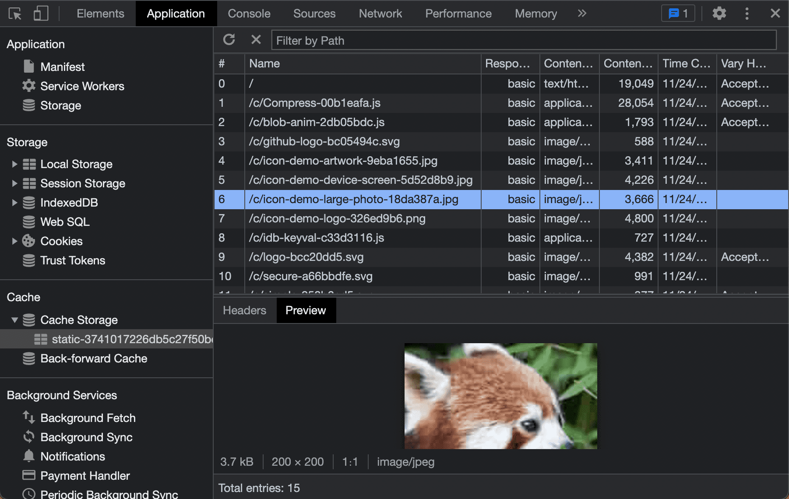

# Кэширование

<big>Вы можете использовать API Cache Storage для загрузки, хранения, удаления или обновления ресурсов на устройстве. Затем эти ресурсы могут обслуживаться на устройстве без необходимости сетевого запроса.</big>

Кэш-хранилище - это мощный инструмент. Оно делает ваши приложения менее зависимыми от состояния сети. При правильном использовании кэшей можно сделать веб-приложение доступным в автономном режиме и обслуживать ресурсы максимально быстро при любых условиях работы сети. Как указано в [Assets and Data](assets-and-data.md), вы можете выбрать оптимальную стратегию кэширования необходимых ресурсов. Для управления кэшем сервис-воркер взаимодействует с [Cache Storage API](https://developer.mozilla.org/docs/Web/API/CacheStorage).

<p class="ciu_embed" data-feature="mdn-api__CacheStorage" data-periods="future_1,current,past_1,past_2" data-accessible-colours="false"></p>

!!!note ""

    При установке приложений для конкретной платформы устройство сохраняет значок и другие ресурсы приложения в операционной системе за один шаг. Для PWA этот процесс состоит из двух отдельных этапов. PWA может сохранять ресурсы на устройстве в любое время после первого посещения браузера, даже без установки. Установка - это отдельное действие, которое будет рассмотрено далее в этом курсе.

Cache Storage API доступен из различных контекстов:

-   Контекст окна (главный поток вашего PWA).
-   Сервис-воркер.
-   Любые другие рабочие, которые вы используете.

Одним из преимуществ управления кэшем с помощью сервис-воркеров является то, что его жизненный цикл не привязан к окну, а значит, вы не блокируете главный поток. Следует помнить, что для использования Cache Storage API большинство из этих контекстов должны находиться под TLS-соединением.

## Что кэшировать

Первый вопрос, который может возникнуть в связи с кэшированием, - что кэшировать. Хотя единого ответа на этот вопрос не существует, можно начать с минимальных ресурсов, необходимых для визуализации пользовательского интерфейса.

Эти ресурсы должны включать:

-   HTML главной страницы (`start_url` вашего приложения).
-   Таблицы стилей CSS, необходимые для основного интерфейса пользователя.
-   Изображения, используемые в пользовательском интерфейсе.
-   Файлы JavaScript, необходимые для визуализации пользовательского интерфейса.
-   Данные, например, JSON-файл, необходимые для визуализации основного интерфейса.
-   Веб-шрифты.
-   В многостраничном приложении - другие HTML-документы, которые необходимо обслуживать быстро или в автономном режиме.

!!!warning ""

    Помните, что вы загружаете и храните ресурсы на устройствах пользователей, поэтому используйте это пространство и пропускную способность ответственно. Необходимо найти баланс между достаточным количеством ресурсов на устройстве для быстрой или автономной работы, не потребляя при этом слишком много данных.

### Возможность работы в автономном режиме

Хотя возможность работы в автономном режиме является одним из требований к прогрессивному веб-приложению, важно понимать, что не каждый PWA требует полноценной работы в автономном режиме, например, облачные игровые решения или приложения для работы с криптовалютными ресурсами. Поэтому вполне допустимо предложить базовый пользовательский интерфейс, позволяющий пользователям ориентироваться в таких ситуациях.

Ваш PWA не должен выдавать сообщение об ошибке браузера, говорящее о том, что движок веб-рендеринга не смог загрузить страницу. Вместо этого используйте сервис-воркер для отображения собственного сообщения, избегая общей и непонятной ошибки браузера.

!!!note ""

    При [публикации PWA в Google Play Store](https://chromeos.dev/en/publish/pwa-in-play) PWA никогда не должен выдавать сообщение об ошибке HTTP в браузере, чтобы избежать пенализации в листинге магазина. Дополнительную информацию см. в разделе [Изменения в критериях качества для PWA](https://blog.chromium.org/2020/06/changes-to-quality-criteria-for-pwas.html).

Существует множество различных стратегий кэширования, которые можно использовать в зависимости от потребностей вашего PWA. Поэтому важно продумать использование кэша так, чтобы обеспечить быстрое и надежное функционирование. Например, если все ресурсы вашего приложения загружаются быстро, не занимают много места и не требуют обновления при каждом запросе, то кэширование всех ресурсов будет правильной стратегией. С другой стороны, если у вас есть ресурсы, которые должны иметь самую последнюю версию, то лучше отказаться от кэширования этих ресурсов.

!!!note ""

    Содержимое кэш-хранилища и правила вытеснения устанавливаются для каждого `origin`, а не для каждого PWA, поскольку в одном `origin` может быть несколько `origin`. Если вы используете общий `origin` для многих PWA, то во избежание проблем с коллизиями между хранилищами данных каждого PWA следует добавить префикс к именам кэшей.

## Использование API

Используйте API Cache Storage для определения набора кэшей в вашем origin, каждый из которых идентифицируется строковым именем, которое вы можете задать. Доступ к API осуществляется через объект `caches`, а метод `open` позволяет создать или открыть уже созданный кэш. Метод open возвращает обещание для объекта кэша.

```js
caches.open('pwa-assets').then((cache) => {
    // you can download and store, delete or update resources with cache arguments
});
```

### Загрузка и хранение ресурсов

Чтобы попросить браузер загрузить и сохранить ресурсы, используйте методы `add` или `addAll`. Метод `add` выполняет запрос и сохраняет один HTTP-ответ, а `addAll` - группу HTTP-ответов в виде транзакции на основе массива запросов или URL.

```js
caches.open('pwa-assets').then((cache) => {
    cache.add('styles.css'); // it stores only one resource
    cache.addAll(['styles.css', 'app.js']); // it stores two resources
});
```

!!!note ""

    И `add()`, и `addAll()` возвращают обещание без аргументов; если оно выполнено, то вы знаете, что ресурсы были загружены и закешированы, а если нет, то API не смог загрузить один или несколько ресурсов и не модифицировал кеш.

Интерфейс хранения кэша хранит весь ответ, включая все заголовки и тело. Следовательно, в дальнейшем его можно получить, используя в качестве ключа HTTP-запрос или URL. Как это сделать, вы увидите в [главе "Сервировка"](serving.md).

!!!note ""

    Для загрузки и хранения ресурсов необходимо явно указать все URL-адреса. В противном случае API не сможет узнать все ресурсы, которые необходимо или нужно кэшировать.

### Когда кэшировать

В своем PWA вы сами решаете, когда кэшировать файлы. Хотя один из подходов заключается в том, чтобы хранить как можно больше ресурсов в момент установки сервис-воркера, обычно это не самая лучшая идея. Кэширование ненужных ресурсов приводит к расходованию пропускной способности и дискового пространства, а также может привести к тому, что ваше приложение будет обслуживать нежелательные устаревшие ресурсы.

Не обязательно кэшировать все ресурсы сразу, можно кэшировать их много раз в течение жизненного цикла PWA, например:

-   При установке сервис-воркера.
-   После первой загрузки страницы.
-   При переходе пользователя к разделу или маршруту.
-   Когда сеть простаивает.

Можно запросить кэширование новых файлов в главном потоке или в контексте сервис-воркера.

### Кэширование ресурсов в сервис-воркере

Одним из наиболее распространенных сценариев является кэширование минимального набора ресурсов при установке сервис-воркера. Для этого можно использовать интерфейс хранения кэша в событии `install` в сервисе-воркере.

Поскольку поток сервис-воркера может быть остановлен в любой момент, можно попросить браузер дождаться завершения выполнения обещания `addAll`, чтобы увеличить вероятность сохранения всех ресурсов и сохранить целостность приложения. В следующем примере показано, как это сделать, используя метод `waitUntil` аргумента события, полученного в слушателе событий сервис-воркера.

```js
const urlsToCache = ["/", "app.js", "styles.css", "logo.svg"];
self.addEventListener("install", event => {
   event.waitUntil(
      caches.open("pwa-assets")
      .then(cache => {
         return cache.addAll(urlsToCache);
      });
   );
});
```

Метод [`waitUntil()`](https://developer.mozilla.org/docs/Web/API/ExtendableEvent/waitUntil) получает обещание и просит браузер дождаться решения задачи, указанной в обещании (выполнено или не выполнено), прежде чем завершить процесс сервис-воркера. Возможно, потребуется составить цепочку обещаний и вернуть вызовы `add()` или `addAll()`, чтобы в метод `waitUntil()` попал один результат.

Можно также работать с обещаниями, используя синтаксис async/await. В этом случае функция `waitUntil()` требует в качестве аргумента функцию, основанную на обещаниях, поэтому для ее работы необходимо создать функцию, возвращающую обещание, как показано в следующем примере:

```js
const urlsToCache = [
    '/',
    'app.js',
    'styles.css',
    'logo.svg',
];
self.addEventListener('install', (event) => {
    event.waitUntil(async () => {
        const cache = await caches.open('pwa-assets');
        return cache.addAll(urlsToCache);
    });
});
```

### Междоменные запросы и непрозрачные ответы

Ваш PWA может загружать и кэшировать ресурсы с исходного и междоменных сайтов, например, контент из сторонних CDN. При работе с междоменными приложениями взаимодействие с кэшем очень похоже на работу с однодоменными запросами. Запрос выполняется, а копия ответа сохраняется в кэше. Как и другие кэшированные ресурсы, она может быть использована только в оригинале вашего приложения.

Ресурс будет сохранен как [непрозрачный ответ](https://fetch.spec.whatwg.org/#concept-filtered-response-opaque), что означает, что ваш код не сможет увидеть или изменить содержимое или заголовки этого ответа. Кроме того, непрозрачные ответы не отображают свой реальный размер в API хранилища, что влияет на квоты. Некоторые браузеры показывают большие размеры, например 7 Мб, независимо от того, что файл имеет размер всего 1 Кб.

!!!note ""

    Помните, что при кэшировании непрозрачных ответов от кросс-доменов функции `cache.add()` и `cache.addAll()` не сработают, если эти ответы не вернутся с кодом состояния 2xx. Таким образом, при сбое одной CDN или кросс-домена все загружаемые ресурсы будут отброшены, даже успешные загрузки в рамках одной операции.

### Обновление и удаление ресурсов

Обновить ресурсы можно с помощью `cache.put(request, response)`, а удалить - с помощью `delete(request)`.

!!!warning ""

    Cache Storage API не обновляет ваши ресурсы, если вы изменили их на своем сервере, и не удаляет их. Ваш код должен управлять обеими ситуациями, и для этого существуют различные паттерны проектирования. В главе [Workbox](workbox.md) вы узнаете о библиотеке, помогающей справиться с этими ситуациями.

Более подробную информацию можно найти в документации [Cache object documentation](https://developer.mozilla.org/docs/Web/API/Cache).

<iframe style="width: 100%; height: 350px;" allow="geolocation; microphone; camera; midi; encrypted-media; xr-spatial-tracking; fullscreen" allowfullscreen="" sandbox="allow-scripts allow-modals allow-forms allow-same-origin allow-top-navigation-by-user-activation allow-downloads" data-testid="app-preview-iframe" title="Preview of learn-pwa-asset-caching" src="https://learn-pwa-asset-caching.glitch.me/"></iframe>

## Отладка кэш-хранилища

Многие браузеры предлагают возможность отладки содержимого кэш-памяти на вкладке DevTools Application. Там можно просмотреть содержимое каждого кэша в текущем origin. Подробнее об этих инструментах мы поговорим в главе [Инструменты и отладка](tools-and-debug.md).



!!!note ""

    В Web Inspector в Safari на macOS нет возможности посмотреть содержимое кэш-хранилища. Для этого можно использовать бесплатное расширение [Service-воркер Detector Safari](https://apps.apple.com/app/service-worker-detector/id1530808337?l=en&mt=12), созданное [Томасом Штайнером](https://twitter.com/tomayac).

## Ресурсы

-   [Cache Storage на MDN](https://developer.mozilla.org/docs/Web/API/CacheStorage)
-   [The Cache API: Краткое руководство](https://web.dev/articles/cache-api-quick-guide)
-   [Поваренная книга Offline](https://web.dev/articles/offline-cookbook)

:material-information-outline: Источник &mdash; [Caching](https://web.dev/learn/pwa/caching)
