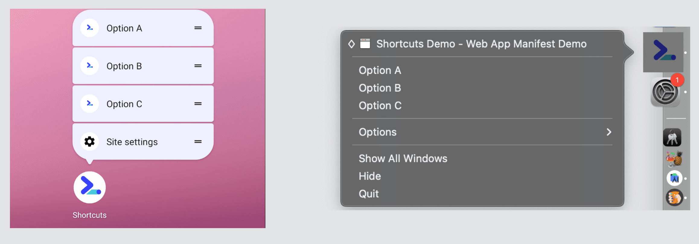
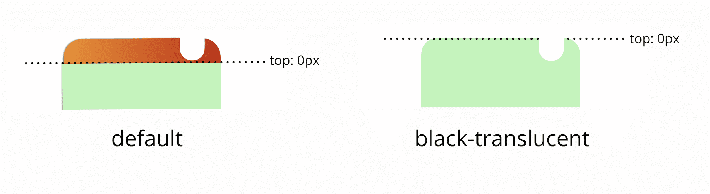

# Улучшения

<big>Пользователь ожидает хорошего опыта. В этой главе мы рассмотрим, как улучшить PWA с помощью заставки, ярлыков приложений, а также как работают сессии.</big>

Существует множество усовершенствований, которые могут улучшить конверсию и использование вашего PWA.

## Ярлыки приложений

[Ярлыки приложений](https://w3c.github.io/manifest/#shortcuts-member) - это статический список глубоких ссылок на ваш PWA, они прописаны в вашем манифесте ([Спецификация манифеста Web App Manifest](web-app-manifest.md)). Позволяет определить список ярлыков для различных частей или функций PWA, ускоряющих навигацию по часто используемым разделам.

Ярлыки приложений доступны в большинстве настольных операционных систем и в Android с WebAPK. Они появляются в контекстном меню на значке приложения на главном экране, в доке или на панели задач, как показано на следующем рисунке:



Чтобы получить доступ к этому меню, необходимо щелкнуть правой кнопкой мыши или нажать длинную клавишу на иконке PWA.

!!!note ""

    Ярлыки приложений доступны только в том случае, если пользователь установил ваш PWA.

!!!warning ""

    После установки PWA пользователь не сможет добавить или удалить ярлыки, пока не обновит манифест на сервере и не сработает [алгоритм обновления](update.md).

Ярлыки определяются в члене `shortcuts` манифеста. Он принимает массив членов со следующими свойствами:

`name`

: Текст, который будет показан пользователю, обычно в контекстном меню.

`start_url`

: URL, который должен загружаться при запуске PWA с этого ярлыка. Это должен быть URL в области видимости PWA, и он должен содержать глубокую ссылку на функцию, которую описывает `имя` или `короткое_имя`.

`short_name` (необязательно)

: Сокращенное название, используемое, когда недостаточно места для отображения полного значения поля `name`.

`description`

: (Необязательно) Описание того, что будет делать данный ярлык

`icons`

: (Необязательно) Массив объектов иконок с полями `src`, `type`, `sizes` и необязательным полем `purpose`, описывающими, какие изображения должны представлять данный ярлык.

К ярлыкам приложений следует относиться как к возможностям, которые можно реализовать наилучшим образом. Это означает, что вы не можете рассчитывать на постоянное появление таких ярлыков, и даже если они появятся, вы не знаете, сколько ярлыков появится и будет ли платформа игнорировать иконки, поскольку это зависит от браузера. Полноценное обсуждение каждой платформы не представляется возможным, но ниже вы получите представление о том, как это работает на Android и настольных компьютерах. Лучший способ справиться с этой неопределенностью - упорядочить элементы по приоритету.

!!!warning ""

    Chrome и Edge на настольном компьютере отображают первые 10 элементов, в то время как Chrome на Android отображает только первые три ярлыка в списке манифеста, поэтому лучше упорядочить их по приоритету. В Chrome на Android также добавлен доступ к "Информации о приложении" и "Настройкам сайта" из меню после пользовательского списка.

!!!note ""

    При публикации PWA в каталогах и магазинах приложений можно преобразовать ярлыки в манифесте в платформенные реализации, используя API, специфичные для каждой операционной системы, например, Quick Actions на iOS и ярлыки на Android. [BubbleWrap](https://github.com/GoogleChromeLabs/bubblewrap) поддерживает ярлыки App для Android и ChromeOS, а [PWA Builder](https://www.pwabuilder.com/) - для Android, ChromeOS, iOS и iPadOS.

Следующий пример кода определяет различные ярлыки приложений, которые можно попробовать, если установить приложение на Android с Chrome или на настольном компьютере с Edge или Chrome.

<iframe width="100%" height="400" allow="geolocation; microphone; camera; midi; encrypted-media; xr-spatial-tracking; fullscreen" allowfullscreen="" sandbox="allow-scripts allow-modals allow-forms allow-same-origin allow-top-navigation-by-user-activation allow-downloads" data-testid="app-preview-iframe" title="Preview of mlearn-pwa-app-shortcuts" src="https://mlearn-pwa-app-shortcuts.glitch.me/"></iframe>

## iOS и iPadOS

При публикации PWA есть некоторые усовершенствования, которые могут улучшить работу пользователей в Safari на iOS/iPadOS.

!!!warning ""

    Как мы уже упоминали в предыдущих главах, PWA на iOS и iPadOS можно устанавливать только из Safari; другие браузеры не могут устанавливать PWA на главный экран.

### Всплывающие экраны

Как показано в главе [Web App Manifest](web-app-manifest.md), в Android заставки создаются автоматически на основе значений манифеста. Этого нельзя сказать об iOS и iPadOS. В этих устройствах заставки следует задавать в HTML как статические изображения с помощью элементов `<link>`.

На устройствах Apple эти изображения называются стартовыми и используют свойство `rel` со значением `apple-touch-startup-image`, как показано на рисунке:

```html
<link
    rel="apple-touch-startup-image"
    href="ios-startup.png"
/>
```

Сложность заключается в том, что стартовое изображение должно иметь точный размер окна, которое будет открываться на вашем PWA. Таким образом, на разных устройствах iOS и iPadOS потребуются разные изображения. Для iPad необходимо предусмотреть больше ситуаций, таких как открытие в ландшафтном/портретном режиме и отображение PWA в режиме многозадачности (например, на 1/3, 1/2 или 2/3 экрана).

Обновленный список размеров экранов iOS и iPadOS можно посмотреть на сайте [Apple Human Interface Guidelines](https://developer.apple.com/design/human-interface-guidelines/ios/visual-design/adaptivity-and-layout/).

Различные версии изображения запуска могут быть заданы с помощью медиазапроса внутри атрибута `media`:

```html
<link
    rel="apple-touch-startup-image"
    href="ios-startup.png"
    media="orientation: portrait"
/>
<link
    rel="apple-touch-startup-image"
    href="ios-startup-landscape.png"
    media="orientation: landscape"
/>
```

!!!warning ""

    Если вы хотите предоставить все возможные варианты, сочетающие в себе определение экрана, ориентацию и многозадачный режим, то в итоге у вас получится более 25 различных изображений, которые необходимо создать и связать в HTML. Если вы не предоставите начальное изображение для контекста iOS или iPadOS, то в анимации открытия появится белый экран, а во время загрузки вашего PWA

#### Шаблоны проектирования стартовых изображений для iOS

Определение начальных образов - сложная работа, поэтому мы предлагаем несколько инструментов для их автоматической генерации и настройки:

-   Статическая генерация интегрируется с вашей системой сборки, создает все статические изображения PNG и предоставляет вам HTML-код с элементами `<link>` для вставки в документ. Примером такого инструмента является [PWA Asset Generator](https://github.com/onderceylan/pwa-asset-generator).
-   Генератор на стороне клиента - JavaScript-инструмент, который может встраивать одну или несколько base64-версий начального изображения в инжектируемые элементы `<link>` в зависимости от типа и размера экрана текущего устройства. Можно использовать холст в памяти, рендерить изображение и преобразовывать его в `data:` URI с PNG-файлом. Библиотека [PWA Compat](https://github.com/GoogleChromeLabs/pwacompat) - это простая в использовании клиентская библиотека, которая делает это путем клонирования типичного экрана запуска Android.

### Обнаружение PWA на мобильных платформах Apple

Несмотря на то, что в PWA следует использовать прогрессивное улучшение и обнаружение особенностей, в некоторых случаях необходимо знать, находится ли пользователь в PWA на мобильных платформах Apple, например, когда требуется предложить инструкции по установке или добавить ссылки на приложения, предназначенные только для iOS.

Чтобы избежать чтения строки агента пользователя, проверьте свойство `standalone` объекта `navigator`. Это нестандартное свойство, и оно доступно только для движка WebKit на iOS и iPadOS.

-   Если `navigator.standalone` имеет значение `undefined`, это означает, что пользователь не находится на устройстве iPadOS или iOS.
-   Если `navigator.standalone` имеет значение `false`, это означает, что пользователь открыл PWA в браузере и использует его там.
-   Если `navigator.standalone` имеет значение `true`, то это означает, что пользователь открыл PWA с главного экрана и получает опыт работы с автономным PWA.

### Поддержка полноэкранного режима

В Safari на iOS и iPad в качестве [режима отображения иконки PWA](app-design.md#display-modes) поддерживается только `display: standalone` . Хотя `display: fullscreen` не поддерживается, как на устройствах Android, можно использовать нестандартный мета-тег, чтобы заставить PWA переходить в полноэкранный режим.

На следующем изображении слева показан стандартный автономный дизайн с цветом темы, а справа - PWA с полноэкранным режимом iOS, позволяющим выводить содержимое за строку состояния.


Если добавить в HTML следующий тег, то ваш PWA на iOS и iPadOS перейдет в полноэкранный режим, но это не так, как на Android.

```html
<meta
    name="apple-mobile-web-app-status-bar-style"
    content="black-translucent"
/>
```

В этом режиме строка состояния устройства (верхняя часть, где отображаются часы, уровень заряда батареи и значки уведомлений) остается видимой, но отображается поверх содержимого с прозрачным фоном.

!!!warning ""

    В этом режиме цвет темы игнорируется, а панель уведомлений отображается на прозрачном фоне. Кроме того, пиксель [0, 0] вашего приложения теперь находится на [0, 0] физического экрана, а не после безопасной области.

При использовании этого режима будьте осторожны с дизайном, поскольку операционная система всегда будет отображать значки белым цветом, поэтому всегда следует контрастировать фоны для верхней части экрана со светлым содержимым. Кроме того, важно использовать [переменные окружения CSS](<https://developer.mozilla.org/docs/Web/CSS/env()>) для вывода содержимого в безопасной области, как показано в [Главе "Дизайн приложений"](app-design.md#safe-areas).



### Надежность установки

Safari на iOS и iPadOS до версии 15.4 загружает файл манифеста из сети только тогда, когда пользователь открывает лист общего доступа - с помощью значка общего доступа в браузере, - а не в момент загрузки страницы. Поэтому Safari не проверяет, является ли ваш сайт PWA, до этого момента, что может привести к ситуации, когда манифест не может быть загружен или занимает слишком много времени, и Safari игнорирует его.

Если Safari не может вовремя загрузить манифест, нажатие кнопки "Добавить на главный экран" помещает значок на главный экран, но не обеспечивает работу с приложением; это будет просто ярлык вкладки Safari.

!!!warning ""

    Если Safari не удается загрузить манифест, он возвращается к проверке наличия в PWA устаревших метатегов, таких как `apple-mobile-web-app-capable`. Не следует использовать эти метатеги. Они обеспечивают работу приложения на домашнем экране без существенных для PWA атрибутов, таких как атрибуты `start_url` или `scope`, что делает работу приложения ужасной.

## Ресурсы

-   [Генератор ресурсов PWA](https://github.com/onderceylan/pwa-asset-generator)
-   [Быстрое выполнение задач с помощью ярлыков приложений](https://web.dev/articles/app-shortcuts)
-   [Библиотека PWA Compat](https://github.com/GoogleChromeLabs/pwacompat)
-   [Определение ярлыков приложений](https://docs.microsoft.com/en-us/microsoft-edge/progressive-web-apps-chromium/how-to/shortcuts)

:material-information-outline: Источник &mdash; [Enhancements](https://web.dev/learn/pwa/enhancements)
