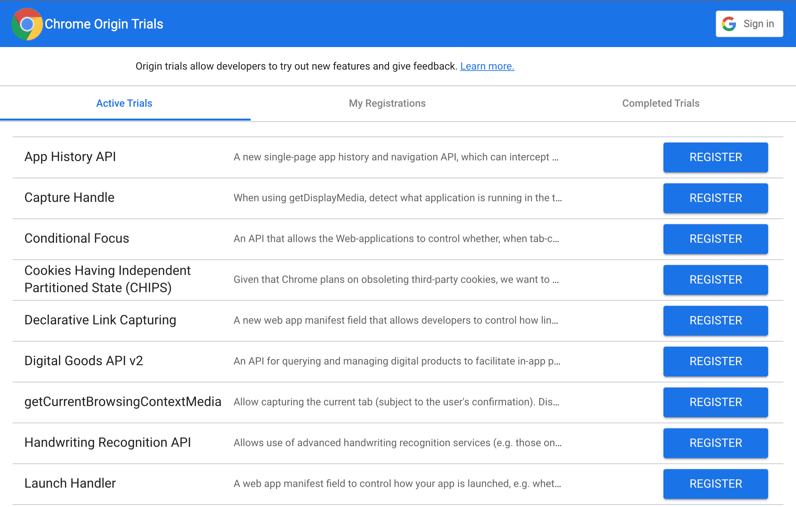
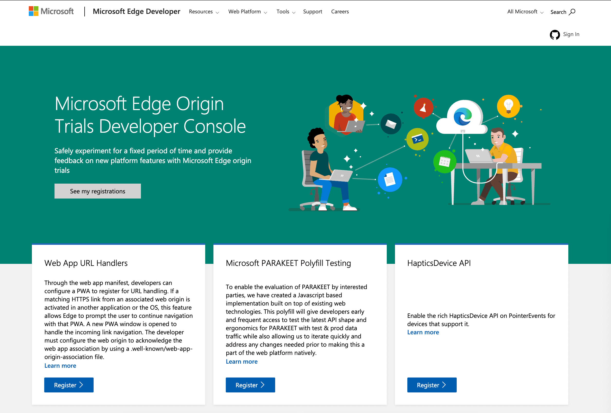
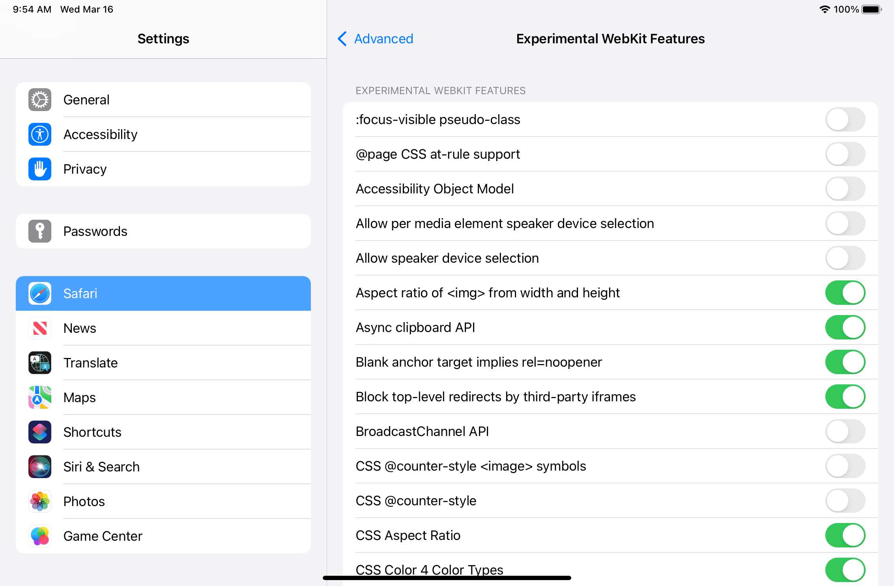

# Экспериментальные возможности

<big>Существуют возможности PWA, которые еще находятся в стадии разработки, и вы можете принять участие в их развитии. В этой главе вы узнаете о проекте Fugu, о том, как подписаться на пробную версию и как использовать экспериментальные API.</big>

Веб - мощная платформа, но в ее возможностях все еще есть пробелы. Те, кто хочет разрабатывать для Web, но нуждается в более широких возможностях, вынуждены упаковывать свои веб-приложения в обертки и публиковать их в магазинах приложений.

Разработчики могут решить поставлять свой собственный браузер в виде приложений для конкретной платформы, что непропорционально увеличивает размер их веб-приложений. Это также заставит их взять на себя дополнительную нагрузку по обеспечению безопасности и сопровождению, связанную с поддержанием в актуальном состоянии как форка браузера, так и обертки.

Кроме того, при таком подходе теряется охват веб-среды, часто приходится выбирать, какие устройства и операционные системы поддерживать, для чего часто требуются различные обертки, что еще больше увеличивает нагрузку на безопасность и обслуживание.

Устранение этих пробелов в возможностях - ключ к исправлению ситуации и, таким образом, к тому, чтобы веб стал программной платформой будущего, охватывающей максимальное количество вариантов использования, по сравнению с SDK, ориентированными на конкретные платформы.

## Проект Fugu

Именно в этом случае на помощь приходит проект возможностей, известный как [Project Fugu](https://www.chromium.org/teams/web-capabilities-fugu). Проект [capabilities project](https://developer.chrome.com/blog/fugu-status/), или Project Fugu, - это межкорпоративная работа, направленная на то, чтобы веб-приложения обладали теми же возможностями, что и приложения для конкретных платформ, путем раскрытия возможностей этих платформ в Интернете, сохраняя при этом безопасность пользователей, конфиденциальность, доверие и другие основные принципы Интернета.

### Отслеживание функций

Для отслеживания всех работ по выпуску новых функций существует [публичный трекер](https://goo.gle/fugu-api-tracker). На трекере можно увидеть:

-   Статус каждого API, над которым ведется работа или который рассматривается.
-   Платформы, для которых предназначен API.
-   Ссылки и дополнительная информация по каждому API.
-   Возможности поиска и фильтрации.
-   Временная шкала.

### Запрос функциональности

Что делать, если вы хотите запросить новую функциональность? Вы можете подать заявку в [Chromium bug tracker](https://bugs.chromium.org/p/chromium/issues/list), или зайти на [webwewant.fyi](https://webwewant.fyi) и заполнить форму, чтобы связаться с соответствующими производителями браузеров.

### Процесс для каждой функциональности

Перед запуском API может находиться в двух состояниях, и оба позволяют протестировать его.

-   Пробная версия для разработчиков: функция находится под флагом, API не обязательно стабилен, и не стоит внедрять его для реальных пользователей. Включить или отключить флаги в браузерах на базе Chromium можно, перейдя в раздел `about:flags`, что позволит провести тестирование на собственном экземпляре браузера.

!!!danger ""

    Ни при каких обстоятельствах не следует сообщать пользователям о необходимости включения или отключения флагов. Поскольку такие функции находятся в стадии разработки, изменение флагов по умолчанию может привести к непредвиденным последствиям для стабильности работы браузера.

-   Пробная версия origin: состояние, когда функции могут быть включены в origin, разработчики могут проводить тесты для более широкой аудитории, чем их единственный экземпляр браузера, но функция все еще тестируется, и ее реализация может измениться, подробнее об этом ниже.

## Тестирование Origin

Пробные версии Origin позволяют опробовать новые возможности и дать обратную связь сообществу разработчиков веб-стандартов по вопросам удобства, практичности и эффективности. API, доступные в рамках программы origin trial, являются:

-   Экспериментальными, они могут изменяться и становиться недоступными, в том числе не выходя за рамки эксперимента, и могут быть недоступны в течение некоторого времени, даже если в конечном итоге они будут включены для всех пользователей. Поэтому там, где это возможно, следует реализовать обнаружение функции или ее плавную деградацию, чтобы справиться с ситуацией, когда функция недоступна.
-   Достаточно стабильны для использования с реальными пользователями, но могут меняться в ходе испытаний.
-   [Ограничено для всех пользователей в мире](https://github.com/GoogleChrome/OriginTrials/blob/gh-pages/explainer.md#monitoring-and-limiting-usage), чтобы не стать стандартом де-факто, рекомендуется активировать функцию в кодовой базе, следуя рекомендациям по тестированию каждого браузера для подмножества пользователей.
-   Ограничения распространяются только на тот браузер, в котором запущена пробная версия, поэтому пробная версия Chrome не будет работать, например, в Safari, Firefox или Edge.

Если эти требования вас устраивают, вы можете зарегистрировать origin для участия в тестировании. Инструкции по регистрации для участия в тестировании origin в Chrome можно найти [здесь](https://developer.chrome.com/blog/origin-trials/), а для Microsoft Edge - по [этой ссылке](https://github.com/MicrosoftEdge/MSEdgeExplainers/blob/main/OriginTrialsGuide/explainer.md).

## Экспериментальные возможности Safari

Safari также позволяет разработчикам опробовать и протестировать новые и недоработанные API и возможности, но не предоставляет возможности тестирования оригиналов. Включить экспериментальные возможности Safari для пользователей нельзя.

Решение Safari аналогично флажкам, известным как экспериментальные возможности. Каждая новая версия Safari поставляется с множеством экспериментальных функций, некоторые из которых включены, а некоторые отключены по умолчанию.

Как разработчик, вы можете изменить эти настройки по умолчанию:

-   Меню "Разработка, экспериментальные функции" в Safari для macOS.
-   В приложении настроек iOS и iPadOS перейдите в раздел Safari, Advanced, Experimental Features.

## Экспериментальные возможности Firefox

Firefox предлагает [экспериментальные возможности](https://developer.mozilla.org/docs/Mozilla/Firefox/Experimental_features) через настройки, которые можно включить или отключить, обратившись к редактору конфигурации с помощью `about:config`.

## Ресурсы

-   [Проект возможностей](https://developer.chrome.com/blog/capabilities/)
-   [Статус новых возможностей](https://developer.chrome.com/blog/fugu-status/)
-   [Fugu Public Tracker](https://goo.gle/fugu-api-tracker)
-   [Руководство по началу работы с Chrome origin trials](https://developer.chrome.com/blog/origin-trials/)
-   [Руководство по испытаниям Microsoft Edge Origin](https://github.com/MicrosoftEdge/MSEdgeExplainers/blob/main/OriginTrialsGuide/explainer.md)
-   [The Web We Want, форма обратной связи](https://webwewant.fyi)
-   [Экспериментальные возможности Firefox](https://developer.mozilla.org/docs/Mozilla/Firefox/Experimental_features)
-   [Блог WebKit](https://webkit.org/blog/)

:material-information-outline: Источник &mdash; [Experimental features](https://web.dev/learn/pwa/experimental)
