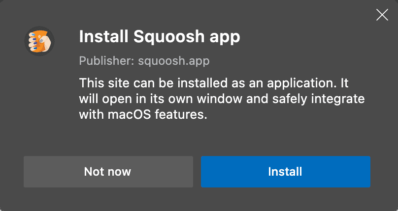

# Запрос на установку

<big>Для сайтов, удовлетворяющих критериям установки PWA, браузер запускает событие, побуждающее пользователя к установке. Хорошая новость заключается в том, что вы можете использовать это событие для настройки подсказки и приглашения пользователей установить ваше приложение.</big>

Пользователи могут быть не знакомы с процессом установки PWA. Как разработчик, вы поймете, когда наступает подходящий момент, чтобы предложить пользователю установить приложение. Можно также улучшить подсказки для установки в браузере по умолчанию. Давайте посмотрим, какие инструменты для этого существуют.

## Улучшение диалога установки

Браузеры предоставляют стандартные подсказки по установке, когда PWA соответствуют критериям установки. Для создания подсказки браузер использует свойства `name` и `icons` из вашего [Web App Manifest](web-app-manifest.md).



Некоторые браузеры расширяют возможности диалога установки с помощью [рекламных полей в манифесте](web-app-manifest.md#promotional-fields), включая `description`, `categories` и `screenshots`. Например, при использовании Chrome на Android, если в PWA указаны значения полей `description` и `screenshots`, диалог установки превращается из небольшой информационной панели **Add to home screen** в более крупный и подробный диалог, похожий на приглашения к установке в магазине приложений.

<video controls>
<source src="/learn/pwa/installation-prompt-2.mp4" />
</video>

Посмотрите на рекламные поля в действии:

<iframe width="100%" height="400" allow="geolocation; microphone; camera; midi; encrypted-media; xr-spatial-tracking; fullscreen" allowfullscreen="" sandbox="allow-scripts allow-modals allow-forms allow-same-origin allow-top-navigation-by-user-activation allow-downloads" data-testid="app-preview-iframe" title="Preview of learn-pwa-web-app-manifest-promotional" src="https://learn-pwa-web-app-manifest-promotional.glitch.me/"></iframe>

## Событие `beforeinstallprompt`

Подсказки браузера по установке - это первый шаг к тому, чтобы заставить пользователей установить ваш PWA. Чтобы реализовать собственный опыт установки, ваше приложение должно пройти критерии установки: когда браузер определяет, что ваше приложение может быть установлено, он запускает событие `beforeinstallprompt`. Для настройки пользовательского опыта необходимо реализовать обработчик этого события. Вот как это сделать:

1.  Прослушать событие `beforeinstallprompt`.
2.  Сохраните его (оно понадобится вам позже).
3.  Запустите его из пользовательского интерфейса.

!!!warning ""

    Не все браузеры поддерживают это событие, и оно было перенесено из спецификации Web App Manifest в [отдельный инкубатор](https://wicg.github.io/manifest-incubations/).

Пример слушателя события `beforeinstallprompt`, его перехвата и последующего пользовательского использования приведен в коде ниже.

```js
// This variable will save the event for later use.
let deferredPrompt;
window.addEventListener('beforeinstallprompt', (e) => {
    // Prevents the default mini-infobar or install dialog from appearing on mobile
    e.preventDefault();
    // Save the event because you'll need to trigger it later.
    deferredPrompt = e;
    // Show your customized install prompt for your PWA
    // Your own UI doesn't have to be a single element, you
    // can have buttons in different locations, or wait to prompt
    // as part of a critical journey.
    showInAppInstallPromotion();
});
```

Затем, если пользователь нажмет на вашу кнопку установки, используйте сохраненный ранее `deferredPrompt` и вызовите его метод `prompt()`, поскольку пользователю все еще нужно пройти через процесс браузера, чтобы установить ваше приложение. Вы отложили событие до тех пор, пока не предоставите пользователю нужный контекст, чтобы побудить его установить PWA.

Захват события дает возможность добавить подсказки и стимулы для установки приложения, а также выбрать момент, когда пользователь будет более заинтересован в установке.

!!!warning ""

    Вызвать `prompt()` на отложенном событии можно только один раз. Если пользователь отклонит его, необходимо дождаться повторного срабатывания события `beforeinstallprompt`.

Событие не сработает, если:

-   Пользователь уже установил текущий PWA (справедливо только для настольных компьютеров и WebAPK на Android).
-   Приложение не соответствует критериям установки [PWA](installation.md#installation-criteria).
-   PWA не может быть установлено на текущее устройство по другим причинам (например, устройство находится в режиме киоска или не имеет разрешений).

!!!warning ""

    Chrome и Edge на iOS и iPadOS не поддерживают установку PWA, поэтому событие `beforeinstallprompt` не может сработать. В этом случае единственным вариантом является открытие PWA с помощью Safari, где его можно установить из меню [поделиться, добавить на домашний экран](installation.md#installation-criteria).

### Лучшее место для подсказки

Место для подсказки зависит от особенностей приложения и от того, когда пользователи наиболее активно работают с вашим контентом и сервисами. Когда вы выводите подсказку `beforeinstallprompt`, вы можете объяснить пользователям, почему стоит продолжать использовать ваше приложение, и какие преимущества они получат, установив его. Вы можете выбрать для отображения подсказок по установке любое место в приложении. Часто встречаются следующие шаблоны: в боковом меню, после критического действия пользователя, такого как завершение заказа, или после страницы регистрации. Подробнее об этом можно прочитать в статье [Patterns for promoting PWA installation](https://web.dev/articles/promote-install).

### Сбор аналитики

Использование аналитики поможет вам лучше понять, где и когда следует показывать подсказки. Вы можете использовать свойство `userChoice` из события `beforeinstallprompt`; `userChoice` - это промис, который будет разрешен в соответствии с действием, которое совершил пользователь.

```js
// Gather the data from your custom install UI event listener
installButton.addEventListener('click', async () => {
    // deferredPrompt is a global variable we've been using in the sample to capture the `beforeinstallevent`
    deferredPrompt.prompt();
    // Find out whether the user confirmed the installation or not
    const { outcome } = await deferredPrompt.userChoice;
    // The deferredPrompt can only be used once.
    deferredPrompt = null;
    // Act on the user's choice
    if (outcome === 'accepted') {
        console.log('User accepted the install prompt.');
    } else if (outcome === 'dismissed') {
        console.log('User dismissed the install prompt');
    }
});
```

!!!note ""

    Браузеры Chromium запускают событие [`appinstalled`](https://developer.mozilla.org/docs/Web/API/Window/appinstalled_event) на объекте `window`. Событие срабатывает, когда пользователь принимает установку, независимо от того, было ли это действие вызвано пользовательской кнопкой установки или браузером.

### Посмотреть в действии

Попробуйте следующий пример в действии на браузере Chromium (настольном или Android).

<iframe width="100%" height="400" allow="geolocation; microphone; camera; midi; encrypted-media; xr-spatial-tracking; fullscreen" allowfullscreen="" sandbox="allow-scripts allow-modals allow-forms allow-same-origin allow-top-navigation-by-user-activation allow-downloads" data-testid="app-preview-iframe" title="Preview of mlearn-pwa-web-app-install-prompt" src="https://mlearn-pwa-web-app-install-prompt.glitch.me/"></iframe>

## Fallback

Если браузер не поддерживает `beforeinstallprompt` или событие не срабатывает, то другого способа вызвать подсказку браузера об установке не существует. Однако на платформах, позволяющих пользователю устанавливать PWA вручную, например на iOS, можно отобразить эти инструкции.

Эти инструкции следует отображать только в режиме браузера; другие варианты отображения, такие как `standalone` или `fullscreen`, означают, что пользователь уже установил приложение.

Чтобы отобразить элемент только в режиме браузера, используйте медиазапрос `display-mode`:

```css
#installInstructions {
    display: none;
}
@media (display-mode: browser) {
    #installInstructions {
        display: block;
    }
}
```

## Codelab

!!!tip ""

    Попробуйте сами, используя [Make it installable](https://web.dev/articles/codelab-make-installable) codelab.

## Библиотеки

Ознакомьтесь с этими библиотеками для помощи в создании пользовательского приглашения к установке:

-   [PWA Builder `<pwa-install>`](https://github.com/pwa-builder/pwa-install)
-   [PWA Installer Prompt for React](https://github.com/shnaveen25/react-pwa-installer-prompt)
-   [React PWA Install](https://www.npmjs.com/package/react-pwa-install)
-   [Vue PWA Install](https://github.com/Bartozzz/vue-pwa-install)
-   [Add to Home Screen](https://github.com/docluv/add-to-homescreen)

## Ресурсы

-   [Patterns for Promoting PWA installation](https://web.dev/articles/promote-install)
-   [How to provide your own in-app install experience](https://web.dev/articles/customize-install)
-   [MDN: Add to Home Screen](https://developer.mozilla.org/docs/Web/Progressive_web_apps/Add_to_home_screen)
-   [Web Manifest Incubations](https://wicg.github.io/manifest-incubations/)

:material-information-outline: Источник &mdash; [Installation prompt](https://web.dev/learn/pwa/installation-prompt)
