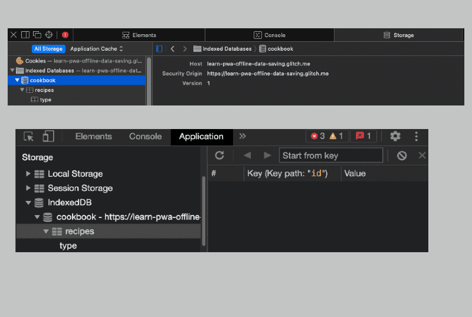
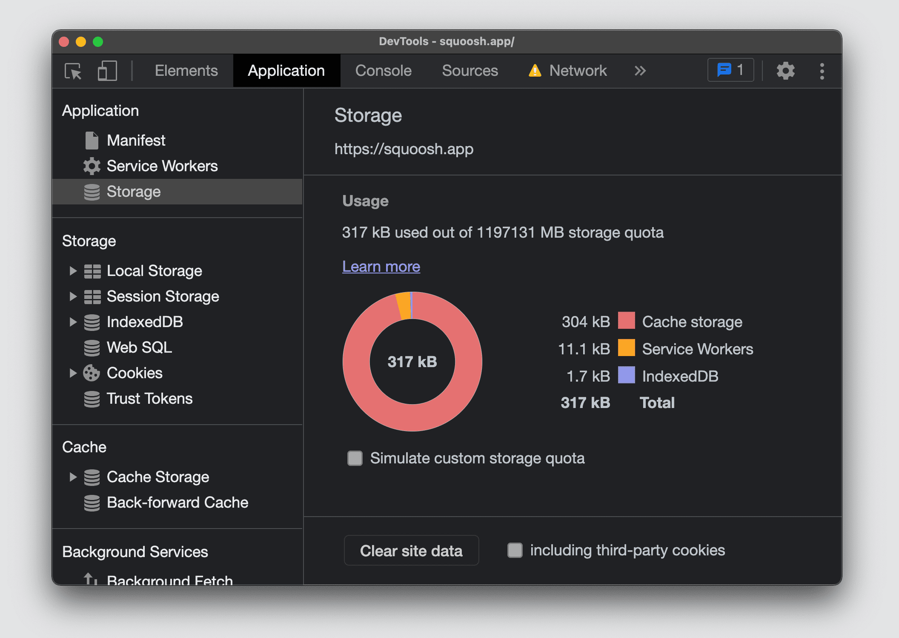
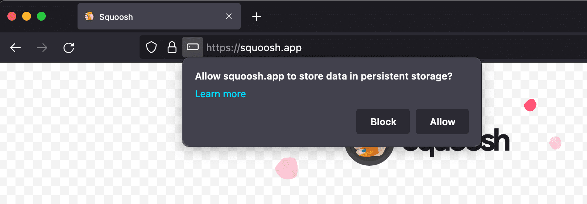
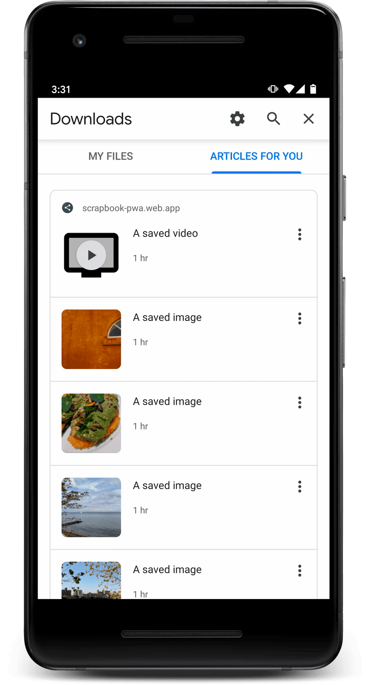

# Оффлайн данные

<big>Для создания надежной автономной работы необходимо реализовать управление хранением данных. В этом могут помочь такие инструменты, как IndexedDB, Cache, Storage Manager, Persistent Storage и Content Indexing.</big>

Для создания надежной автономной работы PWA необходимо управлять хранением данных. В главе [caching](caching.md) вы узнали, что кэш-хранилище - это один из вариантов сохранения данных на устройстве. В этой главе мы покажем, как управлять автономными данными, включая сохранение данных, ограничения и доступные инструменты.

## Хранение

Хранилище - это не только файлы и ресурсы, оно может включать и другие типы данных. Во всех браузерах, поддерживающих PWA, для хранения данных на устройстве доступны следующие API:

-   [IndexedDB](https://developer.mozilla.org/docs/Web/API/IndexedDB_API): вариант объектного хранилища NoSQL для структурированных данных и блобов (бинарных данных).
-   WebStorage: Способ хранения пар строк ключ/значение, использующий локальное хранилище или хранилище сеансов. Он недоступен в контексте сервис-воркера. Этот API является синхронным, поэтому его не рекомендуется использовать для хранения сложных данных.
-   Кэш-хранилище: Как описано в модуле [Caching](caching.md).

 На поддерживаемых платформах можно также использовать [FileSystem Access API](https://developer.chrome.com/articles/file-system-access/) для чтения и записи в и из локальной файловой системы пользователя с соответствующими правами. Поскольку вы записываете файлы непосредственно в файловую систему, браузер не будет выделять эти данные в квоту вашего origin, и любое другое приложение может взаимодействовать с этими файлами, если пользователь разрешит это. 

На поддерживаемых платформах можно управлять всеми устройствами хранения данных с помощью [Storage Manager API](https://developer.mozilla.org/docs/Web/API/StorageManager). API Cache Storage и IndexedDB обеспечивают асинхронный доступ к постоянным хранилищам для PWA и могут быть доступны из главного потока, веб-рабочих и сервис-воркеров. Оба они играют важную роль в обеспечении надежной работы PWA в условиях нестабильной или отсутствующей сети. Но когда следует использовать каждый из них?

Используйте _Cache Storage API_ для сетевых ресурсов, таких как HTML, CSS, JavaScript, изображения, видео и аудио, к которым можно получить доступ, запросив их по URL.

Для хранения структурированных данных используйте _IndexedDB_. К ним относятся данные, которые должны быть доступны для поиска или комбинирования в NoSQL-подобном виде, а также другие данные, например, данные о конкретном пользователе, которые не обязательно должны соответствовать URL-запросу. Обратите внимание, что IndexedDB не предназначена для полнотекстового поиска.

 Все хранилища, независимо от того, как они используются, привязаны не только к PWA, для которого они предназначены, но и к их происхождению. Поэтому, если вы развертываете более одного PWA на одном источнике (что не рекомендуется), имейте в виду, что базы данных IndexedDB, кэш-хранилище и другие хранилища браузера будут разделять квоты между всеми сервис-воркерами и PWA. 

## IndexedDB

Чтобы использовать [IndexedDB](https://developer.mozilla.org/docs/Web/API/IndexedDB_API), сначала откройте базу данных. При этом создается новая база данных, если она не существует. IndexedDB - это асинхронный API, но вместо промиса он принимает обратный вызов. В следующем примере используется библиотека [idb library](https://github.com/jakearchibald/idb) Джейка Арчибальда , которая представляет собой миниатюрную обертку с промисом для IndexedDB. Для использования IndexedDB библиотеки-помощники не требуются, но если вы хотите использовать синтаксис промисов, то библиотека `idb` является дополнительным вариантом.

В следующем примере создается база данных для хранения кулинарных рецептов.

### Создание и открытие базы данных

Чтобы открыть базу данных, выполните следующие действия:

1.  С помощью функции `openDB` создайте новую базу данных IndexedDB с именем `cookbook`. Поскольку базы данных IndexedDB являются версионными, то при внесении изменений в структуру базы данных необходимо увеличивать номер версии. Второй параметр - версия базы данных. В примере установлено значение 1.
2.  Объект инициализации, содержащий обратный вызов `upgrade()`, передается в `openDB()`. Функция обратного вызова вызывается при первой установке базы данных или при ее обновлении до новой версии. Эта функция является единственным местом, где могут происходить действия. Действия могут включать создание новых хранилищ объектов (структур, которые IndexedDB использует для организации данных) или индексов (по которым будет производиться поиск). Здесь же должна происходить миграция данных. Обычно функция `upgrade()` содержит оператор `switch` без операторов `break`, чтобы каждый шаг выполнялся по порядку, в зависимости от того, какой была старая версия базы данных.

```js
import { openDB } from 'idb';

async function createDB() {
    // Using https://github.com/jakearchibald/idb
    const db = await openDB('cookbook', 1, {
        upgrade(db, oldVersion, newVersion, transaction) {
            // Switch over the oldVersion, *without breaks*, to allow the database to be incrementally upgraded.
            switch (oldVersion) {
                case 0:
                // Placeholder to execute when database is created (oldVersion is 0)
                case 1:
                    // Create a store of objects
                    const store = db.createObjectStore(
                        'recipes',
                        {
                            // The `id` property of the object will be the key, and be incremented automatically
                            autoIncrement: true,
                            keyPath: 'id',
                        }
                    );
                    // Create an index called `name` based on the `type` property of objects in the store
                    store.createIndex('type', 'type');
            }
        },
    });
}
```

В примере создается объектное хранилище внутри базы данных `cookbook` под названием `recipes`, при этом свойство `id` устанавливается в качестве индексного ключа хранилища, а на основе свойства `type` создается еще один индекс `type`.

Давайте посмотрим на только что созданное хранилище объектов. После добавления рецептов в хранилище объектов и открытия DevTools в браузерах на базе Chromium или Web Inspector в Safari можно увидеть следующее:



### Добавление данных

В IndexedDB используются транзакции. Транзакции объединяют действия в группы, поэтому они выполняются как единое целое. Они помогают обеспечить постоянное состояние базы данных. Кроме того, они очень важны, если у вас запущено несколько копий приложения, для предотвращения одновременной записи в одни и те же данные. Чтобы добавить данные, выполните следующие действия:

1.  Начните транзакцию с `mode`, установленным на `readwrite`.
2.  Получить хранилище объектов, в которое будут добавлены данные.
3.  Вызовите `add()` с сохраняемыми данными. Метод получает данные в виде словаря (в виде пар ключ/значение) и добавляет их в хранилище объектов. Словарь должен быть клонируемым с помощью [Structured Cloning](https://developer.mozilla.org/docs/Web/API/Web_Workers_API/Structured_clone_algorithm). Если вы хотите обновить существующий объект, то вместо этого следует вызвать метод `put()`.

Транзакции имеют промис `done`, который разрешается при успешном завершении транзакции или отказе от нее с ошибкой [transaction error](https://developer.mozilla.org/docs/Web/API/IDBTransaction/error).

Как объясняется в [документации по библиотеке IDB](https://www.npmjs.com/package/idb?activeTab=readme), если вы пишете в базу данных, то `tx.done` - это сигнал о том, что все успешно зафиксировано в базе данных. Однако полезно ожидать выполнения отдельных операций, чтобы видеть ошибки, приводящие к сбою транзакции.

```js
// Using https://github.com/jakearchibald/idb
async function addData() {
  const cookies = {
      name: "Chocolate chips cookies",
      type: "dessert"
	    cook_time_minutes: 25
  };
  const tx = await db.transaction('recipes', 'readwrite');
  const store = tx.objectStore('recipes');
  store.add(cookies);
  await tx.done;
}
```

После добавления cookie рецепт окажется в базе данных вместе с другими рецептами. ID автоматически устанавливается и увеличивается с помощью indexedDB. Если выполнить этот код дважды, то будут получены две одинаковые записи о cookie.

<iframe width="100%" height="400" allow="geolocation; microphone; camera; midi; encrypted-media; xr-spatial-tracking; fullscreen" allowfullscreen="" sandbox="allow-scripts allow-modals allow-forms allow-same-origin allow-top-navigation-by-user-activation allow-downloads" data-testid="app-preview-iframe" title="Preview of learn-pwa-offline-data-saving" src="https://learn-pwa-offline-data-saving.glitch.me/"></iframe>

### Получение данных

Вот как можно получить данные из IndexedDB:

1.  Начните транзакцию и укажите хранилище или хранилища объектов, а также, по желанию, тип транзакции.
2.  Вызовите `objectStore()` из этой транзакции. Обязательно укажите имя хранилища объектов.
3.  Вызовите `get()` с ключом, который вы хотите получить. По умолчанию хранилище использует свой ключ в качестве индекса.

```js
// Using https://github.com/jakearchibald/idb
async function getData() {
    const tx = await db.transaction('recipes', 'readonly');
    const store = tx.objectStore('recipes');
    // Because in our case the `id` is the key, we would
    // have to know in advance the value of the id to
    // retrieve the record
    const value = await store.get([id]);
}
```

<iframe width="100%" height="400" allow="geolocation; microphone; camera; midi; encrypted-media; xr-spatial-tracking; fullscreen" allowfullscreen="" sandbox="allow-scripts allow-modals allow-forms allow-same-origin allow-top-navigation-by-user-activation allow-downloads" data-testid="app-preview-iframe" title="Preview of learn-pwa-offline-data-get" src="https://learn-pwa-offline-data-get.glitch.me/"></iframe>

!!!tip "Попробуйте"

    [Progressive Web Apps: IndexedDB](https://developers.google.com/codelabs/pwa-training/pwa03--indexeddb#0).

## Менеджер хранилища

Знание того, как управлять хранилищем PWA, особенно важно для правильного хранения и потоковой передачи сетевых ответов.

Объем хранилища распределяется между всеми вариантами хранения, включая Cache Storage, IndexedDB, Web Storage и даже файл сервис-воркера и его зависимости. Однако объем доступного хранилища варьируется в зависимости от браузера. Вряд ли он будет исчерпан: в некоторых браузерах сайты могут хранить мегабайты и даже гигабайты данных. Например, Chrome позволяет браузеру использовать до 80% всего дискового пространства, а отдельному origin - до 60% всего дискового пространства. В браузерах, поддерживающих Storage API, можно узнать, сколько дискового пространства еще доступно для вашего приложения, какова его квота и как оно используется. Следующий пример использует Storage API для получения оценки квоты и использования, а затем вычисляет процент использования и оставшиеся байты. Обратите внимание, что `navigator.storage` возвращает экземпляр `StorageManager`. Существует отдельный интерфейс `Storage`, и их легко перепутать.

```js
if (navigator.storage && navigator.storage.estimate) {
    const quota = await navigator.storage.estimate();
    // quota.usage -> Number of bytes used.
    // quota.quota -> Maximum number of bytes available.
    const percentageUsed =
        (quota.usage / quota.quota) * 100;
    console.log(
        `You've used ${percentageUsed}% of the available storage.`
    );
    const remaining = quota.quota - quota.usage;
    console.log(
        `You can write up to ${remaining} more bytes.`
    );
}
```

<iframe width="100%" height="400" allow="geolocation; microphone; camera; midi; encrypted-media; xr-spatial-tracking; fullscreen" allowfullscreen="" sandbox="allow-scripts allow-modals allow-forms allow-same-origin allow-top-navigation-by-user-activation allow-downloads" data-testid="app-preview-iframe" title="Preview of learn-pwa-offline-data-storage" src="https://learn-pwa-offline-data-storage.glitch.me/"></iframe>

В Chromium DevTools, открыв раздел **Storage** на вкладке **Application**, вы можете увидеть квоту вашего сайта и объем используемого хранилища в разбивке по используемым ресурсам.



В Firefox и Safari нет сводного экрана для просмотра всех квот и использования хранилища для текущего источника.

### Постоянство данных

На совместимых платформах можно запросить у браузера постоянное хранилище, чтобы избежать автоматического удаления данных после бездействия или в случае сжатия хранилища. Если запрос будет удовлетворен, браузер никогда не будет извлекать данные из хранилища. Эта защита распространяется на регистрацию сервис-воркера, базы данных IndexedDB и файлы в кэш-хранилище. Обратите внимание, что пользователь всегда остается в выигрыше и может удалить хранилище в любой момент, даже если браузеру разрешено постоянное хранение.

Чтобы запросить постоянное хранилище, вызовите функцию `StorageManager.persist()`. Как и прежде, доступ к интерфейсу `StorageManager` осуществляется через свойство `navigator.storage`.

```js
async function persistData() {
    if (navigator.storage && navigator.storage.persist) {
        const result = await navigator.storage.persist();
        console.log(`Data persisted: ${result}`);
    }
}
```

Также можно проверить, разрешено ли постоянное хранилище в текущем origin, вызвав `StorageManager.persisted()`. Firefox запрашивает у пользователя разрешение на использование постоянного хранилища. Браузеры на базе Chromium разрешают или запрещают постоянное хранение, основываясь на [эвристике](https://web.dev/articles/persistent-storage?hl=ru#chrome_and_other_chromium-based_browsers) для определения важности содержимого для пользователя. Одним из критериев для Google Chrome является, например, установка PWA. Если пользователь установил в операционной системе значок для PWA, браузер может разрешить постоянное хранение.



!!!warning ""

    Интерфейс `StorageManager` имеет методы `persist()` и `persisted()`, которые возвращают промисы, разрешаемые булевым значением. Функция `persist()` запрашивает включение постоянного хранилища и возвращает результат, а `persisted()` возвращает текущее состояние, не изменяя его.

!!!note ""

    [Content Indexing API](https://developer.chrome.com/articles/content-indexing-api/) - это экспериментальный API, доступный в некоторых браузерах Chromium, который позволяет вашему PWA открывать фрагменты контента, проиндексированные вами в автономном режиме. Если вы зарегистрируете готовый к работе в автономном режиме контент с помощью этого API, то пользователь будет видеть его в разделе "Загрузки" в браузере даже при отсутствии сетевого подключения.

    

## Ресурсы

-   [Хранилище в Интернете](https://web.dev/articles/storage-for-the-web)
-   [FileSystem Access API](https://web.dev/file-system-access)
-   [Постоянное хранение данных](https://web.dev/articles/persistent-storage)
-   [MDN: Storage API](https://developer.mozilla.org/docs/Web/API/Storage_API)
-   [MDN: Хранилище на стороне клиента](https://developer.mozilla.org/docs/Learn/JavaScript/Client-side_web_APIs/Client-side_storage)
-   [Индексирование содержимого](https://web.dev/content-indexing-api)

:material-information-outline: Источник &mdash; [Offline data](https://web.dev/learn/pwa/offline-data)
