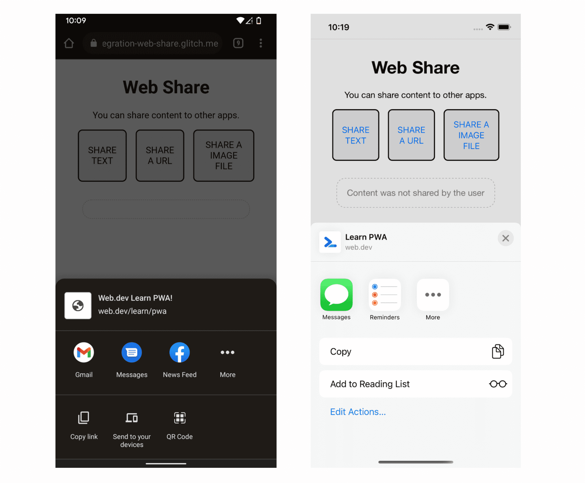

# Интеграция с ОС

<big>Теперь ваше PWA работает вне браузера. В этой главе рассматривается дальнейшая интеграция с операционной системой после того, как пользователи установят ваше приложение.</big>

Веб-приложения имеют большой охват. Они работают на различных платформах. Их легко распространять с помощью ссылок. Однако традиционно им не хватало интеграции с операционной системой. Не так давно их даже нельзя было установить. К счастью, ситуация изменилась, и теперь мы можем воспользоваться этой интеграцией для добавления полезных функций в наши PWA. Давайте рассмотрим некоторые из этих возможностей.

## Работа с файловой системой

Типичный процесс работы пользователя с файлами выглядит следующим образом:

-   Выбрать файл или папку с устройства и открыть его напрямую.
-   Внести изменения в эти файлы или папки и сохранить их обратно.
-   Создание новых файлов и папок.

До появления [API доступа к файловой системе](https://developer.chrome.com/articles/file-system-access/) веб-приложения не могли этого делать. Для открытия файлов требовалась загрузка файлов, для сохранения изменений - их загрузка, а для создания новых файлов и папок в файловой системе пользователя у веб-приложений вообще не было доступа.

### Открытие файла

Для открытия файла мы используем метод `window.showOpenFilePicker()`. Обратите внимание, что этот метод требует жеста пользователя, например, нажатия кнопки. Ниже приведены остальные настройки для открытия файла:

1.  Захват [file handle](https://developer.mozilla.org/docs/Web/API/FileSystemHandle) из API файловой системы доступа к file picker. Это позволяет получить основную информацию о файле.
2.  Используя метод дескриптора `getFile()`, получить специальный вид [`Blob`](https://developer.mozilla.org/docs/Web/API/Blob), называемый [`File`](https://developer.mozilla.org/docs/Web/API/File), который содержит дополнительные свойства файла, доступные только для чтения (такие как имя и дата последнего изменения). Поскольку файл является блобом, для получения его содержимого можно вызывать методы блоба, например, `text()`.

```js
// Have the user select a file.
const [handle] = await window.showOpenFilePicker();
// Get the File object from the handle.
const file = await handle.getFile();
// Get the file content.
// Also available, slice(), stream(), arrayBuffer()
const content = await file.text();
```

### Сохранение изменений

Для сохранения изменений в файле также необходим жест пользователя; тогда:

1.  Используйте хэндл файла для создания [`FileSystemWritableFileStream`](https://developer.mozilla.org/docs/Web/API/FileSystemWritableFileStream).
2.  Внести изменения в поток. При этом файл не будет обновляться на месте; вместо него обычно создается временный файл.
3.  Наконец, по окончании внесения изменений закрываем поток, что переводит изменения из временных в постоянные.

Рассмотрим это в коде:

```js
// Make a writable stream from the handle.
const writable = await handle.createWritable();
// Write the contents of the file to the stream.
await writable.write(contents);
// Close the file and write the contents to disk.
await writable.close();
```

<iframe width="100%" height="400" allow="geolocation; microphone; camera; midi; encrypted-media; xr-spatial-tracking; fullscreen" allowfullscreen="" sandbox="allow-scripts allow-modals allow-forms allow-same-origin allow-top-navigation-by-user-activation allow-downloads" data-testid="app-preview-iframe" title="Preview of mlearn-pwa-os-integration-file" src="https://mlearn-pwa-os-integration-file.glitch.me/"></iframe>

!!!warning ""

    Safari реализует API доступа к файловой системе не для общедоступной системы, а в виде [origin-private sandbox](https://developer.chrome.com/articles/file-system-access/#accessing-files-optimized-for-performance-from-the-origin-private-file-system). С помощью этого API можно читать и записывать файлы только в этой виртуальной файловой системе.

## Работа с файлами

API доступа к файловой системе позволяет открывать файлы из приложения, но как быть в обратном случае? Пользователи хотят установить свое любимое приложение в качестве приложения по умолчанию для открытия файлов. API [file handling API](https://developer.chrome.com/articles/file-handling/) - это экспериментальный API, позволяющий установленным PWA: Зарегистрироваться в качестве обработчика файлов на устройстве пользователя, указав в манифесте веб-приложения тип MIME и расширение файла, поддерживаемые вашим PWA. Для поддерживаемых расширений можно указать собственные значки файлов.

После регистрации установленный вами PWA будет отображаться как опция файловой системы пользователя, позволяя ему открыть файл непосредственно в ней. Ниже приведен пример настройки манифеста для PWA, предназначенного для чтения текстовых файлов:

```json
...
"file_handlers": [
     {
         "action": "/open-file",
         "accept": {
             "text/*": [".txt"]
         }
     }
]
...
```

## Работа с URL

С помощью функции обработки URL-адресов PWA может перехватывать ссылки, входящие в область действия операционной системы, и отображать их в окне PWA, а не на вкладке браузера по умолчанию. Например, если вы получаете сообщение со ссылкой на PWA или нажимаете на глубокую ссылку (URL-адрес, указывающий на определенный фрагмент содержимого) в PWA, содержимое откроется в отдельном окне.

Такое поведение автоматически доступно на Android при использовании WebAPK, например, когда пользователи устанавливают PWA с помощью Chrome. Перехват URL-адресов в PWA, установленных на iOS и iPadOS, из Safari невозможен.

Для настольных браузеров сообщество веб-браузеров создало новую спецификацию. В настоящее время эта спецификация является [экспериментальной](experimental.md); она добавляет новый член файла манифеста: `url_handlers`. Это свойство ожидает массив исходных кодов, которые PWA хочет перехватить. Происхождение вашего PWA будет предоставлено автоматически, а все остальные происхождения должны принять эту обработку, действующую через файл с именем `web-app-origin-association`. Например, если манифест вашего PWA размещен на web.dev, и вы хотите добавить origin app.web.dev, то это будет выглядеть следующим образом:

```json
"url_handlers": [
    {"origin": "https://app.web.dev"},
]
```

В этом случае браузер будет проверять наличие файла по адресу `app.web.dev/.well-known/web-app-origin-association`, принимая обработку URL из URL области действия PWA. Разработчик должен создать этот файл. В следующем примере файл выглядит следующим образом:

```json
{
    "web_apps": [
        {
            "manifest": "/mypwa/app.webmanifest",
            "details": {
                "paths": ["/*"]
            }
        }
    ]
}
```

!!!warning ""

    На Android с WebAPK PWA автоматически регистрируются в качестве обработчиков для области действия манифеста с помощью фильтра намерений Android, и добавить к нему другие origins или области действия невозможно. Для iOS и iPadOS можно обрабатывать только URL-адреса PWA, опубликованных в AppStore, например созданных с помощью [PWABuilder](https://pwabuilder.com).

## Работа с протоколом URL

Работа с URL работает со стандартными URL протокола `https`, но возможно использование и пользовательских URI-схем, таких как `pwa://`. В некоторых операционных системах установленные приложения получают такую возможность, регистрируя свои схемы.

Для PWA эта возможность реализуется с помощью [URL protocol handler API](https://developer.chrome.com/articles/url-protocol-handler/), доступного только на настольных устройствах. Разрешить использование пользовательских протоколов для мобильных устройств можно только путем распространения PWA в магазинах приложений.

!!!warning ""

    Для PWA, использующих API-обработчик протокола URL, имя протокола должно быть одним из [безопасных схем](https://html.spec.whatwg.org/multipage/system-state.html#safelisted-scheme), либо использовать префикс `web+`. Таким образом, в нашем примере ссылка должна указывать на `web+pwa://`, чтобы открыть наш PWA.

Для регистрации можно воспользоваться методом [registerProtocolHandler()](https://developer.mozilla.org/docs/Web/API/Navigator/registerProtocolHandler) или использовать член `protocol_handlers` в манифесте, указав нужную схему и URL, который вы хотите загрузить в контекст PWA, например:

```json
...
{
  "protocol_handlers": [
    {
      "protocol": "web+pwa",
      "url": "/from-protocol?value=%s"
    },
  ]
}
...
```

Вы можете направить URL `from-protocol` в нужный обработчик и получить строку запроса `value` в своем PWA. `%s` - это заполнитель для эскейпированного URL, который вызвал операцию, поэтому если у вас есть ссылка, например `<a href="web+pwa://testing">`, ваш PWA откроет `/from-protocol?value=testing`.

### Вызов других приложений

Вы можете использовать схемы URI для подключения к любому другому установленному приложению (PWA или нет) на устройствах пользователей на любой платформе. Для этого достаточно создать ссылку или использовать `navigator.href` и указать на нужную URI-схему, передав аргументы в виде URL-escaped.

Можно использовать известные стандартные схемы, такие как `tel:` для телефонных звонков, `mailto:` для отправки электронной почты или `ms:` для обмена текстовыми сообщениями, а можно изучить схемы URL других приложений, например, известных приложений для обмена сообщениями, карт, навигации, онлайн-встреч, социальных сетей и магазинов приложений.

!!!note ""

    Вместо использования частных схем URI для взаимодействия с приложениями для обмена сообщениями и социальными сетями можно воспользоваться общим API Web Share

## Web Share

<p class="ciu_embed" data-feature="web-share" data-periods="future_1,current,past_1,past_2" data-accessible-colours="false">
<picture>
<source type="image/webp" srcset="https://caniuse.bitsofco.de/image/web-share.webp">
<source type="image/png" srcset="https://caniuse.bitsofco.de/image/web-share.png">

</picture>
</p>

С помощью [Web Share API](https://developer.mozilla.org/docs/Web/API/Web_Share_API) ваш PWA может отправлять содержимое другим установленным на устройстве приложениям через общий канал.

API доступен только в операционных системах с механизмом `share`, включая Android, iOS, iPadOS, Windows и ChromeOS. В общий доступ можно передать объект, содержащий:

-   Текст (свойства `title` и `text`)
-   URL (свойство `url`)
-   Файлы (свойство `files`).

Чтобы проверить, может ли текущее устройство предоставлять общий доступ, для простых данных, таких как текст, проверяется наличие метода `navigator.share()`, для предоставления общего доступа к файлам проверяется наличие метода `navigator.canShare()`.

Вы запрашиваете действие share, вызывая [`navigator.share(objectToShare)`](https://developer.mozilla.org/docs/Web/API/Navigator/share). Этот вызов возвращает промис, который разрешается с `undefined` или отклоняется с исключением.

<iframe width="100%" height="400" allow="geolocation; microphone; camera; midi; encrypted-media; xr-spatial-tracking; fullscreen" allowfullscreen="" sandbox="allow-scripts allow-modals allow-forms allow-same-origin allow-top-navigation-by-user-activation allow-downloads" data-testid="app-preview-iframe" title="Preview of mlearn-pwa-os-integration-web-share" src="https://mlearn-pwa-os-integration-web-share.glitch.me/"></iframe>



## Web Share Target

[Web Share Target API](https://developer.chrome.com/articles/web-share-target/) позволяет вашему PWA быть целью операции обмена данными от другого приложения на данном устройстве, независимо от того, является оно PWA или нет. При этом ваш PWA получает данные, которыми делится другое приложение.

В настоящее время эта функция доступна на Android с WebAPK и ChromeOS, и работает она только после того, как пользователь установит ваш PWA. При установке приложения браузер регистрирует цель общего доступа в операционной системе.

Целевой веб-ресурс задается в манифесте с помощью элемента `share_target`, определенного в [Web Share Target draft spec](https://w3c.github.io/web-share-target/). `share_target` задается объектом с некоторыми свойствами:

`action`

: URL-адрес, который будет загружен в окно PWA, которое должно получить общие данные.

`method`

: метод HTTP-глагола, который будет использоваться для действия, например `GET`, `POST` или `PUT`.

`enctype`

: (Необязательно) Тип кодировки для параметров, по умолчанию это `application/x-www-form-urlencoded`, но также может быть установлен как `multipart/form-data` для таких методов, как `POST`.

`params`

: объект, который сопоставляет данные ресурса (из ключей: `title`, `text`, `url` и `files` из Web Share) с аргументами, которые браузер будет передавать в URL (при `method: 'GET'`) или в теле запроса, используя выбранную кодировку.

!!!note ""

    Вы можете разобрать `POST`-запрос на стороне сервера или внутри своего сервис-воркера, если хотите избежать обращения к сети. Более подробную информацию можно найти в [этом примере](https://developer.chrome.com/articles/web-share-target/#processing-post-shares).

Например, вы можете определить для своего PWA, что хотите получать общие данные (только заголовок и url), добавив их в свой манифест:

```json
...
"share_target": {
   "action": "/receive-share/",
   "method": "GET",
   "params": {
      "title": "shared_title",
      "url": "shared_url"
   }
}
...
```

Из предыдущего примера видно, что если какое-либо приложение в системе имеет общий URL с заголовком, и пользователь выбирает из диалога ваш PWA, то браузер создаст новую навигацию к вашему origin'у `/receive-share/?shared_title=AAA&shared_url=BBB`, где AAA - это общий заголовок, а BBB - общий URL. Вы можете использовать JavaScript для чтения этих данных из строки `window.location`, разобрав ее с помощью конструктора [`URL`](https://developer.mozilla.org/docs/Web/API/URL/URL).

Браузер будет использовать имя и иконку PWA из вашего манифеста, чтобы передать запись в общий ресурс операционной системы. Выбрать другой набор для этой цели нельзя.

!!!note ""

    Убедитесь, что страница, на которой обрабатываются общие данные, доступна в автономном режиме. Вы же не хотите, чтобы пользователи, выбрав ваше приложение, обнаружили ошибку, потому что у них в данный момент нет соединения.

Более подробные примеры и способы получения файлов можно найти в статье [Получение общих данных с помощью Web Share Target API](https://developer.chrome.com/articles/web-share-target/)

## Выборка контактов

С помощью [Contact Picker API](https://developer.mozilla.org/docs/Web/API/Contact_Picker_API) можно запросить у устройства диалоговое окно со всеми контактами пользователя, чтобы пользователь мог выбрать один или несколько. Затем ваш PWA может получить нужные данные от этих контактов.

API Contact Picker доступен в основном на мобильных устройствах, а на совместимых платформах все делается через интерфейс [`navigator.contacts`](https://developer.mozilla.org/docs/Web/API/Navigator/contacts).

Вы можете запросить доступные свойства для запроса с помощью `navigator.contacts.getProperties()` и запросить выборку одного или нескольких контактов со списком нужных свойств.

В качестве примера можно привести такие свойства, как `name`, `email`, `address` и `tel`. Когда вы просите пользователя выбрать один или несколько контактов, вы можете вызвать `navigator.contacts.select(properties)`, передав массив свойств, которые вы хотите получить в ответ.

!!!warning ""

    API не гарантирует, что возвращаемые объекты будут иметь все запрошенные свойства, поэтому необходимо перепроверять их наличие.

Следующий пример выводит список контактов, полученных пикером.

```js
async function getContacts() {
    const properties = ['name', 'email', 'tel'];
    const options = { multiple: true };
    try {
        const contacts = await navigator.contacts.select(
            properties,
            options,
        );
        console.log(contacts);
    } catch (ex) {
        // Handle any errors here.
    }
}
```

<iframe width="100%" height="400" allow="geolocation; microphone; camera; midi; encrypted-media; xr-spatial-tracking; fullscreen" allowfullscreen="" sandbox="allow-scripts allow-modals allow-forms allow-same-origin allow-top-navigation-by-user-activation allow-downloads" data-testid="app-preview-iframe" title="Preview of mlearn-pwa-os-integration-contacts" src="https://mlearn-pwa-os-integration-contacts.glitch.me/"></iframe>

## Ресурсы

-   [The File System Access API: упрощение доступа к локальным файлам](https://web.dev/file-system-access)
-   [Пусть установленные веб-приложения будут обработчиками файлов](https://web.dev/file-handling)
-   [Работа с файлами в прогрессивных веб-приложениях](https://docs.microsoft.com/en-us/microsoft-edge/progressive-web-apps-chromium/how-to/handle-files)
-   [Интеграция с пользовательским интерфейсом OS Sharing UI с помощью Web Share API](https://web.dev/articles/web-share)
-   [Обмен содержимым с другими приложениями](https://docs.microsoft.com/en-us/microsoft-edge/progressive-web-apps-chromium/how-to/share)
-   [Получение общих данных с помощью Web Share Target API](https://developer.chrome.com/articles/web-share-target/)
-   [Подборщик контактов для Web](https://web.dev/contact-picker)

:material-information-outline: Источник &mdash; [OS Integration](https://web.dev/learn/pwa/os-integration)
