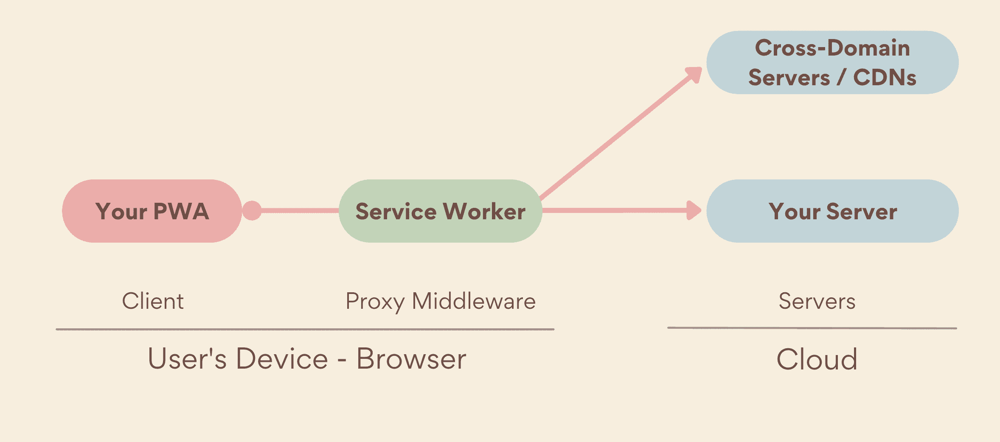
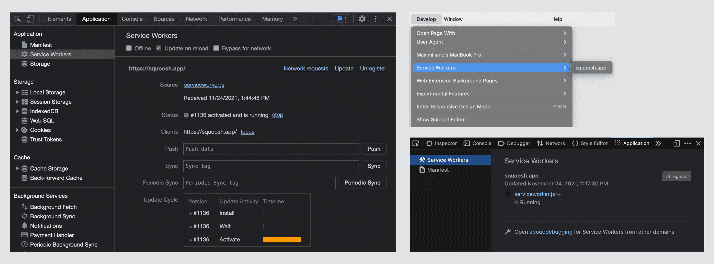

# Сервис-воркеры

<big>Сервис-воркеры являются фундаментальной частью PWA. Они обеспечивают быструю загрузку (независимо от сети), автономный доступ, push-уведомления и другие возможности.</big>

Пользователи ожидают, что приложения будут запускаться при медленном или нестабильном сетевом соединении или даже в автономном режиме. Они ожидают, что контент, с которым они недавно взаимодействовали, например, медиа-треки или билеты и маршруты, будет доступен и пригоден для использования. В случае невозможности выполнения запроса приложение должно сообщить об этом, а не молча отказать или выйти из строя. При этом пользователи хотят, чтобы все это происходило быстро. Как видно из этого исследования [Milliseconds make millions](https://web.dev/case-studies/milliseconds-make-millions), даже улучшение времени загрузки на 0,1 секунды может повысить конверсию на 10%. Таким образом, пользователи ожидают от PWA надежности, и именно поэтому у нас есть сервис-воркеры.

## Здравствуйте, сервис-воркеры



Когда приложение запрашивает ресурс, входящий в область действия сервис-воркера, в том числе когда пользователь находится в автономном режиме, сервис-воркер перехватывает запрос, выступая в роли сетевого прокси. Затем он может решить, следует ли ему предоставить ресурс из кэша с помощью API Cache Storage, из сети, как это обычно происходит без сервис-воркера, или создать его на основе локального алгоритма. Это позволяет обеспечить работу, аналогичную работе платформенного приложения. Он даже может работать полностью автономно.

!!!note ""

    Не все браузеры поддерживают сервис-воркеры. Даже если он присутствует, сервис-воркер не будет доступен при первой загрузке или во время ожидания активации. Поэтому рассматривайте его как опциональный и не требуйте его для основной функциональности.

## Регистрация сервис-воркера

Прежде чем сервис-воркер получит контроль над вашей страницей, он должен быть зарегистрирован для вашего PWA. Это означает, что при первом обращении пользователя к PWA сетевые запросы не будут направляться непосредственно на ваш сервер, поскольку сервис-воркер еще не контролирует ваши страницы.

Проверив, поддерживает ли браузер API Service Worker, PWA может зарегистрировать сервис-воркера. После загрузки сервис-воркер устанавливает магазин между вашим PWA и сетью, перехватывая запросы и обслуживая соответствующие ответы.

```js
if ('serviceWorker' in navigator) {
    navigator.serviceWorker.register('/serviceworker.js');
}
```

<iframe allow="geolocation; microphone; camera; midi; encrypted-media; xr-spatial-tracking; fullscreen" allowfullscreen="" style="width: 100%; height: 350px;" sandbox="allow-scripts allow-modals allow-forms allow-same-origin allow-top-navigation-by-user-activation allow-downloads" data-testid="app-preview-iframe" title="Preview of learn-pwa-sw-registration" src="https://learn-pwa-sw-registration.glitch.me/"></iframe>

!!!note ""

    Для каждого PWA существует только один сервис-воркер, но это не означает, что код нужно размещать только в одном файле. Сервис-воркер может включать в себя другие файлы, используя [`importScripts`](https://developer.mozilla.org/docs/Web/API/WorkerGlobalScope/importScripts) в каждом браузере или [ECMAScript module imports](https://web.dev/articles/es-modules-in-sw) в некоторых современных браузерах.

### Проверить, зарегистрирован ли сервис-воркер

Чтобы проверить, зарегистрирован ли сервис-воркер, используйте инструменты разработчика в вашем любимом браузере.

В браузере Firefox и браузерах на базе Chromium (Microsoft Edge, Google Chrome или Samsung Internet):

1.  Откройте инструменты разработчика, затем перейдите на вкладку **Приложения**.
2.  В левой панели выберите **Сервисы-воркеры**.
3.  Убедитесь, что URL-адрес сценария сервис-воркера отображается со статусом "Активирован". (О том, что означает этот статус, вы узнаете в разделе "Жизненный цикл" этой главы). В Firefox статус может быть "Выполняется" или "Остановлен".

В Safari:

1.  Щелкните меню **Develop**, затем подменю **Service-воркеры**.
2.  Убедитесь, что в подменю появился пункт с текущим происхождением. Откроется инспектор контекста сервис-воркера.

<figure markdown>

<figcaption>Инструменты разработчика сервис-воркеров в Chrome, Firefox и Safari.</figcaption>
</figure>

!!!note ""

    Для проверки статуса регистрации сервис-воркера на мобильном устройстве можно удаленно проинспектировать телефон или планшет из браузера настольного компьютера. Подробности о том, как это сделать, вы найдете в главе [Инструменты и отладка](tools-and-debug.md).

### Область действия

Папка, в которой находится сервис-воркер, определяет область его действия. Сервис-воркер, расположенный по адресу `example.com/my-pwa/sw.js`, может управлять любой навигацией по пути _my-pwa_ или ниже, например `example.com/my-pwa/demos/`. Сервис-воркеры могут управлять только элементами (страницами, рабочими, в совокупности "клиентами") в своей области видимости. Область действия распространяется на вкладки браузера и окна PWA.

Для каждой области видимости разрешен только _один_ сервис-воркер. При активной работе обычно доступен только один экземпляр, независимо от того, сколько клиентов находится в памяти (например, окна PWA или вкладки браузера).

!!!warning ""

    Область действия сервис-воркера следует устанавливать как можно ближе к корню приложения. Это наиболее распространенная настройка, позволяющая сервису-воркеру перехватывать все запросы, связанные с PWA. Не размещайте его, например, в папке JavaScript или загружайте его из CDN.

В Safari реализовано более сложное управление областями видимости, известное как разделы, что влияет на работу областей видимости, если у вас есть междоменные iframe. Более подробно о реализации WebKit можно прочитать в [их блоге](https://webkit.org/blog/8090/workers-at-your-service/).

## Жизненный цикл

Сервис-воркеры имеют свой жизненный цикл, определяющий порядок их установки, который не зависит от установки PWA. Жизненный цикл сервис-воркера начинается с его регистрации. Затем браузер пытается загрузить и разобрать файл сервис-воркера. Если парсинг прошел успешно, запускается событие `install`. Событие `install` срабатывает только один раз.

Установка сервис-воркера происходит бесшумно, не требуя разрешения пользователя, даже если он не устанавливает PWA. API сервис-воркера доступен даже на платформах, не поддерживающих установку PWA, таких как Safari и Firefox на настольных устройствах.

!!!note ""

    Сервис-воркер _регистрация_ и _установка_, хотя и связаны между собой, являются разными событиями. Регистрация происходит, когда страница запрашивает сервис-воркер, вызывая `register()`, как описано ранее. Установка происходит, когда зарегистрированный сервис-воркер существует, может быть разобран как JavaScript и не выдает никаких ошибок при первом выполнении.

После установки сервис-воркер еще не управляет своими клиентами, в том числе и вашим PWA. Сначала его необходимо активировать. Когда сервис-воркер будет готов управлять своими клиентами, сработает событие `activate`. Однако это не означает, что страница, зарегистрировавшая сервис-воркер, будет управляться. По умолчанию сервис-воркер возьмет управление на себя только при следующем переходе на эту страницу, либо в результате перезагрузки страницы, либо при повторном открытии PWA.

Вы можете прослушивать события в глобальной области видимости сервис-воркера с помощью объекта `self`.

```js title="serviceworker.js"
// This code executes in its own worker or thread
self.addEventListener('install', (event) => {
    console.log('Service worker installed');
});
self.addEventListener('activate', (event) => {
    console.log('Service worker activated');
});
```

### Обновление сервис-воркера

Сервис-воркеры обновляются, когда браузер обнаруживает, что сервис-воркер, управляющий клиентом в данный момент, и новая (с вашего сервера) версия одного и того же файла различаются по байтам.

!!!warning ""

    При обновлении сервис-воркера не переименовывайте его. Даже не добавляйте к имени файла хэш. Иначе браузер никогда не получит новую версию сервис-воркера!

После успешной установки новый сервис-воркер будет ожидать активации до тех пор, пока существующий (старый) сервис-воркер не перестанет контролировать клиентов. Это состояние называется "ожиданием", и именно так браузер обеспечивает одновременную работу только одной версии сервис-воркера. Обновление страницы или повторное открытие PWA не приведет к тому, что новый сервис-воркер возьмет управление на себя. Пользователю необходимо закрыть все вкладки и окна, использующие текущий сервис-воркер, или выйти из них, а затем вернуться обратно. Только после этого новый сервис-воркер возьмет управление на себя. Для получения дополнительной информации посетите эту статью [Жизненный цикл сервис-воркера](https://web.dev/articles/service-worker-lifecycle).

## Срок службы сервис-воркера

После установки и регистрации сервис-воркер может управлять всеми сетевыми запросами в пределах своей области действия. Он работает в собственном потоке, а его активация и завершение контролируются браузером. Это позволяет ему работать как до, так и после открытия PWA. Хотя сервис-воркер работает в собственном потоке, нет никакой гарантии, что состояние в памяти будет сохраняться между запусками сервис-воркера, поэтому убедитесь, что все, что вы хотите повторно использовать в каждом запуске, доступно в IndexedDB или другом постоянном хранилище.

Если сервис-воркер еще не запущен, он будет запускаться каждый раз, когда в его область действия поступит сетевой запрос или когда будет получено триггерное событие, например периодическая фоновая синхронизация или push-сообщение.

Сервис-воркеры не живут бесконечно долго. Несмотря на то, что в разных браузерах существуют свои особенности, сервис-воркеры будут завершены, если они простояли несколько секунд или были заняты слишком долго. Если сервис-воркер был завершен и произошло событие, которое могло бы его запустить, он перезапустится.

## Возможности

Зарегистрированный и активный сервис-воркер - это поток с совершенно иным жизненным циклом, чем основной поток PWA. Однако по умолчанию сам файл сервис-воркера не имеет никакого поведения. Он не будет кэшировать или обслуживать какие-либо ресурсы, поскольку это должен делать ваш код. Как это сделать, вы узнаете в следующих главах.

Возможности сервис-воркера заключаются не только в проксировании или обслуживании HTTP-запросов; поверх него доступны и другие функции, например, фоновое выполнение кода, web push-уведомления, обработка платежей. Эти дополнения мы рассмотрим в главе [capabilities](capabilities.md).

## Ресурсы

-   [API сервис-воркера (MDN)](https://developer.mozilla.org/docs/Web/API/Service_Worker_API)
-   [Мышление сервис-воркера](https://web.dev/articles/service-worker-mindset)
-   [WebKit Workers к вашим услугам](https://webkit.org/blog/8090/workers-at-your-service/)
-   [Модули ES в сервис-воркерах](https://web.dev/articles/es-modules-in-sw)
-   [Жизненный цикл сервис-воркера](https://web.dev/articles/service-worker-lifecycle)

:material-information-outline: Источник &mdash; [Service workers](https://web.dev/learn/pwa/service-workers)
