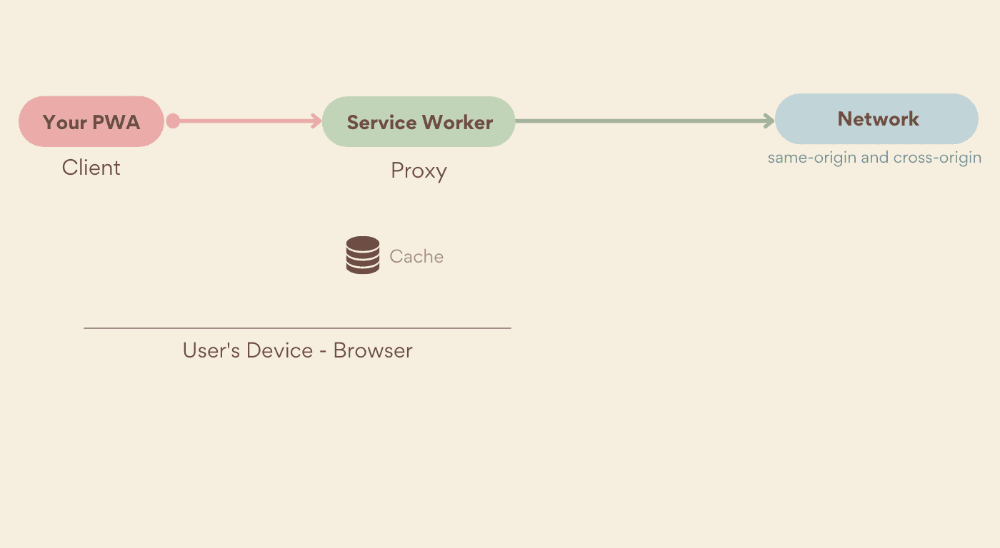
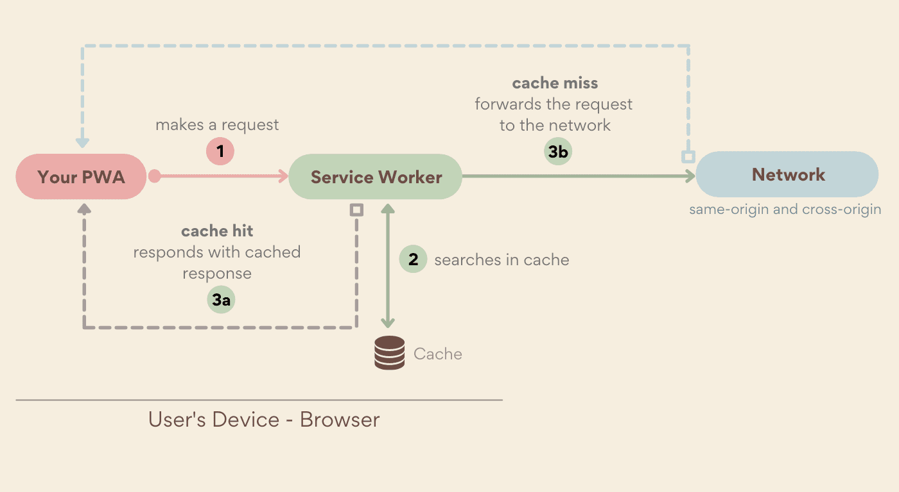
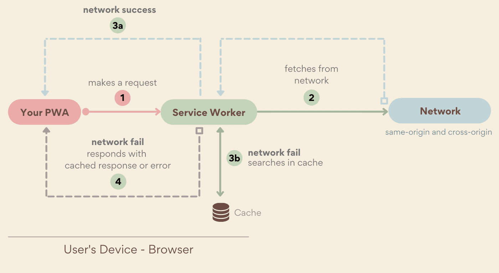
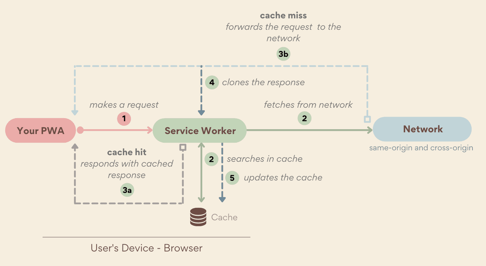
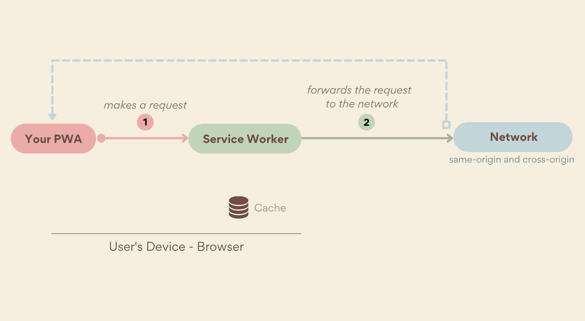
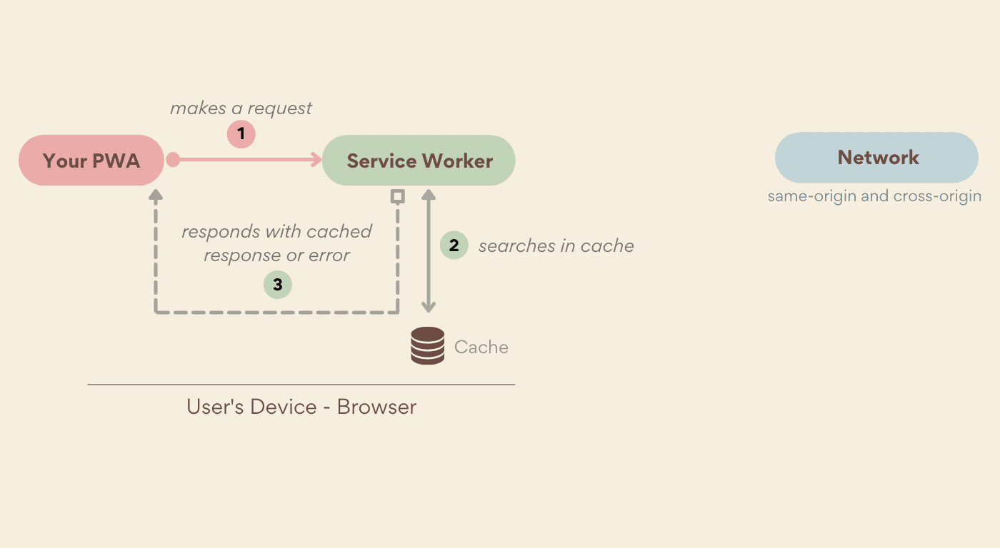

# Обслуживание

<big>Используя событие fetch сервис-воркера, можно перехватывать сетевые запросы и обслуживать ответ, используя различные техники.</big>

Ключевым аспектом прогрессивных веб-приложений является их надежность: они способны быстро загружать ресурсы, обеспечивая вовлеченность пользователей и мгновенную обратную связь даже в условиях плохой сети. Как это возможно? Благодаря событию сервис-воркера `fetch`.

## Событие fetch {#the_fetch_event}

<p class="ciu_embed" data-feature="fetch" data-periods="future_1,current,past_1,past_2" data-accessible-colours="false">
<picture>
<source type="image/webp" srcset="https://caniuse.bitsofco.de/image/fetch.webp">
<source type="image/png" srcset="https://caniuse.bitsofco.de/image/fetch.png">

</picture>
</p>

Событие [`fetch`](https://developer.mozilla.org/docs/Web/API/FetchEvent) позволяет перехватывать каждый сетевой запрос, выполняемый PWA в области действия сервис-воркера, как для одноименных, так и для разноименных запросов. Помимо навигации и запросов к ресурсам, выборка из установленного сервис-воркера позволяет отрисовывать страницы после первой загрузки сайта без обращения к сети.

Обработчик `fetch` получает все запросы от приложения, включая URL и HTTP-заголовки, и позволяет разработчику приложения решать, как их обрабатывать.



Ваш сервис-воркер может переслать запрос в сеть, ответить на него ранее кэшированным ответом или создать новый ответ. Выбор остается за вами. Приведем простой пример:

```js
self.addEventListener('fetch', (event) => {
    console.log(`URL requested: ${event.request.url}`);
});
```

!!!note ""

    Хотя на один сервис-воркер может приходиться более одного обработчика события fetch, на один запрос может отвечать только один. Например, можно иметь несколько обработчиков, которые будут действовать на разные шаблоны URL. Они выполняются в том порядке, в котором были зарегистрированы, пока один из них не вызовет `respondWith()`.

## Ответ на запрос

Когда в сервис-воркер поступает запрос, есть две возможности: можно проигнорировать его, что позволит ему уйти в сеть, или ответить на него. Отвечая на запросы внутри сервис-воркера, вы можете выбирать, что и как будет возвращено в ваш PWA, даже если пользователь находится в автономном режиме.

Чтобы ответить на входящий запрос, вызовите `event.respondWith()` из обработчика события `fetch`, например, так:

```js
// fetch event handler in your service worker file
self.addEventListener("fetch", event => {
    const response = .... // a response or a Promise of response
    event.respondWith(response);
});
```

Вы должны вызывать `respondWith()` синхронно и возвращать объект [Response](https://developer.mozilla.org/docs/Web/API/Response). Но нельзя вызывать `respondWith()` после завершения обработчика события fetch, как в случае асинхронного вызова. Если необходимо дождаться полного ответа, то в `respondWith()` можно передать Promise, который разрешается в Response.

### Создание ответов

Благодаря [Fetch API](https://developer.mozilla.org/docs/Web/API/Fetch_API) можно создавать HTTP-ответы в коде JavaScript, кэшировать их с помощью Cache Storage API и возвращать, как если бы они были получены от веб-сервера.

Чтобы создать ответ, создайте новый объект `Response`, задав его тело и такие параметры, как статус и заголовки:

```js
const simpleResponse = new Response(
    'Body of the HTTP response',
);

const options = {
    status: 200,
    headers: {
        'Content-type': 'text/html',
    },
};
const htmlResponse = new Response(
    '<b>HTML</b> content',
    options,
);
```

!!!warning ""

    Будьте особенно внимательны при создании ответов с помощью сервис-воркера. Некорректный код может привести к возникновению граничных ситуаций и трудноотлаживаемых проблем, например, браузер не может загрузить HTML-документ, в котором отображается PWA. При отладке всегда можно воспользоваться кнопкой перезагрузки браузера с нажатой клавишей Shift, что позволит обойти сервис-воркер; или использовать сервис-ворк devtools на поддерживаемых браузерах, как мы рассмотрим в разделе [Инструменты и отладка](tools-and-debug.md).

<iframe style="width: 100%; height: 400px;" allow="geolocation; microphone; camera; midi; encrypted-media; xr-spatial-tracking; fullscreen" allowfullscreen="" sandbox="allow-scripts allow-modals allow-forms allow-same-origin allow-top-navigation-by-user-activation allow-downloads" data-testid="app-preview-iframe" title="Preview of learn-pwa-serving-synthesize" src="https://learn-pwa-serving-synthesize.glitch.me/"></iframe>

### Ответы из кэша

Теперь, когда вы знаете, как обслуживать HTTP-ответы из сервис-воркера, пришло время использовать интерфейс [Caching Storage](caching.md) для хранения ресурсов на устройстве.

С помощью API кэш-хранилища можно проверить, есть ли запрос, полученный от PWA, в кэше, и, если есть, ответить на `respondWith()` с его помощью. Для этого сначала необходимо выполнить поиск в кэше. Функция `match()`, доступная на верхнем уровне интерфейса `caches`, осуществляет поиск по всем хранилищам в вашем origin, либо по одному открытому объекту кэша.

Функция `match()` получает в качестве аргумента HTTP-запрос или URL и возвращает обещание, которое разрешается в Response, связанный с соответствующим ключом.

```js
// Global search on all caches in the current origin
caches.match(urlOrRequest).then(response => {
   console.log(response ? response : "It's not in the cache");
});

// Cache-specific search
caches.open("pwa-assets").then(cache => {
  cache.match(urlOrRequest).then(response) {
    console.log(response ? response : "It's not in the cache");
  }
});
```

 При использовании `match()` с `respondWith()` промис match разрешится либо найденным элементом, либо ничем. Отказ произойдет только в том случае, если возникла проблема, не позволившая завершить операцию поиска. Чтобы выдать ошибку, если результаты не найдены, необходимо проверить результаты перед возвратом ответа на `respondWith()`. 

## Стратегии кэширования

Обслуживание файлов только из кэша браузера подходит не для всех случаев. Например, пользователь или браузер могут отказаться от кэша. Поэтому необходимо определить собственную стратегию доставки ресурсов для PWA. Вы не ограничены одной стратегией кэширования. Вы можете определить различные стратегии для разных шаблонов URL. Например, можно использовать одну стратегию для минимальных ресурсов пользовательского интерфейса, другую - для вызовов API, третью - для URL-адресов изображений и данных. Для этого необходимо прочитать `event.request.url` в `ServiceWorkerGlobalScope.onfetch` и разобрать его с помощью регулярных выражений или [URL Pattern](https://developer.chrome.com/articles/urlpattern/). (На момент написания статьи URL Pattern поддерживается не на всех платформах).

Наиболее распространенными стратегиями являются:

Cache First

: сначала ищет кэшированный ответ и возвращается к сети, если он не найден.

Network First

: Сначала запрашивается ответ из сети, и если он не возвращается, то проверяется наличие ответа в кэше.

Stale While Revalidate

: обслуживает ответ из кэша, а в фоновом режиме запрашивает последнюю версию и сохраняет ее в кэше для следующего запроса ресурса.

Network-Only

: Всегда отвечает на запрос по сети или выдает ошибку. Обращение к кэшу не происходит.

Cache-Only

: Всегда отвечает из кэша или выдает ошибку. Обращение к сети не происходит. Ресурсы, которые будут обслуживаться с использованием этой стратегии, должны быть добавлены в кэш до того, как они будут запрошены.

### Стратегия Cache first

При использовании этой стратегии сервис-воркер ищет соответствующий запрос в кэше и возвращает соответствующий ответ, если он есть в кэше. В противном случае он получает ответ из сети (как вариант, обновляя кэш для последующих обращений). Если ни в кэше, ни в сети ответа нет, то запрос будет ошибочным. Поскольку обслуживание ресурсов без обращения к сети обычно происходит быстрее, в этой стратегии приоритет отдается производительности, а не свежести.

!!!note ""

    Помните, что интерфейс кэш-хранилища не будет возвращать объект Response. Ссылка на него будет `undefined`, если запрос не кэшируется.



```js
self.addEventListener('fetch', (event) => {
    event.respondWith(
        caches
            .match(event.request)
            .then((cachedResponse) => {
                // It can update the cache to serve updated content on the next request
                return (
                    cachedResponse || fetch(event.request)
                );
            }),
    );
});
```

<iframe style="width: 100%; height: 400px;" allow="geolocation; microphone; camera; midi; encrypted-media; xr-spatial-tracking; fullscreen" allowfullscreen="" sandbox="allow-scripts allow-modals allow-forms allow-same-origin allow-top-navigation-by-user-activation allow-downloads" data-testid="app-preview-iframe" title="Preview of learn-pwa-serving-offline" src="https://learn-pwa-serving-offline.glitch.me/"></iframe>

### Стратегия Network first

Эта стратегия является зеркальным отражением стратегии Cache First; она проверяет, может ли запрос быть выполнен из сети, и, если не может, пытается получить его из кэша. Как и в случае с кэшем. Если нет ни ответа из сети, ни ответа из кэша, то запрос будет ошибочным. Получение ответа из сети обычно происходит медленнее, чем из кэша, поэтому в данной стратегии приоритет отдается обновлению содержимого, а не производительности.



```js
self.addEventListener('fetch', (event) => {
    event.respondWith(
        fetch(event.request).catch((error) => {
            return caches.match(event.request);
        }),
    );
});
```

### Стратегия Stale while revalidate

Стратегия stale while revalidate возвращает кэшированный ответ немедленно, а затем проверяет сеть на наличие обновления, заменяя кэшированный ответ, если оно найдено. Эта стратегия всегда делает запрос в сеть, поскольку даже если кэшированный ресурс будет найден, она попытается обновить то, что было в кэше, с тем, что было получено из сети, чтобы использовать обновленную версию в следующем запросе. Таким образом, данная стратегия позволяет воспользоваться преимуществами быстрого обслуживания по стратегии cache first и обновлять кэш в фоновом режиме.

!!!note ""

    При использовании этой стратегии обновление ресурсов происходит в фоновом режиме. Это означает, что пользователи получат новую версию ресурсов только при следующем запросе пути. В это время стратегия снова проверит наличие новой версии, и цикл повторится.



```js
self.addEventListener('fetch', (event) => {
    event.respondWith(
        caches
            .match(event.request)
            .then((cachedResponse) => {
                const networkFetch = fetch(event.request)
                    .then((response) => {
                        // update the cache with a clone of the network response
                        const responseClone =
                            response.clone();
                        caches
                            .open(
                                url.searchParams.get(
                                    'name',
                                ),
                            )
                            .then((cache) => {
                                cache.put(
                                    event.request,
                                    responseClone,
                                );
                            });
                        return response;
                    })
                    .catch(function (reason) {
                        console.error(
                            'ServiceWorker fetch failed: ',
                            reason,
                        );
                    });
                // prioritize cached response over network
                return cachedResponse || networkFetch;
            }),
    );
});
```

!!!note ""

    Тело ответа представляет собой [ReadableStream](https://developer.mozilla.org/docs/Web/API/ReadableStream), который может быть использован только один раз. Это означает, что если вы вызовете `fetch()` для доставки ответа в PWA, поскольку ресурс не был кэширован, вы не сможете повторно использовать тот же самый ответ для обновления в кэше. Чтобы использовать его дважды, необходимо вызвать `Response.clone()`.

<iframe width="100%" height="600" allow="geolocation; microphone; camera; midi; encrypted-media; xr-spatial-tracking; fullscreen" allowfullscreen="" sandbox="allow-scripts allow-modals allow-forms allow-same-origin allow-top-navigation-by-user-activation allow-downloads" data-testid="app-preview-iframe" title="Preview of learn-pwa-serving-stale-while-revalidate" src="https://learn-pwa-serving-stale-while-revalidate.glitch.me/"></iframe>

### Стратегия Network only

Стратегия "только сеть" аналогична тому, как ведут себя браузеры без сервис-воркера или Cache Storage API. Запросы будут возвращать ресурс только в том случае, если он может быть получен из сети. Это часто бывает полезно для таких ресурсов, как API-запросы, работающие только в сети.



### Стратегия Cache only

Стратегия "только кэш" гарантирует, что запросы никогда не будут передаваться в сеть; на все входящие запросы будет отвечать заранее заполненный элемент кэша. Следующий код использует обработчик события `fetch` с методом `match` кэш-хранилища для ответа только кэшем:

```js
self.addEventListener('fetch', (event) => {
    event.respondWith(caches.match(event.request));
});
```

!!!note ""

    При использовании стратегии "только кэш" вы кэшируете свои ресурсы до того, как они вам понадобятся, обычно в обработчике события `install` сервис-воркера. Поскольку при этой стратегии ресурсы никогда не передаются в сеть, они будут обновляться только при обновлении сервис-воркера и возникновении нового события `install`.



<iframe width="100%" height="400" allow="geolocation; microphone; camera; midi; encrypted-media; xr-spatial-tracking; fullscreen" allowfullscreen="" sandbox="allow-scripts allow-modals allow-forms allow-same-origin allow-top-navigation-by-user-activation allow-downloads" data-testid="app-preview-iframe" title="Preview of learn-pwa-serving-cache-only" src="https://learn-pwa-serving-cache-only.glitch.me/"></iframe>

### Пользовательские стратегии

Хотя приведенные выше стратегии кэширования являются общепринятыми, именно вы отвечаете за свой сервис-воркер и за то, как будут обрабатываться запросы. Если ни одна из них не подходит для ваших нужд, создайте свою собственную.

Например, можно использовать стратегию network first с таймаутом для приоритетного обновления содержимого, но только в том случае, если ответ появляется в пределах заданного порога. Можно также объединить кэшированный ответ с сетевым и построить сложный ответ от сервиса-воркера.

## Обновление ресурсов

Поддержание актуальности кэшированных ресурсов PWA может оказаться непростой задачей. Хотя стратегия stale while revalidate является одним из способов решения этой задачи, она не единственная. В главе [Обновление](update.md) вы узнаете о различных методах поддержания содержимого и ресурсов вашего приложения в актуальном состоянии.

## Ресурсы

-   [Fetch event on MDN](https://developer.mozilla.org/docs/Web/API/FetchEvent)
-   [The Offline Cookbook](https://web.dev/articles/offline-cookbook)
-   [Cache Match на MDN](https://developer.mozilla.org/docs/Web/API/Cache/match)

:material-information-outline: Источник &mdash; [Serving](https://web.dev/learn/pwa/serving)
