# Инструменты и отладка

<big>Мы рассмотрим доступные инструменты для разработки, отладки и тестирования прогрессивных веб-приложений.</big>

Все инструменты, доступные для веб-разработки, полезны и для разработки прогрессивных веб-приложений, включая библиотеки, фреймворки, редакторы кода, конструкторы, инструменты разработчика, отладчики и многое другое. Но при работе со специфическими для PWA возможностями, такими как возможность установки, сервис-воркеры, поддержка офлайн и т.д., некоторые инструменты для PWA оказываются особенно полезными. Давайте посмотрим на них в действии.

## Симуляторы и устройства

Как уже говорилось в главе [Основы](foundations.md), следует использовать агностические паттерны проектирования, чтобы предложить наилучший опыт каждому пользователю в любом контексте. Тем не менее, нелишним будет протестировать свои возможности на различных устройствах.

!!!warning ""

    Установленные PWA - это новый опыт тестирования и отладки для веб-разработчиков, но следует помнить, что не все инструменты совместимы с этим режимом.

Вероятно, вы не владеете десятками физических устройств, включая iPhone, телефоны на базе Android, планшеты, а также настольные компьютеры или ноутбуки с различными операционными системами. Именно поэтому существуют симуляторы и эмуляторы.

### Простые симуляторы

Большинство инструментов для разработчиков в браузерах позволяют тестировать PWA при различных размерах экрана или сетевых условиях, используя при этом один движок браузера. Некоторые из этих инструментов также могут принудительно использовать другой пользовательский агент в таких симуляторах.

К числу доступных симуляторов относятся:

-   Chromium DevTools: [Device Mode](https://developer.chrome.com/docs/devtools/device-mode/), сетевой throttling и несколько сенсорных симуляторов.
-   Firefox Developer Tools: [Responsive Design Mode](https://developer.mozilla.org/docs/Tools/Responsive_Design_Mode).
-   Safari Web Inspector: [Responsive Design Mode](https://developer.apple.com/safari/tools/)

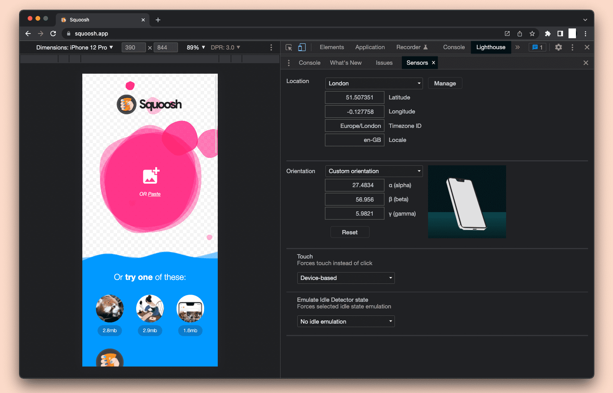

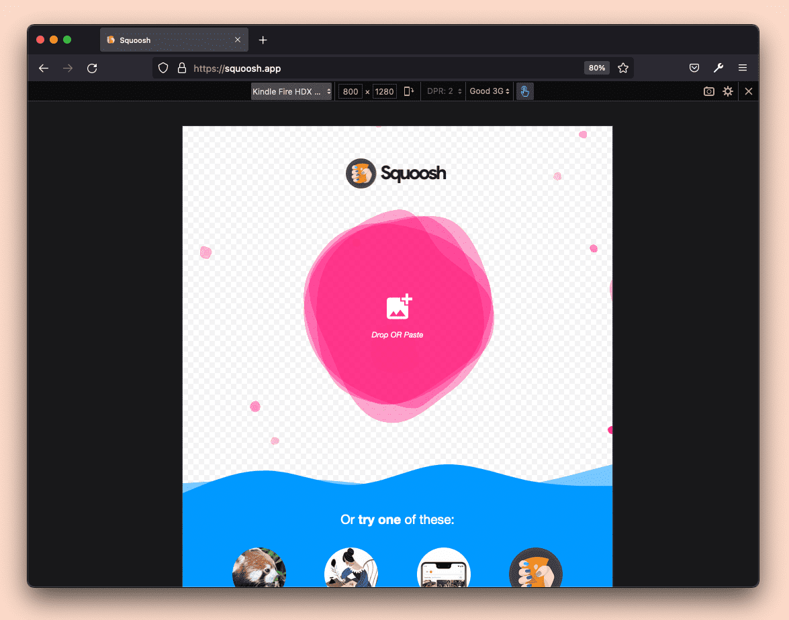

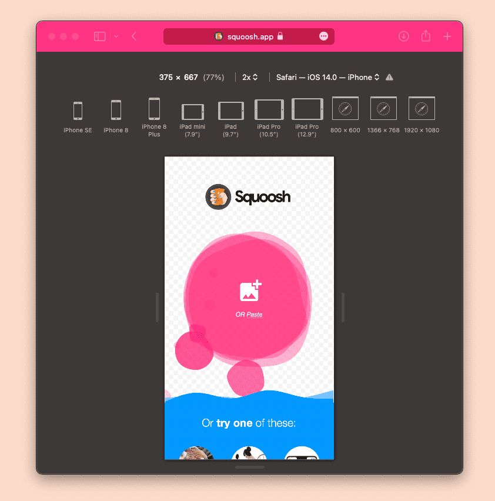

Некоторые коммерческие и бесплатные решения оптимизированы для разработчиков и дизайнеров, например, приложение с открытым кодом [Responsively app](https://responsively.app).

!!!warning ""

    Простые симуляторы не могут имитировать и тестировать возможности, связанные с установкой, такие как медиа-запросы, связанные с `display-mode`, мета-теги веб-приложений iOS, ярлыки приложений или цели веб-ресурсов.

### Симуляторы Apple

Компания Apple предлагает приложение Simulator (ранее известное как iOS Simulator), которое позволяет тестировать веб-приложение на различных iPhone и iPad с разными версиями операционной системы.

Приложение Simulator доступно только для компьютеров с macOS и поставляется вместе с [Xcode, доступно в [AppStore](https://apps.apple.com/us/app/xcode/id497799835); оно имитирует iOS и iPadOS с различными конфигурациями устройств. Оно включает в себя реальное приложение Mobile Safari и движок Web.app, используемый при установке PWA на главный экран, поэтому конечный результат работы устройства достаточно точно соответствует реальному.

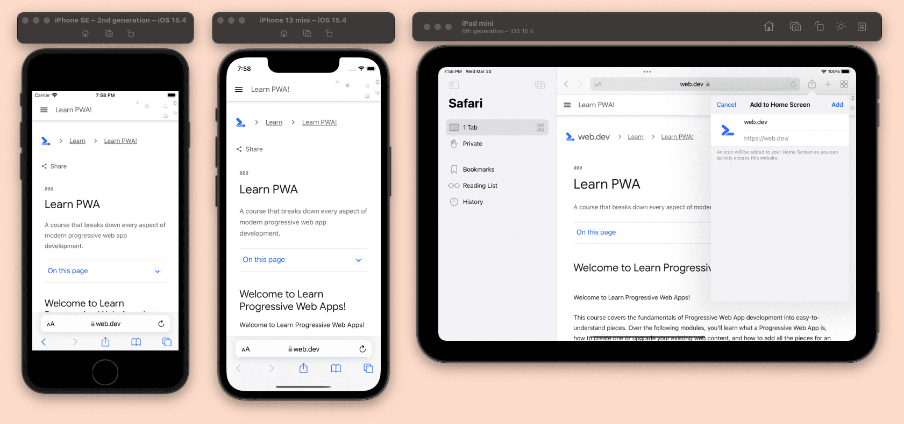

Для запуска приложения после установки Xcode можно открыть симулятор в меню `Xcode`, выбрав `Open Developer Tools`, а затем `Simulator`. Оказавшись в симуляторе, можно открыть Safari, как на настоящем iPhone или iPad. Открыть другие устройства можно, выбрав в меню `File`, затем `Open Simulator`.

Некоторые полезные сочетания клавиш для веб-разработчиков при использовании симулятора для тестирования PWA:

-   `Command-Shift-H`: переход на главный экран.
-   `Control-Command-Shift-H`: доступ к переключателю приложений.
-   `Команда-Вправо` и `Команда-Лево`: поворот устройства.

Симулятор - это не виртуальная машина, а приложение, работающее поверх macOS и похожее на iPhone или iPad, поэтому у него нет собственного стека TCP. Поэтому, если вы используете `localhost` в Simulator, Safari будет указывать на ваше устройство macOS `localhost`.

По умолчанию Xcode устанавливает только последнюю версию iOS, но вы можете зайти в Xcode, воспользоваться меню `Preferences` и загрузить более старые версии симуляторов с вкладки `Components`.

Хорошей практикой является тестирование PWA на последней версии iOS, предыдущей минорной версии и хотя бы одной предыдущей мажорной версии.

### Эмуляторы Android

Экосистема Android предлагает различные эмуляторы, но наиболее часто используются те, которые доступны в рамках [Android SDK](https://developer.android.com/studio/run/emulator).

Как разработчику PWA, вам также необходимы браузеры в эмуляторе Android, что добавляет сложности при тестировании, поскольку AOSP (Android Open Source Project) не включает Google Chrome или Play Store для загрузки браузеров. Поэтому не каждый эмулятор Android подходит для тестирования PWA.

Android SDK поставляется с двумя инструментами, полезными для эмуляции:

-   SDK Manager: загружает и обновляет различные версии операционных систем и плагинов.
-   AVD Manager: добавляет, редактирует и удаляет виртуальные устройства Android (AVD), каждое из которых представляет собой одно устройство с установленной ОС Android, аналогично экземпляру виртуальной машины.

Вы можете установить только Android SDK или [Android Studio](https://developer.android.com/studio), бесплатную IDE, включающую Android SDK с эмуляторами. При использовании SDK для открытия и настройки эмуляторов придется использовать командную строку. В Android Studio необходимые инструменты можно открыть из меню экрана приветствия. Попав в менеджер AVD, можно создать сколько угодно устройств с различными сочетаниями размеров экрана, возможностей и версий ОС Android.

!!!warning ""

    Каждое виртуальное устройство Android может занимать более 5 ГБ на жестком диске. Помните об этом при создании изображений.

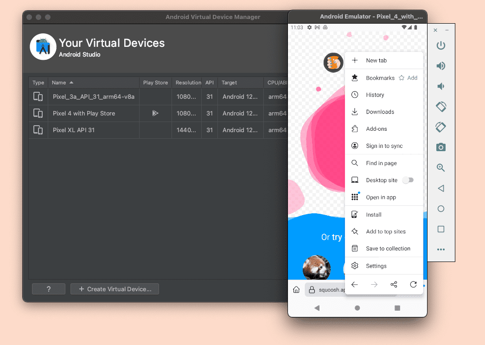

!!!warning ""

    Устройства Android представляют собой виртуальные машины поверх хост-компьютеров, поэтому они имеют собственные стеки TCP. Поэтому `localhost` в браузере Android в AVD не будет совпадать с `localhost` на настольном компьютере. Позже в этой главе мы рассмотрим, как решить это ограничение с помощью проброса портов.

С помощью эмулятора Android вы можете проверить поддержку установки PWA, весь пользовательский опыт, а также проверить, работают ли используемые вами возможности так, как ожидалось.

#### Использование Google Chrome

Чтобы использовать Google Chrome в эмуляторе Android, необходимо создать AVD с Play Services внутри. Для этого убедитесь, что в SDK, используемом для AVD, есть значок Play, как показано на следующем изображении:

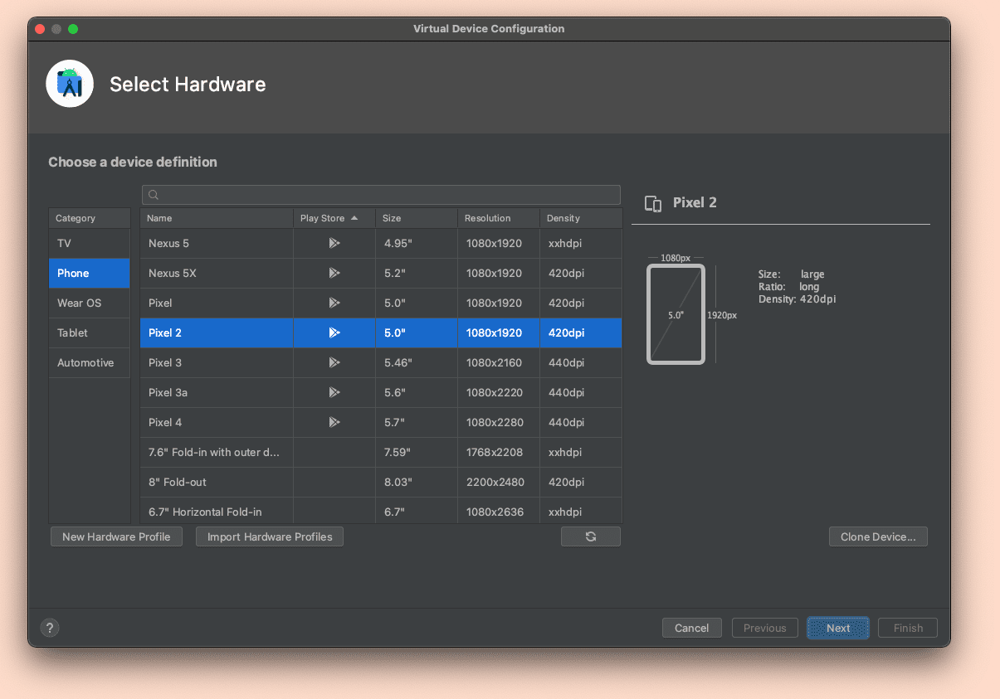

AVD с сервисами Play также включают Play Store, поэтому после настройки учетной записи с помощью аккаунта Google можно обновить Chrome до последней версии.

#### Использование других браузеров

Если вы используете AVD с сервисами Play, вы также можете загрузить браузеры из Play Store.

Большинство браузеров, доступных для Android, включая Samsung Internet, Microsoft Edge, Opera, Firefox и Brave, доступны в виде APK (пакетов для Android). Если у вас есть APK для браузера, который вы хотите протестировать, вы можете просто перетащить файл в эмулятор или установить его через командную строку [с помощью ADB](https://developer.android.com/studio/command-line/adb).

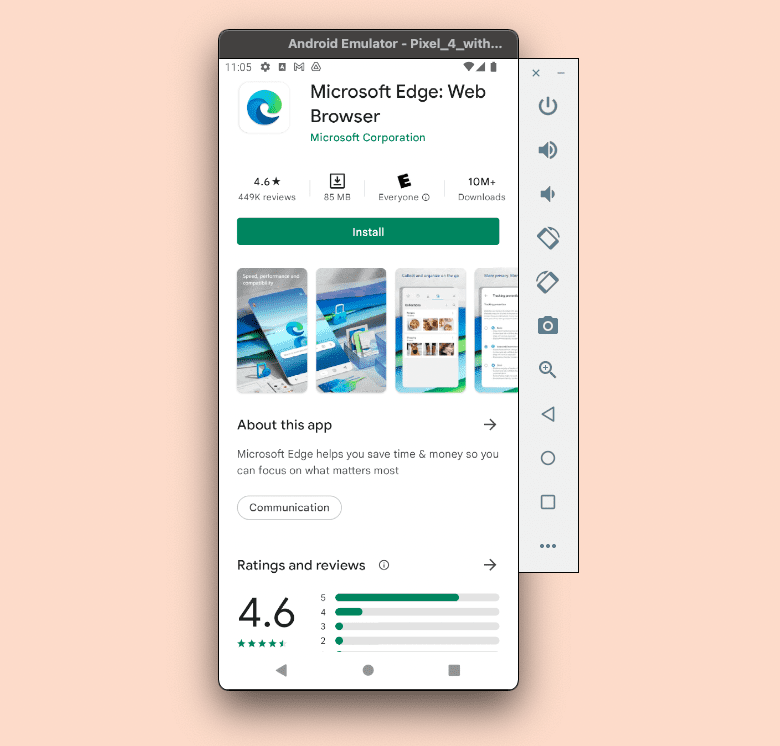

### Эмуляторы настольных компьютеров

Эмуляция другого настольного компьютера обычно осуществляется с помощью системы виртуальных машин, таких как VirtualBox или VMWare. Даже с помощью этих инструментов эмуляция некоторых сред невозможна, например эмуляция macOS на Windows или Linux, а для некоторых других вариантов может потребоваться лицензия, например для эмуляции Windows на macOS или Windows.

### Использование физических устройств

Использование реальных устройств для тестирования PWA также является хорошей идеей. При этом не обязательно иметь несколько устройств, поскольку существуют некоторые облачные решения, позволяющие использовать физические устройства удаленно. Существуют как бесплатные, так и коммерческие решения с бесплатным уровнем.

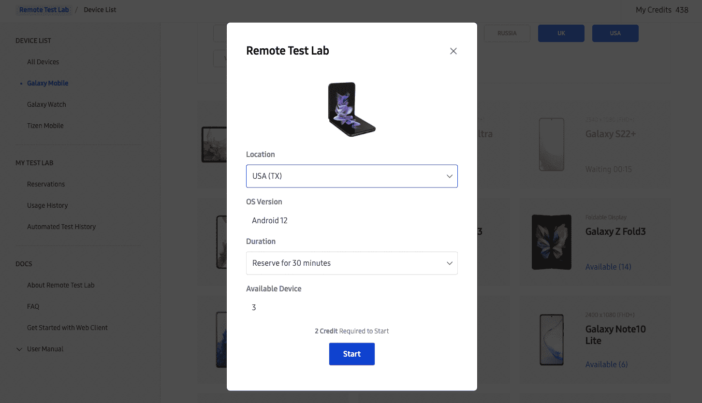

Одним из доступных решений является [Samsung Remote Test Lab](https://developer.samsung.com/remote-test-lab) - бесплатное решение для тестирования PWA на устройствах Samsung, включая телефоны, планшеты и складные устройства.

!!!warning ""

    Некоторые "облачные" решения для тестирования устройств подходят для тестирования приложений на конкретных устройствах. Они не оптимизированы для PWA, поэтому их можно использовать только в том случае, если вы планируете создать пакет для распространения PWA в магазине приложений.

### Удаленная проверка

Когда требуется отладить Progressive Web App на реальном устройстве, симуляторе или эмуляторе, можно подключить сеанс удаленной проверки с помощью средств браузера на рабочем столе.

Существуют коммерческие инструменты, но все браузеры также предлагают способы сделать это, включая:

-   [WebKit Remote Inspector](https://webkit.org/web-inspector/enabling-web-inspector/) для подключения к Safari и установленным PWA на устройствах и эмуляторах, подключенных к iOS и iPadOS.
-   [Chromium DevTools Remote Debugging](https://developer.chrome.com/docs/devtools/remote-debugging/) для подключения к Chrome, Edge, Samsung Internet и другим браузерам на базе Chromium на Android и PWA, установленным из этих браузеров, включая подключенные физические устройства и эмуляторы.
-   [Firefox Remote Debugging](https://developer.mozilla.org/docs/Tools/Remote_Debugging) для подключения к Firefox для Android на подключенных реальных устройствах и эмуляторах.

#### Перенаправление портов для Android

При тестировании PWA, доступных на `localhost`, на физических устройствах или эмуляторах Android возникает проблема, поскольку `localhost` будет указывать на TCP-стек Android, а не на вашу машину разработки.

Возможно, вы захотите использовать локальный IP-адрес вместо `localhost`, но это не очень хорошая идея, поскольку сервис-воркеры и многие возможности будут работать только с HTTPS-соединениями, за исключением `localhost`, поэтому ваш PWA не будет работать в автономном режиме и не будет соответствовать критериям PWA.

Решить проблему можно, включив проброс портов в браузере Chromium на настольном компьютере. В этом случае можно пробросить порт `localhost` на Android-устройстве на любой origin и порт с хост-компьютера, включая `localhost` на компьютере разработчика. Более подробную информацию можно найти в [этом руководстве](https://developer.chrome.com/docs/devtools/remote-debugging/local-server/).

## Браузеры Chromium

Браузеры Chromium предлагают множество инструментов для отладки и тестирования Progressive Web Apps, начиная с DevTools.

Большинство браузеров на базе Chromium, включая Samsung Internet, Microsoft Edge и Google Chrome, предлагают различные каналы, такие как Stable, Beta и Canary. Вы можете установить отдельные версии на настольный компьютер и Android, чтобы протестировать свой PWA на будущих версиях браузера. Это позволяет создавать и тестировать функции, которые еще не получили широкого распространения, или проверять утраты и изменения, а также выяснять, как будет вести себя ваше приложение в новых версиях.

С помощью удаленной проверки можно использовать все эти инструменты для отладки и тестирования PWA на настольных компьютерах и устройствах Android.

### Инструменты для сервис-воркеров

На вкладке "Приложение" Chromium DevTools имеется полный набор инструментов для отладки сервис-воркеров и их API. В разделе "Сервис-воркеры" вы можете:

-   Просмотреть статус установки и жизненный цикл сервис-воркеров.
-   Обновлять и снимать с регистрации сервис-воркер.
-   Проследить за циклом обновления.
-   Просмотреть текущих клиентов сервис-воркеров.
-   Отправить сервис-воркеру push-сообщение.
-   Зарегистрировать операции Background Sync и Periodic Background Sync.

[Подробнее об этих инструментах](https://developer.chrome.com/docs/devtools/progressive-web-apps/#service-workers).

### Инструменты для хранения данных

Внутри `Application`, затем `Storage` можно просматривать, обновлять и удалять данные из origin, такие как записи Web Storage или хранилища IndexedDB. Внутри `Application`, `Cache`, затем `Cache Storage`, можно просмотреть все кэши, хранящиеся в текущем origin, предварительно просмотреть содержимое и удалить записи. [Подробнее об инструменте для работы с кэшем](https://developer.chrome.com/docs/devtools/storage/cache/).

Также, выбрав в меню `Application`, затем `Storage`, можно посмотреть текущую используемую квоту, смоделировать хранение пользовательской квоты, а также очистить все данные, включая регистрацию сервис-воркера, с помощью команды `Clear site data`.

#### Фоновые сервисы

В Chromium DevTools также есть набор инструментов для записи событий фоновых служб, которые можно найти, нажав `Application`, затем `Background Services`. Это позволяет увидеть, что происходит с некоторыми событиями в фоновом режиме поверх API сервис-воркеров. [Подробнее об этих инструментах](https://developer.chrome.com/docs/devtools/javascript/background-services/).

### Инструменты манифеста веб-приложений

В Chromium DevTools в разделе `Application`, `Manifest` есть секция для Web App Manifest и критериев устанавливаемости. В этом разделе можно проверить корректность загрузки манифеста, значения манифеста, внешний вид иконок, идентификатор [app id](web-app-manifest.md#basic-fields), а также быструю проверку на наличие [маскируемых иконок](web-app-manifest.md#maskable-icons).

Также в этом разделе отображаются предупреждения и ошибки, связанные с проблемами [критериев устанавливаемости](installation.md#installation-criteria).

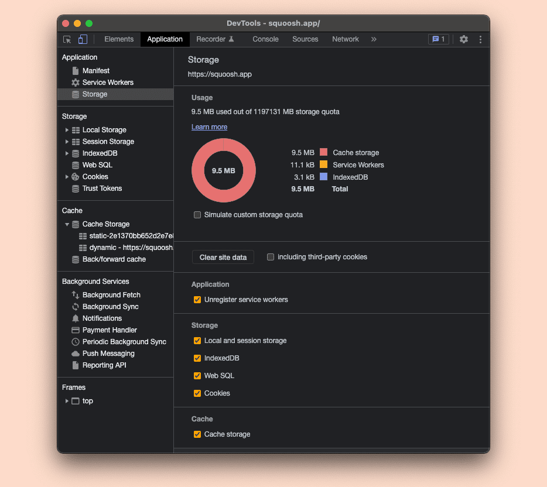

[Подробнее об этих инструментах](https://developer.chrome.com/docs/devtools/progressive-web-apps/).

!!!note ""

    В браузерах на базе Chromium есть несколько флагов, которые могут быть полезны при тестировании PWA. Ознакомьтесь со всеми доступными опциями, перейдя по адресу `about://flags/`

### Отладка установки

На устройствах Android, использующих режим установки [WebAPK](installation.md#webapks), можно получить доступ к списку установленных приложений, перейдя по адресу `about:webapk` в браузерах Chromium.

Здесь можно увидеть текущий статус обновления и запросить обновление WebAPK.

На настольных компьютерах список установленных PWA можно посмотреть по адресу `about:apps`, а отладочную версию - по адресу `about:app-service-internals`.

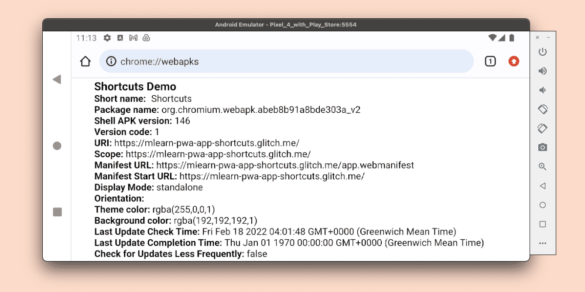

## Safari

На момент написания статьи Safari имеет более ограниченный набор инструментов для тестирования и отладки PWA. В нем нет инструментов для просмотра и отладки состояния и жизненного цикла сервис-воркеров, нет инспектора содержимого кэша, а также нет инструментов для поддержки манифеста веб-приложений и возможности его установки на iOS и iPadOS.

!!!warning ""

    Проверка и отладка PWA на iOS и iPadOS возможна только при наличии компьютера с обновленной ОС macOS, на котором используется Safari desktop или Safari Technology Preview. Существуют некоторые коммерческие инструменты, например [Inspect](https://inspect.dev), которые позволяют проверять веб-приложения на iOS и iPadOS из других операционных систем.

Safari доступен только на стабильной версии, а [Safari Technology Preview](https://developer.apple.com/safari/technology-preview/), доступный для macOS, позволяет лишь предварительно опробовать возможности будущих версий Safari. В [Программы бета-тестирования iOS и iPadOS](https://beta.apple.com/sp/betaprogram) иногда включаются новые версии Safari, которые можно использовать для тестирования.

### Инструменты для сервис-воркеров Safari

В Safari (как в macOS, так и в удаленном режиме для iOS и iPadOS) можно открыть окно инспектора для запущенного сервис-воркера.

В Safari на macOS в меню `Develop`, `Service Workers` будут перечислены все запущенные в данный момент сессии сервис-воркеров. Для удаленного инспектирования необходимо выбрать устройство для проверки в меню `Develop`. Контексты сервис-воркеров будут отображаться в том же подменю, что и контексты окон, под установленным именем origin или PWA.

При выборе одного из них Safari откроет новое окно с ограниченным инспектором, включающим только `Консоли`, `Источники` и `Сетевые вкладки`.

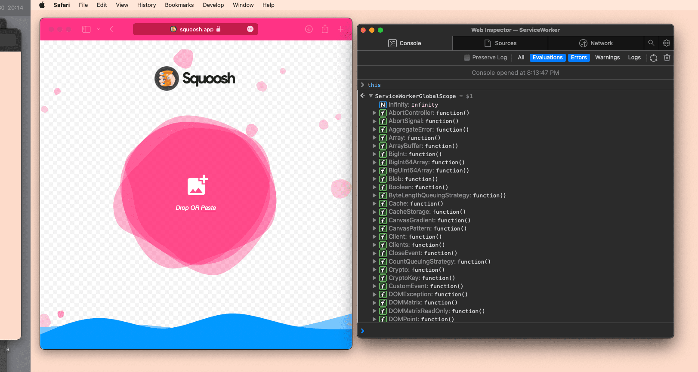

!!!note ""

    [Service Worker Detector](https://apps.apple.com/app/service-worker-detector/id1530808337) - бесплатное расширение для Safari, доступное в AppStore, которое позволяет увидеть статус регистрации сервис-воркера и доступные под текущим origin хранилища кэша, что недоступно в Инспекторе WebKit.

## Firefox

Firefox поддерживает сервис-ворк на всех платформах, а App Manifest для установки - только на Android. Доступ к инструментам для работы с PWA на настольных компьютерах и Android можно получить с помощью [USB remote inspection session](https://developer.mozilla.org/docs/Tools/about:debugging).

Для настольных компьютеров можно использовать версию, известную как [Firefox Developer Edition](https://www.mozilla.org/firefox/developer/). Как и браузер Chromium, Firefox имеет версии для настольных компьютеров и Android, включая стабильную, бета- и dev-версии.

### Инструменты для PWA

Инспектор сервис-воркеров в Firefox - это базовый инструмент, доступный в Developer Tools в разделе `Application`, `Service Workers`. Он позволяет увидеть зарегистрированный в данный момент сервис-воркер, проверить его состояние и снять с регистрации. Отладка кода сервис-воркера может быть доступна только в некоторых версиях Firefox для разработчиков.

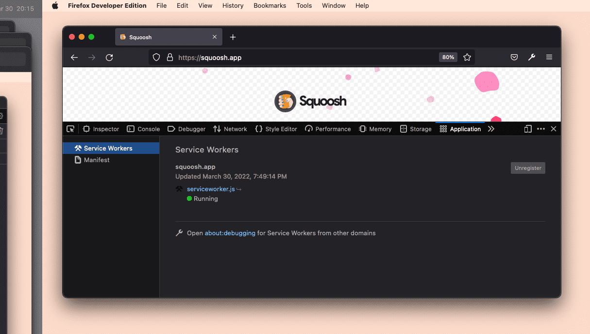

Инструмент манифеста доступен в разделе `Application`, `Manifest`, он отображает только значения манифеста с предварительным просмотром значков.

В разделе `Storage` можно управлять хранилищем origin, включая IndexedDB и Cache Storage.

Подробнее об этом можно прочитать на сайте [Firefox developer tooling for web apps](https://developer.mozilla.org/docs/Tools/Application).

!!!note ""

    Для разработки PWA можно использовать любой редактор кода, IDE и инструментарий по своему выбору. Если в качестве редактора кода вы используете Visual Studio, то вам стоит обратить внимание на бесплатное расширение [PWA Studio](https://blog.pwabuilder.com/posts/announcing-pwa-studio-the-vs-code-extension-for-building-progressive-web-apps!/?WT.mc_id=M365-MVP-4025164) от команды PWABuilder. Оно содержит множество инструментов для разработчиков PWA, таких как редактор иконок, генератор сервис-воркеров и быстрый способ создания пусковых установок PWA, полезных для распространения в магазинах приложений.

## Ресурсы

-   [Chrome DevTools: Отладка прогрессивных веб-приложений](https://developer.chrome.com/docs/devtools/progressive-web-apps/)
-   [Отладка PWA на Edge](https://docs.microsoft.com/en-us/microsoft-edge/devtools-guide-chromium/progressive-web-apps/)
-   [Firefox Developer Tools: Application Tab](https://developer.mozilla.org/docs/Tools/Application)
-   [Отладка сервис-воркеров в Chrome (видео)](https://www.youtube.com/watch?v=tuRPSaSiK_c)

:material-information-outline: Источник &mdash; [Tools and debug](https://web.dev/learn/pwa/tools-and-debug)
