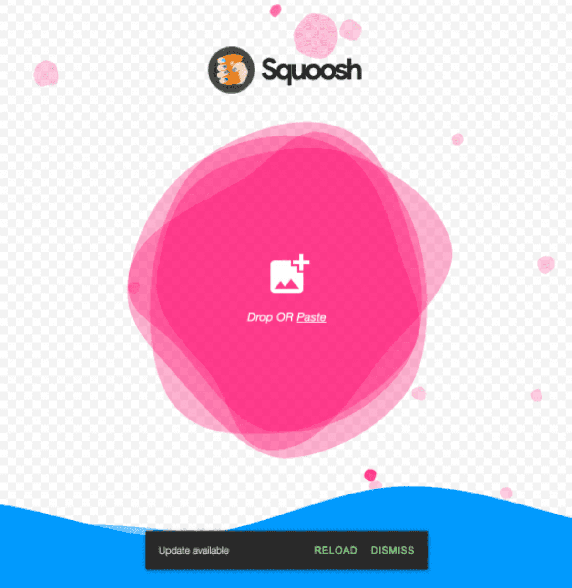
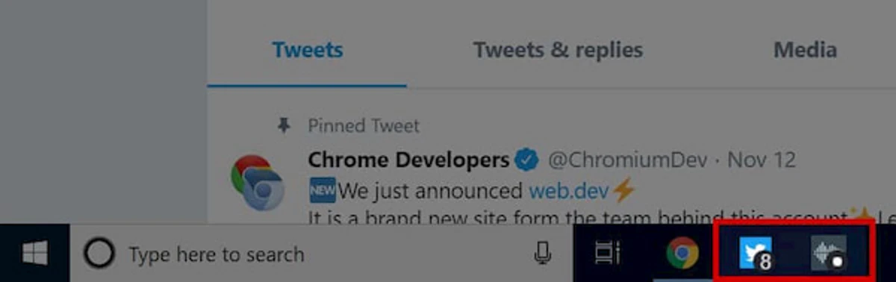

# Обновление

<big>Скорее всего, ваш PWA нуждается в обновлении. В этой главе представлены инструменты для обновления различных частей PWA, от ресурсов до метаданных.</big>

Вы опубликовали свое PWA: одни пользователи используют его из браузера, другие устанавливают на свои устройства. При обновлении приложения важно применять лучшие практики, чтобы избежать "подводных камней".

Вы можете обновлять:

-   Данные приложения.
-   Ресурсы, уже кэшированные на устройствах.
-   Рабочий файл службы или его зависимости.
-   Метаданные манифеста.

Рассмотрим лучшие практики для каждого из этих элементов.

## Обновление данных

Для обновления данных, например хранящихся в IndexedDB, можно использовать такие средства, как Fetch, WebRTC или WebSockets API. Если ваше приложение поддерживает какие-либо автономные функции, не забывайте обновлять и данные, которые поддерживают эти функции.

В совместимых браузерах есть возможность синхронизировать данные не только при открытии PWA, но и в фоновом режиме. К таким опциям относятся:

-   [Фоновая синхронизация](https://developer.mozilla.org/docs/Web/API/Background_Synchronization_API): сохраняет неудачные запросы и повторяет их, используя синхронизацию с сервис-воркером.
-   [Периодическая фоновая синхронизация](https://developer.mozilla.org/docs/Web/API/Web_Periodic_Background_Synchronization_API): периодическая синхронизация данных в фоновом режиме в определенное время, что позволяет приложению предоставлять обновленные данные, даже если пользователь еще не открыл приложение.
-   [Фоновая загрузка](https://developer.mozilla.org/docs/Web/API/Background_Fetch_API): загрузка больших файлов, даже когда PWA закрыто.
-   [Веб-push](https://developer.mozilla.org/docs/Web/API/Push_API): отправка сообщения с сервера, которое пробуждает сервис-воркер и уведомляет пользователя. Это обычно называется "push-уведомлением". Этот API требует разрешения пользователя.

Все эти API выполняются из контекста сервис-воркера. В настоящее время они доступны только в браузерах на базе Chromium, на Android и в настольных операционных системах. При использовании одного из этих API можно запускать код в потоке сервис-воркера, например, для загрузки данных с сервера и обновления данных в IndexedDB.

!!!note ""

    Web Push API - это единственный API, который уведомляет пользователя из фонового режима, и его сообщение `push` может содержать небольшой объем данных: оно может нести полезную нагрузку размером около 2 КБ.

## Обновление ресурсов

Обновление ресурсов включает в себя любые изменения в файлах, используемых для визуализации интерфейса приложения, таких как HTML, CSS, JavaScript и изображения. Например, изменение логики приложения, изображения, являющегося частью интерфейса, или таблицы стилей CSS.

### Шаблоны обновления

Ниже приведены некоторые общие схемы работы с обновлениями приложений, но вы всегда можете адаптировать этот процесс под свои нужды:

-   Полное обновление: каждое изменение, даже незначительное, приводит к замене всего содержимого кэша. Эта схема имитирует работу с обновлениями в приложениях для конкретных устройств, поэтому она потребляет больше пропускной способности и занимает больше времени.
-   Обновление измененных ресурсов: в кэше заменяются только те ресурсы, которые изменились с момента последнего обновления. Часто реализуется с помощью библиотеки, например [Workbox](workbox.md). Она предполагает создание списка кэшируемых файлов, хэш-представления файла и временных меток. Имея эту информацию, сервис-воркер сравнивает этот список с кэшированными ресурсами и решает, какие ресурсы необходимо обновить.
-   Обновление отдельных ресурсов: каждый ресурс обновляется отдельно при его изменении. Примером индивидуального обновления ресурсов является стратегия stale while revalidate, описанная в главе [Обслуживание](serving.md).

### Когда обновлять

Еще одна хорошая практика заключается в том, чтобы найти удобное время для проверки обновлений и их применения. Вот некоторые варианты:

-   Когда сервис-воркер просыпается. Для этого момента нет события, но браузер выполнит любой код в глобальной области видимости сервис-воркера, когда тот проснется.
-   В контексте главного окна PWA, после того как браузер загрузил страницу, чтобы не замедлять загрузку приложения.
-   При срабатывании фоновых событий, например, когда PWA получает push-уведомление или выполняется фоновая синхронизация. В этом случае можно обновить кэш, и при следующем открытии приложения пользователи получат новую версию ресурса.

!!!warning ""

    Проверяя наличие обновлений, не прерывайте процесс загрузки и не влияйте на производительность приложения. Не ждите проверки обновлений перед рендерингом приложения, так как это ухудшит пользовательский опыт и отразится на ваших [core web vitals](https://web.dev/articles/vitals). Если вам необходимо часто обновлять часть приложения, используйте стратегию кэширования [stale while revalidate](serving.md#stale-while-revalidate).

### Живые обновления

Вы также можете выбрать способ применения обновлений: когда приложение открыто (в реальном времени) или закрыто. При закрытом приложении, даже если приложение загрузило новые ресурсы, оно не внесет никаких изменений и будет использовать новые версии при следующей загрузке.

Живое обновление означает, что как только ресурс обновляется в кэше, ваш PWA заменяет его в текущей загрузке. Это сложная задача, которая не рассматривается в данном курсе. Некоторые инструменты, помогающие реализовать такое обновление, - это [livereload-js](https://www.npmjs.com/package/livereload-js) и обновление ресурсов CSS [CSSStyleSheet.replace() API](https://developer.mozilla.org/docs/Web/API/CSSStyleSheet/replace).

## Обновление сервиса-воркера

Браузер запускает алгоритм обновления, когда изменяется сервис-воркер или его зависимости. Браузер обнаруживает обновления, используя побайтовое сравнение кэшированных файлов и ресурсов, поступающих из сети.

Затем браузер пытается установить новую версию сервис-воркера, при этом новый сервис-воркер будет находиться в состоянии _ожидания_, как описано в главе [Service workers chapter](service-workers.md#updating-a-service-worker). При новой установке будет запущено событие `install` для нового сервис-воркера. Если в обработчике этого события кэшируются ресурсы, то они также будут повторно кэшированы.

!!!warning ""

    Если вы удалите или переименуете файл сервис-воркера, браузер не удалит ранее зарегистрированный сервис-воркер из своих клиентов. Для полного удаления сервис-воркера необходимо использовать методы [getRegistrations()](https://developer.mozilla.org/docs/Web/API/ServiceWorkerContainer/getRegistrations) и [unregister()](https://developer.mozilla.org/docs/Web/API/ServiceWorkerRegistration/unregister).

!!!note ""

    Установка новой версии сервис-воркера не приводит к автоматическому удалению ранее кэшированных ресурсов. Необходимо явно удалить ненужные ресурсы.

### Обнаружение изменений сервис-воркера

Для обнаружения готовности и установки нового сервис-воркера мы используем событие `updatefound` из регистрации сервис-воркера. Это событие запускается, когда новый сервис-воркер начинает установку. Нам необходимо дождаться изменения его состояния на `installed` с помощью события `statechange`; см. следующее:

```js
async function detectSWUpdate() {
    const registration = await navigator.serviceWorker
        .ready;

    registration.addEventListener(
        'updatefound',
        (event) => {
            const newSW = registration.installing;
            newSW.addEventListener(
                'statechange',
                (event) => {
                    if (newSW.state == 'installed') {
                        // New service worker is installed, but waiting activation
                    }
                }
            );
        }
    );
}
```

### Force override

По умолчанию новый сервис-воркер будет установлен, но будет ожидать активации. Ожидание не позволит новому сервису-воркеру занять старых клиентов, которые могут быть несовместимы с новой версией.

Хотя это и не рекомендуется, новый сервис-воркер может пропустить этот период ожидания и начать активацию немедленно.

!!!warning ""

    `skipWaiting()` означает, что ваш новый сервис-воркер, вероятно, управляет страницами, которые были загружены в старой версии. Это означает, что часть запросов страницы была выполнена старым сервис-воркером, а последующие запросы будут выполняться новым сервис-воркером. Если это может помешать работе вашего приложения, не используйте `skipWaiting()`. Это предупреждение взято из статьи [Жизненный цикл сервис-воркера](https://web.dev/articles/service-worker-lifecycle). Ознакомьтесь с этой статьей, чтобы узнать больше о лучших практиках.

```js
self.addEventListener('install', (event) => {
    // forces a service worker to activate immediately
    self.skipWaiting();
});

self.addEventListener('activate', (event) => {
    // when this SW becomes activated, we claim all the opened clients
    // they can be standalone PWA windows or browser tabs
    event.waitUntil(clients.claim());
});
```

Событие `controllerchange` срабатывает при смене сервис-воркера, управляющего текущей страницей. Например, новый рабочий пропустил ожидание и стал новым активным рабочим.

```js
navigator.serviceWorker.addEventListener(
    'controllerchange',
    (event) => {
        // The service worker controller has changed
    }
);
```

## Обновление метаданных

Вы также можете обновить метаданные своего приложения, которые в основном задаются в манифесте [Web App manifest](web-app-manifest.md). Например, обновить его значок, название или стартовый URL-адрес, или добавить новую функцию, такую как [ярлыки приложений](https://web.dev/articles/app-shortcuts). Но что будет с теми пользователями, которые уже установили приложение со старым значком на свои устройства? Как и когда они получат обновленную версию?

Ответ зависит от платформы. Давайте рассмотрим возможные варианты.

!!!note ""

    Свойство `id` однозначно идентифицирует ваш PWA; изменение `id` означает, что ваш PWA будет считаться совершенно новым PWA. Чтобы избежать неожиданного поведения, прежде чем устанавливать или изменять свойство `id`, прочитайте [Уникальная идентификация PWA с помощью свойства id манифеста веб-приложений](https://developer.chrome.com/blog/pwa-manifest-id/).

### Safari в браузерах для iOS, iPadOS и Android.

На этих платформах единственный способ получить новые метаданные манифеста - переустановить приложение из браузера.

!!!note ""

    При изменении `start_url` браузер может установить приложение как совершенно новое. Однако в последнее время принято добавлять в свойство `start_url` ручной идентификатор версии, например `/?version=3`, чтобы определить версию. Из Chrome 96 [для идентификации приложения можно добавить `id` в манифест](https://developer.chrome.com/blog/pwa-manifest-id/).

### Google Chrome на Android с WebAPK

Если пользователь установил ваш PWA на Android с помощью Google Chrome с активированным [WebAPK](installation.md#webapks) (большинство установок Chrome PWA), обновление будет обнаружено и применено на основе алгоритма. Подробности можно узнать в этой статье [манифеста обновлений](https://web.dev/articles/manifest-updates).

Некоторые дополнительные замечания по процессу:

Если пользователь не открывает ваш PWA, его WebAPK не будет обновлен. Если сервер не отвечает на запрос файла манифеста (возникает ошибка 404), Chrome не будет проверять наличие обновлений в течение как минимум 30 дней, даже если пользователь откроет PWA.

Перейдите в раздел `about:webapks` в Chrome на Android, чтобы посмотреть состояние флага "требуется обновление", и запросите обновление. В главе [Инструменты и отладка](tools-and-debug.md) можно подробнее ознакомиться с этим инструментом отладки.

### Samsung Internet на Android с помощью WebAPK

Процесс аналогичен версии для Chrome. В этом случае, если манифест PWA требует обновления, в течение следующих 24 часов WebAPK будет обновлен по Wi-Fi после того, как будет выполнена [минификация обновленного WebAPK](installation.md#webapks).

### Google Chrome и Microsoft Edge на настольных компьютерах

На настольных устройствах при запуске PWA браузер определяет, когда в последний раз он проверял локальный манифест на наличие изменений. Если манифест не просматривался с момента последнего запуска браузера или не проверялся в течение последних 24 часов, браузер выполняет сетевой запрос манифеста и затем сравнивает его с локальной копией.

При обновлении [выбранных свойств](https://web.dev/articles/manifest-updates#cr-desktop-trigger) срабатывает обновление после закрытия всех окон.

## Предупреждение пользователя

Некоторые стратегии обновления требуют перезагрузки или новой навигации от клиентов. Необходимо сообщить пользователю, что он ожидает обновления, но при этом дать ему возможность обновить страницу в удобное для него время.

Для информирования пользователя существуют следующие варианты:

-   Использовать DOM или [canvas API](https://developer.mozilla.org/docs/Web/API/Canvas_API) для вывода уведомления на экран.
-   Использовать [Web Notifications API](https://developer.mozilla.org/docs/Web/API/notification). Этот API является частью разрешения push для генерации уведомления в операционной системе. Для его использования необходимо запросить разрешение web push, даже если вы не используете протокол push-сообщений со своего сервера. Это единственный возможный вариант, если PWA не открывается.
-   Использование [Badging API](https://developer.chrome.com/articles/badging-api/) для отображения информации о наличии обновлений в значке установленного PWA



### Подробнее о Badging API

API [Badging API](https://developer.chrome.com/articles/badging-api/) позволяет помечать иконку вашего PWA номером бейджа или точкой бейджа в совместимых браузерах. Точка бейджа - это крошечная метка внутри установленного значка, которая говорит о том, что внутри приложения что-то ждет.



Для установки номера бейджа необходимо вызвать команду `setAppBadge(count)` на объекте `navigator`. Это можно сделать из контекста окна или сервис-воркера, когда известно, что происходит обновление, чтобы предупредить пользователя.

```js
let unreadCount = 125;
navigator.setAppBadge(unreadCount);
```

Чтобы очистить бейдж, необходимо вызвать `clearAppBadge()` на том же объекте:

```js
navigator.clearAppBadge();
```

!!!note ""

    API Badging API работает по принципу best-effort; браузер будет делать все возможное, чтобы удовлетворить ваш запрос, но иногда браузер будет использовать другой подход. Например, номер бейджа недоступен на некоторых устройствах Android, поэтому используется бейдж с точкой, независимо от того, какой номер вы указываете.

## Ресурсы

-   [Жизненный цикл сервис-воркера](https://web.dev/articles/service-worker-lifecycle)
-   [Как Chrome обрабатывает обновления манифеста веб-приложения](https://web.dev/articles/manifest-updates)
-   [Синхронизация и обновление PWA в фоновом режиме](https://docs.microsoft.com/en-us/microsoft-edge/progressive-web-apps-chromium/how-to/background-syncs)
-   [Более богатый опыт работы в автономном режиме с помощью API периодической фоновой синхронизации](https://web.dev/periodic-background-sync)
-   [Push API](https://developer.mozilla.org/docs/Web/API/Push_API)
-   [Обзор Push-уведомлений](https://web.dev/articles/push-notifications-overview)
-   [Значки для иконок приложений](https://web.dev/badging-api)
-   [Workbox 4: Реализация потока refresh-to-update-version с помощью модуля workbox-window](https://medium.com/google-developer-experts/workbox-4-implementing-refresh-to-update-version-flow-using-the-workbox-window-module-41284967e79c)

:material-information-outline: Источник &mdash; [Update](https://web.dev/learn/pwa/update)
