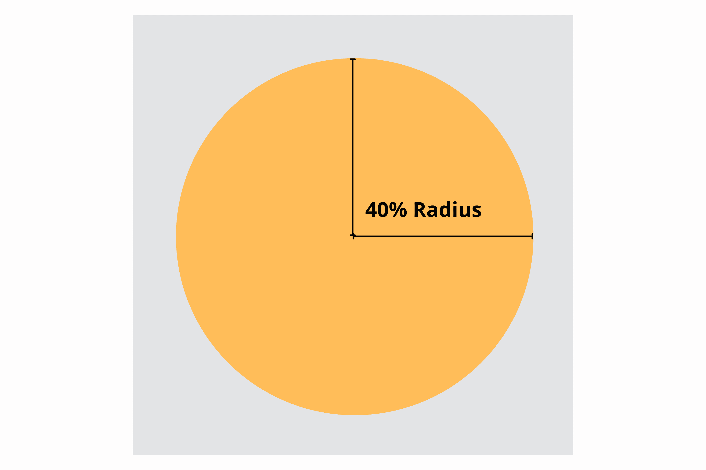
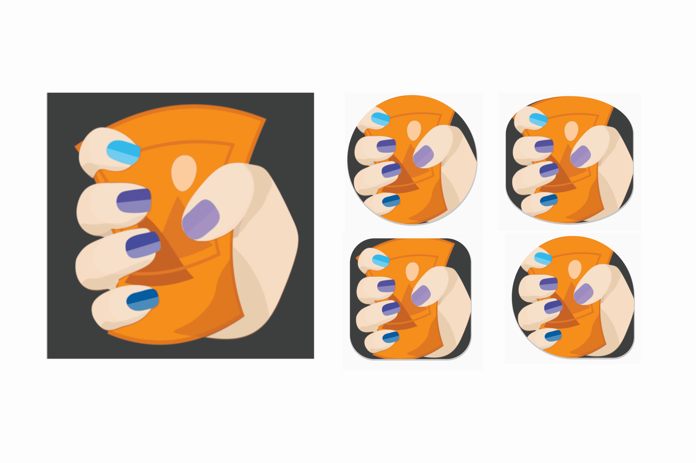
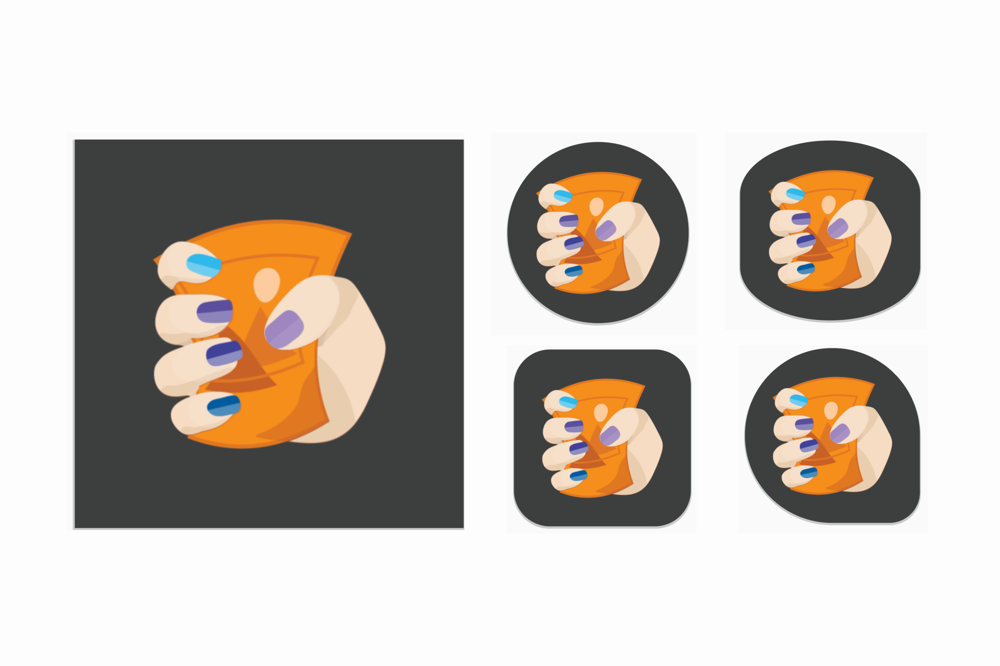
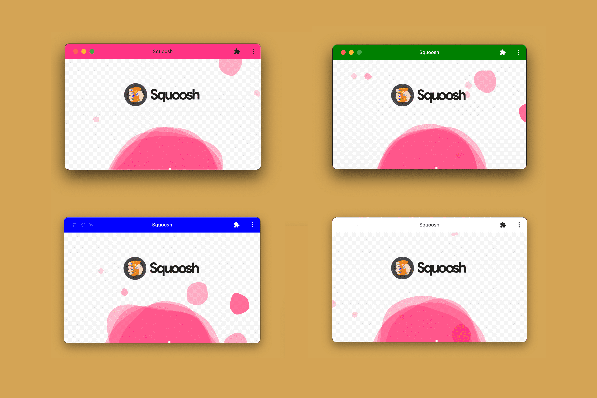
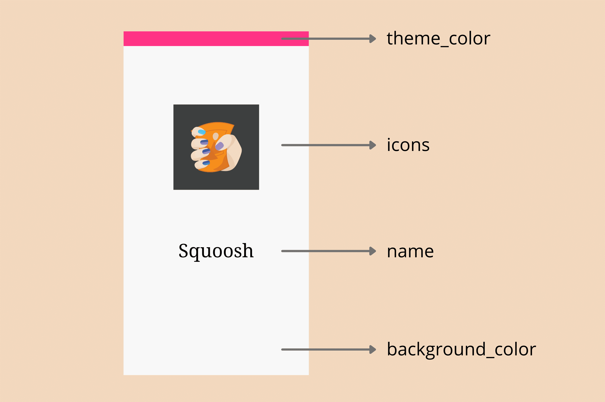

# Манифест Web-приложения

<big>**Манифест веб-приложения** - это JSON-файл, определяющий, как PWA должен восприниматься в качестве установленного приложения, включая внешний вид и базовое поведение в операционной системе.</big>

Манифест веб-приложения - это создаваемый файл, который указывает браузеру, как он должен отображать веб-контент в виде приложения в операционной системе. Манифест может содержать базовую информацию, такую как название приложения, значок и цвет темы; расширенные настройки, такие как желаемая ориентация и ярлыки приложений; метаданные каталога, такие как скриншоты.

!!!warning ""

    Манифест веб-приложения является обязательным [критерием устанавливаемости](installation.md#installation-criteria) в каждом браузере. Без него ваш PWA не установится.

Каждый PWA должен содержать один манифест для каждого приложения, обычно размещаемый в корневой папке и размещаемый на всех HTML-страницах, с которых может быть установлен ваш PWA. Его официальное расширение - `.webmanifest`, поэтому вы можете назвать свой манифест как-нибудь вроде `app.webmanifest`.

!!!note ""

    Хотя рекомендуемым расширением является `.webmanifest`, подойдет любое имя файла, если он поставляется с типом содержимого `application/manifest+json` или другим JSON-валидным типом содержимого, например `text/json`. Поэтому многие PWA, особенно старые, используют вместо него `manifest.json`.

## Добавление манифеста веб-приложения в PWA

Чтобы создать манифест веб-приложения, сначала создайте текстовый файл с JSON-объектом, содержащим, по крайней мере, поле `name` со строковым значением:

```json title="app.webmanifest"
{
    "name": "My First Application"
}
```

Но создать файл недостаточно, браузеру также необходимо знать о его существовании.

### Ссылка на манифест

Чтобы браузер знал о существовании манифеста вашего веб-приложения, необходимо связать его с PWA с помощью HTML-элемента `<link>` и атрибута `rel`, установленного на `manifest`, на всех HTML-страницах PWA. Это аналогично тому, как вы связываете таблицу стилей CSS с документом.

```html title="index.html"
<html lang="en">
    <title>This is my first PWA</title>
    <link rel="manifest" href="/app.webmanifest" />
</html>
```

!!!warning ""

    Если PWA включает в себя несколько HTML-страниц, не забудьте связать его манифест со всеми ними.

### Отладка манифеста

Чтобы убедиться, что манифест настроен правильно, можно использовать Inspector в Firefox и DevTools в каждом браузере на базе Chromium.

!!!note ""

    Если вы видите сообщение о том, что браузер не обнаружил манифеста, а вы правильно включили в него `<link>`, проверьте, можно ли загрузить манифест в браузер и правильно ли задан тип его содержимого. Можно также попробовать переименовать его в `manifest.json`.

### Для браузеров Chromium

В DevTools

1.  На левой панели в разделе **Application** выберите **Manifest**.
2.  Проверьте поля манифеста в том виде, в котором они были разобраны браузером.

### Для Firefox

1.  Откройте Инспектор.
2.  Перейдите на вкладку "Приложение".
3.  Выберите опцию Manifest на левой панели.
4.  Проверьте поля манифеста в том виде, в котором они были разобраны браузером.

!!!warning ""

    Отладка манифестов веб-приложений в Safari невозможна, поэтому единственная возможность проверить работоспособность - попробовать установить PWA на iOS или iPadOS.

## Разработка дизайна PWA

Теперь, когда ваш PWA подключен к манифесту, пришло время заполнить остальные поля, чтобы определить, как он будет работать для ваших пользователей.

!!!warning ""

    До появления спецификации манифеста веб-приложений некоторые браузеры, включая Safari на iOS/iPadOS и Chrome на Android, поддерживали пользовательские элементы `<meta>` для описания возможностей приложения, например `apple-mobile-web-app-capable`. Не используйте эти элементы `<meta>` сегодня; это больше не рекомендуется и может навредить установке, если браузер не сможет загрузить манифест должным образом; опыт, который вы получите в качестве резервного варианта, может быть другим и неожиданным.

### Основные поля

Первый набор полей представляет собой основную информацию о PWA. Они используются для создания иконки и окна установленного PWA и определяют способ его запуска. К ним относятся:

`name`

: Полное имя вашего PWA. Оно будет отображаться вместе со значком на главном экране операционной системы, в пусковой установке, доке или меню.

`short_name`

: необязательное, более короткое название PWA, используемое в тех случаях, когда не хватает места для отображения полного значения поля `name`. Не превышайте 12 символов, чтобы свести к минимуму вероятность усечения.

`icons`

: Массив объектов иконок с полями `src`, `type`, `sizes` и необязательным полем `purpose`, описывающими, какие изображения должны представлять PWA.

`start_url`

: URL, по которому должен загружаться PWA, когда пользователь запускает его с установленной иконки. Рекомендуется указывать абсолютный путь, поэтому, если домашняя страница PWA является корнем сайта, можно задать значение '/', чтобы открывать ее при запуске приложения. Если начальный URL не указан, браузер может использовать в качестве начального URL, с которого был установлен PWA. Это может быть глубокая ссылка, например, подробная информация о продукте, а не домашний экран.

`display`

: Один из вариантов `fullscreen`, `standalone`, `minimal-ui` или `browser`, описывающий, как ОС должна отображать окно PWA. Подробнее о различных режимах отображения можно прочитать в главе [App Design](app-design.md#display-modes). [Большинство](https://almanac.httparchive.org/en/2021/pwa#top-manifest-display-values) вариантов использования реализуют `standalone`.

`id`

: строка, которая однозначно идентифицирует данный PWA среди других, которые могут быть размещены на том же источнике. Если она не задана, то в качестве запасного значения будет использоваться `start_url`. Следует помнить, что, изменяя `start_url` в будущем (например, при изменении значения строки запроса), вы можете лишить браузер возможности определять, что PWA уже установлен.

!!!warning ""

    Если вы опубликовали PWA до сентября 2021 года, прочитайте о лучшей практике добавления свойства `id` сейчас в статье [Уникальная идентификация PWA с помощью свойства id манифеста веб-приложений](https://developer.chrome.com/blog/pwa-manifest-id/).

!!!warning ""

    Некоторые поля манифеста поддерживаются не всеми браузерами. Если браузер не поддерживает какое-либо поле, оно просто игнорируется, и ваш манифест остается в силе. Подробнее о каждом поле можно узнать в разделе [Web App Manifests](https://developer.mozilla.org/docs/Web/Manifest).

#### Иконки

Иконка PWA является его визуальной идентификацией на устройствах пользователей при установке, поэтому очень важно определить хотя бы одну. Поскольку свойство `icons` представляет собой коллекцию объектов иконок, вы можете определить несколько иконок в различных форматах, чтобы обеспечить наилучшее восприятие иконок вашими пользователями. Каждый браузер выберет один или несколько значков в зависимости от своих потребностей и операционной системы, на которой он установлен, причем значки будут ближе к необходимым спецификациям.

!!!warning ""

    Хотя PNG могут включать прозрачность, предоставление прозрачных значков может вызвать неожиданные проблемы в некоторых операционных системах. Например, в iOS, iPadOS и Android 8 и более поздних версиях прозрачность заполняется цветом фона, который невозможно контролировать. Для лучшей совместимости используйте квадратный непрозрачный значок.

Если необходимо выбрать только один размер пиктограммы, то он должен составлять 512 на 512 пикселей. Однако рекомендуется предоставлять и другие размеры, в том числе 192 на 192, 384 на 384 и 1024 на 1024 пикселей.

```json
"icons": [
   {
      "src": "icons/512.png",
      "type": "image/png",
      "sizes": "512x512"
   },
   {
      "src": "icons/1024.png",
      "type": "image/png",
      "sizes": "1024x1024"
   }
]
```

!!!warning ""

    Некоторые ресурсы предлагают добавить больше размеров значков для Android, например 48 на 48, 72 на 72, 96 на 96, 144 на 144, 168 на 168, 256 на 256. Хотя вы можете добавить столько размеров, сколько захотите, эти размеры больше не нужны, поскольку это размеры значков Android для устаревших устройств; даже если некоторые пользователи все еще ожидают таких разрешений, браузер изменит размер одного из ваших отправленных значков.

Если вы не предоставите пиктограмму или пиктограммы не будут иметь рекомендуемых размеров, то на некоторых платформах вы не пройдете [критерии установки](installation.md#installation-criteria). На других платформах значок будет сгенерирован автоматически, например, на основе скриншота PWA или с использованием типового значка.

##### Маскируемые значки

Некоторые операционные системы, например Android, адаптируют значки к различным размерам и формам. Например, в Android 12 различные производители или настройки могут изменять форму значков от кругов до квадратов и квадратов с закругленными углами. Для поддержки такого рода адаптивных значков можно предоставить маскируемый значок, используя поле `цель`.

Для этого необходимо предоставить файл квадратного изображения, основной значок которого находится в "безопасной зоне" - окружности, расположенной по центру значка и имеющей радиус, равный 40% от ширины значка. Устройства, поддерживающие маскируемые значки, замаскируют ваш значок при необходимости.



!!!warning ""

    Если вы не предоставите маскируемый значок, устройства, ожидающие его появления, могут уменьшить ваш значок и сделать его нужной формы с белым фоном.

Приведем пример маскируемого значка, выполненного в нескольких часто используемых формах:

На следующем изображении, если использовать в качестве маскируемого значка значок слева, то при применении маски формы на устройствах будут получены плохие результаты.



Это изображение можно было бы сделать более пригодным для использования, если бы в нем было больше прокладок.



Маскируемые иконки должны иметь размер не менее 512 на 512. Создав один такой значок, вы можете добавить его в коллекцию `icons`, чтобы улучшить работу с поддерживаемыми устройствами:

```json
"icons": [
   {
      "src": "/icons/512.png",
      "type": "image/png",
      "sizes": "512x512"
   },
   {
      "src": "/icons/1024.png",
      "type": "image/png",
      "sizes": "1024x1024"
   },
   {
      "src": "/icons/512-maskable.png",
      "type": "image/png",
      "sizes": "512x512",
      "purpose": "maskable"
   },
]
```

В большинстве случаев, если маскируемый значок отображается не очень хорошо, его можно улучшить, добавив дополнительную подложку. [Maskable.app](https://maskable.app) - это бесплатный онлайн-инструмент для тестирования и создания маскируемой версии вашего значка.

### Рекомендуемые поля

Следующий набор полей, которые необходимо включить, - это поля, которые улучшат работу пользователя, хотя они и не обязательны для установки.

`theme_color`

: Цвет по умолчанию для приложения, иногда влияющий на то, как ОС отображает сайт (например, цвет окна и строки заголовка на настольных компьютерах или цвет строки состояния на мобильных устройствах). Этот цвет может быть переопределен с помощью элемента HTML `theme-color` `<meta>`.

`background_color`

: Цвет-заполнитель для отображения фона приложения до загрузки таблицы стилей. Safari на iOS и iPadOS и большинство настольных браузеров в настоящее время игнорируют это поле.

`scope`

: изменяет область навигации PWA, позволяя определить, что будет отображаться в окне установленного приложения, а что нет. Например, если вы ссылаетесь на страницу, находящуюся за пределами области навигации, то она будет отображаться не в окне PWA, а в браузере приложения. Однако это не приведет к изменению области действия вашего сервис-воркера.

На следующем изображении показано, как поле `theme_color` используется для строки заголовка на настольном устройстве при установке PWA.



!!!note ""

    Если необходимо обеспечить разные цвета темы для темного и светлого режимов, можно переопределить значение манифеста с помощью метатега в HTML, используя медиазапрос, например, так: `<meta name="theme-color" content="red" media="(prefers-color-scheme: dark)">`

При определении цветов в манифесте, например, в рамках `theme_color` и `background_color`, следует использовать именованные цвета CSS, такие как `salmon` или `orange`, цвета RGB, такие как `#FF5500`, или функции цвета без прозрачности, такие как `rgb()` или `hsl()`. Дополнительную информацию можно найти в главе [App design chapter](app-design.md#theming-your-app).

!!!warning ""

    Не используйте прозрачность, переменные CSS, функции градиента или функции цвета с прозрачностью (например, `rgba()`), поскольку они не поддерживаются большинством браузеров. Вы получите несовместимые результаты.

#### Попробуйте

<iframe width="100%" height="400" allow="geolocation; microphone; camera; midi; encrypted-media; xr-spatial-tracking; fullscreen" allowfullscreen="" sandbox="allow-scripts allow-modals allow-forms allow-same-origin allow-top-navigation-by-user-activation allow-downloads" data-testid="app-preview-iframe" title="Preview of learn-pwa-web-app-manifest" src="https://learn-pwa-web-app-manifest.glitch.me/"></iframe>

#### Всплывающие экраны

На некоторых устройствах во время загрузки PWA отображается статическое изображение, чтобы сразу же предоставить пользователю обратную связь.

Для создания заставки в Android используются значения `theme_color`, `background_color` и `icon`.

Когда вы устанавливаете PWA на Android, устройство генерирует заставку с информацией, полученной из вашего манифеста, как показано на следующей схеме.



Safari на iOS и iPadOS, напротив, не использует манифест веб-приложения для создания заставки. Вместо этого используется изображение, связанное с собственным элементом `<link>`, аналогично тому, как это делается с иконками. Более подробную информацию можно найти в [Главе об улучшениях](enhancements.md).

### Расширенные поля

Следующий набор полей содержит дополнительную информацию о PWA. Все они являются необязательными.

`lang`

: Языковой тег, указывающий основной язык значений манифеста, например `en` для английского, `pt-BR` для бразильского португальского или `in` для хинди.

`dir`

: Направление отображения полей манифеста (таких как `name`, `short_name` и `description`), поддерживающих направление. Допустимые значения: `auto`, `ltr` (слева направо) и `rtl` (справа налево).

`orientation`

: желаемая ориентация приложения после установки. Игра может установить это значение для запроса ориентации только на ландшафт. [Принимается несколько значений](https://developer.mozilla.org/docs/Web/Manifest/orientation#values), но если оно включено, то обычно это `portrait` или `landscape` в явном виде.

!!!note ""

    Спецификация Web Application Manifest не допускает интернационализации внутри файла для локализации значений полей и изображений. Для поддержки многоязычных PWA с различными значениями манифеста веб-приложений необходимо реализовать специальное решение для изменения значений для каждого языка. Посмотрите [5 советов для вашего PWA](https://www.youtube.com/watch?v=baSiSIyTGSk&ab_channel=GoogleChromeDevelopers), чтобы получить больше идей.

### Рекламные поля

Четвертый набор полей позволяет предоставлять рекламную информацию о PWA, например, в потоках установки, объявлениях и результатах поиска.

`description`

: Объяснение того, что делает PWA.

`screenshots`

: Массив объектов скриншотов с `src`, `type` и `sizes` (аналогично объекту `icons`), предназначенных для демонстрации PWA. Ограничений по размеру нет.

`categories`

: Массив категорий, к которым должен принадлежать PWA для использования в качестве подсказок для объявлений, опционально из списка [известных категорий](https://www.w3.org/TR/manifest-app-info/#categories-member). Эти значения обычно строчные.

`iarc_rating_id`

: Код сертификации PWA Международной коалицией по возрастным рейтингам, если таковой имеется. Он используется для определения возраста, для которого предназначен ваш PWA.

!!!warning ""

    Рекламные поля были перенесены в отдельную спецификацию: [Web App Manifest - Application Information](https://www.w3.org/TR/manifest-app-info/). Проверьте эту спецификацию на предмет последних дополнений к этим полям.

Вы можете увидеть эти рекламные поля в действии уже сегодня. Например, на Android, если ваш PWA является устанавливаемым и вы указали значения хотя бы для полей `description` и `screenshots`, то диалог установки превращается из простой информационной панели "Добавить на главный экран" в более богатый диалог установки, похожий на диалог из магазина приложений.

На Android можно получить более красивый пользовательский интерфейс установки, если указать значения для рекламных полей, как показано в следующем видеоролике

<video controls>
<sourcsrc="/learn/pwa/web-app-manifest-6.mp4" />
</video>

Посмотрите на эти рекламные поля в действии:

<iframe width="100%" height="400" allow="geolocation; microphone; camera; midi; encrypted-media; xr-spatial-tracking; fullscreen" allowfullscreen="" sandbox="allow-scripts allow-modals allow-forms allow-same-origin allow-top-navigation-by-user-activation allow-downloads" data-testid="app-preview-iframe" title="Preview of learn-pwa-web-app-manifest-promotional" src="https://learn-pwa-web-app-manifest-promotional.glitch.me/"></iframe>

### Поля возможностей

Наконец, существует ряд полей, связанных с различными возможностями, которые ваш PWA может использовать в поддерживаемых браузерах, например, поля `shortcuts`, `share_target`, `display_overrides`, о которых мы рассказываем в главе [Capabilities](capabilities.md). Существуют также поля `related_apps` и `prefer_related_apps` (см. главу [Detection](detection.md) для получения дополнительной информации), позволяющие связать PWA с установленными приложениями, часто из магазина приложений.

Многие новые поля могут появиться в будущем, пока браузеры будут добавлять новые возможности в Progressive Web Apps.

## Ресурсы

-   [Добавление манифеста веб-приложения](https://web.dev/articles/add-manifest)
-   [Адаптивная поддержка значков в PWA с маскируемыми значками](https://web.dev/articles/maskable-icon)
-   [Более богатый пользовательский интерфейс установки PWA](https://developer.chrome.com/blog/richer-pwa-installation/)
-   [MDN: Web App Manifest](https://developer.mozilla.org/docs/Web/Manifest)

:material-information-outline: Источник &mdash; [Web app manifest](https://web.dev/learn/pwa/web-app-manifest)
