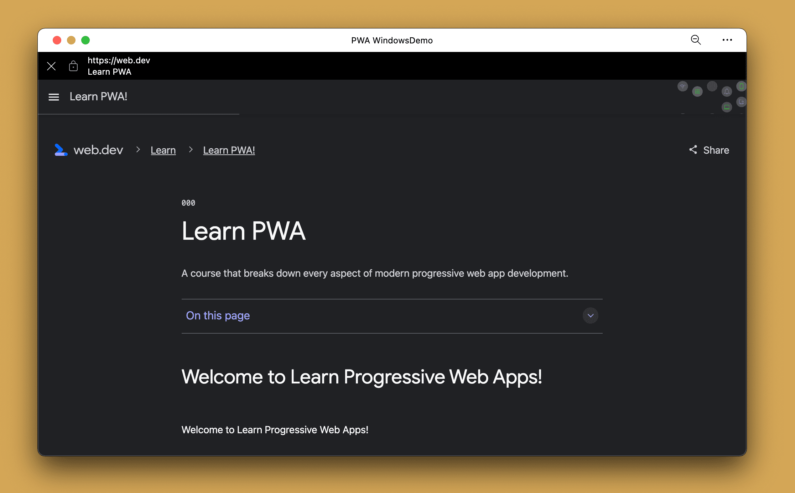
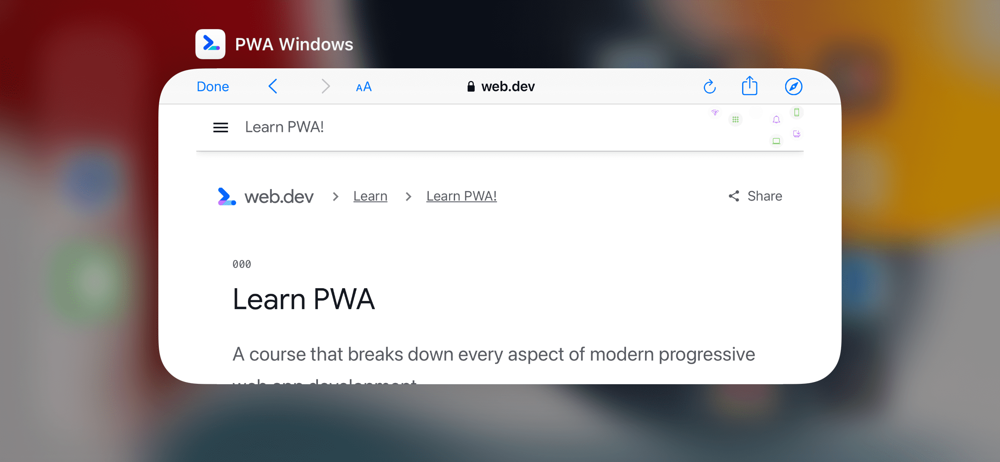
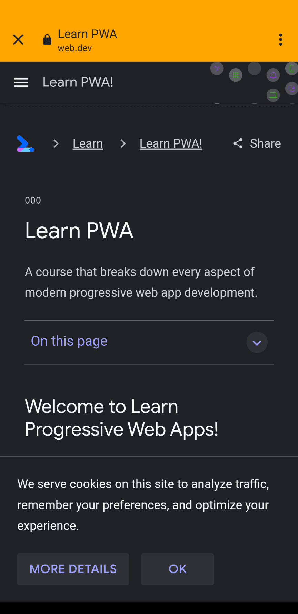
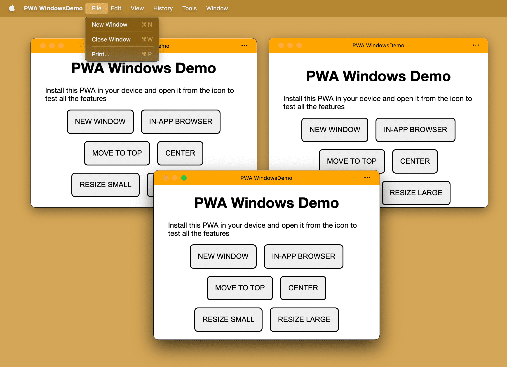
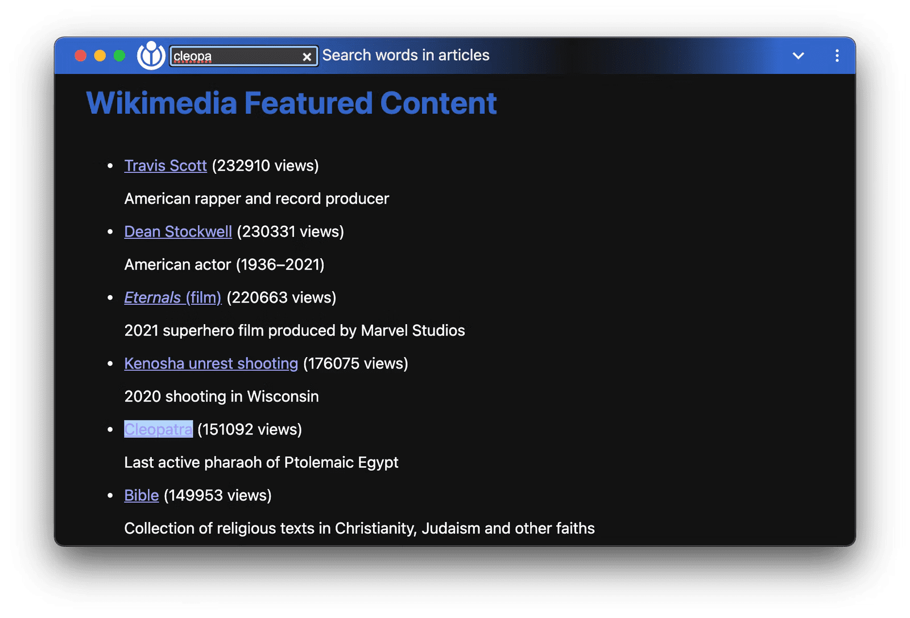

# Управление окнами

<big>PWA вне браузера управляет собственным окном. В этой главе мы рассмотрим API-интерфейсы и возможности управления окном в операционной системе.</big>

## Окно PWA

Запуск в собственном окне, управляемом PWA, обладает всеми преимуществами и обязанностями любого окна в этой операционной системе, например:

-   Возможность изменять размеры и перемещать окно в многооконных операционных системах, таких как Windows или ChromeOS.
-   Разделение экрана с окнами других приложений, как в режиме разделения экрана в iPadOS или в режиме разделения экрана в Android.
-   Появление в доках, панелях задач и в меню ++alt+tab++ на настольных компьютерах, а также в списках многозадачных окон на мобильных устройствах.
-   Возможность сворачивать, перемещать окно по экранам и рабочим столам, а также закрывать его в любой момент.

### Перемещение и изменение размеров окна

Окно PWA может иметь любой размер и располагаться в любом месте экрана в настольных операционных системах. По умолчанию, когда пользователь открывает PWA впервые после установки, окно PWA получает размер в процентах от текущего экрана, с максимальным разрешением 1920x1080, расположенное в левом верхнем углу экрана.

Пользователь может перемещать и изменять размер окна, при этом браузер запоминает последнее предпочтение, поэтому при следующем открытии приложения окно сохранит размер и положение, заданные при предыдущем использовании.

В манифесте нет возможности определить предпочтительный размер и положение окна PWA. Вы можете изменять положение и размер окна только с помощью JavaScript API. В своем коде вы можете перемещать и изменять размеры собственного окна PWA с помощью функций [`moveTo(x, y)`](https://developer.mozilla.org/docs/Web/API/Window/moveTo) и [`resizeTo(x, y)`](https://developer.mozilla.org/docs/Web/API/Window/resizeTo) объекта `window`.

Например, можно изменять размеры и перемещать окно PWA при его загрузке, используя:

```js
document.addEventListener('DOMContentLoaded', (event) => {
    // we can move only if we are not in a browser's tab
    isBrowser = matchMedia('(display-mode: browser)')
        .matches;
    if (!isBrowser) {
        window.moveTo(16, 16);
        window.resizeTo(800, 600);
    }
});
```

Текущий размер и положение экрана можно запросить с помощью объекта `window.screen`; определить изменение размера окна можно с помощью события `resize` объекта `window`. Событие, фиксирующее перемещение окна, не предусмотрено, поэтому можно часто запрашивать позицию.

!!!note ""

    Вместо абсолютного перемещения и изменения размеров окна можно перемещать относительно и изменять размеры с помощью `moveBy()` и `resizeBy()`.

!!!note ""На мобильных устройствах перемещение или изменение размеров окна не приведет к каким-либо изменениям на экране.

### Переход на другие сайты

Если вы хотите отправить пользователя на внешний сайт, не входящий в область действия вашего PWA, это можно сделать с помощью стандартного HTML-элемента `<a href>`, используя `location.href` или открывая новое окно на совместимых платформах.

В настоящее время во всех браузерах, если PWA установлен, при переходе на URL, выходящий за рамки [области действия вашего манифеста](web-app-manifest.md#recommended-fields), браузерный движок вашего PWA отобразит in-app браузер в контексте вашего окна.

Некоторые особенности in-app браузеров таковы:

-   Они отображаются поверх вашего содержимого.
-   Они имеют статическую строку URL, показывающую текущее происхождение, заголовок окна и меню. Обычно они оформлены в соответствии с `theme_color` вашего манифеста.
-   Из контекстного меню можно открыть этот URL в браузере.
-   Пользователь может закрыть браузер или вернуться назад.



!!!note ""

    В то время как браузер приложения находится на экране, ваш PWA ожидает в фоновом режиме, как будто его заслоняет другое окно.

!!!tip ""

    На iOS и iPadOS встроенный браузер использует SafariViewController, движок рендеринга Safari, изолированный от хранилища PWA. Поэтому, если у пользователя есть сессия в Safari, она не будет отображаться в вашем PWA, но она будет отображаться в браузере in-app в вашем PWA.





#### Потоки авторизации

Многие потоки веб-аутентификации и авторизации предполагают перенаправление пользователя на другой URL-адрес в другом месте происхождения для получения маркера, который возвращается в место происхождения вашего PWA, например, при использовании [OAuth 2.0](https://oauth.net/2/).

В этих случаях внутриприкладной браузер выполняет следующие действия:

1.  Пользователь открывает ваш PWA и нажимает кнопку входа.
2.  Ваш PWA перенаправляет пользователя на URL-адрес, выходящий за рамки PWA, чтобы механизм рендеринга открыл in-app браузер внутри вашего PWA.
3.  Пользователь может в любой момент выйти из встроенного браузера и вернуться в PWA.
4.  Пользователь входит в систему с помощью встроенного браузера. Сервер аутентификации перенаправляет пользователя на ваш PWA-сайт, передавая в качестве аргумента токен.
5.  In-app браузер закрывается при обнаружении URL-адреса, входящего в область действия PWA.
6.  Движок перенаправляет навигацию главного окна PWA на URL, на который перешел сервер аутентификации, находясь в in-app браузере.
7.  Ваш PWA получает токен, сохраняет его и отображает PWA.

#### Принудительное открытие навигации браузера

Если вы хотите принудительно открыть браузер с URL, а не in-app браузер, вы можете использовать цель `_blank` для элементов `<a href>`. Это работает только для настольных PWA; на мобильных устройствах возможность принудительного открытия браузера по URL отсутствует.

```js
function openBrowser(url) {
    window.open('url', '_blank', '');
}
```

### Открытие новых окон

На настольных компьютерах пользователи могут открывать несколько окон одного и того же PWA. Каждое окно будет представлять собой отдельную навигацию к одному и тому же `start_url`, как если бы вы открыли две вкладки браузера с одним и тем же URL. В меню PWA пользователь может выбрать пункт File, затем New window, а в коде PWA можно открыть новое окно с помощью функции `open()`. Подробности см. в [документации](https://developer.mozilla.org/docs/Web/API/Window/open).

```js
function openNewWindow() {
    window.open('/', 'new-window', 'width=600,height=600');
}
```



Вызов `open()` внутри окна PWA на iOS или iPadOS возвращает `null` и не открывает окно. Открытие новых окон на Android создает новый встроенный браузер для URL-адреса, даже если URL-адрес находится в пределах области действия PWA, что обычно не приводит к открытию внешнего браузера.

!!!warning ""

    Вторым аргументом функции `open()` является имя окна. Если окно с указанным именем уже открыто, движок заменит открытое окно с таким именем на новое навигационное. Если требуется всегда открывать новое окно, то необходимо использовать различные строковые значения для имени.

<iframe width="100%" height="400" allow="geolocation; microphone; camera; midi; encrypted-media; xr-spatial-tracking; fullscreen" allowfullscreen="" sandbox="allow-scripts allow-modals allow-forms allow-same-origin allow-top-navigation-by-user-activation allow-downloads" data-testid="app-preview-iframe" title="Preview of mlearn-pwa-windows-basic" src="https://mlearn-pwa-windows-basic.glitch.me/"></iframe>

!!!tip ""

    Функции `open()`, `moveTo()` и `resizeTo()` не нуждаются в префиксе `window.` при написании JavaScript, поскольку `window` - это глобальный объект. Можно просто вызвать `moveTo(0, 0)`. Однако вызов `window.moveTo(0, 0)` делает код более понятным.

### Заголовок окна

Элемент `<title>` был использован в первую очередь для SEO-целей, поскольку пространство внутри вкладки браузера ограничено. При переходе из браузера в окно в PWA все пространство строки заголовка становится доступным.

Вы можете определить содержимое строки заголовка:

-   Статически в элементе HTML `<title>`.
-   Динамически, изменяя строковое свойство `document.title` в любой момент времени.

В настольных PWA заголовок очень важен, он используется в строке заголовка окна и иногда в диспетчере задач или многозадачном выборе. Если у вас одностраничное приложение, то вы можете захотеть обновлять заголовок на каждом маршруте.

!!!note ""

    Для уменьшения фишинга в PWA некоторые браузеры для настольных компьютеров могут предусматривать дополнительные меры в отношении заголовка окна. Например, если вы не используете название своего приложения в заголовке, браузер может добавить префикс с названием вашего PWA. Другие браузеры при изменении заголовка могут на несколько секунд отобразить в строке заголовка текущий источник, чтобы подчеркнуть, куда перешел пользователь.

### Tabbed mode

Экспериментальная возможность, известная как _tabbed mode_, позволит вашему PWA иметь дизайн на основе вкладок, подобный веб-браузеру. В этом случае пользователь может иметь несколько вкладок, открытых в одном и том же PWA, но связанных между собой в одном окне операционной системы, как показано на следующем видео:

<video controls loop muted>
<source src="/learn/pwa/windows-5.mp4" />
</video>

Подробнее об этой экспериментальной возможности можно прочитать на сайте [Tabbed application mode for PWA](https://web.dev/articles/tabbed-application-mode).

!!!note ""

    В главе [Experimental chapter](experimental.md) показано, как можно начать использовать экспериментальные возможности.

### Наложение элементов управления окном

Мы уже упоминали, что заголовок окна можно изменить, определив значение элемента `<title>` или свойства `document.title`. Но это всегда строковое значение. А что, если бы мы могли оформлять строку заголовка по своему усмотрению, с помощью HTML, CSS и изображений? Вот тут-то и приходит на помощь Window Controls Overlay - новая экспериментальная возможность в Microsoft Edge и Google Chrome для настольных PWA.

!!!note ""

    Возможности режима вкладок и наложения элементов управления окнами определяют новые значения для члена манифеста `display`. Для обеспечения совместимости со всеми устройствами группа разработчиков манифеста создала способ замены цепочки [fallback `display`](app-design.md#display-modes), чтобы вы могли указать, какое значение `display` использовать, если первый вариант недоступен. Подробнее об этом читайте в [Preparing for the display modes of tomorrow](https://developer.chrome.com/articles/display-override/).

Подробнее об этой возможности можно прочитать в статье [Настройка наложения элементов управления окном на строку заголовка вашего PWA](https://web.dev/articles/window-controls-overlay).



## Размещение окон на нескольких экранах

При наличии нескольких экранов пользователи хотят использовать все доступное им пространство. Пользователи могут:

-   Открыть презентацию на внешнем мониторе.
-   Восстанавливать положение открытого окна на экране.
-   Отдавать предпочтение экранам, поддерживающим сенсорное управление.

API [Multi-Screen Window Placement API](https://developer.chrome.com/articles/window-management/) позволяет PWA делать все это и даже больше.

### Получение информации об экране

Multi-Screen Window Placement API добавляет новый метод `window.getScreenDetails()`, который возвращает объект с экранами в виде неизменяемого массива присоединенных экранов. Также имеется живой объект, доступный из `ScreenDetails.currentScreen`, соответствующий текущему `window.screen`.

!!!tip ""

    В некоторых браузерах вызов `window.getScreenDetails()` требует от пользователя разрешения на использование PWA.

Возвращаемый объект также вызывает событие [`screenschange`](https://developer.chrome.com/articles/window-management/#the-screenschange-event) при изменении массива `screens`. (Этого не происходит при изменении атрибутов отдельных экранов). Отдельные экраны, либо `window.screen`, либо экран в массиве `screens`, также вызывают событие `change` при изменении своих атрибутов.

```js
// Request an object with a screen objects
const screenDetails = await window.getScreenDetails();
screenDetails.screens[0].isPrimary;  // e.g. true
screenDetails.screens[0].isInternal;  // e.g. true
screenDetails.screens[0].pointerTypes;  // e.g. ["touch"]
screenDetails.screens[0].label;  // e.g. 'Samsung Electric Company 28"'

// Access the live object corresponding to the current `window.screen`.
// The object is updated on cross-screen window placements or device changes.
screenDetails.currentScreen;
screenDetails.addEventListener('screenschange', function() {
 // NOTE: Does not fire on changes to attributes of individual screens.
  const screenCount = screenDetails.screens.length;
  const currentScreen screenDetails.currentScreen.id;
});
```

Если пользователь или операционная система перемещает окно PWA с одного экрана на другой, то от объекта screen details также будет получено событие [`currentscreenchange`](https://developer.chrome.com/articles/window-management/#the-currentscreenchange-event).

!!!note ""

    Для отображения веб-содержимого на больших презентационных устройствах, таких как проекторы и телевизоры, подключенные к сети, можно также воспользоваться [Presentation API](https://developer.mozilla.org/docs/Web/API/Presentation_API).

    <p class="ciu_embed" data-feature="mdn-api__Presentation" data-periods="future_1,current,past_1,past_2" data-accessible-colours="false"></p>

<iframe width="100%" height="400" allow="geolocation; microphone; camera; midi; encrypted-media; xr-spatial-tracking; fullscreen" allowfullscreen="" sandbox="allow-scripts allow-modals allow-forms allow-same-origin allow-top-navigation-by-user-activation allow-downloads" data-testid="app-preview-iframe" title="Preview of mlearn-pwa-windows-screens" src="https://mlearn-pwa-windows-screens.glitch.me/"></iframe>

## Блокировка выключения экрана

Представьте себе, что вы находитесь на кухне, следуя рецепту на своем планшете. Вы только что закончили подготовку ингредиентов. Руки в беспорядке, и вы возвращаетесь к планшету, чтобы прочитать следующий шаг. Катастрофа! Экран стал черным! API [Screen Wake Lock API](https://developer.mozilla.org/docs/Web/API/Screen_Wake_Lock_API) создан для вас и позволяет PWA предотвратить затемнение, спящий режим или блокировку экрана, позволяя пользователям останавливаться, запускаться, уходить и возвращаться без опасений.

```js
// Request a screen wake lock
const wakeLock = await navigator.wakeLock.request();

// Listen for wake lock release
wakeLock.addEventListener('release', () => {
    console.log(
        `Screen Wake Lock released: ${wakeLock.released}`
    );
});
// Manually release the wake lock
wakeLock.release();
```

## Виртуальная клавиатура

Сенсорные устройства, такие как телефоны и планшеты, предлагают виртуальную экранную клавиатуру, позволяющую пользователю набирать текст, когда элементы формы вашего PWA находятся в фокусе.

Благодаря [VirtualKeyboard API](https://developer.chrome.com/docs/web-platform/virtual-keyboard/) ваш PWA теперь может получить больше возможностей для управления клавиатурой на совместимых платформах с помощью интерфейса `navigator.virtualKeyboard`, включая:

-   Показ и скрытие виртуальной клавиатуры с помощью функций `navigator.virtualKeyboard.show()` и `navigator.virtualKeyboard.hide()`.
-   Сообщение браузеру о том, что вы сами заботитесь о закрытии виртуальной клавиатуры, путем установки значения `navigator.virtualKeyboard.overlaysContent` равным `true`.
-   Узнавать о появлении и исчезновении клавиатуры по событию `geometrychange` из `navigator.virtualKeyboard`.
-   Задание политики виртуальной клавиатуры при редактировании элементов хоста (с помощью `contenteditable`) с помощью HTML-атрибута `virtualkeyboardpolicy`. Политика позволяет определить, будет ли виртуальная клавиатура обрабатываться браузером автоматически, используя значение `auto`, или с помощью вашего скрипта, используя значение `manual`.
-   Использование переменных окружения CSS для получения информации о внешнем виде виртуальной клавиатуры, таких как `keyboard-inset-height` и `keyboard-inset-top`.

Подробнее об этом API можно прочитать в разделе [Полный контроль с помощью VirtualKeyboard API](https://developer.chrome.com/docs/web-platform/virtual-keyboard/).

## Ресурсы

-   [Управление несколькими дисплеями с помощью Multi-Screen Window Placement API](https://developer.chrome.com/articles/window-management/)
-   [Режим работы приложений с вкладками для PWA](https://web.dev/articles/tabbed-application-mode)
-   [Не спать с помощью API блокировки экрана](https://developer.chrome.com/articles/wake-lock/)
-   [Полный контроль с помощью API VirtualKeyboard](https://developer.chrome.com/docs/web-platform/virtual-keyboard/)
-   [Настройка наложения элементов управления окном на строку заголовка PWA](https://web.dev/articles/window-controls-overlay)
-   [Отображение содержимого в строке заголовка](https://docs.microsoft.com/en-us/microsoft-edge/progressive-web-apps-chromium/how-to/window-controls-overlay)

:material-information-outline: Источник &mdash; [Window management](https://web.dev/learn/pwa/windows)
